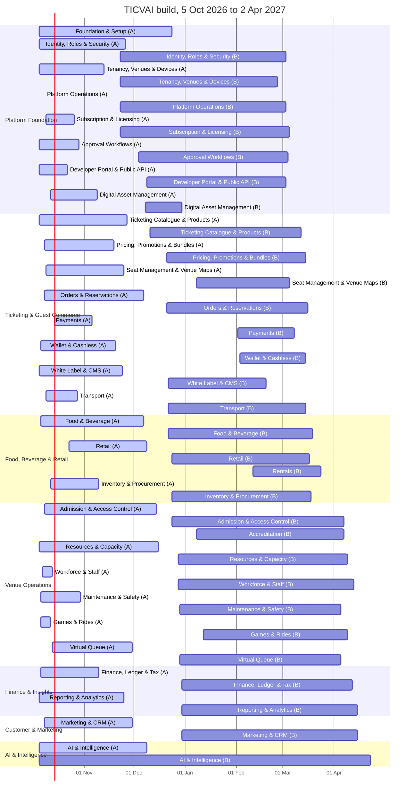

# TICVAI complete build plan: presentation source

> **For:** the build-plan presentation on 30 September 2026. **Generated by** `tools/build-plan-deck.py` from the package; rerun it after any change. The workbook with every table and the Gantt is `handoff/TICVAI - Build Plan.xlsx`.

Each `##` below is one slide. Numbers come from the package, not from estimates.

## 1. The plan in one line

We build TICVAI from **5 Oct 2026 to 2 Apr 2027** in **9 three-week sprints**: about **13,503 hours** of development across **31 modules** in **7 packages**, with a team of 14. The forecast finish is **23 Apr 2027**.

## 2. How the plan is measured

- **Points** come from each screen's specification (operations, components, states, navigation, offline) and from each back-end operation.
- **Pace** is Block A's plan of record: 9.58 points per developer per day, so one point is about 0.83 hours.
- **Hours** are points times that figure. After sprint 1 (23 October) the measured pace replaces it and the plan is regenerated.
- **Names** come from the task sheet for Block A, and from the scheduler for Block B, which places work on people by skill.

## 3. Sprints

| Sprint | Dates | Block | Capacity (h) | Planned (h) |
|---|---|---|---|---|
| 1 | 5 Oct 2026 – 23 Oct 2026 | A | 1,392 | 1,386 |
| 2 | 26 Oct 2026 – 13 Nov 2026 | A | 1,392 | 1,358 |
| 3 | 16 Nov 2026 – 4 Dec 2026 | A ends 20 Nov, B1 starts | 1,226 | 1,017 |
| 4 | 7 Dec 2026 – 25 Dec 2026 | B | 1,632 | 1,636 |
| 5 | 28 Dec 2026 – 15 Jan 2027 | B | 1,523 | 1,523 |
| 6 | 18 Jan 2027 – 5 Feb 2027 | B | 1,632 | 1,632 |
| 7 | 8 Feb 2027 – 26 Feb 2027 | B | 1,632 | 1,632 |
| 8 | 1 Mar 2027 – 19 Mar 2027 | B | 1,306 | 1,306 |
| 9 | 22 Mar 2027 – 2 Apr 2027 | B | 1,088 | 973 |

Holidays counted: 1 Dec 2026 Commemoration Day; 2 Dec 2026 National Day; 3 Dec 2026 National Day; 1 Jan 2027 New Year; 9 Mar 2027 Eid al-Fitr; 10 Mar 2027 Eid al-Fitr; 11 Mar 2027 Eid al-Fitr. Eid dates are to be confirmed.

## 4. Packages

| Package | Modules | Requirements | Screens | Operations | Hours | Completion | Lead |
|---|---|---|---|---|---|---|---|
| **Platform Foundation** | 8 | 563 | 425 | 453 | 2,589 | 5 Mar 2027 | Tanmay Dukhande |
| **Ticketing & Guest Commerce** | 8 | 866 | 867 | 908 | 3,627 | 16 Mar 2027 | Pranay Shinde |
| **Food, Beverage & Retail** | 4 | 224 | 216 | 267 | 1,033 | 24 Mar 2027 | Pradnya Yeram |
| **Venue Operations** | 7 | 411 | 464 | 507 | 1,962 | 13 Apr 2027 | Sanket Keluskar |
| **Finance & Insights** | 2 | 393 | 117 | 120 | 497 | 15 Apr 2027 | New full-stack developer 1 |
| **Customer & Marketing** | 1 | 421 | 219 | 264 | 935 | 15 Apr 2027 | Pallavi Sawant |
| **AI & Intelligence** | 1 | 287 | 137 | 141 | 2,861 | 23 Apr 2027 | Kalpita Mejari |

## 5. Gantt by package

## 6. Platform Foundation

Everything the apps stand on: sign-in, tenants and venues, devices, licensing, approvals, the public API.

| Module | Requirements | Screens A / B | Operations A / B | Hours A / B | Sprints | Completion | Lead | Team |
|---|---|---|---|---|---|---|---|---|
| Foundation & Setup | 0 | 0 / 0 | 0 / 0 | 824 / 0 | 1-4 | 24 Dec 2026 | Hrushikant Patkar | Hrushikant Patkar, Surendra, Sanket Keluskar, Tanmay Dukhande |
| Identity, Roles & Security | 144 | 9 / 22 | 37 / 52 | 83 / 161 | 1-8 | 3 Mar 2027 | Deep Khanvilkar | Deep Khanvilkar, Pranay Shinde, Tanmay Dukhande, Pallavi Sawant |
| Tenancy, Venues & Devices | 126 | 5 / 30 | 18 / 37 | 46 / 136 | 1-7 | 26 Feb 2027 | Sanket Keluskar | Sanket Keluskar, Deep Khanvilkar, Hrushikant Patkar, Tanmay Dukhande |
| Platform Operations | 4 | 0 / 12 | 0 / 51 | 7 / 125 | 1-8 | 3 Mar 2027 | Tanmay Dukhande | Tanmay Dukhande, Deep Khanvilkar, New full-stack developer 1, Chitrangi Mestry |
| Subscription & Licensing | 105 | 2 / 174 | 10 / 138 | 23 / 647 | 1-8 | 5 Mar 2027 | Deep Khanvilkar | Deep Khanvilkar, Chitrangi Mestry, Pradnya Yeram, Tanmay Dukhande |
| Approval Workflows | 90 | 2 / 106 | 8 / 45 | 23 / 279 | 1-8 | 4 Mar 2027 | Chinmay Patkar | Chinmay Patkar, New full-stack developer 2, Sanket Keluskar, Pranay Shinde |
| Developer Portal & Public API | 80 | 3 / 21 | 8 / 23 | 14 / 92 | 1-8 | 3 Mar 2027 | New full-stack developer 1 | New full-stack developer 1, Pranay Shinde, Hrushikant Patkar, Sanket Keluskar |
| Digital Asset Management | 14 | 1 / 38 | 10 / 16 | 26 / 103 | 1-5 | 30 Dec 2026 | Pallavi Sawant | Pallavi Sawant, Chitrangi Mestry, Tanmay Dukhande, Hrushikant Patkar |

## 7. Ticketing & Guest Commerce

What a guest buys and how: catalogue, pricing, seats and maps, orders, payments, wallet, the branded storefront and app.

| Module | Requirements | Screens A / B | Operations A / B | Hours A / B | Sprints | Completion | Lead | Team |
|---|---|---|---|---|---|---|---|---|
| Ticketing Catalogue & Products | 266 | 40 / 170 | 55 / 182 | 175 / 715 | 1-8 | 12 Mar 2027 | Tanmay Dukhande | Tanmay Dukhande, Hrushikant Patkar, Chinmay Patkar, Chitrangi Mestry |
| Pricing, Promotions & Bundles | 105 | 15 / 150 | 28 / 125 | 73 / 532 | 1-8 | 15 Mar 2027 | Tanmay Dukhande | Tanmay Dukhande, Deep Khanvilkar, Sanket Keluskar, New full-stack developer 1 |
| Seat Management & Venue Maps | 100 | 12 / 93 | 20 / 55 | 74 / 270 | 1-8 | 5 Mar 2027 | Chinmay Patkar | Chinmay Patkar, Hrushikant Patkar, Pallavi Sawant, Pranay Shinde |
| Orders & Reservations | 269 | 30 / 140 | 57 / 162 | 211 / 659 | 1-8 | 16 Mar 2027 | Pranay Shinde | Pranay Shinde, Chitrangi Mestry, Deep Khanvilkar, Tanmay Dukhande |
| Payments | 9 | 4 / 51 | 6 / 42 | 26 / 186 | 1-8 | 8 Mar 2027 | Pallavi Sawant | Pallavi Sawant, Chinmay Patkar, Tanmay Dukhande, Hrushikant Patkar |
| Wallet & Cashless | 52 | 5 / 105 | 17 / 49 | 44 / 352 | 1-8 | 15 Mar 2027 | Sanket Keluskar | Sanket Keluskar, Pranay Shinde, Pradnya Yeram, Surendra |
| White Label & CMS | 65 | 32 / 8 | 78 / 1 | 210 / 16 | 1-7 | 19 Feb 2027 | Chitrangi Mestry | Chitrangi Mestry, Tanmay Dukhande, Deep Khanvilkar, Chinmay Patkar |
| Transport | 0 | 11 / 1 | 21 / 10 | 63 / 21 | 1-8 | 15 Mar 2027 | Hrushikant Patkar | Hrushikant Patkar, Pranay Shinde, Sanket Keluskar, Chinmay Patkar |

## 8. Food, Beverage & Retail

Selling at the venue: F&B with the kitchen display, retail, rentals, stock and purchasing.

| Module | Requirements | Screens A / B | Operations A / B | Hours A / B | Sprints | Completion | Lead | Team |
|---|---|---|---|---|---|---|---|---|
| Food & Beverage | 95 | 37 / 37 | 87 / 54 | 276 / 211 | 1-8 | 19 Mar 2027 | Pradnya Yeram | Pradnya Yeram, Pranay Shinde, Hrushikant Patkar, Deep Khanvilkar |
| Retail | 14 | 5 / 4 | 14 / 11 | 43 / 30 | 1-8 | 17 Mar 2027 | Pranay Shinde | Pranay Shinde, Hrushikant Patkar, Pradnya Yeram, Sanket Keluskar |
| Rentals | 0 | 0 / 106 | 0 / 43 | 0 / 287 | 7-9 | 24 Mar 2027 | Chitrangi Mestry | Chitrangi Mestry, Pranay Shinde, New full-stack developer 1, Chinmay Patkar |
| Inventory & Procurement | 115 | 2 / 25 | 7 / 51 | 21 / 164 | 1-8 | 18 Mar 2027 | Surendra | Surendra, Tanmay Dukhande, New full-stack developer 1, Pallavi Sawant |

## 9. Venue Operations

Running the venue day to day: gates and access, accreditation, capacity, staff, maintenance, rides, queues.

| Module | Requirements | Screens A / B | Operations A / B | Hours A / B | Sprints | Completion | Lead | Team |
|---|---|---|---|---|---|---|---|---|
| Admission & Access Control | 108 | 23 / 149 | 38 / 208 | 101 / 725 | 1-10 | 7 Apr 2027 | Hrushikant Patkar | Hrushikant Patkar, Deep Khanvilkar, Tanmay Dukhande, Chinmay Patkar |
| Accreditation | 58 | 0 / 72 | 0 / 47 | 0 / 223 | 5-10 | 7 Apr 2027 | New full-stack developer 2 | New full-stack developer 2, Pallavi Sawant, Chitrangi Mestry, Pradnya Yeram |
| Resources & Capacity | 92 | 7 / 55 | 15 / 46 | 38 / 207 | 1-10 | 9 Apr 2027 | Chinmay Patkar | Chinmay Patkar, Pranay Shinde, New full-stack developer 1, New full-stack developer 2 |
| Workforce & Staff | 27 | 0 / 34 | 2 / 47 | 6 / 172 | 1-10 | 13 Apr 2027 | Sanket Keluskar | Sanket Keluskar, Tanmay Dukhande, Chinmay Patkar, New full-stack developer 1 |
| Maintenance & Safety | 75 | 1 / 28 | 1 / 41 | 9 / 169 | 1-10 | 5 Apr 2027 | New full-stack developer 2 | New full-stack developer 2, Pallavi Sawant, Pradnya Yeram, Surendra |
| Games & Rides | 14 | 0 / 81 | 3 / 37 | 6 / 224 | 1-10 | 9 Apr 2027 | Sanket Keluskar | Sanket Keluskar, New full-stack developer 2, Chitrangi Mestry, Pradnya Yeram |
| Virtual Queue | 37 | 8 / 6 | 11 / 11 | 34 / 46 | 1-10 | 5 Apr 2027 | Sanket Keluskar | Sanket Keluskar, Chinmay Patkar, Deep Khanvilkar, New full-stack developer 1 |

## 10. Finance & Insights

The money and the numbers: ledger, VAT and e-invoicing, reports and analytics.

| Module | Requirements | Screens A / B | Operations A / B | Hours A / B | Sprints | Completion | Lead | Team |
|---|---|---|---|---|---|---|---|---|
| Finance, Ledger & Tax | 204 | 9 / 18 | 18 / 54 | 49 / 147 | 1-10 | 12 Apr 2027 | New full-stack developer 2 | New full-stack developer 2, New full-stack developer 1, Surendra, Pallavi Sawant |
| Reporting & Analytics | 189 | 9 / 81 | 17 / 31 | 52 / 249 | 1-10 | 15 Apr 2027 | Hrushikant Patkar | Hrushikant Patkar, New full-stack developer 1, Chinmay Patkar, Sanket Keluskar |

## 11. Customer & Marketing

Knowing and reaching the guest: CRM, segments, campaigns, loyalty, support.

| Module | Requirements | Screens A / B | Operations A / B | Hours A / B | Sprints | Completion | Lead | Team |
|---|---|---|---|---|---|---|---|---|
| Marketing & CRM | 421 | 33 / 186 | 60 / 204 | 177 / 759 | 1-10 | 15 Apr 2027 | Pallavi Sawant | Pallavi Sawant, Chinmay Patkar, New full-stack developer 2, Pradnya Yeram |

## 12. AI & Intelligence

The AI gateway and governance, the guest concierge, Help me choose, translations, the planner agent; forecasting, fraud and recommendations rules-first.

| Module | Requirements | Screens A / B | Operations A / B | Hours A / B | Sprints | Completion | Lead | Team |
|---|---|---|---|---|---|---|---|---|
| AI & Intelligence | 287 | 20 / 117 | 50 / 91 | 114 / 2,746 | 1-11 | 23 Apr 2027 | Kalpita Mejari | Kalpita Mejari, Second AI engineer, Sanket Keluskar, Pranay Shinde |

## 13. The team

| Name | Role | Block A points | Block A work ends | Last day of planned work |
|---|---|---|---|---|
| Hrushikant Patkar | Back end and DevOps | 535 | 24 Dec 2026 | 16 Apr 2027 |
| Pranay Shinde | Back end | 446 | 11 Dec 2026 | 23 Apr 2027 |
| Tanmay Dukhande | Back end | 441 | 11 Dec 2026 | 21 Apr 2027 |
| Deep Khanvilkar | Back end | 292 | 16 Nov 2026 | 21 Apr 2027 |
| Pallavi Sawant | Full stack (Venue Management) | 289 | 16 Nov 2026 | 15 Apr 2027 |
| Sanket Keluskar | Full stack (Venue Management) | 291 | 16 Nov 2026 | 19 Apr 2027 |
| Chinmay Patkar | Full stack (guest web, white label) | 399 | 4 Dec 2026 | 14 Apr 2027 |
| Chitrangi Mestry | Front end (guest app, web) | 286 | 13 Nov 2026 | 24 Mar 2027 |
| Pradnya Yeram | Front end (POS, guest app) | 244 | 9 Nov 2026 | 24 Mar 2027 |
| Surendra | Full stack (Venue Management) | 175 | 16 Nov 2026 | 22 Apr 2027 |
| New full-stack developer 1 | Full stack (to hire) | – | – | 20 Apr 2027 |
| New full-stack developer 2 | Full stack (to hire) | – | – | 21 Apr 2027 |
| Kalpita Mejari | AI engineer | – | 6 Oct 2026 | 21 Apr 2027 |
| Second AI engineer | AI engineer | – | 5 Oct 2026 | 16 Apr 2027 |

Chinmay Parab (lead) is not counted in capacity. Loads are uneven on purpose: they follow skill and experience.

## 14. AI: built now, more accurate with time

- **Every AI function ships inside the six months** (decided 30 September): forecasting, staffing, suggestions, wait times, anomaly detection, fraud and risk, recommendations, marketing AI, pricing suggestions, the configuration assistant, the analytics assistant, seat-map generation, translations and the planner agent.
- **Day one works with no history:** a venue profile entered at onboarding, a starting pattern for the venue type, the UAE calendar and weather, and the venue's own imported history.
- **Stages a venue sees:** Starting (day one) → Learning (about 4 weeks) → Established (about 3 months) → a trained model, promoted by an admin when it beats the current answer (after about a season).
- **Team:** Kalpita and the second AI engineer from 5 October. No third engineer. Developers build the AI endpoints and screens.
- **Size:** about 2,325 hours of AI engine work on top of the endpoints and screens.

## 15. Finishing by 2 April: overtime

| Name | Last day at normal hours | Hours past 2 April | Overtime per week to finish on time |
|---|---|---|---|
| Hrushikant Patkar | 16 Apr 2027 | 77 | 3.1 |
| Pranay Shinde | 23 Apr 2027 | 117 | 4.8 |
| Tanmay Dukhande | 21 Apr 2027 | 100 | 4.1 |
| Deep Khanvilkar | 21 Apr 2027 | 100 | 4.1 |
| Pallavi Sawant | 15 Apr 2027 | 68 | 2.8 |
| Sanket Keluskar | 19 Apr 2027 | 86 | 3.5 |
| Chinmay Patkar | 14 Apr 2027 | 56 | 2.3 |
| Chitrangi Mestry | 24 Mar 2027 | 0 | 0.0 |
| Pradnya Yeram | 24 Mar 2027 | 0 | 0.0 |
| Surendra | 22 Apr 2027 | 63 | 2.6 |
| New full-stack developer 1 | 20 Apr 2027 | 95 | 5.4 |
| New full-stack developer 2 | 21 Apr 2027 | 98 | 5.6 |
| Kalpita Mejari | 21 Apr 2027 | 98 | 4.0 |
| Second AI engineer | 16 Apr 2027 | 78 | 3.2 |

In total about 1,036 hours past 2 April at normal hours, spread as overtime across the build. Rerun after the measured pace on 23 October.

## 16. Architecture decisions the plan rests on

- **One package, services by contract** (Accepted). Each business module is one OpenAPI contract owned by one service; screens bind to operations, never to tables.
- **Build in two blocks** (Accepted). Block A ships the selling apps first (POS, KDS, guest web and app, white label, Venue Management setup); Block B the back office, console, partner, support and analytics.
- **Size by formula, schedule by measured pace** (Accepted). Points come from each screen's specification and each operation; the pace is replaced by the measured pace after sprint 1.
- **AI that needs no history in Block A** (Accepted). Gateway and governance, concierge, Help me choose, translations and the planner agent ship in Block A; rules stand in for upsell and fraud.
- **Every AI function inside six months, baseline first** (Accepted 30 Sep). Forecasting, fraud, recommendations, anomaly detection and both assistants ship with a working baseline on day one and learn from the tenant's own data; a trained model replaces the baseline only when it beats it and an admin approves.
- **Two AI engineers from 5 October** (Accepted 30 Sep). Kalpita and the second AI engineer carry the engine work from Block A onwards; no third engineer. Developers build the AI endpoints and screens like any other module.
- **CMS as a flow builder** (Accepted). Operators pick their booking flows, see required and optional steps, set their own order, then finish in a configuration panel.
- **Per-tenant data and models** (Accepted). Models train per tenant; the LLM never reads raw data (scrubbed aggregates or code it writes); retention is tenant configuration.
- **Load follows skill** (Accepted). Tasks are assigned by skill rating and experience, not evenly; helpers take a share proportional to their ratings.

## 17. Release checklist

**Every sprint (Friday of week 3)**

- [ ] *Before:* Every ticket in the sprint is Ready for QA or moved to the next sprint with a reason in the ticket. (Scrum lead)
**Every sprint**

- [ ] *Before:* CI green on main: unit, contract (the OpenAPI checks) and migration tests. (Hrushikant Patkar)
- [ ] *Before:* Database migrations run forward on a copy of staging data; the rollback script runs back cleanly. (Back-end owner of the service)
- [ ] *Before:* Feature flags set per tenant for anything half-built; nothing unfinished is visible to a venue. (Lead of the package)
- [ ] *Deploy:* Deploy to staging; run the smoke flows of the apps touched (buy a ticket, pay, scan, POS sale, KDS bump). (QA)
- [ ] *Deploy:* Demo to the client from staging; record accepted and rejected items in OpenProject. (Chinmay Parab)
- [ ] *After:* Measured pace per person recorded; the plan workbook regenerated with the real pace. (Chinmay Parab)
**Block A go-live (20 Nov 2026)**

- [ ] *Before:* The client has signed off every Block A wireframe batch (3 working days each, audit R252). (Client design reviewer)
**Block A go-live**

- [ ] *Before:* Payment sandbox credentials in place and a full sale-refund-settlement cycle passes (CLIENT-PAY-SANDBOX). (Client, then Tanmay Dukhande)
- [ ] *Before:* Offline: the POS sells and the scanner admits with the network cut, and reconcile when it returns. (Pradnya Yeram)
- [ ] *Before:* Tax invoice, credit note and VAT fields checked against the client's answers (make-or-break items). (Pranay Shinde)
- [ ] *Before:* Load test at the burst mix (ticket on-sale) and the venue-day mix; replicas as sized in handoff/sizing.json. (Hrushikant Patkar)
- [ ] *Before:* Backups restore into a clean environment; the restore time is written down. (Hrushikant Patkar)
- [ ] *Before:* Security: role grants reviewed per module, secrets in the vault, no test credentials in production. (Hrushikant Patkar)
- [ ] *Deploy:* Production deploy in a quiet window; canary tenant first, then the pilot venue. (Hrushikant Patkar)
- [ ] *Deploy:* Watch error rate and latency for the first hour of trading; the rollback is rehearsed beforehand. (On-call back end)
- [ ] *Rollback if:* Payment failures above 2% of attempts, POS sale p95 above 2 seconds, or any failed gate admission not explained by the ticket. (Chinmay Parab decides)
- [ ] *After:* Release notes to the client; tickets closed; the hypercare rota for the first two weeks. (Chinmay Parab)
**End of six months (2 Apr 2027)**

- [ ] *Before:* Every module's acceptance signed; open defects triaged into the phase-2 backlog. (Chinmay Parab and the client)

## 18. Risks and checkpoints

- **Back-end owners overloaded in Block A.** Signal: Their Block A work runs past 20 November (People sheet). Action: Deep takes a larger proportional share; the two new developers take back-end tasks from their first day; Block B start slides for the three owners only.
- **Pace below plan.** Signal: Measured pace on 23 October under 9.6 points per developer per day. Action: Rerun the plan with the measured pace; use the wave-3 deferral list on 18 December.
- **Hiring the two developers slips.** Signal: Not confirmed by 23 October. Action: Block B finish moves out by the scheduler's figure; the PM decides scope or date.
- **Client inputs late.** Signal: Wireframe sign-off over 3 working days; sandbox credentials; stations and fares; cabana numbering; real photos. Action: Those tickets wait in 'Waiting on client' and do not count against the team's pace.
- **Make-or-break answers.** Signal: Tax invoice fields, e-invoicing provider, VAT 201 layout, face capture consent, ID-verification provider. Action: Defaults are built; a different answer is a change request.
- **Second AI engineer not in place on 5 October.** Signal: No start date confirmed this week. Action: Kalpita starts the Block A AI alone; the baseline layer moves one sprint and the AI engine work needs more overtime.
- **AI engine estimates are rough.** Signal: The AI review sized the engines in engineer-weeks from the design. Action: Re-base on the measured pace on 23 October; the trained models are the part to move if the AI engineers fall behind.

Checkpoints: 23 October (measured pace, hiring confirmed), 20 November (Block A done), 18 December (deferral decision, only if needed), 2 April 2027 (end of six months).

