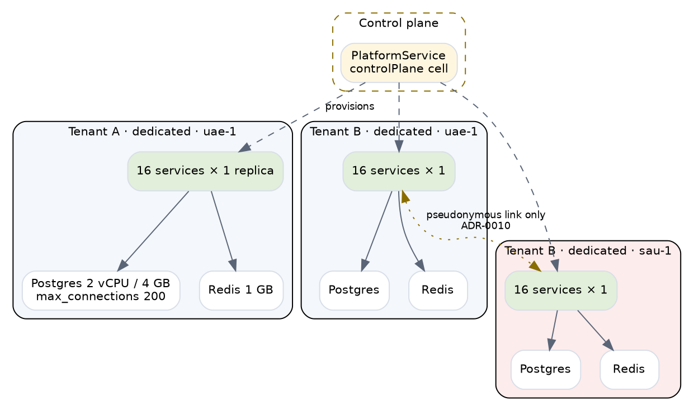
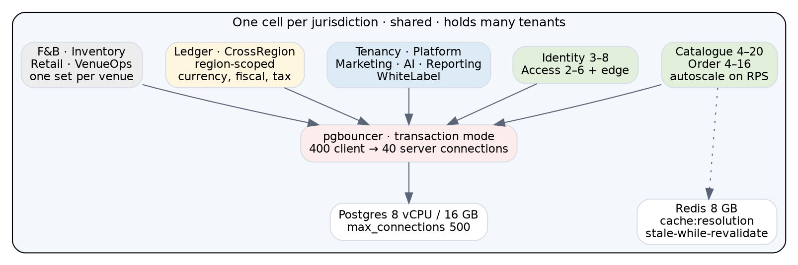
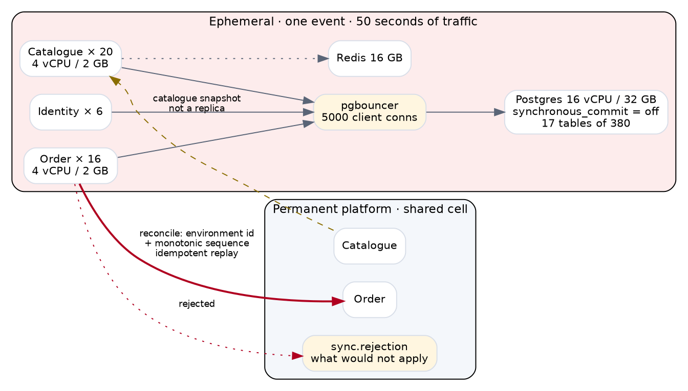
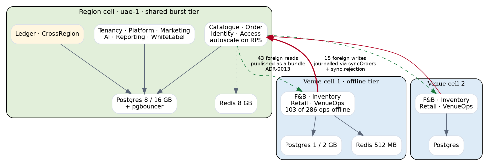
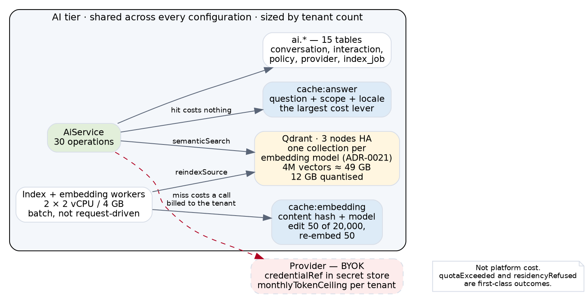
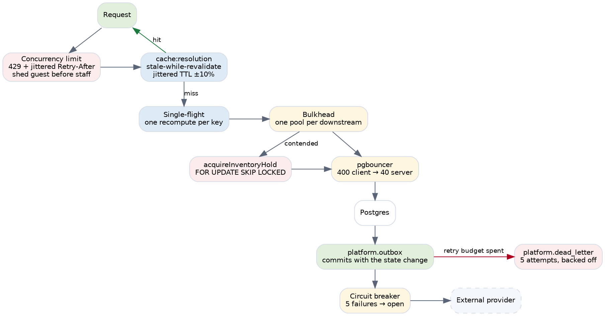
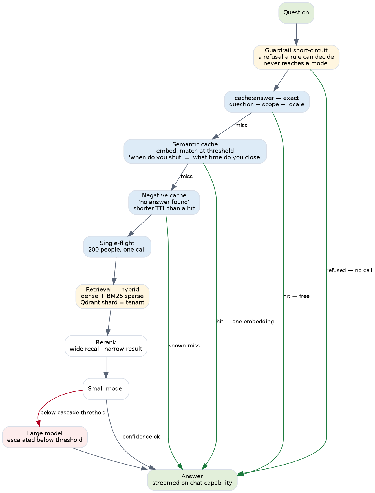

# Deployment architecture — four configurations, costed on AWS and GCP

**31 August 2026. CF-162.**

**A commercial summary of this document exists** at
`docs/active/deployment-summary-commercial.md` — same conclusions, no vCPU counts.

**Runnable in `deploy/`. All four use the same images, the same schema and the same limits — only
placement changes.**

---

## Part 1 · What a cell is

**A cell is a deployment and a legal boundary at once** (ADR-0001). `control.cell` carries
`region_id`, `country_code` **and** `tenant_id`, because a cell sits *in* one region and holds one
tenant or many.

**`CellKind` already exists** — `shared · dedicated · onPremise · controlPlane` (ADR-0017) — and
`tenantId` is documented as *"null on a shared cell, which holds many; nullable since the ADR-0014
amendment, it was required when a cell meant one tenant."*

**So three of the four configurations below already have a name in the package.** The fourth, a cell
per venue, does not — and that is where the interesting question sits.

### The rule the whole document rests on

**A service is shared and horizontally scaled when its load is a function of requests. It is scoped
when its load is a function of how many of something exist. It sits at the region when the law
does.**

Derived from the contracts rather than assumed: **every one of the 1,025 operations declares the
scope it resolves at**, and the distribution is

**venue 682 (67%) · tenant 247 (24%) · region 48 (5%) · workstation 45 (4%)**

---

## Part 2 · Real venues, and what they actually cost in requests

**The client gave the bracket on 31 July.** Qossai contrasted two extremes: **a stadium such as Real
Madrid's, roughly 60,000 seats, selling out within a few hours** of tickets going live — against **a
water park or museum seeing a maximum of around 2,000 visitors a day, roughly five people a
minute.**

**Dinesh summarised it back as an auto-scaling requirement and Qossai confirmed it.** The numbers
below are that conversation turned into arithmetic.

### What a guest costs

**From the flows already walked**: F58, a ticket sold at a till and added to, is 21 operations. F59,
a seat picked and held, is 7. F61, a gate opening and admitting a group, is 12.

**A buying guest costs about 22 requests** — discovery, selection, checkout. **A visiting guest costs
about 14** — admission and in-venue spend.

### The three tiers

| Tier | Example | Guests/day | Buy % | Requests/day | Steady RPS | Peak RPS | Window |
|---|---|---:|---:|---:|---:|---:|---|
| **Small** | Museum, water park | 2,000 | 30% | **41,200** | 1.0 | ~2 | steady across 12h |
| **Medium** | Theme park, concert day | 18,500 | 55% | **482,850** | 11.2 | ~124 | peak 3h before gates |
| **Large** | Stadium sell-out | 60,000 | 95% | **2,094,000** | 48.5 | ~1,045 | 2h sale window |

**18,500 is the client's own figure** — *"TICVAI knows that 18,500 guests are attending Saturday's
concert, 2,100 are VIP ticket holders."* **1,200 is a corporate gala in the Grand Hall.** Neither is
invented.

### 🔴 Two things this changes

**The brief's ceiling of 250,000 requests a day is below one medium venue.** A theme park on a
concert day is 482,850, and a stadium sell-out is 2.09 million. **The daily-volume axis in the
original brief was sized for a small venue and read as a platform ceiling.**

**And the peak depends entirely on how compressed the sale is.** 60,000 seats over a two-hour window
is 1,045 RPS at a six-times burst. **Compressed into twenty minutes — which is what "sold out in
minutes" means — it is 6,270 RPS**, above the 5,000 target and matching the Bahrain shape exactly.

**So the 5,000 RPS figure is not a safety margin. It is roughly one stadium selling out fast**, and
a second concurrent sale exceeds it.

### The steady state still sizes nothing

**Even at the large tier, steady state is 48.5 RPS.** Every tier spends most of its day between 1
and 50 requests per second, and **the entire sizing question is the window.**

---

## Part 3 · The number that sizes everything

**250,000 requests a day is 2.9 per second. Five thousand per second is 1,700 times that.**

**At 5k RPS the entire daily volume arrives in fifty seconds.**

Every scale in the brief — 10k through 250k — sits between 0.1 and 2.9 RPS at steady state. **Daily
volume sizes nothing here.** The burst does, and the burst is not a bigger version of the day.

**A 5k RPS spike is a queue of people buying one thing.** It touches **eleven operations across two
services** and **17 tables of 380**. Marketing, Reporting, Inventory, F&B, Retail and Maintenance
see no part of it.

---

## Part 4 · (a) Independent tenant — `dedicated`



**One tenant, one database, one of everything. 18 containers.**

| | |
|---|---|
| **Right for** | A tenant who requires isolation contractually · one alone in a jurisdiction · one large enough that its own load justifies the stack |
| **Wrong for** | Everybody else |
| **Blast radius** | One tenant |
| **Autoscale** | **None.** At 2.9 RPS there is nothing to scale on |

### 🔴 One correction to the client's request

**A tenant-level cell forces a choice**: either a tenant may never operate in two jurisdictions, or
the cell spans them and **UAE data residency breaks.**

**Offer it as `dedicated` per tenant *per region*.** A tenant in UAE and Saudi gets two cells, linked
only by a pseudonymous guest reference (ADR-0010). **That is how the request survives ADR-0001, and
it is the only way it does.**

---

## Part 5 · (b) Shared platform — the default



**One cell per jurisdiction, holding many tenants. 39 containers before venues.**

**Shared and autoscaled on RPS** — Catalogue 4–20, Order 4–16, Identity 3–8, Access 2–6.

**At the venue, same cell** — F&B, Inventory, Retail, VenueOps. **123 of their operations work
offline**, and a kitchen runs at the speed of a kitchen: no spike makes food faster.

**At the region** — Ledger and CrossRegion. Currency, fiscal year and tax are region properties
(ADR-0018).

### pgbouncer is not optional

**20 Catalogue replicas at 20 connections each is 400 against a primary that will not want them.**
Transaction pooling is what makes horizontal scaling of the shared tier possible at all — without
it the tier stops scaling around six replicas and **the bottleneck looks like the database when it
is the pool.**

### The trade, stated rather than assumed

**Blast radius is the cell — every tenant in it.** `scope_path` partitioning is correctness, not
isolation: **a bug reaches one tenant's rows; an outage reaches all of them.**

**That belongs in a tenant contract**, not in an architecture document nobody reads.

---

## Part 6 · (c) Flash sale — ephemeral



**Three services, 17 tables, 45 containers, and gone afterwards.**

**Catalogue 20, Order 16, Identity 6. Postgres 16 vCPU / 32 GB. pgbouncer at 5,000 client
connections.**

### Two things that are decisions, not settings

**`synchronous_commit = off`.** A crash loses the last few milliseconds of commits. For a sale
lasting fifty seconds that reconciles afterwards, throughput is worth more than the durability
window — **but copied from a tuning guide it is a data-loss bug waiting for an incident review.**

**The catalogue is a snapshot, not a replica.** **If the permanent platform changes a price during
the sale, reconciliation has to decide which one the guest paid.** That is unanswered.

### 🔴 `acquireInventoryHold` is where this fails

**Every buyer wants the same rows.** The lease path serialises on contention, and **no amount of
horizontal scaling helps a contended row** — twenty replicas queue behind one lock.

**Load-test this before anything else.** It is a property of the contention model and cannot be
estimated from a per-instance figure.

### The reconciliation route, designed

**The shape already exists one layer down.** `syncOrders` reconciles a till's offline journal: a
device id, a monotonic sequence, idempotent replay, and `sync.rejection` for what will not apply —
*kept, because a till that loses a rejected sale silently is worse than one that reports it.*

**Same three properties, one layer up**: an environment id in place of a device id, a sequence that
orders the replay, and a rejection table somebody works afterwards.

---

## Part 7 · (d′) Shared burst tier, venue-local offline tier



**The inverse of putting the horizontal-scaling services at the venue.**

### 🔴 Why the inverse

**Those four — Catalogue, Order, Identity, Access — carry the burst.** Per venue, each absorbs its
own venue's spike: **a flash sale means that venue needs twenty Catalogue replicas while 599 cells
sit idle.** The problem has moved, not gone, and the pooling that would have absorbed it is gone
with it.

**Offline is the reason to be at the venue, not scaling.** 103 of the venue tier's 286 operations
work offline. **A venue with no network still cooks, still counts stock, still sells merchandise.**

### The design constraint, and how it resolves

**The venue tier owns 80 tables and reads 100** — ten foreign schemas, **43 reads and 15 writes
across the boundary.**

**Foreign reads are cached, not fetched.** 12 into `platform`, 8 into `identity`, 6 into
`catalogue` — the org tree, who a principal is, what a menu item is. **All slow-changing, all
already published to a till as a bundle** (ADR-0013). The same mechanism serves a venue cell.

**Foreign writes are journalled, not written.** 5 into `orders`, 4 into `marketing`, 4 into
`catalogue`, through `syncOrders` and `sync.rejection`. **The mechanism exists and F33 walks it.**

---

## Part 8 · Cost — AWS and GCP

**Rates are on-demand, Middle East region, and indicative.** AWS Fargate + RDS PostgreSQL +
ElastiCache; GCP Cloud Run + Cloud SQL + Memorystore. **CF-64 supplies the contracted ones and will
move these materially** — committed-use and savings plans typically take 25–40% off both.

### Billing unit, before the numbers

**🔴 Three of the four run continuously and one does not.** Quoting a monthly figure for the flash
sale is the mistake that makes it look like the most expensive option when it is the cheapest.

| Config | Billed as | AWS | GCP |
|---|---|---:|---:|
| (a) dedicated tenant | month, always on | $948 / mo | $779 |
| (b) shared platform | month, always on | $3,485 / mo | $2,874 |
| **(c) flash sale** | **hour, while it runs** | **$11.76 / hr** | **$9.76 / hr** |
| (d′) burst + venue-local | month, always on | $3,965 / mo | $3,237 |

**A sixty-thousand-seat sell-out at a two-hour window is $24 of infrastructure.**

| Flash-sale duration | AWS |
|---|---:|
| 2-hour sale window | **$24** |
| 6-hour cautious window | $71 |
| Left up for a day | $282 |
| Left up for a month | **$8,587** |

**The risk is not the cost, it is forgetting to tear it down.** **Teardown must be automatic** —
tied to the sale window in the catalogue rather than to somebody's calendar.

### One deployment, per month

**Application, database and session cache only.** The AI tier is
costed separately below because it is shared across every configuration and sized by tenant count
rather than by topology.

| Config | Containers | App vCPU | DB vCPU | Redis GB | AWS | GCP |
|---|---:|---:|---:|---:|---:|---:|
| **(a)** dedicated tenant | 18 | 16 | 2 | 1 | **$948** | **$779** |
| **(b)** shared platform | 39 | 57 | 8 | 8 | **$3,485** | **$2,874** |
| **(c)** flash sale | 45 | 157 | 16 | 16 | **$8,587** | **$7,125** |
| **(d′)** burst + venue-local | 44 | 59 | 11 | 9.5 | **$3,965** | **$3,237** |

### 🔴 The AI tier, which the table above leaves out



**Qdrant is a fourth store and the four configurations cost three.** Nine operations use it —
`semanticSearch`, `sendAiMessage`, `ingestKnowledgeDocument`, `reindexSource` and five more — and
**ADR-0021 puts one collection per embedding model**, shared across tenants using that model.

**Sizing, at 200 tenants averaging 20,000 chunks each:**

**4 million vectors × 1,536 dimensions × float32 = 24.6 GB raw.** With the HNSW index and payload
roughly **49 GB**; **scalar-quantised to int8, about 12 GB.** Quantisation is the difference between
one node and three, and it costs recall — **a decision, not a default.**

| Component | AWS / month | GCP / month |
|---|---:|---:|
| Qdrant self-hosted, 3 nodes HA (4 vCPU / 16 GB each) | $694 | $596 |
| Qdrant self-hosted, 1 node | $231 | $199 |
| AI cache tier — `cache:answer` + `cache:embedding`, 8 GB | $274 | $286 |
| Index and embedding workers, 2 × 2 vCPU / 4 GB batch | $180 | $152 |
| **AI tier total, HA** | **$1,148** | **$1,034** |

**Neither provider offers managed Qdrant.** Both mean self-hosting on the compute tier or buying
Qdrant Cloud, and **the 12 August minute made this conditional**: Qdrant was proposed over Postgres
native vectors *subject to confirming UAE compliance*. **That confirmation has not happened**, and
if it fails the vectors move into Postgres and this table changes shape entirely.

### LLM tokens are not platform cost

**BYOK, and the contract already says so.** `setAiProvider` takes a `credentialRef` that lives in
the secret store, `monthlyTokenCeiling` caps consumption per tenant, and `AiProviderError` has
`quotaExceeded` and `residencyRefused` as first-class outcomes.

**So the token spend is the tenant's.** What the platform pays for is the vector store, the caches
and the workers — the table above.

**`cache:answer` is the largest lever and the package already says why**: *forty questions repeat
thousands of times a day at a kiosk.* **A cache hit costs nothing and a miss costs a provider
call**, so the hit ratio is worth measuring before the node count is.

### At 200 tenants averaging three venues

| Config | AWS / month | GCP / month | Shape |
|---|---:|---:|---|
| **(a)** dedicated per tenant × 200 | **$189,600** | **$155,800** | 3,600 containers, 200 databases |
| **(b)** one cell + 600 venue service sets | **$96,910** | **$82,502** | 815 containers, **1 database** |
| **(d′)** one cell + 600 venue cells | **$177,283** | **$141,720** | 1,412 containers, **601 databases** |

**(c) is $12 an hour on AWS and $10 on GCP.** Run for one event it costs less than lunch; **left
running a month it costs more than the platform it is protecting.**

### What the numbers say

**(a) is twice (b) and delivers isolation nobody at 2.9 RPS is asking for.**

**(d′) is 1.8× (b), and every dollar of the difference is 600 small databases.** That is the price
of a venue trading through a regional outage, and it is a conversation about what a venue is paying
for rather than an architecture decision.

**GCP is 15–18% cheaper across all four**, driven mostly by Cloud SQL vCPU pricing against RDS.
**That is not a reason to choose it.** DESC compliance, the managed Postgres feature set and the
support relationship all matter more than 17%, and CF-64 is where they get weighed.

---

## Part 9 · Optimisations, and what they do to the numbers

**Four ADRs landed on 31 August** — ADR-0031 contention, ADR-0032 pooling and shedding, ADR-0033
outbox and dead letters, ADR-0034 AI retrieval and cost. **Each changes a figure above.**

### The request path



**pgbouncer is the one that changes the shape.** In transaction mode, 400 client connections share
40 server ones. **Without it the shared tier stops scaling around six replicas** and the ceiling in
config (b) is not the database — it is the pool that does not exist.

**Cost: two containers, about $70 a month on either provider.** It is the cheapest line in this
document and it decides whether the most expensive one works.

**Backpressure changes what an overload looks like, not what it costs.** A 429 with a jittered
`Retry-After` is free; a service queueing until it dies is not. **Shedding guests before staff is a
commercial decision** — `x-ticvai-audience` already says which is which, but the ordering should be
checked with Qossai rather than assumed.

**Stale-while-revalidate on `cache:resolution` removes a stampede that would otherwise be sized
for.** Permission resolution reads five tables on every authorised call; at 5,000 RPS a synchronised
expiry is a database outage that looks like a traffic spike. **Without it, config (b) needs a larger
Postgres for a load that only exists at cache boundaries.**

**`FOR UPDATE SKIP LOCKED` on the lease path is what makes config (c) possible at all.** Optimistic
retry at 5,000 RPS is a retry storm; **`SKIP LOCKED` turns contention into throughput** where the
caller does not care which seat they get.

### The AI path



**Every green edge is a provider call that never happens**, and provider calls are the tenant's
bill rather than the platform's — **which makes this the commercial argument, not the
infrastructure one.**

**The semantic cache is the largest single lever.** `cache:answer` is exact-match on question,
scope and locale; *what time do you close* and *when do you shut* are two misses and two
completions. **An embedding costs a fraction of a completion**, so the trade is favourable even
when it misses.

**Quantisation is the largest infrastructure lever**, and it moves the Qdrant line directly:

| | Vectors | AWS / month | GCP / month |
|---|---|---:|---:|
| No quantisation, 3 nodes HA | 49 GB | $694 | $596 |
| Scalar int8, 3 nodes | 12 GB | **$347** | **$298** |
| Scalar int8, 1 node | 12 GB | **$116** | **$100** |

**It costs recall**, and ADR-0034 makes it a declared decision rather than a default for exactly
that reason — **a tenant whose search quality drops after an infrastructure change should be able
to find the line that did it.**

**Model cascade and batch embedding do not appear in the table at all**, because they reduce token
spend and tokens are BYOK. **They are worth more than everything else here and none of it is our
bill.**

### What the four ADRs add to the platform's own cost

| Component | Per cell, AWS | Per cell, GCP |
|---|---:|---:|
| pgbouncer, pair | $70 | $63 |
| Outbox relay | $90 | $76 |
| **Total added to config (b)** | **$160** | **$139** |

**4.6% of the (b) bill**, and it buys the difference between a tier that scales to twenty replicas
and one that stops at six.

**🔴 Three failure tables now exist and nobody has a screen for them.** `sync.rejection`,
`platform.dead_letter`, `ai.index_failure`. **A dead-letter table nobody reads converts a visible
outage into an invisible backlog** — the dashboard is a gap in the screen layer, not the
infrastructure one.

---

## Part 10 · Which configuration a venue gets

**Mapped to the tiers in Part 2, not to the abstract scales in the brief.**

| Venue | Guests/day | Configuration | Catalogue | Order | Postgres | AWS / month |
|---|---:|---|---|---|---|---:|
| **Small** — museum, water park | 2,000 | **(b)** shared cell | 2–4 | 2–4 | shared 8/16 | **~$310** |
| **Medium** — theme park | 18,500 | **(b)** shared cell | 4–12 | 4–10 | shared 8/16 | **~$780** |
| **Large** — stadium, routine day | 60,000 | **(b)** + dedicated replicas | 8–20 | 6–16 | shared 8/32 | **~$1,900** |
| **Large** — stadium, sell-out | 60,000 in 2h | **(c)** for the window | 20 | 16 | dedicated 16/32 | **+$12/hour** |

**Per-venue figures are that venue's share of a shared cell**, not a stack of its own — which is
the point of config (b) and the reason the small tier is $310 rather than the $948 a dedicated cell
costs.

### 🔴 A small venue cannot justify its own cell

**$948 a month for a museum doing one request per second.** At `dedicated` placement the
infrastructure costs more than a member of staff, and **that is the conversation to have before
promising isolation to a tenant who does not need it.**

### The large tier is two different problems

**A routine Saturday at 60,000 guests is 48.5 RPS steady** and fits inside a shared cell with more
replicas.

**A sell-out is a different event entirely** — 1,045 RPS over two hours, 6,270 if it compresses into
twenty minutes. **That is config (c), it runs for the window, and it costs twelve dollars.**

**The mistake to avoid is provisioning the routine day for the sell-out.** A stadium is at 48 RPS
for 363 days and 6,000 RPS for two, and **paying for the second shape all year is how the (a)
numbers happen by accident.**

---

## Part 11 · What each configuration trades

| | (a) dedicated | (b) shared | (c) flash sale | (d′) venue-local |
|---|---|---|---|---|
| **Blast radius** | one tenant | **the whole cell** | the sale only | cell, plus one venue |
| **Isolation** | machine-level | `scope_path` partition | n/a — one event | machine per venue |
| **PITR granularity** | **per tenant** | **per cell — all tenants** | none | per cell |
| **Scales with** | nothing | requests | requests | venue count |
| **Cost driver** | tenant count | request volume | duration | **venue count** |
| **Fails when** | tenant outgrows it | pooler saturates | lease contention | 600 databases to migrate |
| **Operational units** | 200 stacks | **1** | ephemeral | 1 + 600 |

### The single strongest argument for each

**(a)** — **point-in-time recovery is per tenant.** Restoring one customer to last Tuesday touches
nobody else.

**(b)** — **one thing to upgrade.** A schema migration is one migration, not two hundred, and the
burst tier pools capacity across every quiet tenant.

**(c)** — **$24, and it isolates the exact failure that cost a client relationship in Bahrain.**

**(d′)** — **a venue trades through a regional outage**, not merely through its own broken
connection, which (b) already survives.

### And the strongest argument against each

**(a)** — **the machinery is sized for the software, not the traffic.** A museum at 1 RPS costs what
a theme park costs.

**(b)** — **🔴 PITR restores every tenant in the cell.** Recovering one customer means recovering all
of them. **This is not in any cost table and nobody has been told.**

**(c)** — **the reconciliation route back is undesigned**, and teardown is a discipline rather than a
mechanism until it is automated.

**(d′)** — **1.8× config (b) for protection against a rarer failure than the one (b) already
handles.**

---

## Part 12 · Recommendation

**Default to (b).** One cell per jurisdiction, shared burst tier, venue services per venue but not
per-venue *cells*. **815 containers and one database at 200 tenants.**

**Offer (a) as `dedicated`, per tenant per region.**

**Offer (d′) as an upgrade to (b), not an alternative.** The only reason to take it is a venue that
must trade through a regional outage.

**Keep (c) ephemeral and separate.**

**Add the AI tier once, not per configuration.** It is shared, sized by tenant count, and at
$1,148 a month on AWS it is 1.2% of the (b) bill at 200 tenants — **but it is the only component
whose compliance is unconfirmed**, and that matters more than its cost.

---

## Part 13 · Implementation notes

**The detail a commercial summary cannot carry.**

### Postgres configuration, per configuration

| Setting | (a) dedicated | (b) shared | (c) flash sale |
|---|---|---|---|
| `max_connections` | 200 | 500 behind pgbouncer | 800 behind pgbouncer |
| `shared_buffers` | 1 GB | 4 GB | 8 GB |
| `synchronous_commit` | on | on | **off** — a decision, see Part 6 |
| `effective_cache_size` | 3 GB | 12 GB | 24 GB |
| `random_page_cost` | 1.1 | 1.1 | 1.1 |
| Replicas | none | 2 | 1, read-only for catalogue |

**`random_page_cost = 1.1` on all three** because every one runs on SSD. **The default of 4.0 is
tuned for spinning disks** and makes the planner avoid index scans it should be choosing.

### Connection arithmetic, which is where (b) actually fails

**Twelve shared services, each scaling to twenty replicas, each holding twenty connections is
4,800.** Postgres will refuse at 500.

**pgbouncer in transaction mode collapses that**: a connection is held for the duration of a
statement rather than a session, so **4,800 client connections share roughly 40 server ones** at
realistic concurrency.

**What transaction mode forbids** and every service must respect:

- No prepared statements across transactions
- No `SET` outside a transaction — including `SET search_path`
- **No advisory lock held between statements** — ADR-0031's singleton lock is taken and released
  inside one transaction for exactly this reason
- No `LISTEN`/`NOTIFY`

**A service that breaks one of these fails intermittently under load and works perfectly in
development**, which is the worst failure shape there is.

### Autoscaling triggers

**On requests per second, not CPU.**

**CPU lags a burst by the time it takes to fill a queue.** A fifty-second flash sale is over before
a CPU-triggered scale-out has served anything, and by the time CPU registers the load the latency
damage is already done.

```
Catalogue    scale out at 400 RPS/replica    cooldown 60s     min 4  max 20
Order        scale out at 250 RPS/replica    cooldown 60s     min 4  max 16
Identity     scale out at 600 RPS/replica    cooldown 90s     min 3  max 8
Access       scale out at 800 RPS/replica    cooldown 120s    min 2  max 6
```

**Per-replica thresholds are hypotheses.** `tools/bench.py` establishes the real ones, and **the
Order figure is the one most likely to be wrong** because it is bounded by lease contention rather
than by CPU.

**Scale in is slower than scale out**, deliberately: 5 minutes against 60 seconds. **A sale that
pauses for ninety seconds should not lose its capacity.**

### Health, readiness and the difference

**Readiness fails when the pool is exhausted or the database is unreachable.** The instance stops
receiving traffic and is not killed.

**Liveness fails only on a deadlocked process.** **An instance that is merely overloaded must not be
restarted** — restarting it moves its load onto its equally overloaded neighbours, which is how a
brownout becomes an outage.

**`/_health` already reports `poolSize`, `poolIdle` and `coldStartMs`** in the generated skeletons.

### Cold start

**A pool that fills lazily makes the first request the slow one and the container look healthy.**
The skeletons fill the pool at startup and time it, which is why `coldStartMs` is a field.

**Budget: under 5 seconds to ready.** Above that, autoscaling cannot respond inside a burst and the
minimum replica count has to absorb it instead — **which means paying for idle capacity to cover a
slow start.**

### Backup and restore, which nothing in the package states

**🔴 There is no RPO or RTO anywhere in 34 ADRs.** These are the shapes each configuration can
support, not targets anybody has agreed:

| | (a) dedicated | (b) shared | (c) flash sale |
|---|---|---|---|
| Continuous archiving | per tenant | per cell | **none — ephemeral** |
| Point-in-time recovery | to the tenant | **to the cell, all tenants** | not applicable |
| Restore blast radius | one tenant | **every tenant in the cell** | n/a |

**Point-in-time recovery on a shared cell restores every tenant in it.** Recovering one tenant to
last Tuesday means recovering all of them, and **that is a property nobody has been told about.**

**It is the strongest technical argument for `dedicated` placement** and it is not in the cost
table, because it does not show up until the day it matters.

---

## Part 14 · What would falsify this

**Every figure above is a container count and a limit, not a measurement.** `tools/bench.py` runs
the same workload against all four.

**Decides (b) at scale**: the replica count at which pgbouncer becomes the bottleneck instead of
Postgres.

**Decides (d′)**: whether a venue-local Postgres at 1 vCPU / 2 GB sustains F&B and Inventory during
service. **If it does not, the venue tier needs more and the 1.8× becomes worse.**

**Decides (c)**: lease contention throughput on one hot performance.

```bash
python3 tools/bench.py --pattern hot-venue --rps 5000 --seconds 600
```

**`hot-venue` sends 90% of load to one venue** — the Bahrain distribution, and the pattern that
separates the four most sharply.

---

## Part 15 · Still blocking

**CF-161** — one database per cell or one per service. **Every connection number here assumes
shared-schema**, and per-service databases turn (d′)'s 601 databases into several thousand. **ADR-0028
still reads Accepted while contradicting a client-facing recommendation.**

**CF-64** — AWS or Azure, pending DESC. **This document prices AWS and GCP because those were
asked for; Azure is not costed and should be if it is still a candidate.** CF-64 also carries RPO
and RTO, which are stated nowhere in the package.
