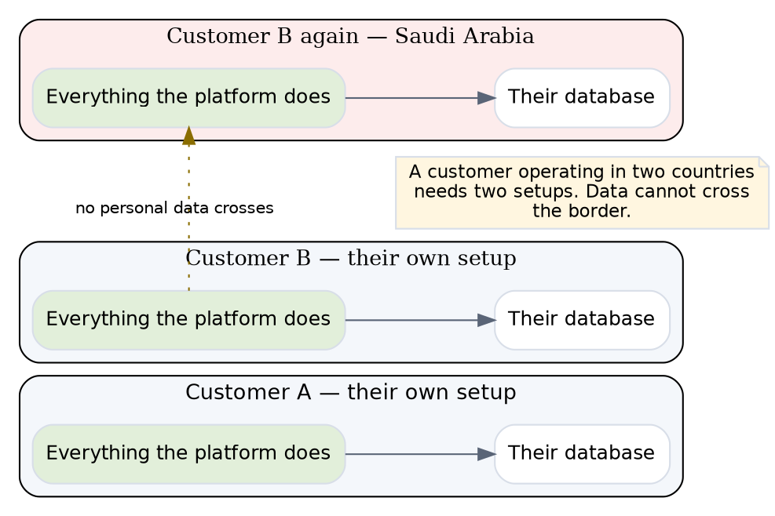
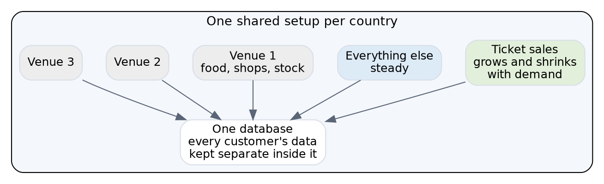
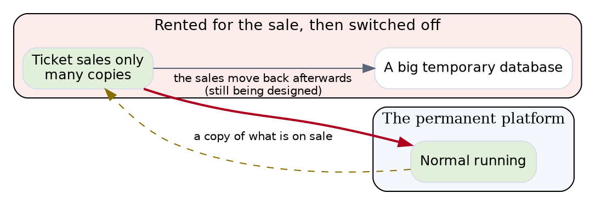
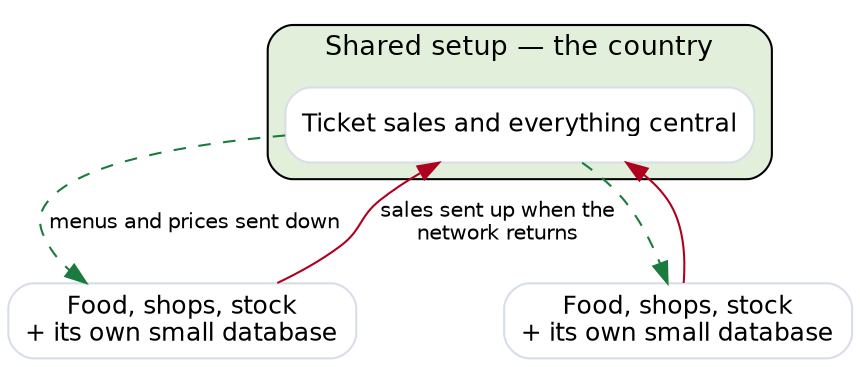

# How TICVAI will be hosted, and what it costs

**A summary for commercial and product. 31 August 2026.**

**There is a technical companion to this document.** Everything here is in it, with the workings.

---

## The problem in one paragraph

**A museum and a stadium are the same software and completely different machines.**

Qossai put it well on 31 July: a water park might see two thousand visitors in a day — **about five
people a minute, all day, nothing dramatic.** A stadium the size of Real Madrid's sells sixty
thousand seats **in a couple of hours**, and everybody arrives at once.

**Build for the museum and the stadium falls over.** Build for the stadium and the museum is paying
for machinery it will never switch on.

**This document is how we serve both without doing either of those things.**

---

## The three sizes of venue

| | Example | Guests a day | What the day looks like |
|---|---|---:|---|
| **Small** | Museum, water park | 2,000 | Steady from open to close |
| **Medium** | Theme park, concert night | 18,500 | Quiet, then a rush before the gates |
| **Large** | Stadium, arena | 60,000 | Everything in a two-hour window |

**These are the client's own numbers.** 18,500 is from the brief for Saturday's concert; 1,200 is
the corporate gala in the Grand Hall.

---

## The four ways we can host it

**Two of these are the everyday choice. One is for a big sale. One is an upgrade.**

### 1 · Private — a customer has their own setup

**Everything the platform does, running only for them, with their own database.**

**A customer operating in two countries needs two.** Data cannot cross the border, and the two are
linked only by a reference that carries no personal information.

### 2 · Shared — customers share one setup per country

**This is the default and it is what we recommend.**

**The ticket-selling part grows and shrinks with demand.** Everything else stays a steady size,
because no rush of ticket buyers makes a kitchen cook faster.

**Each venue's food, shop and stock systems run at that venue**, so a venue keeps working when the
internet does not.

**One database, with every customer's data kept separate inside it.**

### 3 · Big sale — rented for the sale, then switched off

**Only the parts that sell tickets.** Six of the sixteen parts of the platform have nothing to do
with buying a ticket and are not switched on.

**Afterwards the sales move back into the main platform.** That is the part still being designed
and it is the honest gap in this plan.

### 4 · Shared plus venue equipment — an upgrade to option 2

**A small amount of equipment at each venue with its own database.**

**The only reason to take this** is a venue that must keep trading through an outage at the country
level — not just a broken internet connection at the venue, which option 2 already handles.

**It costs roughly 1.8 times option 2**, and almost all of the difference is six hundred small
databases to look after.

---

## What each option costs, and how it is billed

**Three of these run all the time and are billed monthly. One runs for hours.**

| Option | Billed as | Amazon | Google |
|---|---|---:|---:|
| **1 · Private** | per month, always on | **$948 / month** | $779 |
| **2 · Shared** | per month, always on | **$3,485 / month** | $2,874 |
| **3 · Big sale** | **per hour, while it runs** | **$11.76 / hour** | $9.76 |
| **4 · Shared + venue equipment** | per month, always on | **$3,965 / month** | $3,237 |

### What a big sale actually costs

**It is rented by the hour and returned.**

| | Amazon |
|---|---:|
| A two-hour sale window | **$24** |
| A cautious six-hour window | **$71** |
| A full day, if somebody forgets to switch it off | **$282** |
| A whole month, if somebody really forgets | **$8,587** |

**A sixty-thousand-seat stadium selling out costs about twenty-four dollars in machinery.**

**The risk is not the cost, it is forgetting.** Left running for a month it costs more than the
platform it was protecting, so **switching it off has to be automatic rather than somebody's job.**

### With two hundred customers, three venues each

| Option | Monthly cost | What that is |
|---|---:|---|
| **1 · Private, one each** | **$189,600** | 200 separate setups, 200 databases |
| **2 · Shared** | **$96,910** | one setup per country, one database |
| **4 · Shared + venue equipment** | **$177,283** | one setup plus 600 small ones |
| **3 · Big sale** | **$24 per event** | rented and returned |

**Private hosting for everyone costs roughly twice what shared does**, and delivers isolation that a
customer serving one guest per second is not asking for.

---

## What each option is good and bad at

### 1 · Private

**Good** — Nobody else can affect them. If something breaks, it breaks for one customer. Their data
is on its own machine, which is the easiest answer to give a compliance officer. **Restoring their
data to last Tuesday affects only them.**

**Bad** — **Costs about the same for a museum as for a theme park**, because the machinery is sized
for the software rather than the traffic. Two hundred customers means two hundred sets of everything
to update, back up and watch. **A customer in two countries needs two.**

**Use it when** a contract requires it, or a customer is alone in a country, or they are big enough
to fill it.

### 2 · Shared

**Good** — **Cheapest by a wide margin.** One thing to update instead of two hundred. The
ticket-selling part borrows capacity from quiet customers when a busy one needs it, which is why a
sudden rush is absorbed rather than felt.

**Bad** — **If it goes down, it goes down for everyone in that country.** Data is kept properly
separate so nobody can see anyone else's, but **availability is shared even though privacy is not.**

**And one thing worth knowing before it is promised**: restoring one customer's data to last Tuesday
would restore everybody's. **That is a real limitation and it has not been raised with anyone.**

**Use it as the default.**

### 3 · Big sale

**Good** — **Twenty-four dollars.** It protects the exact failure Qossai described in Bahrain. It
runs only the ticket-selling parts, so there is less to go wrong.

**Bad** — **It has to be planned in advance**, which suits an announced concert and not a surprise.
The sales taken during it have to be moved back into the main platform afterwards, **and that
mechanism is still being designed.**

**Use it for** an announced on-sale where a large number of people will arrive at one moment.

### 4 · Shared plus venue equipment

**Good** — **A venue keeps trading through a countrywide outage**, not just a broken connection at
the venue.

**Bad** — **1.8 times the cost of option 2**, and six hundred small databases to look after. **The
protection is against a rare failure** — option 2 already keeps a venue trading when its own
internet fails.

**Use it when** a venue's contract requires trading through an outage they do not control.

---

## What one venue costs

**A venue's share of option 2, per month.**

| Venue size | Their share |
|---|---:|
| Small — museum, water park | **about $310 / month** |
| Medium — theme park | **about $780 / month** |
| Large — stadium, normal day | **about $1,900 / month** |
| Large — stadium, on a sell-out | **+ $24 for the sale** |

**A museum on its own private setup costs $948 a month** — more than three times its share of a
shared one, for a venue serving about one guest per second.

**And that is the decision that moves the most money.** Across two hundred customers it is
**$97,000 a month against $190,000.**

**Same software. Same performance. Twice the cost.**

---

## What happens when something breaks

**Three honest answers.**

**On a private setup, a failure affects one customer.** Nobody else notices.

**On a shared setup, a failure affects everybody sharing it.** Their data is kept properly separate
— one customer can never see another's — **but if the shared system goes down, it goes down for all
of them.**

**This is the real trade** and it belongs in a customer's contract rather than buried in a technical
document. **A customer paying for shared hosting should know they are sharing.**

---

## The thing we are most careful about

**Qossai told us what happens when this goes wrong.** A ticketing platform his team installed for a
theatre in Bahrain went down when roughly thirty thousand people tried to buy at the same moment.
**It took days to fix and cost them the client.**

**That exact shape is what the sell-out configuration exists for.** When a big sale is coming, we
stand up dedicated machinery for it, run the sale, and take it down afterwards.

**Two things about it are worth knowing:**

**It only runs the parts that sell tickets.** Not the restaurant system, not the stock system, not
reporting — **six of the sixteen parts of the platform have nothing to do with buying a ticket and
are not switched on.**

**Afterwards, the sales have to be moved into the main system.** That is the part still being
designed, and it is the honest gap in this plan.

---

## Amazon or Google

**We priced both.**

**Google comes out 15–18% cheaper**, mostly on database pricing.

**That is not a reason to pick it.** What matters more: which one satisfies Dubai's compliance
review, which has the better managed database, and which relationship we would rather have at 3 a.m.
during an incident. **Fifteen percent does not settle any of those.**

**And that decision is still open** — it is waiting on guidance from the Dubai Electronic Security
Center.

---

## The AI feature, and who pays for it

**The AI Concierge costs the customer, not us.** They bring their own account with an AI provider,
and we cap how much it can spend so a runaway conversation cannot empty their budget.

**What we pay for is the search index behind it** — roughly **$1,150 a month** across every
customer, shared.

**We spend a lot of effort not calling the AI at all.** The same forty questions get asked
thousands of times a day at a kiosk, so we remember the answers. **A remembered answer is instant
and free; a new one costs the customer money and takes a second.**

**One caution.** The search index we plan to use has not yet been confirmed as acceptable under UAE
compliance rules. **It is the cheapest part of the whole system and the only part whose legal
position is unsettled**, which is worth resolving before it is in production.

---

## What we recommend

**Share by default.** One shared setup per country, with every customer's data properly separated
inside it.

**Offer private hosting as a paid upgrade** to customers who ask for it, and **be clear it is one
setup per country** — a customer operating in both the UAE and Saudi Arabia needs two, because the
data cannot cross the border.

**Stand up dedicated machinery for big sales** and take it down after.

---

## What we still need decided

**Two things are holding this up, and both have been open since 24 August.**

**How the database is organised.** There is a disagreement between what was recommended to the
client and what the design says. **Nobody can finalise costs until it is settled**, and the
difference is significant.

**Amazon or Google.** Waiting on the Dubai compliance guidance.

**And one thing nobody has asked for yet**: how much data loss and how much downtime the client
considers acceptable. **Every plan in this document assumes an answer to that and none of them
states it.**
