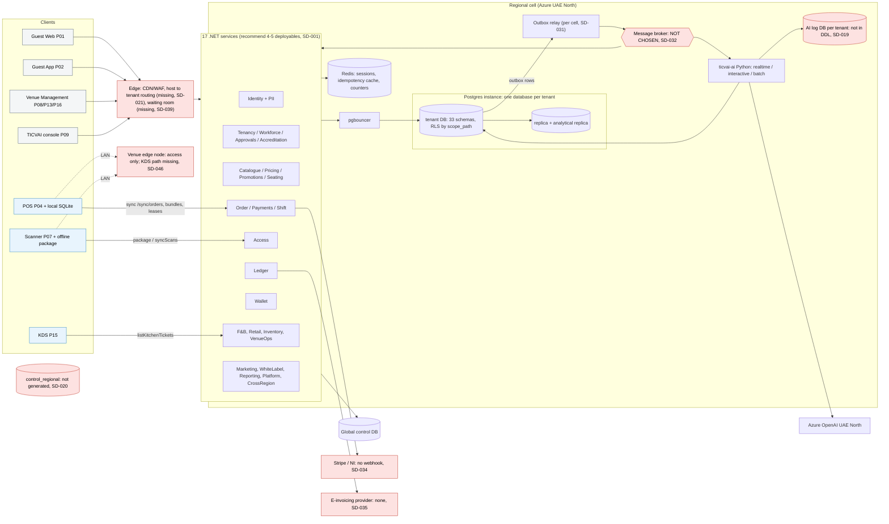
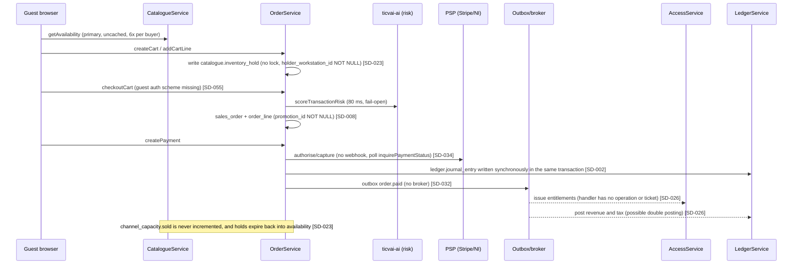
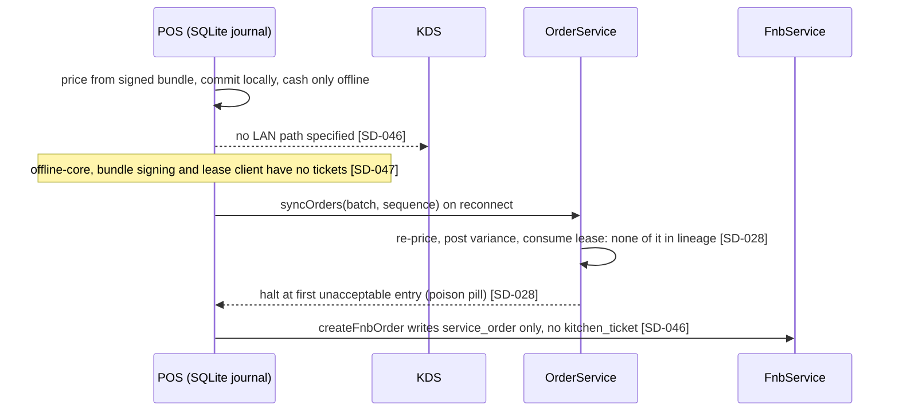

# TICVAI system design review (re-audit before Block A tickets)

**Date:** 29 September 2026. **Scope:** the package in `ticvai/` as on disk today (read-only; other work is editing screens and flows). **Method:** the system-design framework (requirements, high-level design, deep dive, scale and reliability, trade-offs), with every finding checked against the contracts, DDL, lineage, events, flows, ADRs and task list. Machine-readable findings: `findings.json` (63 findings). Working scripts: `work/`.

---

## 1. Executive summary

1. The package is unusually thorough on intent: 48 ADRs, per-operation declarations for permission, routing, conflict policy and offline, an outbox/dead-letter design, lease-based contention, and an AI design that keeps language models off every money path. The problems are in the joins between these, not in the ideas.
2. **Ten blockers for Block A.** Four are defects in generated artefacts: invalid DDL (two fake schemas, two fake tables and six fake FKs, so the very first migration fails), `order_line.promotion_id NOT NULL`, 295 operations with no authentication scheme, and missing tickets for the platform skeleton.
3. **The sale path does not hold together end to end.** Capacity is never decremented on sale (oversell), nothing issues tickets after payment (the saga stops at `order.paid`), and no message broker has been chosen to carry `order.paid`.
4. **Payments have no inbound integration.** There is no provider webhook, no provider reference and no 3-D Secure return path, only polling. Stripe and NI sandboxes are still outstanding.
5. **POS with KDS, the headline of Block A, has no POS-to-kitchen path.** `createFnbOrder` creates no kitchen ticket, and offline the KDS has no LAN route. The offline-core engine (journal, bundle signing, leases) has no tickets.
6. **Service boundaries are logical, not physical.** 17 deployables share one database per tenant, with 35 multi-writer tables and 894 cross-schema reads. Recommendation: a modular monolith deployed as 4–5 units. This keeps every ADR-0028 boundary and removes about 70% of the operational surface for a 14-person team.
7. **Consistency promises exceed their mechanisms.** Idempotency lives only in Redis. The consistency token is returned by 1,354 writes and accepted by no read. `serverWins` optimistic concurrency has a version column on only 62 of 1,068 tables. The wallet balance of record has no writer.
8. The data model needs a few decisions before the first migration, because they fix primary keys: the partitioning shape (ADR-0044 is accepted but nothing is partitioned), currency on money rows, and ID types.
9. The AI platform design is sound and does support "baseline now, learns per tenant" (rules, then statistics, then a shadow model a person promotes). It is still a draft, though, the ADRs it needs (0049–0054) do not exist, and its Block A scope (32 dev-weeks) does not fit the plan.
10. **Counts:** 10 blocker, 19 high, 29 medium, 5 low. By where to fix: 36 in the package, 15 need an ADR, 9 are Block A build tasks, 3 are later. Most blockers are 1–8 points each, about 70 points of package and ADR work before tickets are cut.

---

## 2. Requirements recap (what the design must satisfy)

| | |
|---|---|
| **Functional** | Multi-tenant venue platform: ticketing (timed, seated, passes), POS with KDS, F&B, retail, access control and offline scanners, accreditation, CRM and marketing, wallet/cashless, seating, subscriptions and licensing, public API, AI (governed assistants, forecasting, fraud, recommendations). 2,608 operations, 1,076 tables, 16 platforms, 5 apps. |
| **Scale** | Venue tiers of 2k, 18.5k and 60k guests a day (`sizing.json`); normal cell peaks of 382 to 7,036 rps; on-sale burst of 5,000 rps for a 30k-buyer sale (ADR-0035); 10 tenants at go-live, growing (ADR-0038). |
| **Latency** | Gate under 300 ms, local (ADR-0028). Availability under 400 ms and payment under 8 s (F01). p95 200 ms read and 400 ms order (deployment analysis). Risk scoring 80 ms, recommendations 200 ms (AI). |
| **Availability** | 99.99% agreed on 31 July (`deployment-and-scaling-brief.md`). POS, scanner and KDS keep working with the WAN down (ADR-0013). |
| **Constraints** | Team of 14. Block A is 5 Oct to 20 Nov 2026 (35 days) and the whole programme ends 2 Apr 2027. .NET back end with PostgreSQL, Python for AI. React web and React Native. Azure UAE North, with residency per ADR-0038/0043 and PDPL. |

---

## 3. High-level design, as the package specifies it

### 3.1 Components

### 3.2 Main data flows (as specified, with the gaps marked)

**Guest web checkout (F01).** The flow's own steps skip the cart. The package's cart path is what screens WEB-010 and GST-041 bind.

**POS sale, offline then sync (ADR-0013).**

**Gate scan (F06, Block B1).** The steward loads `getOfflinePackage`, built from the replica. Per lineage the package does **not** include `access.entitlement` or the dynamic policy (SD-052, SD-005). `validateAccess` decides locally and journals `scan_event`; `syncScans` appends, with `sync.rejection` holding what the server refuses. The scan path is the most mature in the package: append-only conflict policy, a local decision, and a rejection table.

**AI request (guest concierge or recommendation).** Client → service → `ticvai-ai` real-time or interactive process → governance decision point (in-process) → gateway (masking fails closed, budget, breaker) → Azure OpenAI UAE North for language tasks only. Recommendations and fraud use rules or classical models within 200 ms and 80 ms budgets and fail open. A decision record goes to the AI log database, which is not in the DDL (SD-019). Retrieval uses pgvector in the tenant database, per the draft design (SD-060).

---

## 4. Findings by area

Severity: **B** blocker for Block A, **H** high, **M** medium, **L** low. Full evidence, impact and effort for each finding are in `findings.json`.

### 4.1 Service boundaries and ownership

| ID | Sev | Finding | Key evidence |
|---|---|---|---|
| SD-001 | H | 17 deployables over one database per tenant form a distributed monolith, and ADR-0028's "no schema written by two services" is false | 35 multi-writer tables; 894 cross-schema reads in 493 ops; `data-model.md` promises per-schema grants; 34 replica floor at 65 rps |
| SD-002 | H | The sale path writes Catalogue, Access, Ledger and Wallet tables from OrderService | `addCartLine` → `catalogue.inventory_hold`; 9 ops → `access.entitlement`; `createPayment` → `ledger.journal_entry` |
| SD-003 | M | Kernel tables sit in domain schemas | `platform.outbox` (Tenancy) written by 14 services; `sync.*` owned by CrossRegion; `platform.wallet_authorisation` written only by CrossRegion |
| SD-004 | M | Two device registers | `platform.device` vs `access.access_device` |
| SD-005 | M | Two access policy engines | `identity.access_policy` vs `access.dynamic_policy`; offline package has neither |
| SD-006 | L | Decomposition docs stale | ADR-0028 "Sixteen services"; "304 of 379 tables" |

**Recommended merges.** Devices: `platform.device` becomes the single register, and access keeps only an access-point binding. Policy: guest admission lives in Access only, and identity keeps staff authorisation. Kernel tables move to a platform-owned schema. Wallet authorisations fold into `wallet`. There is a third duplicate the brief did not name: **`fnb.service_order` versus `orders.sales_order`**. This is two order aggregates with no FK between them (`service_order.sales_order_id`). Keep `sales_order` as the commercial order and treat the F&B record as its fulfilment (SD-046).

**Chatty hot paths.** Because every service shares the tenant database, cross-service reads are SQL joins, not network calls. `addCartLine` reads 6 foreign tables and `getCart` 5, so the hot paths are not chatty over the network. The coupling is at the schema level instead: any column rename in `catalogue` breaks OrderService. That is the argument for SD-001: treat the system as one codebase with enforced module boundaries, rather than pay for network boundaries the data layer does not respect.

### 4.2 Data model

| ID | Sev | Finding | Key evidence |
|---|---|---|---|
| SD-007 | **B** | Two invalid schemas, two invalid tables and six invalid FKs in generated DDL; the first migration (MIG-BASELINE) fails | `000-schemas.sql:19-20`; `backend/tenant/010-embedded as attributes (jsonb) on orders.sql`; `900-foreign-keys.sql:353,354,401,402,429,430`; 27 ops cite them |
| SD-008 | **B** | `order_line.promotion_id uuid NOT NULL` (a discount flattened into the line), and no `venue_id` | `010-orders.sql` |
| SD-009 | H | Transport ids are `jsonb PRIMARY KEY` and the tables have no writer; 15 transport ops are in the slice | `010-transport.sql` |
| SD-010 | H | ADR-0044 accepted, 0 `PARTITION BY`; PK shape must be fixed before data | `930-partitioning.sql`; `sales_order.id text PK` |
| SD-011 | H | 294 of 317 money-bearing tables have no currency, including order, line, posting and journal line | ADR-0008 |
| SD-012 | M | Mixed ID types; `outbox.aggregate_id uuid` cannot hold a text ULID order id | 980 uuid / 79 text / 9 jsonb |
| SD-013 | M | `serverWins` on 2,109 ops, `version` on 62 tables, no If-Match | ADR-0031 |
| SD-014 | L | No audit-column or deletion convention | `created_at` on 258 of 1,068 tables |
| SD-015 | H | 212 tenant tables have no RLS policy, including `pii.subject*`, `payments.token`, `wallet.*`, `identity.principal` | `920-row-level-security.sql` |
| SD-016 | M | RLS runs a per-row subquery (`venue_in_scope`, parent `EXISTS`) on 222 tables | `920` |
| SD-017 | M | FK gaps on hot tables | `journal_line.account_id`, `entitlement.subject_id`, `kitchen_ticket.order_id` |
| SD-018 | M | Hot-path configuration stored as jsonb blobs | `venue_settings` 14 jsonb columns; `admission_rules` 5 |
| SD-019 | M | Vectors stored as `text`; AI log tables in the tenant DDL; lineage says Qdrant | `ai.chunk_embedding.dense text` |
| SD-020 | M | ADR-0043 split not generated; tenant CMS content in the global control DB | `control.content_block`, `seo_metadata`, `url_redirect` |
| SD-021 | H | No hostname → tenant routing table outside the tenant DB | `whitelabel.custom_domain` sits inside the tenant DB |
| SD-022 | M | 18 slice writes have no table in lineage; path parameter `{reinventoryHoldId}` | `recordConsentAnswers`, `openPlatformStaffGrant`, `createResourceHold` |

**Tenancy isolation.** Tenant-to-tenant isolation comes from the database per tenant (ADR-0038), which is the strongest boundary available and is right. RLS is venue and scope isolation *inside* a tenant. It is default-deny and FORCEd, which is correct, but 212 tables are open by default. The control and tenant split is sound. What is missing is the regional half of the control plane and a routing table.

**Partitioning.** ADR-0044's list-by-venue rule makes 85 tables partitioned and adds a `venue_id` column to 74 more. That is expensive to retrofit, and it does nothing for the tables that actually grow, which grow with *time*: `scan_event`, `outbox`, `journal_line`, audit tables, `message_dispatch`. Recommendation for the first release: range-partition those by month (no composite FKs needed) and defer venue partitioning. Either way, **decide before MIG tickets**.

### 4.3 Consistency

| ID | Sev | Finding | Key evidence |
|---|---|---|---|
| SD-023 | **B** | Capacity never decremented on sale, so the design oversells | `channel_capacity.sold` written only by config ops; no converted state for a hold; cart holds skip the lock; `holder_workstation_id NOT NULL` |
| SD-024 | H | Idempotency only in Redis | `cache:idempotency`; no durable table |
| SD-025 | H | Consistency token returned by 1,354 writes, accepted by 0 of 1,159 GETs | `common.yaml` |
| SD-026 | **B** | Order → payment → ticket saga not closed | no op issues entitlements on payment; `order.paid` consumer "catalogue" writes Access's table; ledger posts both synchronously and from the event |
| SD-027 | H | Wallet double-spend | `wallet.balance` has no writer; `authoriseStoredValue` takes no lock; three authorisation stores |
| SD-028 | H | `syncOrders` barely modelled; stops at first bad entry; 3 points | lineage writes only `sales_order` |
| SD-029 | M | 32 LWW ops (ADR-0022's review threshold is 30), including HACCP readings; 215 writes with no conflict policy | `logTemperature`, `logColdChain` |
| SD-030 | M | Outbox has no unpublished-row index; 68 of 69 events lack `sequence` | `platform.outbox` |
| SD-031 | H | Relay designed per cell while outboxes live per tenant DB; no inbox table | ADR-0033 vs ADR-0038 |

**Exactly-once versus at-least-once.** The design is correctly at-least-once with idempotent consumers. It needs three pieces it does not yet have: a durable inbox to de-duplicate on the consumer side, a standard envelope with `eventId` and `sequence`, and the broker.

**Seat holds under burst.** `createSeatHold` and `acquireInventoryHold` take the right locks (SKIP LOCKED where the buyer does not care which unit), and ADR-0037's rule of one statement per lock is good. The guest-cart path bypasses both (SD-023).

### 4.4 Events and integration

| ID | Sev | Finding |
|---|---|---|
| SD-032 | **B** | No broker chosen or in any deployment config |
| SD-033 | H | No `x-ticvai-emits`. Missing events needed in Block A: payment captured, order created, kitchen ticket created, hold expired, `wallet.*`, sync rejection |
| SD-034 | **B** | Payments: no inbound webhook, no provider reference, no 3DS return, no terminal (ECR) flow; sandboxes outstanding |
| SD-035 | H | E-invoicing is make-or-break (5 ops) with no provider design |
| SD-036 | M | Outbound webhooks stored globally, events arise per tenant |
| SD-037 | L | Weather and ID-verification vendors not chosen (Block B) |

The event catalogue is well structured (69 events, each consumer states its idempotency key and failure mode, and critical consumers are flagged). Its gap is the link back to the operations that emit each event.

### 4.5 Scale and performance

| ID | Sev | Finding |
|---|---|---|
| SD-038 | H | `getAvailability` goes to the primary, uncached, 6 times per buyer. At 5,000 rps × 63.6% catalogue, browsing loads the primary more than holds do. The sale mix sums to 87.2% |
| SD-039 | H | The on-sale waiting room (ADR-0012 Q2) is bound to the ride-queue operations (a Postgres write per arrival); there is no admission token |
| SD-040 | M | Latency budgets declared on 3 ops (all AI); every hot-path budget is prose |
| SD-041 | M | The burst environment deploys 3 services, but the buyer path calls 7 |
| SD-042 | M | No per-tenant rate limit (deferred in ADR-0032) |
| SD-043 | M | 429 declared on 9 of 2,608 ops |
| SD-044 | M | Replica floors sized per service; the sizing note contradicts its own mix |

**Load, roughly.** Normal operation is small. A large cell peaks at 7k rps across all services, and the heaviest single call is about 1.7k rps of catalogue reads, which replicas and caching absorb easily. The real constraints are three:

- the contended hold row (ADR-0037: about 2,000 holds per second per row at 0.5 ms);
- primary connections summed over tenant databases (ADR-0032: 10 tenants, which is 11 databases, reach 89% of `max_connections` in the worst case);
- the burst browse read (SD-038).

None of these is addressed by adding replicas.

### 4.6 Reliability and operations

| ID | Sev | Finding |
|---|---|---|
| SD-045 | H | 99.99% agreed; no HA/DR/PITR ADR; RPO/RTO only in the conflicts register |
| SD-046 | **B** | No POS → KDS routing online (no kitchen ticket created) or offline (no LAN path) |
| SD-047 | **B** | Offline-core, bundle signing, lease client and staleness bound have no tickets |
| SD-048 | M | Observability is a 2-point task |
| SD-049 | M | Migration fan-out and expand/contract not ticketed |
| SD-050 | M | Nothing frozen; compat checker ignores response enums and x-ticvai semantics |
| SD-051 | L | No release flags |
| SD-052 | M | Scanner package omits entitlements and dynamic policy (B1) |
| SD-053 | L | `sprint-1.md` stale; ADR index missing 12 ADRs |

**When to freeze Block A contracts.** Not now: the saga, capacity and payment fixes above will change `orders`, `catalogue` and `payments`. Freeze each core contract (orders, catalogue, identity, tenancy, white-label, fnb) **once its first end-to-end path passes, with a target of Friday 6 November, two weeks after the 23 October pace checkpoint**, and certainly before the guest app's first store build. Extend `check-contract-compat` to response enum additions and to `x-ticvai-permission`, conflict policy, routing and events, and make generated clients tolerate unknown enum values.

**Deploy strategy per sprint.** Deploy per sprint to staging with expand-migrate-contract migrations fanned out tenant by tenant (canary tenant first, ADR-0039), and use feature flags keyed by tenant to dark-launch. Production deploys follow the tier order in ADR-0028 (foundation first). With the 4–5 deployables from SD-001 this becomes 5 rollouts instead of 17.

### 4.7 Security

| ID | Sev | Finding |
|---|---|---|
| SD-054 | **B** | 295 ops unauthenticated as written: 7 contracts have no `security` or `securitySchemes`; 48 slice ops affected (wallet, payments, resources, public-api, venue-map) |
| SD-055 | H | 37 guest-facing ops resolve to the staff `bearerAuth` scheme; cart ops are not self-scoped (cart id as capability) |
| SD-056 | M | The 134 permission-less ops (below) |
| SD-057 | M | Audit fragmented across 11 tables; 27 of 29 escalated ops write no audit |
| SD-058 | M | No encryption/CMK ADR; biometric template location unstated |
| SD-059 | M | Scope setting per transaction under pgbouncer, and a system scope for workers, not ticketed |

**The 134 operations without a permission.** 95% of operations declare one. Of the 134 that do not:

| Group | Count | Right? |
|---|---:|---|
| Guest self-service (own profile, cart, orders, wishlist, queue, MFA) | 77 | **Yes**, provided each one is self-scoped. Not self-scoped today: `updateParkingEntitlement`, `createTableReservation`, `updateTableReservation`, and all cart ops |
| Anonymous or public (login, OTP, SSO, cookie consent, transport timetables, storefront events) | 26 | **Yes**, except `registerPartner` (anonymous write into `control.partner` and `approvals.request`: add rate limit and challenge) and `getDeviceConsentHistory` (anonymous read by device id) |
| Service-to-service (AI scoring, cross-region, DSAR, usage, e-invoice callback) | 18 | **Acceptable** with workload identity plus a per-op caller allowlist, which is missing. `sendTransactionalMessage` also admits `partner` and must get a partner permission |
| Device (game readers, signage, heartbeat, kiosk assist) | 9 | Needs a device credential. `endKioskAssist` and `recordDeviceHeartbeat` resolve to no device scheme |
| Own staff session (logout, select role, change own credential, current session) | 4 | **Yes** |

**PII.** The `pii` schema separation from the append-only ledger (ADR-0023) and the control-plane split on personal data (ADR-0043) are the right design. The gaps are grants and RLS on `pii.*` (SD-015), the unimplemented `control_regional` (SD-020), and the biometric retention floor, which remains a client make-or-break while `enrolFaceTag` is on a Block A screen (POS-005).

**Secrets and BYOK.** Key Vault per cell and `credentialRef` only (`ai-credentials.md`) are good. BYOK covers model provider keys. Nothing covers data encryption keys (SD-058). Guest auth (OTP, UAE Pass, social) and staff SSO/MFA are contracted. Their test is whether the guest scheme is actually applied (SD-055).

### 4.8 AI platform

| ID | Sev | Finding |
|---|---|---|
| SD-060 | H | The AI design is a draft; ADR-0049–0054 do not exist; ADR-0021 (Qdrant) is still the recorded position |
| SD-061 | M | "Learns per tenant" has no model-version, training-run or sufficiency tables, and no common Producer interface |
| SD-062 | M | Block A AI scope is 32 dev-weeks against 7 weeks with 1–2 engineers; the plan already moved two assistants out |

**What is right.**

- **Gateway and routing.** One gateway with task-based routing, masking that fails closed, budgets, breakers, and a residency refusal that is never failed over.
- **Governance decision point.** In-process, 5 ms.
- **Language models kept off money paths.** Fraud and recommendations are rules or classical models, fail open, with hard budgets.
- **Retrieval.** pgvector in the tenant database, so RLS carries scope and erasure follows the tenant lifecycle.
- **Evaluation and promotion.** Golden sets, isolation cases must pass 100%, stages from shadow to canary, and a person promotes.
- **Cost controls.** Per-tenant budgets, ceilings, and a 25% concurrency cap.

The rule that the LLM never touches raw data is upheld by design (section 5.10: compute the figures first, bind them into the text, or have the model write a query that runs deterministically). It is not enforced by contract. Add a lineage check that AiService operations read only `ai.*` or go through owner APIs.

**"Baseline now, learns per tenant as data grows"** is supported in principle: each engine ships a rules producer, a statistical producer that improves with history, and a per-tenant model trained in shadow and promoted by a person against stated gates (WAPE, precision and recall, experiment). The missing pieces are all concrete:

- a `Producer` interface common to forecast, fraud and recommendations (fit, predict, explain, backtest, with kind rule, statistical or model);
- a per-tenant model and version registry: `ai.release.candidate_ref` is free text today;
- a training and backtest run record;
- data-sufficiency thresholds per capability per tenant.

Features-as-code instead of a feature store is the right call for one or two AI engineers.

### 4.9 Block A readiness

| ID | Sev | Finding |
|---|---|---|
| SD-063 | **B** | The platform skeleton has no tickets. 1,014 tasks, of which only SETUP-AUTH, SETUP-DB (5 points each) and SETUP-OBS (2 points) are platform work. A starter kernel exists per `STEPS.md` S002, but what it implements is not checkable from the package |

Also Block A–critical from other areas: SD-007, 008, 023, 026, 032, 034, 046, 047, 054 (blockers) and SD-021, 024, 027, 028, 055, 059 (high or medium, on the Block A path).

---

## 5. Trade-offs

| Decision | Chosen (or recommended) | Gives | Costs | Why here |
|---|---|---|---|---|
| Deployment shape | **Modular monolith as 4–5 deployables** (recommended over 17 services) | One transaction for order + payment + entitlement (which `data-model.md` requires anyway); 5 rollouts not 17; floor of about 10 replicas not 34; shared kernel built once | Less independent scaling per module; discipline needed to keep module boundaries (architecture tests) | 14 people, 6 months, one database per tenant already couples every service. Keeps the two boundaries ADR-0028 actually needs: Access at the edge, AI isolated |
| Tenancy | Database per tenant (ADR-0038) | Real isolation, per-tenant restore, bounded offboarding, residency by host | N migrations, per-database pools, relay per database | Right. Extraction of a tenant is the operation clients will ask for |
| Venue isolation | RLS now, **time partitioning first**, venue partitioning later | Pruning where growth is; no composite-FK retrofit | Venue-level vacuum and archive deferred | ADR-0044's cost is mostly in the 74 added columns |
| Contention | Row lock held for one statement, SKIP LOCKED; guarded decrement for capacity | Correct without a retry storm | Throughput ceiling per hot row; a sweeper for expired holds | ADR-0031/0037 reasoning is sound; finish it |
| Idempotency | Postgres record in the same transaction, Redis as cache | Survives Redis loss | One insert per write | Payments cannot rely on a cache |
| Events | Outbox + Service Bus (sessions per aggregate) + inbox | Ordering per aggregate, managed DLQ, in-region | Azure lock-in behind an interface; an on-premise profile needs another broker | Kafka is more machinery than 10–200 tenants need |
| Availability reads at burst | Cached counters for browse, primary check at hold | The primary survives the sale | Up to 2 s stale "available" | A lie on the browse page is recoverable; a lie at the hold is not |
| POS | Local-first (ADR-0013) | Offline is the only path, so it is always tested | About 2.2× build effort; the offline-core epic is missing | Required by requirements and venue reality |
| AI | Rules first, per-tenant models on evidence | Value in week 1; no confident wrong numbers | Slower visible "AI" | Right for new tenants with no history |
| Vector store | pgvector in the tenant DB | RLS, erasure, one store fewer | Scale ceiling (about 2M chunks per tenant) | The revisit trigger is stated |

---

## 6. What we would revisit as it grows

| Trigger | Revisit |
|---|---|
| A module's load profile diverges (Order at 10× on Saturdays, Marketing campaign sends) | Split that module into its own deployable. The boundary already exists in code |
| More than about 11 busy tenants on one instance, or sustained approach to `max_connections` | Add an instance to the region (ADR-0040); per-tenant pool caps |
| A single hot performance beyond about 2,000 holds per second | Sharded capacity counters or a Redis-held lease with Postgres reconciliation (ADR-0037 alternatives) |
| On-sales above 5k rps, or more than 1 per week | Burst environment (ADR-0035) plus a dedicated waiting-room vendor |
| More than 200 tenant databases | Logical-decoding relay instead of polling; migration fan-out scheduler; per-tenant migration retention |
| A tenant with more than 100 venues or very hot venues | Venue list partitioning per ADR-0044 |
| Reporting load on the analytical replica | CQRS read models or a warehouse fed from events (ADR-0016 left the door open) |
| AI: more than 2M chunks per tenant, more than 3 ML engineers, or more than 5k confirmed fraud labels | Qdrant shard per tenant; feature store; graph and sequence models |
| A second region or a DR customer | Cross-region replication of the control plane and a DR runbook per tenant |

---

## 7. Prioritised action list

### 7.1 Fix in the package before tickets are cut (in order)

1. **SD-007** Drop the fake "embedded" tables, FKs and columns; fix `derive-ddl`; regenerate lineage. (2)
2. **SD-054** Add `security` and `securitySchemes` to wallet, payments, resources, accreditation, rental, public-api, venue-map; add a check. (1)
3. **SD-008** Move `order_line` discounts to `order_line_discount`; add `venue_id`. (1)
4. **SD-023** Capacity model: guarded decrement, converted hold state, sweeper, holder (kind, id), one locked hold path. (5)
5. **SD-026** Close the order→payment→entitlement saga; model event handlers as internal operations; settle ledger posting ownership. (5)
6. **SD-034** Payment provider adapter, inbound webhook operation, provider references, 3DS and ECR flows. (8)
7. **SD-024** Durable idempotency record. (3)
8. **SD-027** Single wallet debit path. (5)
9. **SD-028** Specify `syncOrders` ingest and re-size the ticket. (8)
10. **SD-055 / SD-056** Guest auth scheme and self-scoping on guest ops; fix the risky permission-less ops. (4)
11. **SD-021** `control.tenant_domain` routing table. (2)
12. **SD-011** Currency on money rows and the VAT rounding rule. (3)
13. **SD-009, SD-022, SD-025, SD-033, SD-043, SD-030, SD-012** Transport keys, lineage holes, consistency-token params, `x-ticvai-emits` and missing events, 429 everywhere, outbox index and envelope, ID types.
14. Then the medium and low package items: SD-013, 015, 017, 018, 019, 020, 029, 040, 050, 052, 061, 003, 006, 014, 053.

### 7.2 ADR needed (decide in week 1 unless marked)

| ADR | Decides | Finding |
|---|---|---|
| Deployment shape | Modular monolith, 4–5 deployables, module rules, cross-schema read views and write policy | SD-001, SD-002 |
| Messaging | Azure Service Bus, topics, sessions, DLQ; relay per tenant DB; inbox | SD-032, SD-031 |
| Partitioning amendment (0044) | Time-range first; PK shape frozen before MIG | SD-010 |
| Availability, HA, DR | SLO per tier, zone-redundant HA, PITR, restore drills, DR option | SD-045 |
| AI baseline | Accept the AI design; write 0049 and 0051 now, 0050/0052–0054 in Block A; re-cut Block A AI scope | SD-060, SD-062 |
| Device register and policy engine merges | SD-004, SD-005 (before B1 scanner work) | |
| E-invoicing provider | Before the Block A finance setup screens ship | SD-035 |
| Burst read path and waiting room | Before the first on-sale | SD-038, SD-039 |
| Per-tenant limits | SD-042 | |
| Encryption and keys | SD-058 | |
| Replica floors | Follows the deployment-shape ADR | SD-044 |

### 7.3 Build tasks to add to Block A

| Task | Finding | Points (rough) |
|---|---|---:|
| Platform kernel: tenant resolution (host → tenant → database), per-transaction scope setting, system scope for workers, problem+json, 429/503 with Retry-After, circuit breakers, bulkheads | SD-063, SD-059 | 13 |
| Durable idempotency middleware | SD-024 | 3 |
| Outbox relay, broker adapter, inbox consumer framework, dead-letter replay | SD-063, SD-031 | 8 |
| Offline-core: journal, outbox, orchestrator, bundle apply and verify, lease client, staleness bound; server-side bundle signing and key rotation | SD-047 | 13 |
| POS → KDS routing, online and LAN | SD-046 | 8 |
| Payment adapters (Stripe, NI) and webhook endpoint, once sandboxes arrive | SD-034 | 8 |
| Audit interceptor | SD-057 | 3 |
| Observability: tenant/venue/cell attributes, six alerts, dashboards | SD-048 | 5 |
| Migration fan-out orchestrator and expand/contract CI check | SD-049 | 5 |
| RLS performance benchmark (sprint 2) | SD-016 | 3 |
| Hold-contention benchmark `tools/bench.py --pattern hot-venue` (sprint 2) | SD-063 | 2 |
| Feature flags keyed by tenant | SD-051 | 2 |

### 7.4 Later (B1 and after)

SD-036 outbound webhooks. SD-037 weather and ID-verification vendors. SD-041 burst environment service set. SD-052 scanner package contents (B1, with the scanner). Venue partitioning. Waiting room (unless an on-sale lands in Block A).

---

## 8. Block A must-dos

**Before sprint 1 starts (by Monday 5 October).** Without these, the tickets that would be wrong are those for MIG, OrderService, CatalogueService, WalletService, PaymentService and POS.

1. Regenerate DDL and lineage without the fake tables; fix `order_line` (SD-007, SD-008).
2. Add security schemes to the 7 contracts and the guest scheme to guest ops (SD-054, SD-055).
3. Decide the key shape: partition by time or by venue, the ULID domain, currency columns. Once MIG tickets run, primary keys are expensive to change (SD-010, SD-011, SD-012).
4. Write the capacity model and the order→payment→entitlement saga into the contracts and lineage (SD-023, SD-026).
5. Choose the broker; decide the deployment shape (SD-032, SD-001).
6. Add the Platform and offline-core epics to the task list (SD-063, SD-047).

**During sprint 1 (5–23 October).**

- **Week 1.** Kernel: tenant routing, scope per transaction, idempotency, errors and 429 (SD-059, SD-024). SETUP-DB applies clean DDL to a tenant and a control database. Gate 0 test: an unset scope returns zero rows.
- **Week 1–2.** Outbox, relay, broker and inbox, proven on `order.paid` → entitlement issuance → `entitlement.issued` (SD-026, SD-031).
- **Week 2.** Payment adapter interface and webhook endpoint against the Stripe test mode, even if the NI sandbox is late (SD-034). POS → KDS routing decision and online path (SD-046).
- **Week 2–3.** Offline-core journal, bundle apply and lease client behind the POS shell (SD-047). `syncOrders` ingest to the new spec (SD-028).
- **Throughout.** OpenTelemetry with tenant, venue and cell attributes in the kernel (SD-048). Audit interceptor (SD-057).
- **By 23 October (the pace checkpoint).** One guest-web purchase and one offline POS cash sale end to end, each producing a ticket and a ledger entry. Hold-contention benchmark run once.

---

## 9. Not checkable from the package

- Whether the starter repository's kernel (`Money`, `Ulid`, `ITenantContext`, `IIdempotencyStore`, `SqlMigrationRunner`, per `audit/ticvai/STEPS.md` S002) already implements idempotency persistence, scope setting, outbox or error handling.
- Actual latency, throughput and contention figures: `tools/bench.py` results are not in the package, and `sizing.json` says `rpsPerReplica` is a hypothesis.
- Azure specifics: which Postgres SKU and HA mode, which models UAE North offers, and Service Bus availability.
- Payment-provider capabilities (3DS flow, terminal ECR protocol) until the sandboxes arrive.
- Legal points: the UAE e-invoicing dates and the biometric retention floor (both flagged make-or-break in the contracts).
- Where biometric templates are held (vendor or platform): stated nowhere.
