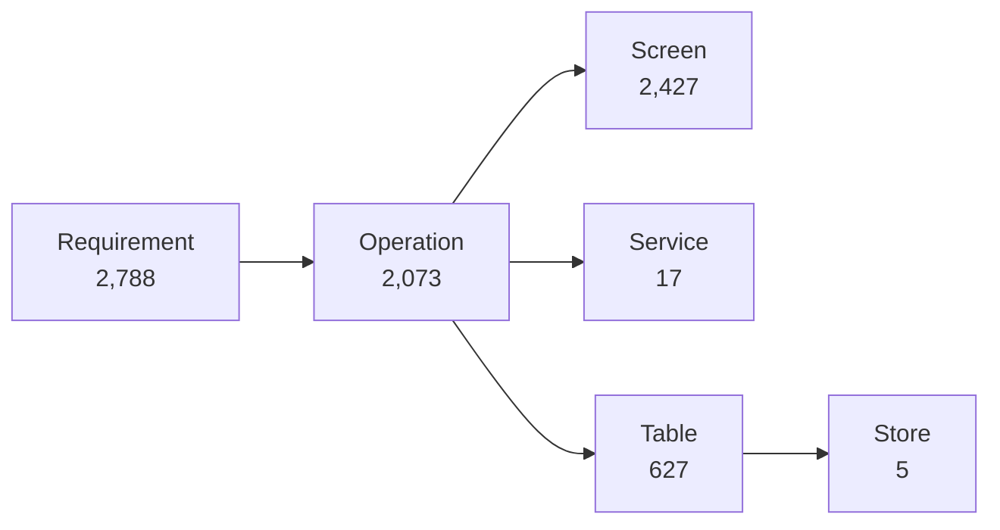

# TICVAI — build readiness

21 September 2026 · Chinmay Parab

## Verdict

**Yes — start on the sale-and-entry path, and do not start on the back office.** 281 screens across guest web, guest app, kiosk, POS, staff app, scanner and kitchen display call 407 operations, of which **exactly one is unagreed**. Everything under those screens resolves: a service, a permission, the tables it touches, and a row-level security policy on every one of those tables.

**The package is not uniformly ready, and the unevenness is the useful finding.** 577 of 2,073 operations — 28% — carry `x-ticvai-provisional`: drafted out of client workshop packs, never agreed with anyone who has to build them. **All 577 are also exactly the operations with no data lineage, with no exception in either direction.** They are not scattered. They sit in the back office: TICVAI Web is 44% ready, Venue Management 72%, Venue CMS 68%. The floor is 99–100%.

|  |  |
| --- | --: |
| Operations that are agreed and fully resolved | 1,429 of 2,073 |
| Screens naming an operation | 2,319 of 2,427 |
| Screens naming an operation that does not exist | 0 |
| Requirements contracted | 2,650 of 2,788 |
| Contract backlog closed | 175 of 179 |
| Tables with row-level security | 310 |
| Conflicts open, blocking | 9, **none** |

### Three things are not ready, and only the second is quick

1. **577 operations need agreeing, not designing.** Each cites the client pack and page it came from and every citation resolves to a real page, so this is a series of review meetings — concentrated in seven contracts, heaviest in `access` (146) and `catalogue` (108).
2. **72 permissions have no description**, so 121 of the 232 module checklist items would render as a bare key. One line each. Until then the user-and-access screen cannot ship, and that screen gates every other one.
3. **Nothing has ever executed.** No migration has been applied, Sprint 0 stands at 0 of 11, and `backend/` is a generated template rather than a migration history. The DDL is complete and untested, which is a different thing from ready.

### The gate ran and failed the build, which is the honest headline

**This was the first full refresh through the restored checker gate, and it exited 1.** 32 checkers ran, 30 passed, one is report-only, and **two failed** — both of them real, neither of them a design defect:

- **`check-package`** — six errors, all the same error: the six repository mirrors were two files behind the root. Those two files were this report's own output, written minutes earlier; a second mirror pass fixed it.
- **`check-authored-inputs`** — seven files authored against yesterday's contract surface, including `traceability.json`, `service-decomposition.json` and `contract-backlog.json`. The operations added this week are not reflected in them. **Nothing in `tools/` can rebuild these**, which is exactly why the checker exists.

**A gate that passes on its first run tells you nothing.** This one caught a stale mirror and seven inputs that had drifted, on a day when eleven contract changes went in. It also means the two steps below it in `refresh.sh` — the transition-coverage print and the tool-coverage guard — never ran, because `set -e` stops the script there.

**Everything below is derived by `tools/build-package-report.py` in the same refresh, and the same figures are in `handoff/TICVAI_Build_Readiness.xlsx` as rows you can filter.**

## Scale

**The package is 32 contracts, 2,073 operations and 2,427 screens over 627 tables.** Every figure below is read from a file a tool wrote in the refresh, never from prose — `tools/build-package-report.py` does the joins and `handoff/status.json` holds the headline counts.

|  |  |  |
| --- | --: | --- |
| Contracts | 32 | OpenAPI documents under `contracts/` |
| Operations | 2,073 | distinct `operationId` across all contracts |
| Screens | 2,427 | each with a purpose, a route and navigation |
| Platforms | 16 | P01–P17, less the retired P03 |
| Apps | 5 | the platforms collapse into five buildable front ends |
| Services | 17 | deployables, across five tiers |
| Tables | 627 | over 32 schemas, two databases |
| Foreign keys | 632 | declared references |
| Indexes | 734 |  |
| Relationships | 1,354 | edges in the relationship graph |
| Flows | 96 | authored journeys, plus 192 derived |
| Boards | 218 | client wireframe boards ingested |
| ADRs | 48 | decisions with a recorded reason |

**The table count is counted two ways and the gap between them is a real finding.** The schema reference describes **627**; `backend/` emits **624**; `status.json` **agrees at 627**. The difference is four tables the schema describes and the DDL does not create — `identity.session`, `identity.guest_session`, `inventory.stock_level` and `reporting.report_field` — against one the DDL creates and the schema does not describe, `platform.schema_version`, which is the migration register and belongs only to the machinery. **Those four are the first backend task**, and they are named here rather than averaged away. Every percentage below uses 627, the widest denominator, so nothing is flattered.

## The chain

**A screen is buildable when the whole chain under it resolves, and there is no single coverage percentage here because the links fail separately.** An operation can have a screen and no lineage. A table can carry a relationship and have nothing that reaches it. One blended number would hide exactly the link that is broken.

| Link |  |  |  |
| --- | --: | --: | --- |
| Requirements in scope | 2,788 / 3,184 | 88% | matrix rows, less the ones deliberately parked |
| Requirements contracted | 2,650 / 2,788 | 95% | an operation or schema field demonstrably serves it |
| Operations declaring a service | 2,073 / 2,073 | 100% | every operation is owned by one of the seventeen deployables |
| Operations declaring a permission | 1,979 / 2,073 | 95% | the checklist a grant screen renders is built from these |
| **Operations with resolved lineage** | **1,429 / 2,073** | **69%** | **names the tables it reads and writes** |
| Operations reaching a screen | 1,806 / 2,073 | 87% | sync, webhook and job operations legitimately have none |
| Screens naming an operation | 2,319 / 2,427 | 96% | the rest are static, navigation shells or workshop-blocked |
| Tables reached by an operation | 607 / 627 | 97% | a table nothing reaches is a missing operation or a table that should not exist |
| Tables carrying a relationship | 559 / 627 | 89% | either end of a declared reference |

**Lineage at 69% is the one link below 87%, and it is not what it looks like.** 644 operations do not name the tables they read and write. **577 of those 644 are exactly the operations already flagged `x-ticvai-provisional` — all 577 of them, with no exceptions in either direction.** Not one provisional operation has lineage, and only 67 non-provisional operations are missing it.

**So there are two surfaces here, and blending them produces a number that describes neither.** On the 1,496 operations that have been agreed, lineage is **1,429 of 1,496 — 96%**, in line with every other link in the table. The remaining 577 were read out of client workshop packs and have never been agreed with anyone who has to build them; they were never going to have tables resolved, because what they read and write is the thing still to be settled. **That is a scoping question with a known shape, not a data-quality problem**, and it is the subject of CF-171.

**One integrity check worth stating because it could have gone the other way: zero screens name an operation that does not exist.** All 1,806 operation references across 2,427 screens resolve to a declared `operationId`. The link between the screens and the contracts is validated in both directions by `tools/link-screens-contracts.py`, and the `x-ticvai-consumed-by` annotation on each operation is rebuilt from the screens on every refresh rather than edited — so it cannot drift, and an operation no screen names loses its annotation the same day.

## APIs

**2,073 operations over 32 contracts, and the lineage column is where the work is.** Screen coverage is high and even; lineage is neither. `access` has 182 operations, 177 of them on a screen, and **35 with lineage** — it is the single largest hole in the package and it sits on the busiest path in the product.

| Contract | Ops | On a screen | With lineage | With a permission | Service |
| --- | --: | --: | --: | --: | --- |
| marketing-crm | 205 | 171 | 132 | 188 | MarketingService |
| catalogue | 199 | 177 | 88 | 196 | CatalogueService |
| access | 182 | 177 | **35** | 179 | AccessService |
| orders | 175 | 155 | 84 | 160 | OrderService |
| promotions | 145 | 132 | 46 | 145 | CatalogueService |
| subscription | 129 | 108 | 76 | 127 | PlatformService |
| fnb | 102 | 84 | 102 | 92 | FnbService |
| identity | 68 | 47 | 66 | 45 | IdentityService |
| finance | 56 | 48 | 56 | 56 | LedgerService |
| seating | 54 | 54 | 47 | 54 | CatalogueService |
| inventory | 51 | 49 | 51 | 51 | InventoryService |
| wallet | 50 | 43 | 46 | 50 | WalletService |
| white-label | 50 | 32 | 49 | 49 | WhiteLabelService |
| resources | 48 | 48 | 44 | 48 | VenueOpsService |
| approvals | 45 | 45 | 25 | 45 | TenancyService |
| reporting | 43 | 39 | 39 | 43 | ReportingService |
| workforce | 43 | 23 | 40 | 43 | TenancyService |
| rental | 43 | 39 | 37 | 43 | VenueOpsService |
| tenancy | 39 | 30 | 38 | 38 | TenancyService |
| payments | 39 | 39 | 33 | 39 | OrderService |
| maintenance | 36 | 36 | 36 | 36 | VenueOpsService |
| games | 35 | 35 | 31 | 32 | VenueOpsService |
| platform-ops | 33 | 32 | 33 | 33 | PlatformService |
| ai | 31 | 21 | 31 | 31 | AiService |
| accreditation | 29 | 28 | 26 | 29 | TenancyService |
| assets | 26 | 26 | 21 | 26 | VenueOpsService |
| retail | 25 | 17 | 25 | 25 | RetailService |
| public-api | 22 | 21 | 22 | 22 | PlatformService |
| queue | 21 | 16 | 21 | 14 | VenueOpsService |
| shift | 19 | 19 | 19 | 19 | OrderService |
| cross-region | 18 | 4 | 18 | 9 | CrossRegionService |
| venue-map | 12 | 11 | 12 | 12 | VenueOpsService |

**The lineage column is a proxy for one thing: whether the operation has been agreed.** Seven contracts carry all 577 provisional operations, and they are the same seven with the thin lineage columns — the correlation is not approximate, it is exact.

| Contract | Ops | Provisional | Missing lineage |
| --- | --: | --: | --: |
| access | 182 | 146 | 147 |
| catalogue | 199 | 108 | 111 |
| promotions | 145 | 96 | 99 |
| orders | 175 | 89 | 91 |
| marketing-crm | 205 | 68 | 73 |
| subscription | 129 | 50 | 53 |
| approvals | 45 | 20 | 20 |

**Everything else in the 32 is at or near complete lineage.** `fnb`, `finance`, `inventory`, `maintenance`, `ai`, `retail`, `public-api`, `shift`, `cross-region` and `venue-map` are all at 100%. The gap is one body of work in seven places, not a slow leak across the package.

**Low screen coverage is not automatically a defect and two rows prove it.** `cross-region` reaches four screens out of eighteen operations because it is a service-to-service path — cell handover, not a page anybody opens. `workforce` at 23 of 43 is the opposite case: it is low because the payroll half of it has no requirement behind it at all, which is the open question already put to the backend team.

## Screens

**2,427 screens across 16 platforms, and they collapse into five buildable apps.** The platform code is how the package organises screens; the app is what somebody actually builds and ships, and the difference matters because `venue-management-web` is one codebase carrying P08, P13 and P16.

| App | Screens | Naming an operation | Distinct operations |
| --- | --: | --: | --: |
| venue-management | 1,379 | 1,368 | 1,210 |
| ticvai-control | 767 | 675 | 652 |
| guest | 134 | 131 | 156 |
| venue-staff-mobile | 107 | 105 | 209 |
| venue-pos | 40 | 40 | 156 |

**Two apps hold 88% of the screens and the other three hold the hard parts.** `venue-pos` is 40 screens calling 156 operations, offline-mandatory and transactional; `guest` is 134 screens and the only surface a paying customer ever sees. Screen count is the wrong measure of build effort here and the operations-per-screen ratio is the right one: 3.9 for venue-pos against 0.9 for venue-management.

| Code | Platform | App | Operator | Screens | Naming an operation | Distinct operations |
| --- | --- | --- | --- | --: | --: | --: |
| P01 | Guest Web | guest | guest | 46 | 46 | 154 |
| P02 | Guest App | guest | guest | 71 | 70 | 154 |
| P04 | Venue POS | venue-pos | venue | 30 | 30 | 140 |
| P05 | Guest Kiosk | guest | guest | 17 | 15 | 23 |
| P06 | Venue Staff App | venue-staff-mobile | venue | 96 | 94 | 202 |
| P07 | Venue Scanner | venue-staff-mobile | venue | 11 | 11 | 22 |
| P08 | Venue Management | venue-management | venue | 1,182 | 1,172 | 1,083 |
| P09 | TICVAI Web | ticvai-control | ticvai | 676 | 588 | 528 |
| P10 | Partner Web | ticvai-control | partner | 51 | 51 | 134 |
| P11 | Accreditation Web | ticvai-control | public | 8 | 4 | 4 |
| P12 | Venue Support | venue-management | venue | 28 | 28 | 54 |
| P13 | Venue CMS | venue-management | venue | 100 | 100 | 140 |
| P14 | Developer | ticvai-control | partner | 8 | 8 | 21 |
| P15 | Kitchen Display | venue-pos | venue | 10 | 10 | 24 |
| P16 | Venue Analytics | venue-management | venue | 69 | 68 | 53 |
| P17 | TICVAI Sign-up | ticvai-control | public | 24 | 24 | 14 |

**The 108 screens that name no operation are almost all in one place: 88 of them are P09.** TICVAI Web is the control plane — it provisions cells, ships releases and administers tenants — so a shell there is not a cosmetic gap; it is a screen somebody can draw and nobody can build. P11 Accreditation is the other, at four of eight, and it is small enough to close in a sitting.

**P01 and P02 are the same product and are deliberately counted twice.** Guest Web and Guest App call an identical 154 operations because the decision on 12 September was that the web and the app are one surface with one offline banner, not two builds. `tools/audit-guest-parity.py` fails the package if they diverge.

## Services

**32 contracts and 627 tables become 17 deployables across five tiers, and the data boundaries were drawn first.** No service spans a schema it does not own, which is what makes the decomposition testable rather than aspirational — the boundary is a schema name, not a diagram.

| Service | Tier | Ops | On a screen | With lineage | Tables | Screens touching it | Edges out | Edges in |
| --- | --- | --: | --: | --: | --: | --: | --: | --: |
| TenancyService | foundation | 156 | 126 | 129 | 81 | 293 | 49 | 154 |
| IdentityService | foundation | 68 | 47 | 66 | 32 | 52 | 14 | 192 |
| CatalogueService | commerce | 398 | 363 | 181 | 69 | 517 | 59 | 45 |
| OrderService | commerce | 233 | 213 | 136 | 57 | 283 | 79 | 58 |
| AccessService | commerce | 182 | 177 | 35 | 9 | 187 | 27 | 22 |
| LedgerService | commerce | 56 | 48 | 56 | 18 | 33 | 34 | 19 |
| WalletService | commerce | 50 | 43 | 46 | 25 | 121 | 9 | 5 |
| VenueOpsService | operations | 221 | 211 | 202 | 90 | 366 | 71 | 30 |
| FnbService | operations | 102 | 84 | 102 | 36 | 72 | 50 | 9 |
| InventoryService | operations | 51 | 49 | 51 | 21 | 37 | 34 | 19 |
| RetailService | operations | 25 | 17 | 25 | 13 | 21 | 23 | 1 |
| MarketingService | engagement | 205 | 171 | 132 | 62 | 241 | 77 | 8 |
| AiService | engagement | 31 | 21 | 31 | 16 | 26 | 13 | 12 |
| PlatformService | platform | 184 | 161 | 131 | 62 | 222 | 30 | 11 |
| WhiteLabelService | platform | 50 | 32 | 49 | 13 | 37 | 5 | 2 |
| ReportingService | platform | 43 | 39 | 39 | 20 | 31 | 10 | 2 |
| CrossRegionService | platform | 18 | 4 | 18 | 3 | 3 | 7 | 2 |

**IdentityService is the shape a foundation service is supposed to have: 192 references in, 14 out.** It is read by everything and reads almost nothing, so it deploys first and alone, and a restart of it is an outage everywhere. TenancyService is the same shape one step up at 154 in and 49 out.

**AccessService is the row to look at twice: 182 operations over 9 tables.** That ratio is not wrong — gate validation is a small amount of state read very hard — but it is also the service with 35 operations of lineage out of 182, so the thinnest schema in the package is also the least described. **It is on the critical path of every visit.**

**One caveat on the Screens column.** It is counted here as *screens that call at least one of the service's operations*, so it sums to more than 2,427 — a screen touching three services counts three times. The `screens` field inside `service-decomposition.json` says something different (71 for Tenancy against 293 here) because `derive-service-counts.py` re-derives `operations`, `tables`, `readsFrom` and `writesOutside` on every run and leaves `screens`, `flows` and `flowCoverage` as authored. **That is a count that is remembered rather than re-derived, which that tool's own note calls the worst kind of drift.** Small fix, named in the task list below.

## Connections

**1,354 declared references. 763 stay inside one service; 591 cross two.** A reference inside a service is a foreign key the database enforces for free. A reference across two is a call, a cache or an eventual read that somebody has to design, own and page on. **That 591 is the price of the decomposition, and it is the number a backend team should be given before they agree to it.**

**It is a better number than it looks, because the crossings concentrate rather than spread.** 260 of the 591 land on three tables:

| Most-referenced table across a service boundary | Edges |
| --- | --: |
| `identity.principal` | 128 |
| `platform.scope` | 75 |
| `pii.subject` | 57 |
| `orders.sales_order` | 25 |
| `platform.outlet` | 22 |
| `platform.outbox` | 17 |
| `catalogue.product` | 14 |
| `access.entitlement` | 11 |
| `catalogue.variant` | 10 |
| `assets.media_asset` | 10 |

**Those top three are the two foundation services, which exist to be read by everything.** If the crossings were spread evenly over 627 tables the boundaries would be in the wrong place. They are not: they collapse onto a principal, a scope path and a PII subject — three lookups, all cacheable, all owned by services that deploy first and alone. **The decomposition holds.**

| From | To | Edges |
| --- | --- | --: |
| MarketingService | IdentityService | 36 |
| OrderService | IdentityService | 29 |
| TenancyService | IdentityService | 27 |
| VenueOpsService | TenancyService | 26 |
| CatalogueService | TenancyService | 22 |
| FnbService | TenancyService | 19 |
| OrderService | TenancyService | 18 |
| VenueOpsService | IdentityService | 15 |
| MarketingService | TenancyService | 15 |
| FnbService | IdentityService | 12 |
| OrderService | CatalogueService | 12 |
| AccessService | OrderService | 12 |

**Two pairs are worth designing before anyone writes code.** `AccessService → OrderService` is the gate asking whether a ticket was actually sold, at turnstile latency, and `OrderService → CatalogueService` is the till asking what a thing costs. Both are on the sale-and-entry path where an eventual read is not acceptable, so both are cache-or-colocate decisions rather than service-call decisions.

**Every edge resolves to an owning service — none dangle.** All 1,354 references have both ends inside a schema some service owns, so there is no orphan table and no reference into a schema nobody has claimed.

## Backend

**There is now one DDL series and it is generated, including the security layer.** Until 21 September there were two — a hand-written `V0001__baseline.sql` holding the extensions, the scope vocabulary, row-level security and the partition helper, and a separate numbered series under `backend/` holding the business tables. `backend/` had **zero** `CREATE POLICY` and **zero** `ENABLE ROW LEVEL SECURITY` of its own. Deleting both without carrying the first would have deleted the security model.

**The machinery moved into `tools/derive-ddl.py` and became part of the numbered series**, which is what the hand-written file had been kept outside `backend/` to avoid: a `V*.sql` sorts after `010-` and would have applied last.

| File | What it does |
| --- | --- |
| `000-schemas.sql` | 32 schemas |
| `001-extensions.sql` | `ltree`, `btree_gist`, `pgcrypto` |
| `002-migration-register.sql` | `platform.schema_version` |
| `010-<schema>.sql` | 624 tables, one file per schema |
| `900-foreign-keys.sql` | 632 declared references |
| `910-indexes.sql` | 734 indexes |
| `920-row-level-security.sql` | 310 tables, default-deny, `FORCE` |
| `930-partitioning.sql` | the venue partition helper (ADR-0044) |

**The order is the apply order, and the whole series regenerates.** Two databases: `tenant` (34 files) and `control` (7).

### Row-level security reaches every table that can be scoped

**310 tables carry a policy — 251 through `scope_path`, 59 through `venue_id`** — against three in the hand-written baseline it replaced. The second family exists because checking only `scope_path` had been missing the tables that carry `venue_id` instead; those would have passed a coverage check with no policy at all.

**Checked exhaustively rather than asserted: every table in the schema that carries a tenancy column has a policy, with exactly one exception.** 252 tables declare `scope_path` and 251 have scope RLS; 59 declare `venue_id` and not `scope_path`, and all 59 have venue RLS. The single exception is `qdrant:knowledge`, which is a vector collection and not a Postgres table. `platform.scope` guards itself with a longhand `scope_isolation` policy, because the scope tree cannot resolve its own scope.

The remaining 321 tables carry neither column by design — they are children reached through a scoped parent, or global reference data.

### What is not written

**No migration has ever been applied and nothing has executed since 30 July.** `backend/` is a generated template, not a migration history: the register table exists, the versioned files do not. That is the deliberate position from ADR-0024 — DDL waits for the design to settle — and settling is what this report is measuring.

## Permissions

**Access is granted as a checklist per module, not as a role, and the checklist is derived.** Defining a role per module means inventing a taxonomy nobody has agreed — Supervisor, Manager, Lead — and then arguing about which one may void a transaction. A checklist asks the only question the person granting access can answer: **may this person do this specific thing.**

**232 capability pairs across 32 modules, none of them invented.** `tools/derive-capabilities.py` crosses the 167-key vocabulary in `contracts/shared/permissions.yaml` with every contract's `x-ticvai-permission` and writes `handoff/module-capabilities.json`, which is what a grant screen renders.

|  |  |
| --- | --: |
| Permission keys in the vocabulary | 167 |
| Modules with a checklist | 32 |
| Capability pairs (module × capability) | 232 |
| Elevated — raise an approval instead of taking effect | 5 |
| Operations carrying no permission, so on no checklist | 94 |

**"Smaller things that need higher permission" is derived too, not judged.** A capability is elevated because an operation behind it already declares `x-ticvai-step-up` — not because its name sounds dangerous. Five qualify today: `ORDER_REFUND_APPROVE`, `LEDGER_APPROVE`, `APPROVAL_REQUEST`, `ACCESS_POINT_CONFIGURE` and `PLATFORM_CELL_MANAGE`.

### This settles the two-vocabularies conflict

`roles.yaml` holds 44 lowercase action keys and shares **zero** keys with the 167 in `permissions.yaml`, so `check-screens` could only ever validate POS guards. The conflict was framed as *reconcile the two vocabularies*. **There is one vocabulary — the 167 — and `roles.yaml` is a saved checklist for one surface that got mistaken for the alphabet.** It becomes the first `CapabilityTemplate`: a role is a saved checklist, not a prerequisite. Applying a template copies the ticks rather than binding to them, so editing a template never silently widens access somebody already holds.

### The blocker is 72 missing sentences, not the contract

**121 of the 232 checklist items would render as a bare key like `ORDER_VOID`, because 72 distinct permissions have no description.** The contract side is done — `listModuleCapabilities`, `getPrincipalModuleAccess`, `setPrincipalModuleAccess`, `listCapabilityTemplates` and `setCapabilityTemplate` are all in `identity.yaml`. **A checklist item nobody can read gets ticked anyway**, which is the opposite of the point, so no label was generated from the key name. The 72 are listed in `handoff/module-capabilities.json` with the operations behind each; they are one line apiece.

**One flag is live in design and derives nothing yet.** `segregationConstrained` marks a capability named in a segregation-of-duties rule. The rule model exists — `SegregationRule` with `permissionA`, `permissionB` and a severity, checked at grant time rather than at use time — but no rule has been authored, so the flag is zero across all 232 today. It is not broken; it is empty.

## Tasks

**The contract backlog is effectively closed: 179 entries, 175 done, 2 withdrawn, 2 open — and both open ones are client decisions rather than design work.** BL-073 is cookie consent and BL-140 is tax invoicing; each mirrors a conflict of the same shape.

**Nine conflicts are open and none of them blocks a build.** All nine are decisions for the client or for counsel, and the package has a defensible position in every one.

|  | Open | Needs |
| --- | --- | --- |
| CF-35 | Biometric consent under PDPL | counsel confirms the form of the notice |
| CF-127 | Cookie consent | build, buy or drop |
| CF-133 | UAE tax invoice fields, and e-invoicing | client finance |
| CF-140 | Delivery-plan priorities against dependency order | reconciliation |
| CF-162 | Burst environment reconciliation path | design |
| CF-165 | Retention and archival, decided in ADR-0047 | five contract changes to build |
| CF-169 | Dashboard authoring screens that do not exist | four screens |
| CF-170 | Screens specified from titles | — |
| CF-171 | **577 provisional operations** | workshops to agree them |

### What we owe, in the order it blocks something

1. **Agree the 577 provisional operations.** They are 28% of the API surface, all of them concentrated in seven contracts, and they are the reason lineage reads 69% instead of 96%. Each cites the client pack and page it was drafted from, and all 577 citations resolve to a real page — so this is a review meeting, not a research project.
2. **Write 72 permission descriptions.** One line each. Until then 121 of 232 checklist items render as a bare key, and the grant screen cannot ship.
3. **Emit the four described-but-uncreated tables** — `identity.session`, `identity.guest_session`, `inventory.stock_level`, `reporting.report_field`.
4. **Build the five ADR-0047 contract changes** — `eraseSubject`, archive and restore, the retention policy model and the expiry listing. The decision is made; the operations are not written.
5. **Close the 89 GAP\_CONTRACT requirements**, plus 5 GAP\_DECISION and 44 CONTRACTED\_PARTIAL.
6. **Specify the 88 P09 shells** and the four P11 screens, which are the only screens naming no operation outside the static ones.

### Hygiene, small and real

- **20 tables nothing reaches** — including `control.cell_instance` and `control.cell_tenant`, which are provisioned rather than called, and `platform.sale_board_page` / `sale_board_tile`, which are not. Each is either a missing operation or a table that should not exist, and that is a judgement per row.
- **267 operations no screen names.** Sync, webhook and job operations legitimately have none, so this is a list to read rather than a number to drive to zero.
- **`derive-service-counts.py` leaves `screens`, `flows` and `flowCoverage` authored** while re-deriving everything else beside them, so those three drift silently.
- **One malformed row in `docs/registers/conflicts.md`.** CF-171's owner cell holds a whole re-measurement paragraph instead of an owner, and it propagates into `status.json` as a conflict owner named *"Chinmay + Qossai Re-measured 20 September: 577 of 2,056 operations…"*. Cosmetic in the register, wrong in a derived file.

## Where to start

**The 577 unagreed operations are not spread across the product — they are almost entirely in the back office, and the sale-and-entry path is clean.** Scoring each platform by the share of its operations that are both agreed and have lineage puts the answer in one column.

| Code | Platform | Screens | Operations | Provisional | Ready |
| --- | --- | --: | --: | --: | --: |
| P01 | Guest Web | 46 | 154 | 0 | 100% |
| P02 | Guest App | 71 | 154 | 0 | 100% |
| P05 | Guest Kiosk | 17 | 23 | 0 | 100% |
| P07 | Venue Scanner | 11 | 22 | 0 | 100% |
| P11 | Accreditation Web | 8 | 4 | 0 | 100% |
| P14 | Developer | 8 | 21 | 0 | 100% |
| P15 | Kitchen Display | 10 | 24 | 0 | 100% |
| P04 | Venue POS | 30 | 140 | 1 | 99% |
| P06 | Venue Staff App | 96 | 202 | 0 | 99% |
| P16 | Venue Analytics | 69 | 53 | 2 | 91% |
| P17 | TICVAI Sign-up | 24 | 14 | 2 | 79% |
| P10 | Partner Web | 51 | 134 | 30 | 77% |
| P08 | Venue Management | 1,182 | 1,083 | 269 | 72% |
| P13 | Venue CMS | 100 | 140 | 39 | 68% |
| P12 | Venue Support | 28 | 54 | 19 | 65% |
| P09 | TICVAI Web | 676 | 528 | 282 | 44% |

**Start with the floor: P01, P02, P04, P05, P06, P07 and P15.** That is **281 screens calling 407 distinct operations over 234 tables, with exactly one provisional operation among them.** Guest web, guest app, kiosk, POS, staff app, scanner and kitchen display — the whole path from a guest buying a ticket to a gate letting them in and a kitchen making their food. Everything under it is agreed, has lineage and has a policy.

**It is also the right slice for reasons that have nothing to do with readiness.** The scanner and the POS are offline-mandatory, so the hardest constraint in the product gets tested first rather than retrofitted. The guest path is the only surface a paying customer ever sees.

**Be honest about what it touches: 16 of the 17 services, but four of them carry it.** OrderService (67 operations), FnbService (63), VenueOpsService (59) and CatalogueService (44) are the real build. The rest are thin — LedgerService and CrossRegionService are two operations each, WhiteLabel four, Wallet and Ai five. Only PlatformService is untouched, which is the same finding as *do not start with P09*: the control plane is not on the critical path for a first release.

**What it needs from the foundation tier is small and known.** 32 IdentityService operations and 25 TenancyService — principal resolution and the scope tree. Both deploy first and alone by design.

**Do not start with P09.** TICVAI Web is 676 screens at 44% ready, with 282 provisional operations and 88 screens naming no operation at all. It is also the control plane — it provisions cells and ships releases — so it is the piece most likely to be reached for first and the one least ready to be built. **Provisioning a cell by hand for the first release is cheaper than building a control plane out of 282 operations nobody has agreed.**

## Why the other seven are not complete

**Every one of the 577 unagreed operations cites the client design pack it was drafted from, and there are only 17 of them.** Six packs cover 372. So "not complete" resolves to a short list of review sessions with named material, not to an open-ended design effort.

| Client design pack | Operations |
| --- | --: |
| Access Control Module | 116 |
| Promotions & Bundles Management | 96 |
| Pricing & Revenue Management | 70 |
| B2B, Reseller & OTA Partner Management | 30 |
| Ticket Media & Credential Management | 30 |
| Ticket Resale Marketplace | 30 |
| Order & Reservation Management | 29 |
| Waiver, Consent & Digital Form Management | 20 |
| Membership & Annual Pass Management | 20 |
| Rules, Workflow, Approval & Automation Engine | 20 |
| Sales Channel Management | 20 |
| Group Sales & Corporate Booking Management | 20 |
| Privacy, Consent & Preference Management | 19 |
| Customer Service | 19 |

### P09 TICVAI Web — 44%. Two different problems, and only one is a workshop

**282 provisional operations**, from `catalogue` (108), `promotions` (96), `orders` (42) and `approvals` (20) — which is Promotions & Bundles, Pricing & Revenue, Ticket Resale and the Rules/Workflow/Approval engine.

**And 88 screens that name no operation at all, which is the harder half.** They are not miscellaneous: **27 are the AI Configuration Assistant** (setup discovery, guided Q&A, blueprint, execution, rollback), **17 are Forecasting**, and most of the rest are AI governance and human oversight — capability registry, risk classification, policy builder, approval review. The `ai` contract has 31 operations in total. **This is a product with no contract behind it, not a contract nobody has agreed.**

**What we need:** two review sessions (pricing and promotions; resale and the approvals engine), and **a scoping decision on the AI configuration assistant** — whether it is in this delivery. If it is, it needs contracts written from scratch, and that is the largest single piece of undone design in the package.

### P08 Venue Management — 72%. One pack is more than half of it

**269 provisional**, and **146 are ****`access`** — 116 from the Access Control Module pack and 30 from Ticket Media & Credential Management. The rest is `orders` (49, Order & Reservation), `marketing-crm` (35) and `subscription` (20, Membership & Annual Pass).

**What we need:** the access control review. One session moves P08 from 72% to roughly 86% and is the highest-leverage meeting on this list — `access` is also the contract with the thinnest lineage in the package.

### P13 Venue CMS — 68%. Consent, and it overlaps an open conflict

**39 provisional, all ****`marketing-crm`**, from two packs: Waiver, Consent & Digital Form Management (20) and Privacy, Consent & Preference Management (19).

**What we need:** one session on consent and waivers — and it should be taken together with **CF-127 (cookie consent, build/buy/drop)** and **CF-165 (retention and archival)**, because all three are the same legal surface and answering them separately risks three different answers.

### P12 Venue Support — 65%. One pack, 19 operations

**19 provisional, all ****`marketing-crm`****, all from the Customer Service pack.** Support cases, SLA policies, case comments.

**What we need:** one short session. P12 is 28 screens; this is the smallest gap on the list in absolute terms.

### P10 Partner Web — 77%. One pack, and a commercial decision inside it

**30 provisional, all ****`subscription`****, all from B2B, Reseller & OTA Partner Management.** Partner onboarding, credit terms, allocation.

**What we need:** one session — but it carries a commercial question rather than a technical one, because reseller credit terms and OTA allocation are pricing policy. It wants someone from the commercial side in the room, not only the product side.

### P16 Venue Analytics — 91% and P17 Sign-up — 79%. Neither is a real gap

**P16 has two provisional operations out of 53 and one shell screen. P17 has two out of 14.** P17 reads worse than P16 only because its denominator is fourteen — two operations against a small surface. **Neither needs a session**; they will close as a side effect of Sales Channel Management and the B2B pack being agreed for P10 and P09.

### What this adds up to

**Five review sessions and one scoping decision.** Access Control; pricing and promotions; resale and approvals; consent and waivers, taken with CF-127 and CF-165; partner and reseller terms with the commercial side present. Then the decision on whether the AI configuration assistant and forecasting are in this delivery. **Everything in the back office that is blocked is blocked behind one of those six things.**

## The nine open conflicts

**None of them blocks contract, schema or build work.** 157 conflicts have been closed and 6 withdrawn; these nine are what is left, and every one is a decision somebody outside the package has to make. The register is `docs/registers/conflicts.md`.

| ID | What is open | Owner | Since |
| --- | --- | --- | --- |
| CF-35 | Biometric consent under PDPL | Allam + counsel | 13 Aug |
| CF-127 | Cookie consent — build, buy or drop | Qossai | 18 Aug |
| CF-133 | UAE tax invoice, credit memo, e-invoicing | Qossai + finance | 18 Aug |
| CF-140 | Delivery plan priorities vs dependency order | Chinmay + Qossai | 18 Aug |
| CF-162 | Burst environment reconciliation path | Dinesh | 24 Aug |
| CF-165 | Retention and archival — decided, not built | Allam | 20 Aug |
| CF-169 | Dashboard authoring screens that do not exist | Chinmay + Dinesh | 8 Sep |
| CF-170 | Seventeen screens promising a publication they cannot perform | Chinmay + Dinesh | 8 Sep |
| CF-171 | 577 provisional operations | Chinmay + Qossai | 8 Sep |

### CF-35 — Biometric consent under PDPL · Allam + counsel

Biometric data is sensitive under the PDPL: heightened protection, explicit consent, a DPIA, stricter transfer rules. It affects Face Pass, facial readers and fingerprint enrolment. **The functionality is built and the principle is settled; one question is outstanding.** Requirement 3.2.44 says Face Tag *"does not require the customer to explicitly sign a consent form"*, and BL-106 built it requiring explicit consent anyway — because **PDPL Article 4's exceptions are an exhaustive list with no legitimate-interests basis**, so there is no lawful route to a consent-free biometric capture. **That deviation is recorded rather than left to surface in UAT.** `VenueSettings.biometrics` already forces a venue to name a DPIA and acknowledge a consent notice before any of it can be switched on.

**What counsel must confirm is the form, not the principle:** whether a notice acknowledged at a counter satisfies *explicit* for a same-visit tag, or whether a signature is required. The first is operable at a gate; the second is not.

### CF-127 — Cookie consent · Qossai

Fifteen requirements (2.6.51–2.6.65) ask for a consent banner, cookie categorisation, **automatic site scanning to detect new third-party cookies and tracking pixels**, script blocking before consent, a preference centre, consent records, an audit trail, multi-domain preference sharing and an admin portal. 2.6.60 names GDPR, ePrivacy, CCPA, CPRA, LGPD and PDPL, so it is compliance rather than preference.

**The package has one trace — `PolicyKind.cookie`, a publishable policy document. That is the text, not the enforcement.** The real PDPL consent register in `marketing-crm` answers a different question: consent to process a guest's data for marketing is not consent to set a tracking cookie in a browser, and the second must be enforced client-side before a script loads.

**Build, buy or drop.** Scanning means maintaining a cookie database and re-scanning as third-party tags change — the product OneTrust and Cookiebot sell. Buying means a vendor on every tenant storefront and a data-residency question under ADR-0009. Dropping is only available if no tenant storefront sets a non-essential cookie, which the analytics requirements contradict.

### CF-133 — UAE tax invoice · Qossai + finance

**The platform cannot issue a tax invoice, and in the UAE that is a VAT obligation rather than a document feature.** 5.10.3 requires the receipt to show *"all required fields in accordance with VAT regulations"* and **nothing states what those fields are.**

`finance` is otherwise strong here — `LegalEntity` carries the TRN, `TaxCode` supports compound, inclusive and exclusive treatment with effective dating, the ledger is append-only with reversal rather than edit. **The data exists and the document does not.** Three things make it a decision: a UAE tax invoice has a mandated format and issuing a non-compliant one is an audit finding; a credit memo is the paired obligation with its own sequence; and **gapless sequential numbering interacts with ADR-0013 and ADR-0014** — an offline-first till and a cell-per-region topology both make one sequence harder than it looks, and the answer differs by whether numbering is per legal entity, per venue or per till. **E-invoicing is the unresolved half**: the UAE phase-in binds tenants above AED 50m from 30 October 2026.

### CF-140 — Delivery plan vs dependency order · Chinmay + Qossai

The delivery plan prices **7,552 person-days** across 23 epics, 445 features and 2,173 tasks. Two things in it need reconciling. **Resource Management is P3 — Could — and is the most-depended-on gap in the walk**: rentals, lockers, cabanas, instructor assignment, event resourcing and maintenance planning all sit behind it, so a P3 prerequisite blocks every P1 that needs it. Access Control is also P3 at 114 requirements, which reads as a scoring artefact. **And the plan splits single modules across three priorities** — Notifications, Loyalty and Portfolio each appear at P1, P2 and P3, which is not a schedulable statement.

**Re-derive priority from the dependency matrix rather than from requirement counts.** The plan's own *Missing Components* sheet independently reaches several of the walk's conclusions and marks DevOps/IaC and CI/CD as outright missing, which matches the package holding no code and no Sprint 0.

### CF-162 — Burst environment · Dinesh

Three deployment scenarios were requested and the package models one. Independent and shared tenancy are variations on ADR-0001; **dedicated infrastructure for a flash sale is new** — a short-lived environment taking tens of thousands of concurrent users within hours, then going away. **That is not a cell**: no tenancy of its own, a catalogue it does not own, and orders that have to land in the permanent platform afterwards.

**Narrowed on 20 September to the reconciliation path, which still has no design.** The environment's shape is settled by ADR-0047 — a pinned `control.cell_instance` with `role: burst`, a read-only catalogue replica, never placed onto and never entering another instance's placement metric, retained for `reconciled + 30 days`. **What comes back, and how, is the open part**, and it is the same shape as the offline sync problem one layer up.

### CF-165 — Retention and archival · Allam

**Decided by ADR-0047 on 20 September and not yet built, which is why it stays open** — the standard this package sets is that a rule is closed when it is decided *and* built. The archive is a separate instance rather than a tablespace, so archived personal data is not one query mistake from an operational read. **Derived stores purge at archive, not at erasure**: a knowledge base still answering from an archived profile is an archive that did not happen, and nothing cascades between Postgres and Qdrant.

**Five contract changes are named and ordered.** `pii.subject` already carries `is_erased`, `erased_at` and `erasure_request_id`, so erasure is already a tombstone — **but no erase operation exists**, and `ai.yaml` names `pii.erase_subject` as the erasure path.

### CF-169 — Dashboards built with no authoring screens · Chinmay + Dinesh

ADR-0041 turns 57 command centres into rows in `reporting.dashboard`, which needs **three or four authoring screens that do not exist**: a list separating mine from shared, an editor that binds a tile to a `report_definition`, a tile configuration panel, and a viewer if the editor is not one. Searching all screen names for *widget*, *saved view*, *drag*, *layout editor* or *add a tile* returns nothing, while the tables, the four operations and a `tiles` array capped at 24 all exist.

**Two decisions ride on it.** The editor must surface `dashboard.aggregate_cost` and `report_definition.estimated_cost`, because 24 tiles on a short refresh is a performance incident nobody was warned about. And there is no `deleteDashboard` — so a soft or hard delete has to be chosen where `is_shared` is true. **The same shape appears twice more from the other side**: `seatp` has 130 screens of seat-map authoring with no package counterpart, and `crm` has a Guest Directory and Corporate & Groups the package never specified.

### CF-170 — Screens promising a publication they cannot perform · Chinmay + Dinesh

Seventeen screens declare operations that cannot do what their title promises, in four classes. **Class B is the one that matters: five screens can approve and cannot publish** — `BO-293`, `BO-353`, `ADM-247`, `CMS-030` and `CMS-050` each declare only an `approve*` operation against a title ending in *Publication*. An approval with nothing to release is a dead end in the workflow.

**And the first remedy was wrong, which is worth keeping.** It read as five contract additions. **All five `approve*` operations are themselves provisional**, and every one of their summaries is verbatim the title of the screen that consumes it. **So the approval step does not exist either.** Adding five `publish*` siblings would invent agreed API surface on top of unagreed drafts. **The remedy is to de-provisionalise the five with someone who has to build them** — which folds this conflict into CF-171.

### CF-171 — 577 provisional operations · Chinmay + Qossai

**577 of 2,073 operations carry `x-ticvai-provisional`, and for all 577 the `summary` is verbatim the title of a screen in its own `x-ticvai-consumed-by`.** This report adds one fact to that: **all 577 are also exactly the operations with no data lineage**, with no exception in either direction.

**They are sound, not invented.** Every provisional description cites its origin as `<pack>, page N`, and all 577 citations resolve to a real pack with the page inside that pack's length. `provisional` means *not yet agreed with whoever builds it*, which is an honest label.

**Two cautions recorded against this entry.** The proportion fell from 35% to 28% between 8 and 20 September while **the absolute number did not move by one** — it read better only because the denominator grew, and *a measurement that drifts in our own favour is the one nobody re-runs*. And a premise in the original entry was wrong: the F&B/Retail workshop was not outstanding, it ran on 18 and 19 August. **The uncited packs are a drafting gap, not a workshop gap** — nobody has to be scheduled, somebody has to read them.
