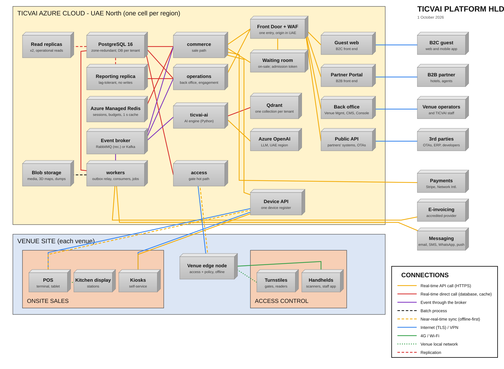

# TICVAI platform: high-level design

> **Date:** 1 October 2026 · **Generated by** `tools/build-hld-lld.py` · **Diagram:** [`TICVAI-HLD.svg`](TICVAI-HLD.svg)
> **Follows** the classic HLD format supplied on 30 September: the cloud, the venue site and the outside world as
> boxes, and every line typed by how the two ends talk.
> **Rechecked 1 October** against the ADRs accepted or amended that day (0058 amended, 0060 to 0068) and the
> Terraform cell module. The generator stops if the address plan, the replica floors, the node pools or the
> PostgreSQL HA mode disagree with the Terraform.

## The shape in one paragraph

One cell per region, in Azure UAE North or, the same cell service for service, in AWS me-central-1 (UAE; see
"On AWS" below and [`TICVAI-LLD-AWS.md`](TICVAI-LLD-AWS.md)). Inside it, 17 modules in one .NET solution run as five deployables
(ADR-0055), each with a replica floor that survives the loss of one zone (ADR-0061): 12 replicas a cell,
13 in a large one. Each tenant has its own PostgreSQL database and its own Qdrant collection (ADR-0038,
amended by ADR-0040 on instance count; ADR-0049). Modules in different deployables talk through events on the
broker, written first to an outbox in the same transaction (ADR-0033, amended by ADR-0058). Everything enters
through Front Door, where the on-sale waiting room also sits (ADR-0066). At each venue an edge node runs the gates
and the POS on its own when the Internet is down (ADR-0013), and syncs when it is back.

## Deployables

| Deployable | What it is | Modules | Replica floor (ADR-0061) |
|---|---|---|---|
| **commerce** | The sale path: order, payment and ledger commit in one transaction. Autoscales on requests per second. | Catalogue, Identity, Ledger, Order, Tenancy, Wallet | 3 |
| **access** | The gate hot path, flat high rate, offline package. The same module code builds the venue edge node. | Access | 2 |
| **operations** | Back office and engagement. Nothing that takes money waits on it. | CrossRegion, Fnb, Inventory, Marketing, Platform, Reporting, Retail, VenueOps, WhiteLabel | 2 |
| **ticvai-ai** | AI, in Python, isolated (ADR-0020): three process groups, read-only on the transactional schemas. | Ai | 3: ai-realtime 2, ai-interactive 1, ai-batch 0 (real-time 3 in a large cell) |
| **workers** | No module of its own: the outbox relay (one per region, ADR-0058), every module's event consumers and scheduled jobs. Scales on queue depth. | - | 2 |

Above its floor each deployable autoscales on requests per second (ADR-0032, amended by ADR-0038 and ADR-0064), with no maximum. The floors are
`replica_floors` in the Terraform cell module (an output the bootstrap Helm values read), `x-ticvai-replica-floors`
in `deploy/a-independent-tenant.yml` and `deploy/b-shared-platform.yml`, and `DEPLOYABLE_FLOORS` in
`tools/derive-sizing.py`. A flash-sale burst environment does not use them: its floor is the expected peak
(ADR-0035, amended 3 September).

## Data stores

| Store | Holds | Decision |
|---|---|---|
| PostgreSQL 16 | A control database, one database per tenant, read replicas, a reporting replica and the AI log database. The primary has a zone-redundant standby on every production tier, the shared cell included | ADR-0038 (amended by ADR-0040), ADR-0056 (UUIDv7 ids, monthly partitions), ADR-0060 (zone-redundant HA decided by Chinmay on 1 October; the rest of ADR-0060 is proposed) |
| Qdrant | The AI knowledge index: one collection per tenant, each with its own collection-scoped key; venue scope is a filter the retrieval client always adds | ADR-0049 (approved 30 September on condition of UAE hosting) |
| Azure Managed Redis | Sessions, idempotency keys, per-tenant request budgets, waiting-room positions, the one-second browse availability cache (not Azure Cache for Redis, which is retiring) | ADR-0032 (amended 30 September for the product, and by ADR-0064), ADR-0064, ADR-0065 (proposed), ADR-0066 |
| Event broker | Events between deployables. **RabbitMQ is recommended, run by CloudAMQP in UAE North** (three nodes, Private Link); Kafka on Event Hubs is the alternative. The client chooses by Monday 12 October | ADR-0057 (proposed), ADR-0058 (amended 1 October); `docs/active/broker-decision-pack.md` |
| Blob storage | Media (including each venue's 3D model and navigation file), exports, Qdrant snapshots, database dumps | ADR-0047, ADR-0069 |

## On the request path

- **One entry.** Front Door Premium with WAF: OWASP and bot rules, and rate rules per client IP against abuse.
  **DDoS protection** (the client's T9, 6 October, CHG-R4-018): Front Door's built-in infrastructure DDoS protection
  absorbs network-layer floods at the edge, at no extra charge, and the WAF's rate and bot rules take the
  application-layer ones; the origin has no public address (Private Link). On AWS, AWS Shield Standard on CloudFront.
- **The on-sale waiting room sits at the edge, apart from the ride queue** (ADR-0066, amended ADR-0012's Q2). The
  waiting page is static and served from Front Door's cache; a guest's position comes from a Redis counter (no
  database write); a release controller admits guests per second from the health of `commerce` (latency and 429
  rate). It is sized and load-tested for **50,000+ simultaneous arrivals**, the client's figure (6 October), with the
  sale behind it accepted at 3,000 concurrent B2C users, a benchmark and not a limit (ADR-0066, amended 6 October).
  An admitted guest gets a short-lived signed admission token (the signing key is a Key Vault secret).
  **Only online cart holds need it**: `addCartLine` forwards it and `acquireInventoryHold` checks the signature in
  middleware, with no database read, for a `cart` hold on a performance whose room is on. A `workstation` hold (a
  till, a kiosk, an edge node) is not behind the room. The endpoints (`enterWaitingRoom`,
  `getWaitingRoomPosition`, and `getWaitingRoomStatus`, `setWaitingRoomSetting` for operators) are Catalogue's, in
  `commerce`. A vendor room (for example Queue-it) stays the fallback, and the client's decision.
- **Browse availability is read from a cache at most about one second old** (ADR-0065, **proposed**, waiting on
  Chinmay because it reverses F01/F07's "never cached"): key per tenant, performance and channel in Redis, one
  recompute per key per second, `asOf` on the response. The hold on the primary stays the only correctness check.
- **Every tenant has a request budget** (ADR-0064): a token bucket per tenant and audience in the kernel middleware
  of `commerce`, `access` and `operations`, counted in Redis so every replica agrees; a share of in-flight work per
  tenant enforced only above 70% of a replica's limit. Every operation declares `429` with `Retry-After` and the
  `RateLimit-*` headers. Front Door's per-IP rules are the outer layer for abuse, not the fairness model.
- **Events.** One relay per region, in `workers`, drains each tenant database's outbox and publishes in batches
  (`Relay:BatchSize` 200 in the shared cells, 1,000 in a burst environment); every consumer records what it handled
  in its tenant database's inbox, so the effect happens once (ADR-0058, amended 1 October). The LLD has the detail.

## Connections

| From | To | How |
|---|---|---|
| B2C guest | Guest web | Internet (TLS) / VPN |
| B2B partner | Partner Portal | Internet (TLS) / VPN |
| Venue operators | Back office | Internet (TLS) / VPN |
| 3rd parties | Public API | Internet (TLS) / VPN |
| Guest web | Edge + WAF | Real-time API call (HTTPS) |
| Partner Portal | Edge + WAF | Real-time API call (HTTPS) |
| Back office | Edge + WAF | Real-time API call (HTTPS) |
| Public API | Edge + WAF | Real-time API call (HTTPS) |
| Edge + WAF | commerce | Real-time API call (HTTPS) |
| Edge + WAF | operations | Real-time API call (HTTPS) |
| Edge + WAF | Waiting room | Real-time API call (HTTPS) |
| Waiting room | commerce | Real-time API call (HTTPS) |
| commerce | PostgreSQL 16 | Real-time direct call (database, cache) |
| commerce | Redis | Real-time direct call (database, cache) |
| operations | PostgreSQL 16 | Real-time direct call (database, cache) |
| operations | Reporting replica | Real-time direct call (database, cache) |
| access | PostgreSQL 16 | Real-time direct call (database, cache) |
| PostgreSQL 16 | Read replicas | Replication |
| PostgreSQL 16 | Reporting replica | Replication |
| commerce | Event broker | Event through the broker |
| operations | Event broker | Event through the broker |
| ticvai-ai | Event broker | Event through the broker |
| workers | Event broker | Event through the broker |
| workers | PostgreSQL 16 | Real-time direct call (database, cache) |
| workers | Blob storage | Batch process |
| ticvai-ai | Qdrant | Real-time direct call (database, cache) |
| ticvai-ai | Azure OpenAI | Real-time API call (HTTPS) |
| commerce | Payments | Real-time API call (HTTPS) |
| workers | E-invoicing | Real-time API call (HTTPS) |
| workers | Messaging | Real-time API call (HTTPS) |
| POS | Device API | Internet (TLS) / VPN and Near-real-time sync (offline-first) |
| Kiosks | Device API | Internet (TLS) / VPN and Real-time API call (HTTPS) |
| Device API | commerce | Real-time API call (HTTPS) |
| POS | Kitchen display | Venue local network |
| Venue edge node | access | Internet (TLS) / VPN and Near-real-time sync (offline-first) |
| Turnstiles | Venue edge node | Venue local network |
| Handhelds | Venue edge node | 4G / Wi-Fi |

## At the venue

- **Onsite sales:** POS terminals and kiosks call the device API over the Internet; the kitchen display takes
  orders from the POS on the venue network. Offline, the POS keeps selling and syncs later.
- **One device register** (ADR-0067): every POS, kiosk, KDS, turnstile and handheld is registered once in
  `platform.device` (Tenancy, in `commerce`), with its versions, health and one lifecycle. Access keeps only where
  a device is placed (`access.device_placement`). Heartbeats have one path.
- **Access control:** turnstiles and handhelds talk to the venue edge node on the venue network or Wi-Fi. The
  edge node holds the offline package: the valid entitlements and **the active guest admission policy version**,
  because guest admission policy lives in Access only and the gate offline evaluates the same version as
  `validateAccess` online (ADR-0068). It decides in under 300 ms, records the policy version on each scan, and
  syncs scans to the cloud as soon as it can.
- **In-park 3D navigation** (ADR-0069): the guest app draws the venue from a GLB model and routes on a pathway and
  location file with GPS. Both are stored per venue in the platform's asset store, in the tenant's region (UAE
  North for a UAE tenant), and delivered through Front Door with the asset module's rules. No asset goes to a
  third-party map service.

## Outside the cloud

- **Payments** are called by `commerce` over HTTPS.
- **E-invoicing** goes through a provider adapter (ADR-0062, **proposed**: the client names the accredited provider,
  the mandate date and the B2C scope). `issueTaxInvoice` and `issueCreditMemo` write the document and an outbox
  row; a job in `workers` transmits over HTTP through the NAT Gateway's static IP; a business rejection stops for
  a person; the provider's callback comes in on its own authenticated endpoint.
- **Messaging** (email, SMS, WhatsApp, push) is sent by jobs in `workers`, also through the NAT Gateway.

## What this does not show

Per-screen flows (see `diagrams/lld/`), the AI internals (`docs/architecture/ai-system-design.md`) and sizing
(`handoff/sizing.json`). The Azure network, security, availability and cost are in [`TICVAI-LLD.md`](TICVAI-LLD.md)
and the Azure cost workbook; the AWS ones in [`TICVAI-LLD-AWS.md`](TICVAI-LLD-AWS.md) and the AWS cost workbook.

## On AWS (me-central-1)

Added 4 October 2026 (CHG-R3-001; Chinmay: "HLD and LLD you didnt add AWS you just did azure add that in as well"). The
cell above runs on AWS in me-central-1 (Middle East, UAE, three AZs) with the same deployables, floors, stores and
lines; only the services under them change. **Disaster recovery on AWS is open**: AWS has one region in the UAE
(see [`TICVAI-LLD-AWS.md`](TICVAI-LLD-AWS.md)).

| Azure (UAE North) | AWS (me-central-1) |
|---|---|
| Azure Front Door Premium + WAF (waiting-room page from cache; built-in DDoS protection) | Amazon CloudFront + AWS WAF (managed core rule set, Bot Control, rate-based rules); the waiting-room page from CloudFront's cache; AWS Shield Standard for DDoS |
| Internal load balancer + Private Link service; AKS App Routing (Gateway API) | Internal Application Load Balancer (AWS Load Balancer Controller, Gateway API or Ingress), CloudFront VPC origin |
| AKS, Standard tier: system, workload, AI GPU, qdrant and broker pools | Amazon EKS: system, workload, AI GPU, qdrant and broker managed node groups, the same taints |
| AKS AI GPU pool: NV6ads A10 v5 (1/6 A10, 4 GB) | EKS GPU node group: g6.2xlarge (1 x L4, 24 GB) |
| Azure Database for PostgreSQL Flexible Server 16, zone-redundant HA | Amazon RDS for PostgreSQL 16, Multi-AZ DB instance (not Aurora) |
| Read replicas x2, reporting replica, AI log DB | RDS read replicas x2 (db.m6g.xlarge), a reporting replica (db.m6g.large), an AI log DB instance |
| Azure Managed Redis (Balanced B10, HA) | Amazon ElastiCache for Valkey (cache.r7g.large, primary + replica, Multi-AZ) |
| Event broker self-run on the AKS broker pool (CloudAMQP recommended) | Self-run on the EKS broker node group (RabbitMQ Cluster Operator), as on Azure; Amazon MQ for RabbitMQ the managed option |
| Qdrant on the AKS qdrant pool, Premium SSD | Qdrant on the EKS qdrant node group (r6i.xlarge), EBS gp3 |
| Managed Disks (Premium SSD) | Amazon EBS gp3 |
| Blob storage (ZRS) | Amazon S3 Standard (multi-AZ), S3 gateway endpoint |
| Container Registry | Amazon ECR |
| Key Vault (secrets; Premium HSM keys for ADR-0063) | AWS Secrets Manager + AWS KMS customer managed keys (HSM-backed; BYOK by import) |
| NAT Gateway (one static egress IP) | NAT Gateway, one per AZ, with Elastic IPs (three IPs to allow-list) |
| Azure Bastion | AWS Systems Manager Session Manager |
| Private Link private endpoints + private DNS zones | AWS PrivateLink interface VPC endpoints + Route 53 private hosted zones |
| NSGs at the edges, Cilium network policy inside | Security groups at the edges, Cilium (or VPC CNI) network policy inside |
| VPN gateway in GatewaySubnet (dedicated-tier venues) | AWS Site-to-Site VPN on a virtual private gateway or Transit Gateway |
| Azure Monitor + Log Analytics | Amazon CloudWatch (Logs, metrics, Container Insights) |
| Microsoft Defender for Cloud | Amazon GuardDuty (EKS Runtime, RDS Protection) + Amazon Inspector + AWS Security Hub |
| Azure Backup | AWS Backup (EBS snapshots); RDS automated backups and PITR |
| Entra ID (administrators); managed identities (workload identity) | IAM Identity Center (administrators); EKS Pod Identity (or IRSA) for workloads |
| DR in UAE Central (ADR-0060) | OPEN: AWS has one UAE region (see Disaster recovery) |

Monthly, production, on-demand: Stage 1 **$2,679.99** on AWS against $2,254.47 on Azure;
the full cell **$4,753.96** without zone-level HA (Azure $5,327.27) and
**$7,923.57** with it (Azure $8,295.04). The AWS workbook has the lines and an Azure-vs-AWS sheet.
