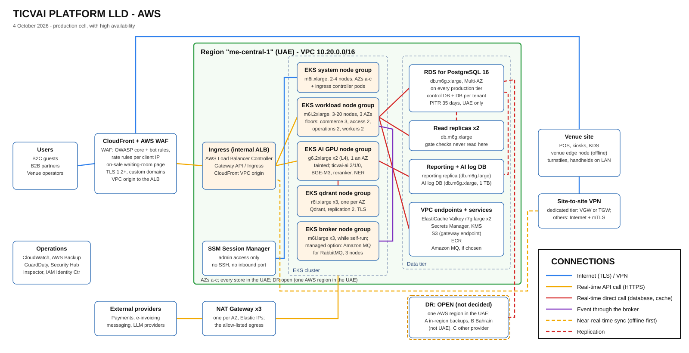

# TICVAI platform: low-level design (AWS)

> **Date:** 4 October 2026 · **Generated by** `tools/build-hld-lld.py` · **Diagram:** [`TICVAI-LLD-AWS.svg`](TICVAI-LLD-AWS.svg)
> **Why:** CHG-R3-001. Chinmay, 4 October 2026: "HLD and LLD you didnt add AWS you just did azure add that in as
> well". The same cell as [`TICVAI-LLD.md`](TICVAI-LLD.md) (Azure), service for service, on AWS me-central-1.
> **Costs:** [`TICVAI - AWS Cloud Specs & Cost.xlsx`](TICVAI%20-%20AWS%20Cloud%20Specs%20%26%20Cost.xlsx): production
> with high availability **$7,923.57** a month, without zone-level HA **$4,753.96**, pre-production **$1,510.53**;
> **staged**: Stage 1 **$2,679.99** a month in production plus **$615.65** of pre-production. Its "Azure vs AWS"
> sheet sets these beside the Azure figures.
> **Prices:** AWS Price List API, public bulk offer files (pricing.us-east-1.amazonaws.com/offers/v1.0/aws/<service>/current/me-central-1/index.json; CloudFront's global file), region me-central-1 (Middle East, UAE), on demand, Linux, 730 hours a month, pulled 4 October 2026 (files published 11 September to 3 October 2026; each rate names its file and date in AWS_RATE).
> **The generator holds the two clouds together** (`clouds_agree()`): the same boxes and lines in both LLDs, the
> same cost groups on every sheet, every Azure service mapped, every AWS price from the rate table, and the DR box
> open until a DR decision is recorded.

## Azure to AWS, service for service

| Azure (UAE North) | AWS (me-central-1, UAE) |
|---|---|
| Azure Front Door Premium + WAF (waiting-room page from cache; built-in DDoS protection) | Amazon CloudFront + AWS WAF (managed core rule set, Bot Control, rate-based rules); the waiting-room page from CloudFront's cache; AWS Shield Standard for DDoS |
| Internal load balancer + Private Link service; AKS App Routing (Gateway API) | Internal Application Load Balancer (AWS Load Balancer Controller, Gateway API or Ingress), CloudFront VPC origin |
| AKS, Standard tier: system, workload, AI GPU, qdrant and broker pools | Amazon EKS: system, workload, AI GPU, qdrant and broker managed node groups, the same taints |
| AKS AI GPU pool: NV6ads A10 v5 (1/6 A10, 4 GB) | EKS GPU node group: g6.2xlarge (1 x L4, 24 GB) |
| Azure Database for PostgreSQL Flexible Server 16, zone-redundant HA | Amazon RDS for PostgreSQL 16, Multi-AZ DB instance (not Aurora) |
| Read replicas x2, reporting replica, AI log DB | RDS read replicas x2 (db.m6g.xlarge), a reporting replica (db.m6g.large), an AI log DB instance |
| Azure Managed Redis (Balanced B10, HA) | Amazon ElastiCache for Valkey (cache.r7g.large, primary + replica, Multi-AZ) |
| Event broker self-run on the AKS broker pool (CloudAMQP recommended) | Self-run on the EKS broker node group (RabbitMQ Cluster Operator), as on Azure; Amazon MQ for RabbitMQ the managed option |
| Qdrant on the AKS qdrant pool, Premium SSD | Qdrant on the EKS qdrant node group (r6i.xlarge), EBS gp3 |
| Managed Disks (Premium SSD) | Amazon EBS gp3 |
| Blob storage (ZRS) | Amazon S3 Standard (multi-AZ), S3 gateway endpoint |
| Container Registry | Amazon ECR |
| Key Vault (secrets; Premium HSM keys for ADR-0063) | AWS Secrets Manager + AWS KMS customer managed keys (HSM-backed; BYOK by import) |
| NAT Gateway (one static egress IP) | NAT Gateway, one per AZ, with Elastic IPs (three IPs to allow-list) |
| Azure Bastion | AWS Systems Manager Session Manager |
| Private Link private endpoints + private DNS zones | AWS PrivateLink interface VPC endpoints + Route 53 private hosted zones |
| NSGs at the edges, Cilium network policy inside | Security groups at the edges, Cilium (or VPC CNI) network policy inside |
| VPN gateway in GatewaySubnet (dedicated-tier venues) | AWS Site-to-Site VPN on a virtual private gateway or Transit Gateway |
| Azure Monitor + Log Analytics | Amazon CloudWatch (Logs, metrics, Container Insights) |
| Microsoft Defender for Cloud | Amazon GuardDuty (EKS Runtime, RDS Protection) + Amazon Inspector + AWS Security Hub |
| Azure Backup | AWS Backup (EBS snapshots); RDS automated backups and PITR |
| Entra ID (administrators); managed identities (workload identity) | IAM Identity Center (administrators); EKS Pod Identity (or IRSA) for workloads |
| DR in UAE Central (ADR-0060) | OPEN: AWS has one UAE region (see Disaster recovery) |

Everything above the infrastructure is the same on both: the five deployables and their replica floors (ADR-0061),
one PostgreSQL database and one Qdrant collection per tenant, the outbox relay and inboxes (ADR-0058), the waiting
room (ADR-0066), the request budgets (ADR-0064), the venue edge node (ADR-0013). Kubernetes manifests and Helm
charts carry over; the Terraform cell module is Azure today, so an AWS cell needs its own module (no Block A task
builds one yet: a plan change if one is added).

## Region and residency

- **Region:** AWS me-central-1 (Middle East, UAE), three Availability Zones (a, b, c). **Every store stays in the
  UAE**, backups and snapshots included: the condition Qdrant was approved on (30 September) and ADR-0009.
- **CloudFront and the WAF are global**, as Front Door is: they cache only public content (the waiting-room page,
  public media) and decrypt at the edge nearest the user; WAF logs go to CloudWatch Logs in me-central-1.
- **One cell per region.** A cell serves many tenants; each tenant has its own PostgreSQL database and its own
  Qdrant collection.

## Disaster recovery: OPEN

OPEN, not decided (CHG-R3-001). AWS has one region in the UAE (me-central-1, three AZs); Azure's DR region, UAE Central, has no AWS counterpart. The options and what each costs are below; the choice is Chinmay's and the client's, because two of the three trade residency or money against recovery.

| Option | What it is | UAE residency | Consequences |
|---|---|---|---|
| **A. Multi-AZ only, backups in-region** | Everything in me-central-1 across three AZs; RDS automated backups and snapshots, AWS Backup vaults (a logically air-gapped vault included) and S3 copies all in me-central-1 | Keeps every store in the UAE (ADR-0009, the condition Qdrant was approved on) | No region-level DR: a regional outage stops the cloud services until AWS restores the region (venues keep running on their edge nodes). RPO is the last in-region backup, RTO the region's recovery, with no bound we control. The cheapest; the tenant-selectable DR module of ADR-0060 has nowhere to go |
| **B. Cross-region to Bahrain (me-south-1)** | An RDS cross-region read replica or snapshot copies, S3 replication, and a standby EKS cell in me-south-1 | Breaks UAE residency: Bahrain is outside the UAE. Needs the client's (and, for regulated data, the regulator's) written acceptance, and reverses the basis Qdrant was approved on | Real regional DR (RPO minutes with a replica, RTO hours with a rehearsed runbook), as Azure's UAE Central gives. Adds a second cell's cost and cross-region transfer (about $0.09 per GB out of me-central-1 to me-south-1) |
| **C. On-premises or another provider in the UAE** | A recovery site in the UAE outside AWS: the client's data centre, a UAE colocation, or Azure UAE North or Central as the DR side of an AWS primary | Keeps every store in the UAE | Cross-provider replication (PostgreSQL logical replication or dumps, S3 to Blob or object-store copies, Qdrant snapshots), two sets of tooling and skills, Internet egress at $0.117 per GB; the most work to build and rehearse |

What does not change with the choice: PostgreSQL is Multi-AZ on every production tier (ADR-0060); RDS keeps
point-in-time restore for 35 days in me-central-1; the outbox is the record, so a rebuilt broker is refilled by
`republishOutbox`; the venue edge node keeps gates and POS running through any cloud outage. The LLD draws the DR
box dashed, as open.

## Tiers

| Tier | What runs there | Size (production, with HA) |
|---|---|---|
| Edge | CloudFront with AWS WAF (AWS managed core rule set for OWASP, Bot Control, rate-based rules per client IP), TLS 1.2+, a VPC origin to the internal ALB. **DDoS protection:** AWS Shield Standard, automatic on CloudFront at no extra charge (network and transport layers), the WAF's rate-based and Bot Control rules for the application layer; Shield Advanced (a subscription) is an option for a major event, not in the costed cell. Serves the on-sale waiting-room page from its cache (ADR-0066) | One distribution, one web ACL |
| Ingress | An internal Application Load Balancer run by the AWS Load Balancer Controller (Gateway API or Ingress), reachable only as CloudFront's VPC origin | In the system node group |
| EKS cluster | Amazon EKS, VPC CNI with custom networking (pods from the secondary range `100.64.0.0/16`, outside the node subnets), Cilium (or the VPC CNI's own) network policy, egress through the NAT Gateways, five managed node groups, a subnet per group and AZ | Standard support |
| EKS system node group | Kubernetes system services, the ingress controller | m6i.xlarge, autoscale 2-4, AZs a-c |
| EKS workload node group | `commerce`, `access`, `operations`, `workers`: floors 3, 2, 2 and 2 | m6i.2xlarge, autoscale 3-20, AZs a-c |
| EKS AI GPU node group | The only AI group (CHG-R11-001): `ticvai-ai` (real-time 2, 3 in a large cell; interactive 1; batch 0), Presidio, and on the GPU BGE-M3, its reranker and the Arabic NER; never an LLM; tainted `ticvai.io/pool=ai` | g6.2xlarge (8 vCPU, 32 GiB, 1 x L4 24 GB): 2 nodes, one per AZ (1 without HA) |
| EKS qdrant node group | Qdrant 1.16 or later, official Helm chart, 3 nodes one per AZ, replication factor 2, TLS; tainted `ticvai.io/pool=data` | r6i.xlarge x3, gp3 256 GB each |
| EKS broker node group | The broker while self-run: RabbitMQ on the Cluster Operator, 3 nodes, quorum queues; tainted `ticvai.io/pool=data`. Not built if a managed broker is chosen (Amazon MQ for RabbitMQ on AWS) | m6i.large x3, gp3 128 GB each |
| Database | Amazon RDS for PostgreSQL 16: a Multi-AZ DB instance (synchronous standby, automatic failover) on every production tier (ADR-0060); 2 read replicas; a reporting replica; the AI log database (an instance of its own, ADR-0020 as amended by ADR-0049) | db.m6g.xlarge, gp3 256 GB; reporting db.m6g.large; AI log db.m6g.xlarge with 1 TB |
| Data services | ElastiCache for Valkey (primary + replica, Multi-AZ); Secrets Manager; KMS; S3 (gateway endpoint); ECR; Amazon MQ if chosen | No public endpoint |

**RDS, not Aurora.** RDS for PostgreSQL 16 (Multi-AZ DB instance), not Aurora PostgreSQL. Like for like, RDS costs less: the primary with its standby is $563.56 (db.m6g.xlarge Multi-AZ) and the two read replicas and the reporting replica $704.45, $1,268.01 of instances in all; Aurora PostgreSQL lists no general-purpose (db.m) class in me-central-1, only r and t, so the same shape is a db.r6g.xlarge writer and two readers (one is the failover target, so it doubles as a replica) plus a db.r6g.large reporting reader, $1,601.62, before Aurora's $0.242 per million I/O requests (a volume nobody knows until the load test). RDS also matches the Azure design one for one (Flexible Server: a standby that does not serve reads, separate replicas), so the Terraform module, the runbooks and ADR-0060 carry over. Aurora's case is a faster failover (about 30 seconds against one to two minutes) and up to 15 readers; revisit it if the commerce target (99.95%) needs that.

**The AI GPU node.** g6.2xlarge (8 vCPU, 32 GiB, one NVIDIA L4 with 24 GB) at $1.20043 an hour, $876.31 a month a node: g6 is offered in me-central-1 (the EC2 offer file of 25 September lists g6.xlarge to g6.48xlarge). g6.xlarge ($721.42) has 4 vCPU, too few for three AI pods at about 1 vCPU each beside Presidio and the node's own daemons; g5.xlarge ($900.82, A10G) costs more and also has 4 vCPU; g5.2xlarge is $1,085.28. The L4's 24 GB is six times the 4 GB of Azure's NV6ads A10 v5 slice, so the GPU-memory step-up Azure keeps in reserve (NV12ads) is not needed on AWS; the AWS node costs $402.54 a month more than Azure's. Whether each of the three AZs has g6 capacity is to confirm before the HA node group is built.

## Network

VPC `10.20.0.0/16`, the Azure address plan block for block, each block split into one subnet per AZ (an AWS subnet
lives in one AZ). A cell runs on one provider, so the range is reused; change it if an AWS cell and an Azure cell
are ever peered.

| Subnet | Block | Per-AZ subnets (a, b, c) | Holds | Rule |
|---|---|---|---|---|
| `ingress` | `10.20.0.0/24` | 10.20.0.0/26, 10.20.0.64/26, 10.20.0.128/26 | Internal Application Load Balancer, CloudFront's VPC origin (snet-ingress) | Security group: inbound 443 only from the CloudFront origin-facing prefix list |
| `public` | `10.20.2.0/24` | 10.20.2.0/26, 10.20.2.64/26, 10.20.2.128/26 | NAT Gateways and their Elastic IPs, nothing else (takes snet-agc's reserved block) | Route to the Internet gateway; no instance, no load balancer |
| `eks-system` | `10.20.4.0/22` | 10.20.4.0/24, 10.20.5.0/24, 10.20.6.0/24 | EKS system node group and the ingress controller pods | Egress through the NAT Gateway of its AZ |
| `eks-workload` | `10.20.8.0/21` | 10.20.8.0/23, 10.20.10.0/23, 10.20.12.0/23 | Workload node group: commerce, access, operations, workers | Network policy: inbound from the ingress controller; egress through the NAT Gateway |
| `eks-ai` | `10.20.16.0/22` | 10.20.16.0/24, 10.20.17.0/24, 10.20.18.0/24 | AI GPU node group (the only AI group): ticvai-ai, BGE-M3 and its reranker, Presidio and the Arabic NER | Network policy: inbound from the ingress controller and the workload group; read-only role on transactional schemas (ADR-0020, amended by ADR-0049) |
| `eks-data` | `10.20.20.0/23` | 10.20.20.0/25, 10.20.20.128/25, 10.20.21.0/25 | qdrant node group and, while the broker is self-run, the broker node group; both tainted ticvai.io/pool=data | Network policy: inbound from the workload and AI groups only; Qdrant needs each tenant's collection-scoped JWT |
| `db` | `10.20.24.0/24` | 10.20.24.0/26, 10.20.24.64/26, 10.20.24.128/26 | RDS DB subnet group: the primary and its Multi-AZ standby, replicas, the AI log DB | Security group: 5432 from the EKS node and pod security groups; not publicly accessible |
| `endpoints` | `10.20.25.0/24` | 10.20.25.0/26, 10.20.25.64/26, 10.20.25.128/26 | Interface VPC endpoints, the ElastiCache subnet group (and Amazon MQ if chosen) | Security group: inbound from the EKS subnets only; private DNS on; no public endpoint |
| `(none: no Bastion)` | `10.20.26.0/26` | - | Not created: Session Manager reaches the nodes through the ssm endpoints or the NAT Gateway | Reserved |
| `tgw-attach` | `10.20.27.0/27` | 10.20.27.0/28, 10.20.27.16/28 (a third /28 needs 10.20.27.32/28) | Transit Gateway or VPN attachment for dedicated-tier venues' site-to-site VPN (GatewaySubnet) | Created when a venue needs it |
| `pods (secondary CIDR)` | `100.64.0.0/16` | 100.64.0.0/18, 100.64.64.0/18, 100.64.128.0/18 | Pod addresses: VPC CNI custom networking, so pods do not use the node subnets (the CNI Overlay range on Azure) | Must not overlap the client's ranges or a venue LAN on the VPN |
| `EKS services` | `10.100.0.0/16` | - | Kubernetes service range (service_ipv4_cidr) | Internal only |

- **Inbound:** only through CloudFront (web, apps, APIs, venue devices) and Session Manager (administrators, no
  inbound port). No database, cache or bucket has a public endpoint.
- **Outbound:** through a NAT Gateway in each AZ, each with an Elastic IP, so the payment, e-invoicing and messaging
  providers allow-list three addresses (one on Azure). A Regional NAT Gateway may present fewer: to confirm.
- **Security groups at the edges, network policy inside**, as NSGs and Cilium on Azure.
- **Venues:** devices reach the cloud over the Internet with TLS and device certificates; a dedicated-tier tenant
  may add a site-to-site VPN on a virtual private gateway or a Transit Gateway.

## Security

- **Identity:** IAM Identity Center for administrators; workloads use EKS Pod Identity (or IRSA) to reach Secrets
  Manager, KMS, S3, ElastiCache and ECR.
- **Keys** (ADR-0063, proposed): KMS customer managed keys, held in FIPS 140-3 validated HSMs, wrap each tenant's
  data key; BYOK by importing key material. Unlike Key Vault, no premium tier is needed for HSM-backed keys.
- **Secrets:** Secrets Manager only; the Qdrant API key and the waiting-room token key are read only by their issuers.
- **Detection:** GuardDuty (EKS Runtime Monitoring, RDS Protection, VPC flow, DNS and CloudTrail analysis),
  Inspector (node and image scanning) and Security Hub: the Defender for Cloud line.
- **DDoS and bot protection** (the client's T9, 6 October, CHG-R4-018): AWS Shield Standard on CloudFront
  (network and transport layers, automatic, no charge); AWS WAF rate-based rules and Bot Control for the application
  layer; the waiting room (ADR-0066) absorbs legitimate floods. Shield Advanced is an option for a major event, not
  costed here. The ALB is internal, reachable only as CloudFront's VPC origin.
- Tenant isolation, least privilege between deployables and encryption in transit are the Azure LLD's, unchanged.

## Availability and backup

| Store | High availability | Backup |
|---|---|---|
| PostgreSQL | RDS Multi-AZ on every production tier, automatic failover (pre-production has none) | Point-in-time restore 35 days in me-central-1; a nightly dump per tenant to S3 for single-tenant restore. Cross-region: open (DR) |
| Qdrant | Three nodes across AZs, replication factor 2 | Snapshot per collection to S3 by a CronJob; EBS snapshots by AWS Backup as a second line |
| Broker | Three nodes across AZs (self-run or Amazon MQ's three-node cluster) | The outbox is the record: after a rebuild the relay republishes |
| Redis | ElastiCache Valkey, a replica in another AZ, automatic failover | Not backed up: it only holds what can be rebuilt |
| EKS | Node groups across AZs; replica floors, `commerce` one per AZ (ADR-0061) | Rebuilt from ECR and the infrastructure code |

## Open points

- **DR** (above): A, B or C, Chinmay's and the client's call.
- **The broker** is the client's choice (ADR-0057, due 12 October). On AWS the managed RabbitMQ is Amazon MQ (3 x
  mq.m7g.large, $733.65 a month plus storage); CloudAMQP in me-central-1 is to confirm.
- **The Terraform**: the cell module is Azure; an AWS cell module is not planned in Block A.
- **g6 capacity** in each AZ before the HA GPU node group is built.

## Prices to confirm

- g6 capacity in each of me-central-1's three AZs (the Price List API lists g6.2xlarge for the region, not per AZ)
- whether a Regional NAT Gateway presents one egress IP for all three AZs (priced here as three zonal gateways, three IPs to allow-list)
- CloudFront VPC origins and Systems Manager Session Manager: no charge line in the price list files
- AWS WAF on CloudFront is a global web ACL: the me-central-1 WAF rates are used, to check against the bill
- S3 and ECR requests, KMS and Secrets Manager API calls, RDS backup beyond the free allocation: usage, not priced
- CloudAMQP on AWS me-central-1 (the broker the client may take; on Azure it is in UAE North)
- Aurora I/O volume (Aurora is not chosen; its I/O cost is unknown until the load test)
- Volumes behind usage lines (logs, metrics, LCUs, GuardDuty data, requests): assumptions, as on the Azure sheets

## The rates behind the AWS workbook

| Key | USD | Per | What | Offer file (publication date) |
|---|---:|---|---|---|
| `eks` | 0.1 | hour | EKS cluster, standard support | AmazonEKS 2026-09-28 |
| `m6i.large` | 0.1177 | hour | EC2 m6i.large (2 vCPU, 8 GiB), Linux | AmazonEC2 2026-09-25 |
| `m6i.xlarge` | 0.2354 | hour | EC2 m6i.xlarge (4 vCPU, 16 GiB), Linux | AmazonEC2 2026-09-25 |
| `m6i.2xlarge` | 0.4708 | hour | EC2 m6i.2xlarge (8 vCPU, 32 GiB), Linux | AmazonEC2 2026-09-25 |
| `m6i.4xlarge` | 0.9416 | hour | EC2 m6i.4xlarge (16 vCPU, 64 GiB), Linux | AmazonEC2 2026-09-25 |
| `r6i.large` | 0.1551 | hour | EC2 r6i.large (2 vCPU, 16 GiB), Linux | AmazonEC2 2026-09-25 |
| `r6i.xlarge` | 0.3102 | hour | EC2 r6i.xlarge (4 vCPU, 32 GiB), Linux | AmazonEC2 2026-09-25 |
| `g6.xlarge` | 0.98824 | hour | EC2 g6.xlarge (4 vCPU, 16 GiB, 1 x L4 24 GB), Linux | AmazonEC2 2026-09-25 |
| `g6.2xlarge` | 1.20043 | hour | EC2 g6.2xlarge (8 vCPU, 32 GiB, 1 x L4 24 GB), Linux | AmazonEC2 2026-09-25 |
| `g5.xlarge` | 1.234 | hour | EC2 g5.xlarge (4 vCPU, 16 GiB, 1 x A10G 24 GB), Linux | AmazonEC2 2026-09-25 |
| `g5.2xlarge` | 1.48669 | hour | EC2 g5.2xlarge (8 vCPU, 32 GiB, 1 x A10G 24 GB), Linux | AmazonEC2 2026-09-25 |
| `gp3` | 0.0968 | GB-month | EBS gp3 volume | AmazonEC2 2026-09-25 |
| `ebs-snap` | 0.055 | GB-month | EBS snapshot storage | AmazonEC2 2026-09-25 |
| `nat` | 0.0528 | hour | NAT Gateway (zonal; the Regional NAT Gateway is the same rate) | AmazonEC2 2026-09-25 |
| `nat-gb` | 0.0528 | GB | NAT Gateway data processed | AmazonEC2 2026-09-25 |
| `ipv4` | 0.005 | hour | Public IPv4 address (Elastic IP), in use | AmazonVPC 2026-09-17 |
| `vpce` | 0.0121 | hour | Interface VPC endpoint, per AZ | AmazonVPC 2026-09-17 |
| `vpce-gb` | 0.01 | GB | Interface VPC endpoint data processed, first 1 PB | AmazonVPC 2026-09-17 |
| `rds-m6g.large` | 0.193 | hour | RDS PostgreSQL db.m6g.large (2 vCPU, 8 GiB), single-AZ | AmazonRDS 2026-10-01 |
| `rds-m6g.xlarge` | 0.386 | hour | RDS PostgreSQL db.m6g.xlarge (4 vCPU, 16 GiB), single-AZ | AmazonRDS 2026-10-01 |
| `rds-m6g.xlarge-maz` | 0.772 | hour | RDS PostgreSQL db.m6g.xlarge, Multi-AZ DB instance | AmazonRDS 2026-10-01 |
| `rds-gp3` | 0.14 | GB-month | RDS gp3 storage, single-AZ | AmazonRDS 2026-10-01 |
| `rds-gp3-maz` | 0.279 | GB-month | RDS gp3 storage, Multi-AZ | AmazonRDS 2026-10-01 |
| `rds-backup` | 0.1045 | GB-month | RDS backup storage beyond the free allocation | AmazonRDS 2026-10-01 |
| `aurora-r6g.large` | 0.313 | hour | Aurora PostgreSQL db.r6g.large (2 vCPU, 16 GiB), Standard | AmazonRDS 2026-10-01 |
| `aurora-r6g.xlarge` | 0.627 | hour | Aurora PostgreSQL db.r6g.xlarge (4 vCPU, 32 GiB), Standard | AmazonRDS 2026-10-01 |
| `aurora-storage` | 0.121 | GB-month | Aurora storage, Standard | AmazonRDS 2026-10-01 |
| `aurora-io` | 0.242 | million I/O | Aurora I/O requests, Standard | AmazonRDS 2026-10-01 |
| `valkey-r7g.large` | 0.2142 | hour | ElastiCache Valkey cache.r7g.large (13.07 GiB) | AmazonElastiCache 2026-09-14 |
| `valkey-m7g.large` | 0.153 | hour | ElastiCache Valkey cache.m7g.large (6.38 GiB) | AmazonElastiCache 2026-09-14 |
| `redis-r7g.large` | 0.2678 | hour | ElastiCache Redis OSS cache.r7g.large | AmazonElastiCache 2026-09-14 |
| `mq-rabbit-3x` | 1.005 | hour | Amazon MQ for RabbitMQ, 3-node cluster mq.m7g.large | AmazonMQ 2026-09-11 |
| `mq-storage` | 0.121 | GB-month | Amazon MQ RabbitMQ storage | AmazonMQ 2026-09-11 |
| `s3` | 0.025 | GB-month | S3 Standard, first 50 TB | AmazonS3 2026-09-28 |
| `ecr` | 0.1 | GB-month | ECR storage | AmazonECR 2026-09-11 |
| `secret` | 0.4 | secret-month | Secrets Manager secret | AWSSecretsManager 2026-09-11 |
| `kms-key` | 1 | key-month | KMS customer managed key | awskms 2026-09-11 |
| `cf-gb` | 0.11 | GB | CloudFront data transfer out, Middle East, first 10 TB | AmazonCloudFront 2026-10-03 |
| `cf-req` | 0.012 | 10,000 HTTPS requests | CloudFront HTTPS requests, Middle East | AmazonCloudFront 2026-10-03 |
| `waf-acl` | 5 | web ACL-month | WAF web ACL | awswaf 2026-09-14 |
| `waf-rule` | 1 | rule-month | WAF rule or managed rule group | awswaf 2026-09-14 |
| `waf-req` | 0.6 | million requests | WAF requests | awswaf 2026-09-14 |
| `waf-bot` | 10 | month | WAF Bot Control (common), subscription | awswaf 2026-09-14 |
| `waf-bot-req` | 1 | million requests | WAF Bot Control requests beyond the first 10 million | awswaf 2026-09-14 |
| `alb` | 0.028224 | hour | Application Load Balancer | AWSELB 2026-09-11 |
| `alb-lcu` | 0.00896 | LCU-hour | Application Load Balancer capacity unit | AWSELB 2026-09-11 |
| `egress` | 0.117 | GB | Data transfer out to the Internet, first 10 TB (the file's description says $0.117, its price column $0.11; the higher is used) | AWSDataTransfer 2026-09-16 |
| `to-bahrain` | 0.09 | GB | Data transfer me-central-1 to me-south-1 (description $0.09, price column $0.085) | AWSDataTransfer 2026-09-16 |
| `cw-ingest` | 0.63 | GB | CloudWatch Logs ingestion, Standard class | AmazonCloudWatch 2026-09-22 |
| `cw-store` | 0.033 | GB-month | CloudWatch Logs storage | AmazonCloudWatch 2026-09-22 |
| `cw-metric` | 0.3 | metric-month | CloudWatch custom metric, first 10,000 | AmazonCloudWatch 2026-09-22 |
| `gd-eks` | 1.58 | vCPU-month | GuardDuty EKS Runtime Monitoring, first 500 vCPU | AmazonGuardDuty 2026-09-17 |
| `gd-rds` | 1.03 | vCPU-month | GuardDuty RDS Protection | AmazonGuardDuty 2026-09-17 |
| `gd-logs` | 1.25 | GB | GuardDuty VPC flow and DNS log analysis, first 500 GB | AmazonGuardDuty 2026-09-17 |
| `gd-trail` | 5 | million events | GuardDuty CloudTrail event analysis | AmazonGuardDuty 2026-09-17 |
| `insp-ec2` | 0.0021 | instance-hour | Inspector EC2 scanning | AmazonInspectorV2 2026-09-11 |
| `sh-ec2` | 0.0056944 | instance-hour | Security Hub Essentials, per EC2 instance | AWSSecurityHub 2026-09-30 |
