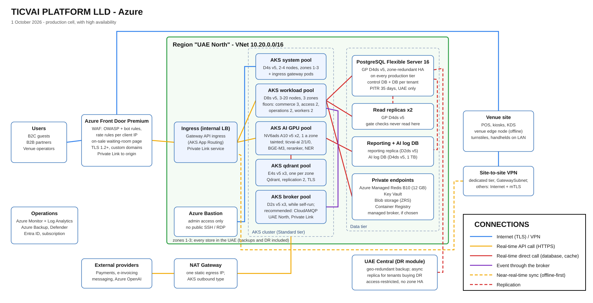

# TICVAI platform: low-level design (Azure)

> **Date:** 1 October 2026 · **Generated by** `tools/build-hld-lld.py` · **Diagram:** [`TICVAI-LLD.svg`](TICVAI-LLD.svg)
> **Costs:** [`TICVAI - Azure Cloud Specs & Cost.xlsx`](TICVAI%20-%20Azure%20Cloud%20Specs%20%26%20Cost.xlsx): production with high availability
> **$8,047.50** a month, without zone-level HA **$5,553.50**, pre-production **$1,535.50** (prices of 30 September)
> **Source of sizes:** the Terraform cell module (`repos/ticvai-infra/terraform/modules/cell`), `handoff/sizing.json`,
> the decisions of 30 September and the ADRs of 1 October. The generator checks the Terraform before it writes.

## Region and residency

- **Region:** Azure UAE North, availability zones 1-3. **Every store stays in the UAE**, including backups,
  snapshots and disaster recovery: the condition Qdrant was approved on (30 September) and ADR-0009 (section 2
  amended by ADR-0049).
- **Disaster recovery is in UAE Central** (ADR-0060): the in-country pair for geo-redundant backup, and the region
  of the tenant-selectable DR module. UAE Central is access-restricted (a support request is needed) and has no
  zone-redundant HA.
- **One cell per region.** A cell serves many tenants; each tenant has its own PostgreSQL database and its own
  Qdrant collection.

## Tiers

| Tier | What runs there | Size (production, with HA) |
|---|---|---|
| Edge | Azure Front Door Premium with WAF (OWASP and bot rules, rate rules per client IP), TLS 1.2+, Private Link to the origin. Serves the on-sale waiting-room page from its cache (ADR-0066) | One profile |
| Ingress | A Gateway API ingress: the AKS App Routing add-on's Gateway API implementation behind an internal load balancer, published to Front Door by Private Link. Not NGINX (ingress-nginx is out of maintenance; the add-on's NGINX is supported only through November 2026). Application Gateway for Containers is the alternative, with `snet-agc` reserved. Installed at bootstrap, not by the Terraform | In the system pool; the gateway pods tolerate its `CriticalAddonsOnly` taint |
| AKS cluster | Azure CNI Overlay (pods from `10.244.0.0/16`, outside the VNet), Cilium network policy and data plane, egress through the NAT Gateway (`userAssignedNATGateway`), five node pools, a subnet per pool (the qdrant and broker pools share `snet-aks-data`) | Standard tier |
| AKS system pool | Kubernetes system services, the ingress gateway | D4s v5, autoscale 2-4 nodes, zones 1-3 |
| AKS workload pool | `commerce`, `access`, `operations`, `workers`: floors 3, 2, 2 and 2 | D8s v5, autoscale 3-20 nodes, zones 1-3 |
| AKS AI pool | `ticvai-ai` (real-time 2, 3 in a large cell; interactive 1; batch 0), the embedding model and the reranker (CPU); tainted `ticvai.io/pool=ai` | D8s v5, autoscale 2-4 nodes |
| AKS qdrant pool | Qdrant 1.16 or later, open source, official Helm chart: 3 nodes, one per zone, replication factor 2, TLS on the service; tainted `ticvai.io/pool=data` | E4s v5 x3, Premium SSD P15 256 GB each |
| AKS broker pool | The broker while it is self-run: RabbitMQ on the Cluster Operator, 3 nodes, quorum queues on persistent disks; tainted `ticvai.io/pool=data`. Not built (`broker_self_hosted = false`) if the client takes the recommended CloudAMQP | D2s v5 x3, Premium SSD P10 128 GB each |
| Database | PostgreSQL Flexible Server 16: primary with a zone-redundant standby on every production tier, the shared cell included (ADR-0060, decided 1 October); 2 read replicas; a reporting replica; the AI log database (a server of its own, ADR-0020 as amended by ADR-0049; not yet in the Terraform cell module) | General Purpose D4ds v5, 256 GB each; reporting D2ds v5; AI log D4ds v5 with 1 TB |
| Private endpoints | Azure Managed Redis Balanced B10 (12 GB), zone-redundant; Key Vault; Blob storage (ZRS); Container Registry; the managed broker's Private Link if one is chosen | Public access disabled |

## Replica floors (ADR-0061, accepted 1 October)

| Unit | Deployable | Floor | Why |
|---|---|---:|---|
| `commerce` | `commerce` | 3 | One per zone: the sale path survives a zone loss without a cold start |
| `access` | `access` | 2 | Cloud side only; the gate decides locally (ADR-0013) |
| `operations` | `operations` | 2 | Back office tolerates a short scale-out |
| `workers` | `workers` | 2 | Relay leases fail over between replicas (ADR-0058, amended 1 October) |
| `ai-realtime` | `ticvai-ai` | 2 | Fraud scoring and recommendations; fail open. 3 in a large cell (AI design 4.3) |
| `ai-interactive` | `ticvai-ai` | 1 | Assistants tolerate a short outage |
| `ai-batch` | `ticvai-ai` | 0 | Scales from zero on queue depth |
| **Total** | | **12** | 13 in a large cell |

A floor is survivability, not load: enough replicas to lose one zone and keep serving. It is each Deployment's
`minReplicas`, from the Terraform output `replica_floors`; above it each unit autoscales on requests per second
(ADR-0032, amended by ADR-0038 and ADR-0064), with no maximum. **The node counts carry the floors:** three workload nodes hold the nine .NET floor
replicas, one `commerce` replica per zone; two AI nodes hold the three AI floor pods beside the embedding model
and reranker, and a large cell's third real-time pod takes a third. Pod sizes are assumptions (about 1 vCPU for a
.NET replica, 2 vCPU for an AI pod) until `tools/bench.py` measures them in sprint 2.

## Network

VNet `10.20.0.0/16` (proposed; confirm against the client's address plan before the first deploy).

| Subnet | Range | Holds | Rule |
|---|---|---|---|
| `snet-ingress` | 10.20.0.0/24 | Internal load balancer and Private Link service for Front Door | NSG: no Internet inbound; Private Link service network policies disabled |
| `snet-agc` | 10.20.2.0/24 | Reserved: Application Gateway for Containers, only if chosen over App Routing | Not created; delegated subnet if used |
| `snet-aks-system` | 10.20.4.0/22 | AKS system pool, and the ingress gateway pods (they tolerate its taint) | No NSG; egress through the NAT Gateway |
| `snet-aks-workload` | 10.20.8.0/21 | Workload pool: commerce, access, operations, workers | No NSG; Cilium policy: inbound from the ingress gateway; egress through the NAT Gateway |
| `snet-aks-ai` | 10.20.16.0/22 | AI pool: ticvai-ai, embeddings, reranker | No NSG; Cilium policy: inbound from the ingress gateway and the workload pool; read-only role on transactional schemas (ADR-0020, amended by ADR-0049) |
| `snet-aks-data` | 10.20.20.0/23 | The qdrant pool (Qdrant cluster) and, while the broker is self-run, the broker pool; both tainted ticvai.io/pool=data | No NSG; Cilium policy: inbound from the workload and AI pools only; Qdrant needs each tenant's collection-scoped JWT |
| `snet-postgres` | 10.20.24.0/24 | PostgreSQL Flexible Server (delegated subnet), replicas, AI log DB | NSG: 5432 (6432 for built-in PgBouncer) from the AKS subnets; all traffic inside the subnet (HA replication); outbound 443 to the Storage tag (WAL archive); public access disabled |
| `snet-private-endpoints` | 10.20.25.0/24 | Azure Managed Redis, Key Vault, Blob storage, Container Registry (and the managed broker's Private Link if one is chosen: CloudAMQP is recommended, ADR-0057) | NSG: inbound from the AKS subnets only; private DNS zones; public access disabled on every resource |
| `AzureBastionSubnet` | 10.20.26.0/26 | Azure Bastion | The only administrative path in |
| `GatewaySubnet` | 10.20.27.0/27 | VPN gateway for dedicated-tier venues' site-to-site VPN | Created empty; the gateway is added when a venue needs it. No NSG (Azure does not support one here) |
| `snet-jump` | 10.20.28.0/27 | Reserved: a jump VM, only if the AKS API is private and Bastion stays Basic | Not created |
| AKS pods (CNI Overlay) | `10.244.0.0/16` | Pod range, outside the VNet (Terraform default) | Must not overlap a peered VNet, the client's ranges or a venue LAN on the VPN; `100.64.0.0/16` if in doubt |
| AKS services | `10.100.0.0/16` | Kubernetes service range (Terraform default) | Internal only |

The Terraform cell module builds this plan (`network.tf`, `address_plan` in `variables.tf`); the two reserved
ranges (`snet-agc`, `snet-jump`) are not created until they are needed.

- **Inbound:** only through Front Door (web, apps, APIs, venue devices) and Bastion (administrators). No
  resource has a public database, cache or storage endpoint.
- **Outbound:** through the NAT Gateway's one static IP, which payment, e-invoicing and messaging providers can
  allow-list. AKS uses it as its outbound type (`userAssignedNATGateway`), and the NAT Gateway is attached to every
  node subnet.
- **NSGs at the edges, Cilium inside.** NSGs guard the ingress, PostgreSQL and private-endpoint subnets. The
  rules between AKS pools (workload to broker, AI to Qdrant) are Cilium network policies: the ingress gateway
  and CoreDNS run on the system pool and must reach every node, which subnet-to-subnet NSGs would block.
- **Venues:** devices reach the cloud over the Internet with TLS and device certificates; a dedicated-tier
  tenant may add a site-to-site VPN, whose gateway goes in `GatewaySubnet`. Turnstiles and handhelds only talk
  to the venue edge node.
- **Front Door is global.** It holds no personal data: it caches only public content (the waiting-room page,
  public media such as the venue 3D models) and decrypts at the edge location nearest the user (normally in the
  UAE for UAE users, not guaranteed): data in transit only. Its WAF logs stay in the UAE North workspace.

## Request path and limits

- **Waiting room** (ADR-0066): positions in Redis, the page from Front Door's cache, a release controller paced
  on `commerce`'s latency and 429 rate, and a signed admission token (key: a Key Vault secret) checked in
  middleware on online `cart` holds only (`addCartLine`, `acquireInventoryHold`). Till, kiosk and edge-node holds
  are not behind it.
- **Request budgets** (ADR-0064): a token bucket per tenant and audience in `commerce`, `access` and `operations`,
  shared through Redis (per-replica buckets if Redis is down); `429` with `Retry-After` and `RateLimit-*` headers.
- **Browse cache** (ADR-0065, proposed): availability from Redis, at most about one second old, single-flight per
  key; the hold on the primary decides.

## Events: relay, inbox and republish

- **One relay per region, in `workers`** (ADR-0058, amended 1 October). One loop per tenant database under a lease
  (`control.outbox_relay`), so one publisher per tenant and order per aggregate holds. **A full batch polls again
  at once** (the drain loop); a partial batch waits 100 ms; an empty poll backs off to 2 s.
- **`Relay:BatchSize` is configuration:** 200 in the shared cells, 1,000 in a flash-sale burst environment (set in
  its warming state), at most 5,000. Planning ceiling: **about 8,700 events a second per tenant database in a
  burst**, against 2,270-2,850 at the on-sale peak; the sprint-2 load test runs 3,500 a second and measures lag.
- **Interfaces:** modules enqueue through `IOutbox` in their own transaction; the relay publishes through
  `IBrokerPublisher` (a batch keyed by aggregate id, confirmed together); consumers subscribe through
  `IEventSubscriber` and write `kernel.inbox` (AI: `ai.inbox`) in the same transaction as their effect.
- **Republish from the outbox, by tenant and time range,** after a broker rebuild or a DR failover: `republishOutbox`
  (`POST /outbox-republishes`, `PLATFORM_CELL_MANAGE`), `listOutboxRepublishes`, `getOutboxRepublish`,
  `cancelOutboxRepublish`. Each job is a row in `control.outbox_republish`; live events go first; one republish per
  tenant at a time; only the hot outbox partitions.

## Security

- **Identity:** Entra ID for administrators; the platform's own identity for staff, guests and partners.
  Workloads use managed identities (workload identity) to reach Key Vault, storage, Redis and the registry.
- **Tenant isolation:** each tenant's database (with row-level security for venue scope) and each tenant's
  Qdrant collection, readable only with that tenant's collection-scoped JWT, signed (HS256) with the Qdrant
  API key, which the token issuer holds as a Key Vault secret. Rotating that key reissues every tenant's token
  at once, so it is a planned event (ADR-0049).
- **Least privilege between deployables:** one PostgreSQL role per deployable; the AI role is read-only on the
  transactional schemas (ADR-0020, amended by ADR-0049; ADR-0055).
- **Encryption** (ADR-0063, **proposed**): platform-managed keys at rest on every store (PostgreSQL and its
  backups, Blob, Redis, the Qdrant and broker disks; a managed broker's own encryption is part of its residency
  check); TLS everywhere, Qdrant and the broker included; customer-managed keys only for a tenant on a pinned,
  dedicated instance; identity-document numbers encrypted by the application with a data key per tenant wrapped
  by an HSM-backed Key Vault key, with a blind index for lookup (not `pgcrypto`). **No biometric template is
  stored in TICVAI**: the facial-reader vendor holds it; the platform keeps a reference and the consent.
- **Secrets:** Key Vault only; nothing in images or config maps. The secrets that sign rather than encrypt (the
  Qdrant API key, the waiting-room token key) are read only by their issuers.

## Availability, backup and recovery

**Targets per tier** (ADR-0060, **proposed**: the client has not yet said what the 99.99% agreed on 31 July
covers, nor accepted a target per tier):

| Tier | Monthly target | Measured |
|---|---|---|
| Venue operations: gate, POS, KDS (local-first, ADR-0013) | 99.99% | At the device and the edge node; a cloud outage does not count against it |
| Commerce in the cloud: guest purchase, sync, payments | 99.95% (about 22 minutes) | A synthetic purchase every minute, per region |
| Back office and operations | 99.9% | Synthetic sign-in and key reads |
| AI and engagement | 99.5%; RTO 4 h, RPO 15 min | Gateway health |

| Store | High availability | Backup |
|---|---|---|
| PostgreSQL | Zone-redundant standby on every production tier, automatic failover (pre-production has none) | Point-in-time restore 35 days; a nightly dump per tenant to Blob (UAE) for single-tenant restore; geo-redundant backup to UAE Central once access is granted (`geo_redundant_backup_enabled` is false until then) |
| Qdrant | Three nodes across zones, replication factor 2 | Snapshot per collection to local disk, copied to Blob (UAE) by a CronJob with azcopy (Blob is not a native snapshot target); disk snapshots as a second line |
| Broker | Three nodes across zones, self-run or CloudAMQP's three-node cluster | The outbox is the record: after a rebuild the relay republishes (`republishOutbox`) and the inboxes absorb duplicates |
| Redis | Azure Managed Redis, high availability, zone-redundant | Not backed up: it only holds what can be rebuilt |
| AKS | Nodes across zones; replica floors per deployable, `commerce` one per zone (ADR-0061) | Rebuilt from the registry and Terraform |

**Disaster recovery** (ADR-0060): a tenant-selectable module. With it, an asynchronous cross-region read replica in
UAE Central (RPO minutes, RTO 4 hours with a rehearsed runbook); without it, geo-restore from backup (RPO about
an hour, RTO up to 24 hours). The broker is not geo-paired: in a failover the DR broker starts empty and the relay
republishes from the promoted tenant databases. Qdrant collections are restored from their snapshots into the DR
cluster, in the UAE.

The venue edge node keeps gates and POS running through any cloud outage and syncs afterwards.

## Environments

| Environment | Purpose | Shape |
|---|---|---|
| Production | Live tenants, shared and dedicated cells | This document, with high availability (`deploy/b-shared-platform.yml`, `deploy/a-independent-tenant.yml` for the local shape) |
| Burst | One large on-sale (ADR-0035, amended 3 September) | Its own environment behind the waiting room; floors are the expected peak; `Relay:BatchSize` 1,000 (`deploy/c-flash-sale.yml`) |
| Venue on premise | Gates and POS offline (ADR-0046) | The venue edge node: PostgreSQL, Redis, RabbitMQ, a single-node Qdrant (`deploy/d-venue-local-offline.yml`) |
| Pre-production | Acceptance tests and client demos | One small cluster, single-node stores, no PostgreSQL standby (see the cost workbook) |
| Development | Day-to-day work | docker-compose locally (PostgreSQL 16, Redis, RabbitMQ; Qdrant in the venue-local profile) |

## Open points

- **The broker** is the client's choice, due Monday 12 October (ADR-0057, proposed). We recommend RabbitMQ on
  CloudAMQP in UAE North, once 84codes confirms in writing that backups, settings and logs stay there. Choosing it
  sets `broker_self_hosted = false` (no broker pool) and adds its Private Link in `snet-private-endpoints`; the
  workbook then swaps $328.50 of self-run broker for $396-696.
- **The availability targets** are with the client (ADR-0060): what the 99.99% covers, the target per tier, and
  the cost of zone-level HA ($8,047.50 against $5,553.50 a month). PostgreSQL is zone-redundant either way.
- **UAE Central:** Dinesh requests access for the DR module and the geo-redundant backup pair (ADR-0060 action 5).
- **The AI log server** (ADR-0020, amended by ADR-0049) is priced and drawn but not in the Terraform cell module.
- **Key Vault SKU:** ADR-0063 (proposed) wraps each tenant's data key with an HSM-backed key, which needs Premium;
  the Terraform sets Premium only on the isolated tier.
- Whether the AKS API server is private. If it is, Bastion Basic cannot tunnel `kubectl`: Bastion Standard
  ($212 a month) or a jump VM in `snet-jump`.
- The ingress: confirm that the App Routing add-on's Gateway API implementation is generally available in UAE
  North before SETUP; otherwise Application Gateway for Containers in `snet-agc`.
- Prices in the workbook were checked against the Azure Retail Prices API on 30 September; confirm them in the
  Azure pricing calculator for UAE North before quoting. The Azure Managed Redis HA price (one or two instance
  meters) is unconfirmed. Pod sizes behind the node counts are assumptions until the sprint-2 benchmark.
