# TICVAI first release: architecture, frontend and backend

> Generated by `tools/build-service-docs.py` from the contracts, screens and `handoff/delivery-slice.json`. **Do not edit.** Re-run after any contract or screen change.

The first release is four platforms, 196 screens and **756 of 2776 operations** across 16 services. 517 operations are called by a first-release screen (core). 239 are Back Office and Admin operations that create the data those screens read (setup).

## How it fits together

```mermaid
flowchart LR
  POS["Point of Sale<br/>42 screens"]
  WEB["Guest App - Web<br/>50 screens"]
  MOB["Guest App - Mobile<br/>77 screens"]
  WL["White Labelling<br/>27 screens"]
  subgraph foundation
    IdentityService["IdentityService<br/>40 ops"]
    TenancyService["TenancyService<br/>32 ops"]
  end
  subgraph commerce
    CatalogueService["CatalogueService<br/>71 ops"]
    OrderService["OrderService<br/>97 ops"]
    AccessService["AccessService<br/>35 ops"]
    LedgerService["LedgerService<br/>15 ops"]
    WalletService["WalletService<br/>14 ops"]
  end
  subgraph operations
    InventoryService["InventoryService<br/>7 ops"]
    FnbService["FnbService<br/>78 ops"]
    RetailService["RetailService<br/>16 ops"]
    VenueOpsService["VenueOpsService<br/>78 ops"]
  end
  subgraph engagement
    MarketingService["MarketingService<br/>75 ops"]
    AiService["AiService<br/>65 ops"]
  end
  subgraph platform
    PlatformService["PlatformService<br/>22 ops"]
    WhiteLabelService["WhiteLabelService<br/>93 ops"]
    ReportingService["ReportingService<br/>18 ops"]
  end
  POS --> OrderService
  WEB --> OrderService
  MOB --> OrderService
  WL --> OrderService
  POS --> FnbService
  WEB --> FnbService
  MOB --> FnbService
  POS --> CatalogueService
  WEB --> CatalogueService
  MOB --> CatalogueService
  WL --> CatalogueService
  POS --> AccessService
  WEB --> AccessService
  MOB --> AccessService
  WL --> PlatformService
  POS --> MarketingService
  WEB --> MarketingService
  MOB --> MarketingService
  WL --> MarketingService
  POS --> VenueOpsService
  WEB --> VenueOpsService
  MOB --> VenueOpsService
  WL --> VenueOpsService
  POS --> TenancyService
  WL --> TenancyService
  POS --> ReportingService
  WEB --> WhiteLabelService
  MOB --> WhiteLabelService
  WL --> WhiteLabelService
  POS --> InventoryService
  POS --> IdentityService
  WEB --> IdentityService
  MOB --> IdentityService
  WL --> IdentityService
  POS --> RetailService
  WEB --> RetailService
  MOB --> RetailService
  WEB --> AiService
  MOB --> AiService
  WL --> AiService
  POS --> LedgerService
  WEB --> LedgerService
  MOB --> LedgerService
  POS --> WalletService
  WEB --> WalletService
  MOB --> WalletService
```

Every app talks only to services. Services own their tables (one PostgreSQL schema each) and read another service's data only through its operations or its published events.

## Platform x service

Operations each platform calls, by the service that owns them. Setup operations are counted separately because no first-release screen calls them.

| Service | Tier | Point of Sale | Guest App - Web | Guest App - Mobile | White Labelling | Setup | In slice | All operations |
|---|---|---|---|---|---|---|---|---|
| [OrderService](backend/OrderService.md) | commerce | 56 | 35 | 40 | 1 | 10 | 97 | 298 |
| [WhiteLabelService](backend/WhiteLabelService.md) | platform |  | 8 | 8 | 85 | 1 | 93 | 95 |
| [FnbService](backend/FnbService.md) | operations | 43 | 14 | 15 |  | 21 | 78 | 138 |
| [VenueOpsService](backend/VenueOpsService.md) | operations | 2 | 33 | 33 | 10 | 33 | 78 | 291 |
| [MarketingService](backend/MarketingService.md) | engagement | 5 | 42 | 40 | 9 | 21 | 75 | 277 |
| [CatalogueService](backend/CatalogueService.md) | commerce | 19 | 25 | 24 | 5 | 34 | 71 | 447 |
| [AiService](backend/AiService.md) | engagement |  | 7 | 7 | 9 | 24 | 65 | 144 |
| [IdentityService](backend/IdentityService.md) | foundation | 8 | 22 | 21 | 5 | 6 | 40 | 94 |
| [AccessService](backend/AccessService.md) | commerce | 2 | 10 | 12 |  | 22 | 35 | 257 |
| [TenancyService](backend/TenancyService.md) | foundation | 13 |  |  | 1 | 17 | 32 | 212 |
| [PlatformService](backend/PlatformService.md) | platform |  |  |  | 3 | 19 | 22 | 228 |
| [ReportingService](backend/ReportingService.md) | platform | 8 |  |  |  | 10 | 18 | 51 |
| [RetailService](backend/RetailService.md) | operations | 13 | 3 | 4 |  | 3 | 16 | 25 |
| [LedgerService](backend/LedgerService.md) | commerce | 5 | 6 | 6 |  | 8 | 15 | 72 |
| [WalletService](backend/WalletService.md) | commerce | 2 | 8 | 8 |  | 4 | 14 | 70 |
| [InventoryService](backend/InventoryService.md) | operations | 1 |  |  |  | 6 | 7 | 59 |

## Tiers

| Tier | What it means |
|---|---|
| foundation | Read by everything, reads nothing above. Deploys first and alone. |
| commerce | The sale path. Highest availability, highest write rate. |
| operations | What a venue does with what it sold. Licensed per module. |
| engagement | Guests and intelligence. Nothing that takes money depends on these. |
| platform | Provisioning, publishing, reporting, and the one cross-region path. |

## Frontend

| Platform | Screens | Runtime | Offline |
|---|---|---|---|
| [Point of Sale](frontend/POS.md) | 42 | reactNativeTablet | yes |
| [Guest App - Web](frontend/WEB.md) | 50 | reactWeb | no |
| [Guest App - Mobile](frontend/MOB.md) | 77 | reactNative | yes |
| [White Labelling](frontend/WL.md) | 27 | reactWeb | no |

## Backend build plan and migrations

The database migrations, in the order they run, and every table the first release needs are in [backend/MIGRATIONS.md](backend/MIGRATIONS.md). The whole backend plan (tasks in build order, services, operations, API schemas, tables and migrations) is `TICVAI_Backend_Build_Plan.xlsx`.

## Services are frozen at 1.0.0, then extended

A service is finished for the first release when every operation in its slice is built and its contract is published at `1.0.0`. After that:

- **Additive, 1.x:** a new operation, a new optional field, a new table with a new migration. Nothing already built changes.
- **Breaking, 2.0.0:** renaming or removing a field, or making an optional field required. Needs a deprecation window.

Each backend page lists what is *not* in the slice, which is what later releases add.

## Known gaps in the slice

**Read but written only by another platform's trading (10 tables).** The screen ships and shows an empty state until that platform exists.

| Table | Written by |
|---|---|
| `games.credit_ledger` | `syncGamePlays` |
| `maintenance.work_order` | `acceptWorkOrder`, `cancelWorkOrder`, `closeWorkOrder`, `completeWorkOrder`, `createWorkOrder` |
| `orders.fraud_rule` | `setFraudRules` |
| `orders.group_participant` | `setParticipantGuestList` |
| `orders.invitation` | `issueInvitation` |
| `queue.reading` | `submitQueueReading`, `testQueueFeed` |
| `reporting.alert` | `acknowledgeAlert` |
| `resources.booking` | `allocateResources`, `bookResource`, `cancelResourceBooking`, `checkInResource`, `checkOutResource` |
| `seating.seat` | `assignSeats` |
| `wallet.gift_card` | `activateGiftCard`, `blockGiftCard`, `issueGiftCard`, `redeemGiftCard` |

**Read but written by no operation (14 tables).** Most are child rows written inside their parent's operation and missing from the lineage. Four are real contract gaps, logged as L1-L4 in `docs/active/action-register-22-september.md`.

`ai.capability_maturity`, `ai.eval_suite`, `ai.forecast_accuracy`, `ai.training_run`, `fnb.sold_out_item`, `inventory.serialised_item`, `inventory.stock_batch`, `marketing.attribution_touch`, `marketing.challenge_progress`, `payments.stored_forward`, `platform.device_heartbeat`, `promotions.promotion_rule`, `seating.seat_block_item`, `workforce.attendance_amendment`

**Setup operations no screen calls (19).** No screen lists them in its apis and no contract marks them consumed, so they are reachable only by API or import. Each needs a screen that binds it, or its contract to say it is API-only.

| Operation | Service | Makes non-empty |
|---|---|---|
| [`approveManualOverrideSupervisor`](backend/AccessService.md#approvemanualoverridesupervisor) | AccessService | `access.scan_event` |
| [`approveMatrixMultiLevel`](backend/TenancyService.md#approvematrixmultilevel) | TenancyService | `approvals.matrix`, `approvals.rule` |
| [`approveRoleAuthorityDelegation`](backend/TenancyService.md#approveroleauthoritydelegation) | TenancyService | `approvals.delegation` |
| [`bulkUpdateProducts`](backend/InventoryService.md#bulkupdateproducts) | InventoryService | `inventory.item` |
| [`convertInventoryHold`](backend/CatalogueService.md#convertinventoryhold) | CatalogueService | `seating.seat_hold_item` |
| [`createInvitationCampaign`](backend/MarketingService.md#createinvitationcampaign) | MarketingService | `marketing.invitation_campaign` |
| [`createKnowledgeCollection`](backend/AiService.md#createknowledgecollection) | AiService | `ai.knowledge_collection` |
| [`createLoyaltyProgramme`](backend/MarketingService.md#createloyaltyprogramme) | MarketingService | `marketing.loyalty_programme`, `marketing.points_earning_rule`, `marketing.programme_tier` |
| [`reindexSource`](backend/AiService.md#reindexsource) | AiService | `ai.chunk_embedding` |
| [`setDynamicFieldQuestion`](backend/MarketingService.md#setdynamicfieldquestion) | MarketingService | `marketing.form_definition_field` |
| [`setEntitlementTemplateBlackoutDates`](backend/CatalogueService.md#setentitlementtemplateblackoutdates) | CatalogueService | `catalogue.entitlement_template` |
| [`setFaqs`](backend/WhiteLabelService.md#setfaqs) | WhiteLabelService | `whitelabel.faq_entry` |
| [`setFxProvider`](backend/LedgerService.md#setfxprovider) | LedgerService | `platform.region_settings` |
| [`setIndexSource`](backend/AiService.md#setindexsource) | AiService | `ai.index_source` |
| [`setModuleListing`](backend/PlatformService.md#setmodulelisting) | PlatformService | `subscription.module_listing` |
| [`setSuggestionProvider`](backend/AiService.md#setsuggestionprovider) | AiService | `ai.policy` |
| [`stopCampaign`](backend/MarketingService.md#stopcampaign) | MarketingService | `marketing.campaign` |
| [`updateRole`](backend/IdentityService.md#updaterole) | IdentityService | `identity.role` |
| [`uploadGuestDocument`](backend/MarketingService.md#uploadguestdocument) | MarketingService | `marketing.guest_document` |
