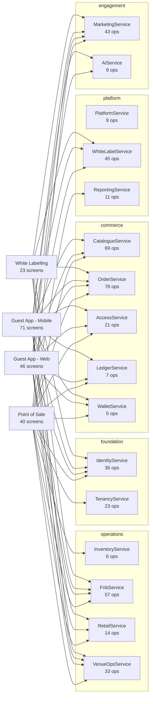

# TICVAI first release: architecture, frontend and backend

> Generated by `tools/build-service-docs.py` from the contracts, screens and `handoff/delivery-slice.json`. **Do not edit.** Re-run after any contract or screen change.

The first release is four platforms, 180 screens and **466 of 2135 operations** across 16 services. 356 operations are called by a first-release screen (core). 110 are Back Office and Admin operations that create the data those screens read (setup).

## How it fits together

Every app talks only to services. Services own their tables (one PostgreSQL schema each) and read another service's data only through its operations or its published events.

## Platform x service

Operations each platform calls, by the service that owns them. Setup operations are counted separately because no first-release screen calls them.

| Service | Tier | Point of Sale | Guest App - Web | Guest App - Mobile | White Labelling | Setup | In slice | All operations |
|---|---|---|---|---|---|---|---|---|
| [OrderService](backend/OrderService.md) | commerce | 43 | 35 | 37 | 2 | 5 | 78 | 253 |
| [CatalogueService](backend/CatalogueService.md) | commerce | 24 | 25 | 24 |  | 31 | 69 | 406 |
| [FnbService](backend/FnbService.md) | operations | 35 | 14 | 14 | 5 | 6 | 57 | 113 |
| [WhiteLabelService](backend/WhiteLabelService.md) | platform |  | 4 | 4 | 45 |  | 45 | 52 |
| [MarketingService](backend/MarketingService.md) | engagement | 4 | 32 | 32 | 3 | 7 | 43 | 213 |
| [IdentityService](backend/IdentityService.md) | foundation | 7 | 24 | 24 | 2 | 5 | 36 | 70 |
| [VenueOpsService](backend/VenueOpsService.md) | operations | 6 | 9 | 9 | 10 | 9 | 33 | 224 |
| [TenancyService](backend/TenancyService.md) | foundation | 14 |  |  |  | 9 | 23 | 163 |
| [AccessService](backend/AccessService.md) | commerce | 3 | 10 | 11 |  | 8 | 21 | 182 |
| [RetailService](backend/RetailService.md) | operations | 10 | 4 | 4 |  | 3 | 14 | 25 |
| [ReportingService](backend/ReportingService.md) | platform | 8 |  |  |  | 3 | 11 | 44 |
| [PlatformService](backend/PlatformService.md) | platform |  |  |  |  | 9 | 9 | 184 |
| [AiService](backend/AiService.md) | engagement |  | 4 | 4 |  | 5 | 9 | 31 |
| [LedgerService](backend/LedgerService.md) | commerce | 1 | 1 | 1 |  | 5 | 7 | 56 |
| [InventoryService](backend/InventoryService.md) | operations | 1 |  |  |  | 5 | 6 | 51 |
| [WalletService](backend/WalletService.md) | commerce | 1 | 4 | 4 |  |  | 5 | 50 |

## Tiers

| Tier | What it means |
|---|---|
| foundation | Read by everything, reads nothing above. Deploys first and alone. |
| commerce | The sale path. Highest availability, highest write rate. |
| operations | What a venue does with what it sold. Licensed per module. |
| engagement | Guests and intelligence. Nothing that takes money depends on these. |
| platform | Provisioning, publishing, reporting, and the one cross-region path. |

## Frontend

| Platform | Screens | Runtime | Offline |
|---|---|---|---|
| [Point of Sale](frontend/POS.md) | 40 | reactNativeTablet | yes |
| [Guest App - Web](frontend/WEB.md) | 46 | reactWeb | no |
| [Guest App - Mobile](frontend/MOB.md) | 71 | reactNative | yes |
| [White Labelling](frontend/WL.md) | 23 | reactWeb | no |

## Backend build plan and migrations

The database migrations, in the order they run, and every table the first release needs are in [backend/MIGRATIONS.md](backend/MIGRATIONS.md). The whole backend plan (tasks in build order, services, operations, API schemas, tables and migrations) is `TICVAI_Backend_Build_Plan.xlsx`.

## Services are frozen at 1.0.0, then extended

A service is finished for the first release when every operation in its slice is built and its contract is published at `1.0.0`. After that:

- **Additive, 1.x:** a new operation, a new optional field, a new table with a new migration. Nothing already built changes.
- **Breaking, 2.0.0:** renaming or removing a field, or making an optional field required. Needs a deprecation window.

Each backend page lists what is *not* in the slice, which is what later releases add.

## Known gaps in the slice

**Read but written only by another platform's trading (13 tables).** The screen ships and shows an empty state until that platform exists.

| Table | Written by |
|---|---|
| `access.scan_event` | `overrideAccess`, `syncScans`, `validateAccess`, `validateGroupAccess` |
| `games.credit_ledger` | `syncGamePlays` |
| `ledger.fiscal_period` | `abandonPeriodClose`, `beginPeriodClose`, `closeFiscalPeriod`, `reopenPeriod` |
| `maintenance.work_order` | `acceptWorkOrder`, `cancelWorkOrder`, `closeWorkOrder`, `completeWorkOrder`, `createWorkOrder` |
| `marketing.form_submission` | `submitForm` |
| `orders.invitation` | `issueInvitation` |
| `orders.reservation_line` | `createReservation` |
| `queue.reading` | `submitQueueReading`, `testQueueFeed` |
| `reporting.alert` | `acknowledgeAlert` |
| `resources.booking` | `bookResource`, `checkInResource`, `checkOutResource` |
| `retail.shop_and_drop` | `collectShopAndDrop`, `createShopAndDrop`, `disposeShopAndDrop` |
| `seating.seat` | `assignSeats` |
| `wallet.gift_card` | `activateGiftCard`, `blockGiftCard`, `issueGiftCard`, `redeemGiftCard` |

**Read but written by no operation (16 tables).** Most are child rows written inside their parent's operation and missing from the lineage. Four are real contract gaps, logged as L1-L4 in `docs/active/action-register-22-september.md`.

`ai.chunk_ref`, `fnb.delivery_location`, `fnb.sold_out_item`, `inventory.serialised_item`, `inventory.stock_batch`, `inventory.stock_level`, `ledger.event_budget`, `marketing.challenge_progress`, `orders.order_line_eligibility`, `orders.pos_shift_approval`, `orders.pos_shift_incident`, `orders.ticket_template_channel`, `platform.device_heartbeat`, `retail.shop_and_drop_line`, `subscription.plan_module`, `wallet.credit_lot`

**Setup operations no screen calls (15).** No screen lists them in its apis and no contract marks them consumed, so they are reachable only by API or import. Each needs a screen that binds it, or its contract to say it is API-only.

| Operation | Service | Makes non-empty |
|---|---|---|
| [`bulkChangePrices`](backend/CatalogueService.md#bulkchangeprices) | CatalogueService | `catalogue.price_list` |
| [`cloneProduct`](backend/CatalogueService.md#cloneproduct) | CatalogueService | `catalogue.product`, `catalogue.variant` |
| [`commitCatalogueImport`](backend/CatalogueService.md#commitcatalogueimport) | CatalogueService | `catalogue.product`, `catalogue.variant` |
| [`createInvitationCampaign`](backend/MarketingService.md#createinvitationcampaign) | MarketingService | `marketing.invitation_campaign` |
| [`createModifierGroup`](backend/FnbService.md#createmodifiergroup) | FnbService | `fnb.modifier_group`, `fnb.modifier_option` |
| [`createUpsellRule`](backend/CatalogueService.md#createupsellrule) | CatalogueService | `promotions.upsell_rule` |
| [`deleteUpsellRule`](backend/CatalogueService.md#deleteupsellrule) | CatalogueService | `promotions.upsell_rule` |
| [`escalateCorrectiveAction`](backend/FnbService.md#escalatecorrectiveaction) | FnbService | `fnb.corrective_action` |
| [`ingestKnowledgeDocument`](backend/AiService.md#ingestknowledgedocument) | AiService | `ai.knowledge_document` |
| [`restoreProductVersion`](backend/CatalogueService.md#restoreproductversion) | CatalogueService | `catalogue.product` |
| [`setFxProvider`](backend/LedgerService.md#setfxprovider) | LedgerService | `platform.region_settings` |
| [`setLoyaltyRules`](backend/MarketingService.md#setloyaltyrules) | MarketingService | `marketing.programme_tier` |
| [`setPromotionVariants`](backend/CatalogueService.md#setpromotionvariants) | CatalogueService | `promotions.promotion` |
| [`setSuggestionProvider`](backend/AiService.md#setsuggestionprovider) | AiService | `ai.policy` |
| [`updateBundle`](backend/CatalogueService.md#updatebundle) | CatalogueService | `promotions.allocation_component`, `promotions.bundle`, `promotions.bundle_component` |
