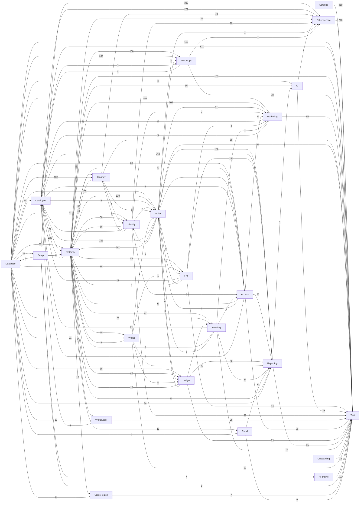

# How the Block A tickets are linked

> **Generated by** `tools/build-ticket-links.py` from `handoff/service-docs/tasks.csv` (the task sheet that becomes the OpenProject tickets). A ticket *waits on* another when it cannot be finished before the other is: that is the "follows" link in OpenProject and the order of each person's board.

**2228 tasks, 12139 links.**

## 1. The build layers, in order

| Layer | Tasks | Build order | Waits on |
|---|---:|---|---|
| Setup | 9 | #3 to #61 | Database (38) |
| Onboarding | 12 | #5 to #16 | nothing |
| Database | 163 | #23 to #2344 | Setup (2) |
| Platform | 20 | #31 to #85 | Setup (8), Database (2) |
| AI engine | 11 | #88 to #2410 | Setup (7) |
| Services | 250 | #79 to #1354 | Platform (515), Database (480) |
| Screens | 313 | #111 to #1363 | Services (997), Setup (196), AI engine (3) |
| Services (Venue Management) | 656 | #128 to #2407 | Database (1121), Services (957), Platform (775), Setup (217) |
| Screens (Venue Management) | 606 | #126 to #2384 | Services (Venue Management) (848), Services (627), Setup (606), AI engine (1) |
| Test | 188 | #62 to #2413 | Services (Venue Management) (656), Screens (Venue Management) (606), Screens (313), Services (250), Database (163), Platform (20), Onboarding (12), AI engine (11), Setup (9) |

## 2. Service map

An arrow means the service on the right waits on the one on the left; the number is how many task links carry it. Screens are left out here (section 4).

## 3. Services: what each waits on and what waits on it

| Service | Owner | Tasks | Points | Build order | Waits on | Needed by |
|---|---|---:|---:|---|---|---|
| **Other service** | Chinmay Patkar, Sanket Keluskar | 220 | 562 | #79 to #2407 | Setup 217, Catalogue 202, Tenancy 78, Platform 26, Identity 12, Ai 1, VenueOps 1, Order 1 | Test 220 |
| **Ai** | Sanket Keluskar, Pranay Shinde | 38 | 152 | #91 to #1952 | Database 73, Platform 66, Reporting 1 | screens: Other 55, Test 38, screens: Engagement & Support 15, screens: Platform 12, screens: Analytics 8, screens: White Label 8 ... |
| **Identity** | Sanket Keluskar, Pranay Shinde | 32 | 131 | #103 to #1655 | Database 73, Platform 66, Order 6, Tenancy 3 | screens: Other 37, Test 32, screens: Account & Self-Service 22, screens: Tenants & Licensing 21, Platform 16, screens: Access & Identity 15 ... |
| **Order** | Pranay Shinde, Chinmay Patkar | 53 | 296 | #109 to #2245 | Database 155, Platform 110, Catalogue 6, Access 4, Ledger 3, Identity 2, Tenancy 1, Inventory 1, Fnb 1, Wallet 1 | Reporting 186, Catalogue 166, Platform 141, screens: Sell 60, Test 53, Ledger 27 ... |
| **Marketing** | Tanmay Dukhande, Pallavi Sawant | 56 | 260 | #110 to #2219 | Database 110, Platform 106, Order 21, Identity 7, Access 5, Fnb 4, Catalogue 4, Inventory 1 | Test 56, screens: Other 39, screens: Engagement & Support 37, screens: Account & Self-Service 22, screens: Membership, Loyalty & Value 16, Catalogue 9 ... |
| **Platform** | Sanket Keluskar, Pallavi Sawant | 87 | 359 | #146 to #2229 | Database 259, Platform 157, Order 141, Catalogue 79, Tenancy 43, Ledger 18, Identity 16, Access 11, Wallet 8, Inventory 6, Fnb 5 | screens: Tenants & Licensing 147, Test 87, screens: Other 64, Tenancy 36, screens: Partners 27, screens: Sell 23 ... |
| **WhiteLabel** | Deep Khanvilkar, Tanmay Dukhande | 28 | 143 | #147 to #2054 | Platform 54, Database 39 | screens: White Label 67, Test 28, screens: Engagement & Support 17, screens: Branding & Localisation 9, screens: Booking & Selection 8, screens: Discovery & Browse 8 ... |
| **Tenancy** | Hrushikant Patkar, Deep Khanvilkar | 55 | 205 | #159 to #2254 | Platform 140, Database 132, Identity 6 | Other service 78, screens: Venue Operations 62, Test 55, screens: Other 47, Platform 43, screens: Sell 32 ... |
| **VenueOps** | Hrushikant Patkar, Chinmay Patkar | 70 | 316 | #192 to #2024 | Platform 130, Database 124, Order 2, Catalogue 1 | Test 70, screens: Other 66, screens: Media Library 56, screens: Access & Venue 19, screens: Transport 16, screens: Operations 16 ... |
| **Catalogue** | Pallavi Sawant, Deep Khanvilkar | 121 | 547 | #208 to #2391 | Database 351, Platform 229, Order 166, Inventory 21, Fnb 17, Identity 12, Marketing 9, VenueOps 4, WhiteLabel 4, Access 3 | Other service 202, Reporting 168, screens: Sell 125, Test 121, screens: Other 88, Platform 79 ... |
| **Access** | Hrushikant Patkar, Sanket Keluskar | 25 | 131 | #211 to #1518 | Database 60, Platform 47, Order 5, Catalogue 3, Identity 1, Inventory 1 | Reporting 66, screens: Other 46, Test 25, screens: Access & Venue 21, screens: Account & Self-Service 13, Platform 11 ... |
| **Inventory** | Pranay Shinde, Deep Khanvilkar | 14 | 71 | #222 to #1137 | Platform 27, Database 23, Ledger 2 | Reporting 34, Catalogue 21, screens: Other 14, Test 14, Platform 6, screens: Stock & Supply 2 ... |
| **Fnb** | Tanmay Dukhande, Deep Khanvilkar | 44 | 226 | #298 to #1139 | Platform 86, Database 84, Order 9, Wallet 1 | Reporting 164, screens: Other 49, Test 44, screens: Kitchen 26, screens: Sell 24, screens: In-venue Services 19 ... |
| **Wallet** | Pranay Shinde, Pallavi Sawant | 12 | 54 | #376 to #2328 | Platform 25, Database 21 | Reporting 40, screens: Other 16, Test 12, screens: Membership, Loyalty & Value 8, Platform 8, Ledger 5 ... |
| **Retail** | Pranay Shinde, Sanket Keluskar | 6 | 31 | #428 to #853 | Platform 12, Database 9 | Reporting 32, screens: Sell 12, screens: Retail 7, Test 6, screens: Payment 3, screens: Other 3 ... |
| **Ledger** | Pallavi Sawant, Tanmay Dukhande | 23 | 104 | #628 to #1648 | Database 56, Platform 48, Order 27, Wallet 5 | Reporting 62, Test 23, screens: Other 18, Platform 18, screens: Orders & Money 12, screens: Sell 5 ... |
| **CrossRegion** | Chinmay Patkar, Pallavi Sawant | 7 | 30 | #731 to #1589 | Platform 13, Database 8 | Test 7, screens: Access 3 |
| **Reporting** | Hrushikant Patkar, Chinmay Patkar | 15 | 53 | #854 to #1432 | Order 186, Catalogue 168, Fnb 164, Access 66, Ledger 62, Wallet 40, Inventory 34, Retail 32, Platform 25, Database 24 | Test 15, screens: Other 15, screens: Analytics 9, screens: Venue Operations 4, screens: Orders & Money 3, screens: Reports 3 ... |

## 4. Module builds: the services each module's screens need

| App | Module | Screen tasks | Build order | Waits on services | Other |
|---|---|---:|---|---|---|
| Guest Web — Storefront | Account & Self-Service | 5 | #111 to #1166 | Identity 9, Marketing 9, Order 8, Access 3, Ledger 2, Wallet 1 | Setup 5 |
| Guest App — Mobile | Account & Self-Service | 14 | #115 to #1179 | Order 15, Identity 13, Marketing 13, Access 10, Wallet 2, Ledger 2 | Setup 14 |
| Venue Staff App — Operations | Operations | 12 | #126 to #2070 | VenueOps 16, Identity 13, Catalogue 3, Order 2, Tenancy 2, Inventory 1, Marketing 1 | Setup 12 |
| Venue Scanner — Access Control | Access | 4 | #132 to #1587 | Identity 5, Access 3, CrossRegion 3, Order 1, Tenancy 1 | Setup 4 |
| Venue POS — Terminal and Tablet | Shift | 4 | #138 to #1007 | Order 12, Identity 7, Tenancy 3 | Setup 4 |
| Venue CMS — White Label | White Label | 23 | #140 to #1204 | WhiteLabel 67, Marketing 8, Ai 8, VenueOps 6, Catalogue 6, Identity 2, Order 1, Tenancy 1 | Setup 23 |
| Venue Support — Agent Console | Access & Availability | 1 | #143 to #143 | Identity 6 | Setup 1 |
| TICVAI Web — Platform Console | Access & Identity | 4 | #154 to #1442 | Identity 15 | Setup 4, Platform 2 |
| Partner Web — Reseller Portal | Access & Account | 4 | #156 to #1986 | Identity 10 | Setup 4, Platform 5 |
| Venue POS — Terminal and Tablet | Sell | 26 | #163 to #1360 | Order 55, Fnb 21, Catalogue 17, Retail 10, Tenancy 9, Marketing 8, Ledger 5, Reporting 3, VenueOps 2, Wallet 2, Inventory 1, Access 1 | Setup 26 |
| TICVAI Web — Platform Console | Tenants & Licensing | 88 | #180 to #1983 | Identity 21, Tenancy 6, WhiteLabel 2, Order 1, Ledger 1 | Setup 85, Platform 147 |
| Guest App — Mobile | Discovery & Browse | 7 | #226 to #1154 | Catalogue 15, WhiteLabel 4, VenueOps 3, Marketing 3, Access 1, Ai 1 | Setup 7 |
| TICVAI Web — Platform Console | Branding & Localisation | 4 | #245 to #1575 | WhiteLabel 9, Identity 8, Tenancy 2 | Setup 4, Platform 4 |
| Guest Web — Storefront | Engagement & Support | 6 | #247 to #1217 | Marketing 12, WhiteLabel 3, Ai 3, Fnb 1, Order 1 | Setup 6, AI engine 1 |
| Guest Web — Storefront | System States | 1 | #248 to #248 | WhiteLabel 1 | Setup 1 |
| Guest Web — Storefront | Support | 2 | #249 to #1162 | WhiteLabel 3, Marketing 2 | Setup 2 |
| Guest App — Mobile | Engagement & Support | 12 | #250 to #1222 | Marketing 12, VenueOps 12, Ai 10, Catalogue 4, WhiteLabel 4, Order 4, Fnb 3 | Setup 12, AI engine 2 |
| Guest App — Mobile | System States | 2 | #251 to #252 | WhiteLabel 2 | Setup 2 |
| Venue Management — Back Office | Platform | 3 | #291 to #296 | Tenancy 3, Identity 1 | - |
| Venue Management — Back Office | People & Access Rights | 10 | #293 to #1851 | Tenancy 13, Identity 12, Reporting 1, Ai 1 | Setup 8 |
| Venue Management — Back Office | Sell | 83 | #294 to #2384 | Catalogue 104, Tenancy 23, Order 5, Identity 5, Fnb 3, Ai 2, Retail 2, WhiteLabel 1, VenueOps 1, Wallet 1 | Setup 69, Platform 23 |
| Venue Management | Other | 139 | #297 to #2263 | Catalogue 88, VenueOps 66, Access 46, Tenancy 45, Fnb 43, Marketing 29, Ai 27, Order 22, Ledger 18, Wallet 16, Identity 14, Reporting 8, Inventory 6, Retail 3, WhiteLabel 2 | Setup 124, Platform 22 |
| Venue Management — Back Office | Food & Beverage | 5 | #299 to #1372 | Fnb 13, Reporting 2, Retail 1, Tenancy 1 | Setup 3 |
| TICVAI Web | Other | 12 | #333 to #1351 | Ai 28, Identity 23, Tenancy 2, Order 2 | Setup 12, Platform 29, AI engine 1 |
| Developer Portal | Developer & API | 8 | #336 to #1995 | - | Setup 5, Platform 16 |
| TICVAI Web — Platform Console | Overview & Health | 4 | #354 to #1681 | - | Setup 4, Platform 13 |
| Developer | Other | 3 | #363 to #367 | - | Setup 3, Platform 13 |
| Venue Management — Back Office | Access & Venue | 47 | #392 to #2084 | Access 21, VenueOps 19, Tenancy 10, Order 6, Catalogue 2, Reporting 2, Marketing 1, Ai 1 | Setup 24, Platform 4 |
| Venue Management — Back Office | Commercial | 5 | #395 to #850 | Order 2, Ledger 2, Catalogue 1 | - |
| Guest Web — Storefront | High-Demand Access | 1 | #496 to #496 | Catalogue 2 | Setup 1 |
| Venue Management — Back Office | Venue Operations | 41 | #498 to #1956 | Tenancy 62, Reporting 4, Ai 3, VenueOps 3, Fnb 3, Order 3, Access 2, Retail 1 | Setup 38, Platform 1 |
| Guest Web — Storefront | Discovery & Browse | 5 | #504 to #1041 | Catalogue 10, VenueOps 4, WhiteLabel 4, Marketing 2, Access 1, Ai 1 | Setup 5 |
| Guest Web — Storefront | Booking & Selection | 7 | #505 to #1216 | Catalogue 13, Order 6, VenueOps 6, WhiteLabel 5, Marketing 3, Ai 1 | Setup 7 |
| Guest Web — Storefront | Membership, Loyalty & Value | 5 | #506 to #1167 | Marketing 11, Order 6, Wallet 5, Identity 5, Catalogue 5, Access 2, VenueOps 1, Ai 1 | Setup 5 |
| Guest App — Mobile | High-Demand Access | 1 | #513 to #513 | Catalogue 2 | Setup 1 |
| Guest App — Mobile | Discovery | 1 | #514 to #514 | Catalogue 1 | Setup 1 |
| Guest App — Mobile | Booking & Selection | 10 | #518 to #1000 | Catalogue 19, Order 12, VenueOps 6, WhiteLabel 3, Marketing 2, Ai 1 | Setup 10 |
| Guest Kiosk — Self-Service | Sell | 5 | #528 to #2065 | Catalogue 4, WhiteLabel 2 | Setup 5 |
| Guest Web — Storefront | Promotions | 1 | #546 to #546 | Catalogue 2 | Setup 1 |
| Guest App — Mobile | Promotions | 1 | #549 to #549 | Catalogue 3 | Setup 1 |
| Guest Web — Storefront | Cart & Checkout | 5 | #581 to #1164 | Order 11, Catalogue 4, Marketing 4, WhiteLabel 4, Identity 1, VenueOps 1 | Setup 5 |
| Guest Web — Storefront | Ticketing | 3 | #586 to #754 | Order 7, Catalogue 3, Fnb 2, VenueOps 1, Ledger 1 | Setup 3 |
| Guest Web — Storefront | Retail | 2 | #592 to #981 | Retail 4, Order 3 | Setup 2 |
| Guest App — Mobile | Cart & Checkout | 3 | #600 to #606 | Order 11, WhiteLabel 3, Catalogue 2, Identity 1, VenueOps 1 | Setup 3 |
| Guest App — Mobile | Ticketing | 4 | #605 to #758 | Order 7, Catalogue 1, Ledger 1 | Setup 4 |
| Venue Management — Back Office | Orders & Money | 10 | #660 to #1127 | Order 18, Ledger 12, Reporting 3, Fnb 2, Tenancy 1, Retail 1 | Setup 4 |
| Guest App — Mobile | Membership, Loyalty & Value | 3 | #678 to #1175 | Marketing 5, Order 4, Catalogue 3, Wallet 3, Identity 1, VenueOps 1, Ai 1 | Setup 3 |
| Guest App — Mobile | In-venue Services | 10 | #706 to #1056 | Fnb 10, VenueOps 7, Access 4, Order 3, Catalogue 2, WhiteLabel 2 | Setup 10 |
| Guest Web — Storefront | In-venue Services | 6 | #712 to #1052 | Fnb 9, VenueOps 5, Access 3, Order 2 | Setup 6 |
| Venue Management — Back Office | Rentals | 20 | #798 to #2299 | VenueOps 10, Catalogue 7, Tenancy 3, Ai 2 | Setup 12, Platform 1 |
| Venue Analytics — Cross-Domain Reporting | Analytics | 6 | #873 to #1571 | Reporting 9, Identity 3, Ai 2, Tenancy 1 | Setup 3 |
| Guest Web — Storefront | Transport | 1 | #876 to #876 | VenueOps 6, Order 1 | Setup 1 |
| Guest App — Mobile | Transport | 4 | #879 to #883 | VenueOps 10, Order 2 | Setup 4 |
| Guest App — Mobile | In-Venue Experience | 2 | #920 to #985 | Retail 1, Fnb 1 | Setup 2 |
| Kitchen Display — Pass and Stations | Kitchen | 10 | #934 to #1363 | Fnb 26, Reporting 2 | Setup 10 |
| Venue Staff App | Other | 3 | #947 to #1091 | Inventory 8, Fnb 6 | Setup 3 |
| Venue Staff App — Operations | Floor Service | 2 | #952 to #954 | Fnb 15, Order 1 | Setup 2 |
| Guest App — Mobile | Retail | 1 | #984 to #984 | Retail 3, Order 1 | Setup 1 |
| Venue POS — Terminal and Tablet | Payment | 1 | #990 to #990 | Retail 3, Order 2, Access 1, Marketing 1 | Setup 1 |
| Venue Management — Back Office | Games & Rides | 9 | #1031 to #2244 | Catalogue 3, VenueOps 1 | Setup 9 |
| Venue Staff App — Operations | Stock on the Floor | 3 | #1073 to #1075 | Fnb 2, Inventory 2 | - |
| Venue Management — Back Office | Stock & Supply | 3 | #1101 to #1479 | Inventory 2, Reporting 1 | Setup 2 |
| Venue Analytics | Other | 3 | #1113 to #1116 | Reporting 7 | Setup 3 |
| Guest App — Mobile | Support | 1 | #1173 to #1173 | Marketing 2 | Setup 1 |
| Guest App — Mobile | Marketing | 1 | #1178 to #1178 | Marketing 4 | Setup 1 |
| Venue Support — Agent Console | Conversations | 2 | #1211 to #1213 | Marketing 7 | Setup 2 |
| Guest Kiosk — Self-Service | AI | 1 | #1225 to #1225 | Ai 2, Catalogue 2, Marketing 1, Order 1 | Setup 1 |
| Venue Management — Back Office | Engagement & Support | 27 | #1232 to #2220 | Marketing 13, WhiteLabel 10, Ai 2, Tenancy 2, Identity 1 | Setup 17 |
| Venue Management — Back Office | Guests & Marketing | 3 | #1255 to #1485 | Tenancy 4, Ai 2, Marketing 2, Identity 1, Reporting 1 | Setup 2 |
| Venue CMS — White Label | Policy | 2 | #1270 to #1271 | Marketing 2 | - |
| Venue CMS | Other | 2 | #1277 to #1278 | Marketing 5 | Setup 2 |
| Venue Support — Agent Console | Overview | 1 | #1281 to #1281 | Marketing 1 | - |
| Venue Support | Other | 1 | #1286 to #1286 | Marketing 5 | Setup 1 |
| TICVAI Web — Platform Console | AI | 2 | #1327 to #1330 | Ai 4 | - |
| TICVAI Web — Platform Console | Analytics | 5 | #1328 to #1447 | Ai 6, Identity 6 | Setup 3, Platform 3 |
| TICVAI Web — Platform Console | Platform | 10 | #1331 to #1953 | Ai 12, Identity 10, Tenancy 4 | Setup 5, Platform 5 |
| Venue POS — Terminal and Tablet | Reports | 1 | #1359 to #1359 | Reporting 3 | Setup 1 |
| Venue CMS — White Label | Media Library | 40 | #1428 to #2047 | VenueOps 56, Identity 2, Ai 1 | Setup 40 |
| TICVAI Web — Platform Console | Commercial | 1 | #1449 to #1449 | Identity 2, Order 1, Ledger 1 | Setup 1, Platform 1 |
| TICVAI Sign-up — Onboarding & Purchase | Onboarding & Assessment | 10 | #1461 to #1785 | Identity 1 | Setup 10, Platform 10 |
| Partner Web — Reseller Portal | Partners | 22 | #1469 to #2167 | Identity 4 | Setup 22, Platform 27 |
| Venue Management — Back Office | Operations | 5 | #1542 to #1549 | Tenancy 6 | Setup 5 |
| Venue Management — Back Office | Setup & Go-Live | 19 | #1560 to #2337 | Catalogue 3, Tenancy 2 | Setup 19, Platform 15 |
| TICVAI Web — Platform Console | Releases & Environments | 8 | #1595 to #1621 | Identity 4 | Setup 8, Platform 16 |
| TICVAI Web — Platform Console | Platform Ops | 1 | #1607 to #1607 | - | Setup 1, Platform 2 |
| TICVAI Web — Platform Console | Infrastructure & Resilience | 4 | #1616 to #1686 | - | Setup 4, Platform 9 |
| TICVAI Web — Platform Console | Security & Compliance | 1 | #1617 to #1617 | - | Setup 1, Platform 2 |
| TICVAI Web — Platform Console | Support & Communications | 2 | #1619 to #1620 | - | Setup 2, Platform 2 |
| TICVAI Sign-up — Onboarding & Purchase | Purchase & Activation | 6 | #1777 to #1799 | - | Setup 6, Platform 5 |
| TICVAI Sign-up — Onboarding & Purchase | Package Builder | 7 | #1786 to #1795 | - | Setup 7, Platform 8 |
| Partner Web — Reseller Portal | Booking & Quotes | 1 | #1809 to #1809 | - | Setup 1, Platform 2 |
| Partner Web — Reseller Portal | Reports & Settlement | 1 | #1817 to #1817 | - | Setup 1, Platform 1 |
| Partner Web — Reseller Portal | Inventory & Pricing | 2 | #2340 to #2341 | Catalogue 6 | Setup 2 |

## 5. Reports and other read-only work that waits for its data

A backend task that only reads waits for the tasks that write what it reads (decided 30 September).

| Task | Service | Waits on the data of |
|---|---|---|
| SVC-CATALOGUE-PRODUCT-2 | Catalogue | Inventory, WhiteLabel |
| SVC-ORDER-ORDERS-8 | Order | Catalogue, Inventory |
| SVC-CATALOGUE-PRODUCT-1 | Catalogue | Inventory |
| SVC-CATALOGUE-CAPACITY-1 | Catalogue | Order, VenueOps |
| VM-IDENTITY-ADMINISTRATION-2 | Identity | Order, Platform, Tenancy |
| SVC-IDENTITY-ADMINISTRATION-9 | Identity | Order, Platform, Tenancy |
| SVC-ACCESS-ACCESS-3 | Access | Catalogue, Identity, Inventory, Order, Platform |
| SVC-MARKETING-CONSENT-2 | Marketing | Access, Identity, Order |
| SVC-ORDER-DRAFTED-1 | Order | Access |
| SVC-PLATFORM-LICENSING-2 | Platform | Access, Order |
| SVC-LEDGER-FINANCE-5 | Ledger | Order, Wallet |
| SVC-VENUEOPS-GENERAL-1 | VenueOps | Catalogue, Order |
| SVC-LEDGER-REPORTING-2 | Ledger | Order, Wallet |
| SVC-ORDER-SHIFT-3 | Order | Identity, Ledger, Tenancy |
| SVC-FNB-GUESTORDERING-2 | Fnb | Order, Wallet |
| VM-ORDER-DRAFTED-1 | Order | Access, Fnb, Identity, Ledger, Wallet |
| VM-CATALOGUE-PRICING-1 | Catalogue | Fnb, Inventory |
| VM-INVENTORY-STOCK-1 | Inventory | Ledger |
| SVC-MARKETING-MARKETING-3 | Marketing | Access, Catalogue, Inventory, Order |
| SVC-MARKETING-CAMPAIGN-5 | Marketing | Fnb, Identity, Platform |
| VM-ADM-247 | Other service | Identity, Tenancy |
| VM-ADM-340 | Other service | Identity |
| SVC-AI-AUDIT-1 | Ai | Reporting |
| SVC-IDENTITY-IDENTITY-6 | Identity | Order, Platform, Tenancy |
| VM-ADM-582 | Other service | Tenancy |
| VM-ADM-584 | Other service | Tenancy |
| VM-ADM-587 | Other service | Tenancy, VenueOps |
| VM-ADM-581 | Other service | Order, Tenancy |
| VM-ADM-346 | Other service | Tenancy |
| VM-PTR-026 | Other service | Platform |
| VM-PTR-029 | Other service | Identity, Platform |
| VM-PTR-047 | Other service | Platform |
| SVC-PLATFORM-SUBSCRIPTION-11 | Platform | Ledger |
| VM-ADM-239 | Other service | Tenancy |
| VM-ADM-241 | Other service | Tenancy |
| VM-ADM-245 | Other service | Tenancy |
| VM-ADM-246 | Other service | Tenancy |
| VM-ADM-145 | Other service | Catalogue, Tenancy |
| SVC-PLATFORM-DRAFTED-12 | Platform | Identity, Order, Tenancy, Wallet |
| SVC-TENANCY-ANALYTICS-1 | Tenancy | Platform |
| VM-ADM-253 | Other service | Tenancy |
| VM-ADM-254 | Other service | Tenancy |
| VM-ADM-256 | Other service | Tenancy |
| VM-ADM-320 | Other service | Tenancy |
| VM-ADM-322 | Other service | Tenancy |
| VM-ADM-324 | Other service | Tenancy |
| VM-ADM-325 | Other service | Tenancy |
| VM-ADM-326 | Other service | Tenancy |
| VM-ADM-329 | Other service | Tenancy |
| VM-ADM-330 | Other service | Tenancy |
| VM-ADM-331 | Other service | Tenancy |
| VM-ADM-332 | Other service | Tenancy |
| VM-ADM-333 | Other service | Tenancy |
| VM-ADM-334 | Other service | Tenancy |
| VM-ADM-335 | Other service | Tenancy |
| VM-ADM-336 | Other service | Tenancy |
| VM-ADM-341 | Other service | Tenancy |
| VM-ADM-343 | Other service | Tenancy |
| VM-ADM-345 | Other service | Tenancy |
| VM-ADM-347 | Other service | Tenancy |
| VM-ADM-350 | Other service | Tenancy |
| VM-ADM-352 | Other service | Platform, Tenancy |
| VM-ADM-355 | Other service | Tenancy |
| VM-ADM-338 | Other service | Tenancy |
| VM-ADM-349 | Other service | Tenancy |
| VM-ADM-337 | Other service | Tenancy |
| VM-ADM-339 | Other service | Tenancy |
| VM-ADM-348 | Other service | Tenancy |
| SVC-TENANCY-APPROVALS-11 | Tenancy | Identity, Platform |
| VM-ADM-367 | Other service | Tenancy |
| VM-ADM-359 | Other service | Tenancy |
| VM-ADM-360 | Other service | Tenancy |
| VM-ADM-361 | Other service | Tenancy |
| VM-ADM-362 | Other service | Tenancy |
| VM-ADM-363 | Other service | Tenancy |
| VM-ADM-364 | Other service | Tenancy |
| VM-ADM-366 | Other service | Ai, Tenancy |
| VM-ADM-368 | Other service | Tenancy |
| SVC-TENANCY-APPROVALS-5 | Tenancy | Identity, Platform |
| VM-ADM-238 | Other service | Tenancy |
| VM-ADM-240 | Other service | Tenancy |
| VM-ADM-244 | Other service | Tenancy |
| SVC-TENANCY-APPROVALS-9 | Tenancy | Identity, Platform |
| VM-ADM-248 | Other service | Tenancy |
| VM-ADM-250 | Other service | Tenancy |
| VM-ADM-251 | Other service | Tenancy |
| VM-ADM-255 | Other service | Tenancy |
| VM-ADM-257 | Other service | Tenancy |
| VM-ADM-319 | Other service | Catalogue, Tenancy |
| VM-ADM-323 | Other service | Tenancy |
| VM-ADM-327 | Other service | Tenancy |
| VM-ADM-328 | Other service | Tenancy |
| VM-ADM-357 | Other service | Tenancy |
| VM-ADM-358 | Other service | Tenancy |
| SVC-PLATFORM-DRAFTED-11 | Platform | Fnb, Identity, Ledger, Order, Tenancy, Wallet |
| VM-ADM-356 | Other service | Identity, Platform |
| VM-ADM-351 | Other service | Platform |
| VM-ADM-119 | Other service | Catalogue |
| VM-ADM-125 | Other service | Catalogue |
| VM-ADM-129 | Other service | Catalogue, Tenancy |
| VM-ADM-131 | Other service | Catalogue |
| VM-ADM-132 | Other service | Catalogue |
| VM-ADM-136 | Other service | Catalogue |
| VM-ADM-120 | Other service | Catalogue |
| VM-ADM-123 | Other service | Catalogue |
| VM-ADM-124 | Other service | Catalogue |
| VM-ADM-126 | Other service | Catalogue |
| VM-ADM-127 | Other service | Catalogue |
| VM-ADM-130 | Other service | Catalogue, Tenancy |
| VM-ADM-133 | Other service | Catalogue |
| VM-ADM-134 | Other service | Catalogue |
| VM-ADM-052 | Other service | Catalogue |
| VM-ADM-055 | Other service | Catalogue |
| VM-ADM-061 | Other service | Catalogue |
| VM-ADM-066 | Other service | Catalogue |
| VM-ADM-070 | Other service | Catalogue |
| VM-ADM-072 | Other service | Catalogue |
| VM-ADM-075 | Other service | Catalogue |
| VM-ADM-078 | Other service | Catalogue |
| VM-ADM-079 | Other service | Catalogue |
| VM-ADM-080 | Other service | Catalogue |
| VM-ADM-081 | Other service | Catalogue |
| VM-ADM-083 | Other service | Catalogue, Tenancy |
| VM-ADM-090 | Other service | Catalogue |
| VM-ADM-091 | Other service | Catalogue |
| VM-ADM-084 | Other service | Catalogue |
| VM-ADM-086 | Other service | Catalogue |
| VM-ADM-092 | Other service | Catalogue |
| VM-ADM-100 | Other service | Catalogue |
| VM-ADM-114 | Other service | Catalogue |
| VM-ADM-115 | Other service | Catalogue |
| VM-ADM-107 | Other service | Catalogue |
| VM-ADM-109 | Other service | Catalogue |
| VM-ADM-111 | Other service | Catalogue |
| SVC-PLATFORM-DRAFTED-3 | Platform | Catalogue, Fnb, Identity, Inventory, Ledger, Order, Tenancy, Wallet |
| VM-PTR-035 | Other service | Identity, Platform |
| VM-PTR-036 | Other service | Identity, Platform |
| VM-PTR-039 | Other service | Platform |
| VM-PTR-048 | Other service | Identity, Platform |
| SVC-PLATFORM-DRAFTED-14 | Platform | Catalogue, Fnb, Identity, Inventory, Order, Tenancy, Wallet |
| SVC-PLATFORM-DRAFTED-15 | Platform | Catalogue, Identity, Inventory, Ledger, Order, Tenancy, Wallet |
| SVC-CATALOGUE-DRAFTED-24 | Catalogue | Fnb, Identity, Inventory, Order, Platform |
| VM-ADM-101 | Other service | Catalogue |
| VM-ADM-103 | Other service | Catalogue |
| VM-ADM-105 | Other service | Catalogue |
| VM-ADM-106 | Other service | Catalogue |
| SVC-CATALOGUE-DRAFTED-23 | Catalogue | Identity, Inventory, Order, Platform |
| SVC-CATALOGUE-DRAFTED-25 | Catalogue | Fnb, Identity, Inventory, Order, Platform |
| VM-ADM-102 | Other service | Catalogue |
| VM-ADM-110 | Other service | Catalogue |
| VM-ADM-112 | Other service | Catalogue |
| VM-ADM-113 | Other service | Catalogue |
| VM-ADM-116 | Other service | Catalogue |
| VM-ADM-117 | Other service | Catalogue |
| VM-ADM-258 | Other service | Catalogue |
| SVC-CATALOGUE-DRAFTED-28 | Catalogue | Inventory, Order, VenueOps |
| VM-ADM-260 | Other service | Catalogue |
| VM-ADM-261 | Other service | Catalogue |
| VM-ADM-265 | Other service | Catalogue |
| VM-ADM-266 | Other service | Catalogue |
| VM-ADM-267 | Other service | Catalogue |
| VM-ADM-270 | Other service | Catalogue |
| VM-ADM-271 | Other service | Catalogue |
| VM-ADM-259 | Other service | Catalogue |
| VM-ADM-268 | Other service | Catalogue |
| VM-ADM-272 | Other service | Catalogue |
| VM-ADM-262 | Other service | Catalogue |
| VM-ADM-263 | Other service | Catalogue |
| VM-ADM-264 | Other service | Catalogue |
| VM-ADM-269 | Other service | Catalogue |
| VM-ADM-273 | Other service | Catalogue |
| SVC-CATALOGUE-DRAFTED-6 | Catalogue | Fnb, Identity, Inventory, Order, Platform |
| VM-ADM-118 | Other service | Catalogue |
| VM-ADM-122 | Other service | Catalogue |
| VM-ADM-128 | Other service | Catalogue |
| VM-ADM-135 | Other service | Catalogue |
| SVC-MARKETING-GUESTS-1 | Marketing | Access, Catalogue, Fnb, Identity, Order, Platform |
| SVC-PLATFORM-DRAFTED-4 | Platform | Access, Catalogue, Identity, Inventory, Order, Tenancy, Wallet |
| VM-PTR-037 | Other service | Platform |
| SVC-PLATFORM-DRAFTED-7 | Platform | Access, Catalogue, Fnb, Identity, Inventory, Order, Tenancy, Wallet |
| SVC-PLATFORM-DRAFTED-8 | Platform | Access, Catalogue, Fnb, Identity, Inventory, Order, Wallet |
| SVC-CATALOGUE-DRAFTED-15 | Catalogue | Access, Fnb, Identity, Inventory, Order, Platform |
| VM-ADM-071 | Other service | Catalogue |
| VM-ADM-073 | Other service | Catalogue |
| VM-ADM-074 | Other service | Catalogue |
| VM-ADM-082 | Other service | Catalogue |
| VM-ADM-277 | Other service | Catalogue |
| SVC-CATALOGUE-DRAFTED-4 | Catalogue | Fnb, Identity, Inventory, Order, Platform |
| SVC-CATALOGUE-DRAFTED-10 | Catalogue | Inventory |
| SVC-CATALOGUE-DRAFTED-11 | Catalogue | Fnb, Inventory |
| SVC-CATALOGUE-DRAFTED-12 | Catalogue | Fnb, Inventory |
| VM-ADM-059 | Other service | Catalogue |
| VM-ADM-063 | Other service | Catalogue |
| VM-ADM-065 | Other service | Catalogue |
| VM-ADM-137 | Other service | Catalogue |
| VM-ADM-050 | Other service | Catalogue |
| VM-ADM-053 | Other service | Catalogue |
| VM-ADM-054 | Other service | Catalogue |
| VM-ADM-056 | Other service | Catalogue |
| VM-ADM-058 | Other service | Catalogue |
| VM-ADM-060 | Other service | Catalogue |
| VM-ADM-064 | Other service | Catalogue |
| VM-ADM-067 | Other service | Catalogue |
| VM-ADM-076 | Other service | Catalogue |
| SVC-CATALOGUE-DRAFTED-18 | Catalogue | Fnb, Inventory |
| SVC-CATALOGUE-DRAFTED-19 | Catalogue | Fnb, Identity, Inventory, Marketing, Order, Platform, VenueOps |
| VM-ADM-085 | Other service | Catalogue |
| VM-ADM-087 | Other service | Catalogue |
| VM-ADM-088 | Other service | Catalogue |
| VM-ADM-089 | Other service | Catalogue |
| VM-ADM-093 | Other service | Catalogue |
| VM-ADM-094 | Other service | Catalogue |
| VM-ADM-095 | Other service | Catalogue |
| VM-ADM-096 | Other service | Catalogue |
| VM-ADM-098 | Other service | Catalogue |
| VM-ADM-099 | Other service | Catalogue |
| VM-ADM-104 | Other service | Catalogue |
| VM-ADM-108 | Other service | Catalogue |
| SVC-CATALOGUE-DRAFTED-9 | Catalogue | Fnb, Inventory |
| VM-ADM-048 | Other service | Catalogue |
| VM-ADM-057 | Other service | Catalogue |
| VM-ADM-062 | Other service | Catalogue |
| SVC-CATALOGUE-DRAFTED-31 | Catalogue | Identity, Inventory, Order, Platform |
| VM-ADM-274 | Other service | Catalogue |
| VM-ADM-275 | Other service | Catalogue |
| VM-ADM-276 | Other service | Catalogue |
| VM-ADM-365 | Other service | Catalogue |
| SVC-CATALOGUE-UPSELL-2 | Catalogue | Inventory |
| SVC-CATALOGUE-DRAFTED-33 | Catalogue | Fnb, Identity, Marketing, Order, Platform |
| SVC-CATALOGUE-DRAFTED-35 | Catalogue | Fnb, Identity, Order, Platform |
| SVC-CATALOGUE-DRAFTED-36 | Catalogue | Fnb, Identity, Order, Platform |
| SVC-CATALOGUE-DRAFTED-37 | Catalogue | Fnb, Inventory |
| SVC-CATALOGUE-PROMOTIONS-3 | Catalogue | Inventory, Marketing, Order, VenueOps |
| VM-ADM-138 | Other service | Catalogue |
| VM-ADM-140 | Other service | Catalogue |
| VM-ADM-139 | Other service | Catalogue |
| VM-ADM-141 | Other service | Catalogue |
| VM-ADM-142 | Other service | Catalogue |
| VM-ADM-143 | Other service | Catalogue |
| VM-ADM-144 | Other service | Catalogue |
| VM-ADM-146 | Other service | Catalogue |
| VM-ADM-147 | Other service | Catalogue |
| VM-ADM-149 | Other service | Catalogue |
| VM-ADM-150 | Other service | Catalogue |
| VM-ADM-151 | Other service | Catalogue |
| VM-ADM-152 | Other service | Catalogue |
| VM-ADM-153 | Other service | Catalogue |
| VM-ADM-154 | Other service | Catalogue |
| VM-ADM-155 | Other service | Catalogue |
| SVC-CATALOGUE-DRAFTED-40 | Catalogue | Fnb, Identity, Order, Platform |
| SVC-CATALOGUE-DRAFTED-39 | Catalogue | Fnb, Inventory |
| VM-ADM-158 | Other service | Catalogue |
| VM-ADM-157 | Other service | Catalogue |
| VM-ADM-161 | Other service | Catalogue |
| VM-ADM-162 | Other service | Catalogue |
| VM-ADM-163 | Other service | Catalogue |
| VM-ADM-168 | Other service | Catalogue |
| VM-ADM-171 | Other service | Catalogue |
| VM-ADM-176 | Other service | Catalogue |
| VM-ADM-160 | Other service | Catalogue |
| VM-ADM-165 | Other service | Catalogue |
| VM-ADM-167 | Other service | Catalogue |
| VM-ADM-175 | Other service | Catalogue |
| VM-ADM-156 | Other service | Catalogue |
| VM-ADM-166 | Other service | Catalogue |
| VM-ADM-170 | Other service | Catalogue |
| VM-ADM-177 | Other service | Catalogue |

## 6. Tasks that wait on nothing

Only setup and onboarding should be here.

| Task | Layer | Build order |
|---|---|---|
| SETUP-CI | Setup | #3 |
| SETUP-ENV | Setup | #4 |
| SETUP-ONBOARD-CHINMAY-PATKAR | Onboarding | #5 |
| SETUP-ONBOARD-CHITRANGI-MESTRY | Onboarding | #6 |
| SETUP-ONBOARD-DEEP-KHANVILKAR | Onboarding | #7 |
| SETUP-ONBOARD-HRUSHIKANT-PATKAR | Onboarding | #8 |
| SETUP-ONBOARD-KALPITA-MEJARI | Onboarding | #9 |
| SETUP-ONBOARD-PALLAVI-SAWANT | Onboarding | #10 |
| SETUP-ONBOARD-PRADNYA-YERAM | Onboarding | #11 |
| SETUP-ONBOARD-PRANAY-SHINDE | Onboarding | #12 |
| SETUP-ONBOARD-SANKET-KELUSKAR | Onboarding | #13 |
| SETUP-ONBOARD-SECOND-AI-ENGINEER | Onboarding | #14 |
| SETUP-ONBOARD-SURENDRA | Onboarding | #15 |
| SETUP-ONBOARD-TANMAY-DUKHANDE | Onboarding | #16 |
| TEST-BLOCK-A2-BE | Test | #1392 |
| TEST-BLOCK-A2-FE | Test | #1393 |

