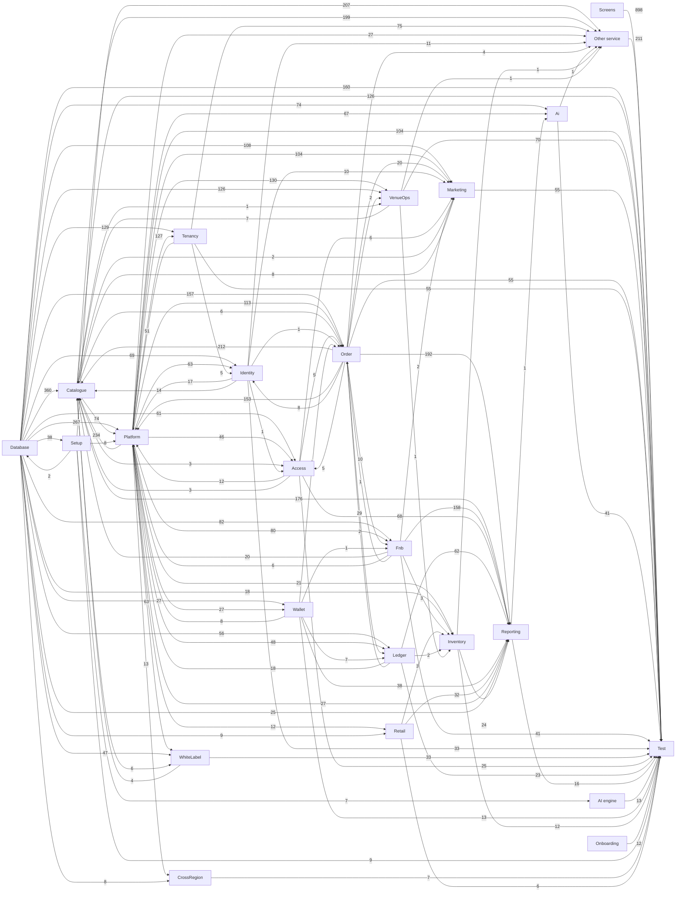

# How the Block A tickets are linked

> **Generated by** `tools/build-ticket-links.py` from `handoff/service-docs/tasks.csv` (the task sheet that becomes the OpenProject tickets). A ticket *waits on* another when it cannot be finished before the other is: that is the "follows" link in OpenProject and the order of each person's board.

**2208 tasks, 12341 links.**

## 1. The build layers, in order

| Layer | Tasks | Build order | Waits on |
|---|---:|---|---|
| Setup | 9 | #3 to #61 | Database (38) |
| Onboarding | 12 | #5 to #16 | nothing |
| Database | 160 | #23 to #2389 | Setup (2) |
| Platform | 20 | #31 to #85 | Setup (8), Database (2) |
| AI engine | 12 | #88 to #2381 | Setup (7) |
| Services | 255 | #79 to #1346 | Platform (525), Database (490) |
| Screens | 312 | #114 to #1377 | Services (1013), Setup (194), AI engine (3) |
| Services (Venue Management) | 649 | #134 to #2393 | Database (1131), Services (1057), Platform (768), Setup (207) |
| Screens (Venue Management) | 586 | #132 to #2397 | Services (Venue Management) (866), Services (645), Setup (586), AI engine (1) |
| Test | 193 | #62 to #2398 | Services (Venue Management) (649), Screens (Venue Management) (586), Screens (312), Services (257), Database (160), Platform (20), AI engine (13), Onboarding (12), Setup (9) |

## 2. Service map

An arrow means the service on the right waits on the one on the left; the number is how many task links carry it. Screens are left out here (section 4).

## 3. Services: what each waits on and what waits on it

| Service | Owner | Tasks | Points | Build order | Waits on | Needed by |
|---|---|---:|---:|---|---|---|
| **Other service** | Sanket Keluskar, Chinmay Patkar | 211 | 541 | #79 to #2386 | Setup 207, Catalogue 199, Tenancy 75, Platform 27, Identity 11, Order 4, VenueOps 1, Ai 1, Inventory 1 | Test 211 |
| **Ai** | Sanket Keluskar, Hrushikant Patkar | 39 | 152 | #91 to #1924 | Database 74, Platform 67, Reporting 1 | screens: Other 58, Test 41, screens: Engagement & Support 15, screens: Analytics 13, screens: Platform 12, screens: White Label 8 ... |
| **Identity** | Sanket Keluskar, Chinmay Patkar | 33 | 135 | #104 to #1631 | Database 69, Platform 63, Order 8, Tenancy 5 | screens: Other 37, Test 33, screens: Account & Self-Service 22, screens: Tenants & Licensing 21, Platform 17, screens: Access & Identity 17 ... |
| **Order** | Pranay Shinde, Chinmay Patkar | 55 | 302 | #111 to #2256 | Database 157, Platform 113, Catalogue 6, Access 5, Ledger 2, Fnb 1, Identity 1, Wallet 1 | Catalogue 212, Reporting 192, Platform 153, screens: Sell 62, Test 55, Ledger 29 ... |
| **Marketing** | Pranay Shinde, Pallavi Sawant | 55 | 263 | #115 to #2230 | Database 108, Platform 104, Order 20, Identity 10, Access 6, Catalogue 2, Fnb 2 | Test 55, screens: Other 44, screens: Engagement & Support 32, screens: Account & Self-Service 24, screens: Membership, Loyalty & Value 16, screens: White Label 8 ... |
| **Platform** | Pallavi Sawant, Sanket Keluskar | 84 | 353 | #152 to #2240 | Database 265, Order 153, Platform 150, Catalogue 74, Tenancy 51, Ledger 18, Identity 17, Access 12, Wallet 8, Fnb 6 | screens: Tenants & Licensing 150, Test 84, screens: Other 63, screens: Partners 26, screens: Sell 24, Other service 22 ... |
| **WhiteLabel** | Hrushikant Patkar, Deep Khanvilkar | 33 | 169 | #153 to #2393 | Platform 63, Database 47, Catalogue 6 | screens: White Label 68, Test 33, screens: Engagement & Support 17, screens: Branding & Localisation 9, screens: Discovery & Browse 8, screens: Booking & Selection 8 ... |
| **Tenancy** | Deep Khanvilkar, Sanket Keluskar | 55 | 207 | #165 to #2267 | Database 129, Platform 127 | Other service 75, screens: Venue Operations 63, Test 55, Platform 51, screens: Other 47, screens: Sell 33 ... |
| **Wallet** | Pranay Shinde, Sanket Keluskar | 13 | 60 | #191 to #2278 | Database 27, Platform 27 | Reporting 38, screens: Other 14, Test 13, Platform 8, Ledger 7, screens: Membership, Loyalty & Value 6 ... |
| **Retail** | Pranay Shinde, Deep Khanvilkar | 6 | 29 | #197 to #769 | Platform 12, Database 9 | Reporting 32, screens: Sell 11, screens: Retail 7, Test 6, Inventory 3, screens: Payment 3 ... |
| **VenueOps** | Tanmay Dukhande, Chinmay Patkar | 70 | 319 | #213 to #1984 | Platform 130, Database 126, Order 2, Catalogue 1 | Test 70, screens: Other 67, screens: Media Library 56, screens: Access & Venue 20, screens: Operations 16, screens: Transport 16 ... |
| **Catalogue** | Tanmay Dukhande, Chinmay Patkar | 126 | 557 | #228 to #2360 | Database 360, Platform 234, Order 212, Fnb 20, Identity 14, Marketing 8, VenueOps 7, WhiteLabel 4, Access 3 | Other service 199, Reporting 176, screens: Sell 129, Test 126, screens: Other 101, Platform 74 ... |
| **Access** | Hrushikant Patkar, Tanmay Dukhande | 25 | 130 | #231 to #1501 | Database 61, Platform 46, Order 5, Catalogue 3, Identity 1 | Reporting 68, screens: Other 44, Test 25, screens: Access & Venue 23, screens: Account & Self-Service 14, Platform 12 ... |
| **Fnb** | Tanmay Dukhande, Deep Khanvilkar | 41 | 227 | #320 to #1162 | Database 82, Platform 80, Order 10, Wallet 1 | Reporting 158, screens: Other 50, Test 41, screens: Sell 28, screens: Kitchen 25, Catalogue 20 ... |
| **Ledger** | Tanmay Dukhande, Sanket Keluskar | 23 | 107 | #631 to #1624 | Database 56, Platform 48, Order 29, Wallet 7 | Reporting 62, Test 23, screens: Other 20, Platform 18, screens: Orders & Money 12, screens: Sell 5 ... |
| **CrossRegion** | Chinmay Patkar, Surendra | 7 | 30 | #736 to #1572 | Platform 13, Database 8 | Test 7, screens: Access 3 |
| **Reporting** | Chinmay Patkar, Hrushikant Patkar | 16 | 52 | #865 to #1438 | Order 192, Catalogue 176, Fnb 158, Access 68, Ledger 62, Wallet 38, Retail 32, Platform 27, Database 25, Inventory 24 | screens: Other 17, Test 16, screens: Analytics 10, screens: Venue Operations 4, screens: Reports 3, screens: Sell 3 ... |
| **Inventory** | Pranay Shinde, Sanket Keluskar | 12 | 55 | #955 to #1171 | Platform 21, Database 18, Fnb 3, Retail 3, Ledger 2, VenueOps 1 | Reporting 24, Test 12, screens: Other 12, screens: Stock & Supply 2, screens: Operations 1, Other service 1 ... |

## 4. Module builds: the services each module's screens need

| App | Module | Screen tasks | Build order | Waits on services | Other |
|---|---|---:|---|---|---|
| Guest Web — Storefront | Cart & Checkout | 5 | #114 to #1186 | Order 11, Catalogue 4, Marketing 4, WhiteLabel 4, Identity 3, VenueOps 1 | Setup 5 |
| Guest Web — Storefront | Account & Self-Service | 5 | #116 to #1188 | Marketing 10, Identity 9, Order 8, Access 3, Ledger 2, Wallet 1 | Setup 5 |
| Guest App — Mobile | Cart & Checkout | 3 | #119 to #615 | Order 11, WhiteLabel 3, Identity 3, Catalogue 2, VenueOps 1 | Setup 3 |
| Guest App — Mobile | Account & Self-Service | 14 | #120 to #1199 | Order 15, Marketing 14, Identity 13, Access 11, Wallet 3, Ledger 2, WhiteLabel 1 | Setup 14 |
| Venue Staff App — Operations | Operations | 12 | #132 to #2040 | VenueOps 16, Identity 13, Catalogue 3, Tenancy 2, Order 2, Inventory 1, Marketing 1 | Setup 12 |
| Venue Scanner — Access Control | Access | 4 | #138 to #1570 | Identity 5, Access 3, CrossRegion 3, Order 1, Tenancy 1 | Setup 4 |
| Venue POS — Terminal and Tablet | Shift | 4 | #144 to #1023 | Order 11, Identity 7, Tenancy 3 | Setup 4 |
| Venue CMS — White Label | White Label | 23 | #146 to #1223 | WhiteLabel 68, Marketing 8, Ai 8, VenueOps 8, Catalogue 6, Identity 2, Tenancy 1, Order 1 | Setup 23 |
| Venue Support — Agent Console | Access & Availability | 1 | #149 to #149 | Identity 6 | Setup 1 |
| TICVAI Web — Platform Console | Access & Identity | 4 | #160 to #1447 | Identity 17 | Setup 4, Platform 2 |
| Partner Web — Reseller Portal | Access & Account | 4 | #162 to #1957 | Identity 10 | Setup 4, Platform 6 |
| Venue POS — Terminal and Tablet | Sell | 26 | #170 to #1202 | Order 57, Fnb 24, Catalogue 17, Tenancy 10, Retail 9, Marketing 8, Ledger 5, Reporting 3, VenueOps 2, Wallet 2, Access 1, Inventory 1 | Setup 26 |
| TICVAI Web — Platform Console | Tenants & Licensing | 87 | #187 to #1954 | Identity 21, Tenancy 6, WhiteLabel 2, Ledger 1, Order 1 | Setup 84, Platform 150 |
| Venue Management — Back Office | People & Access Rights | 9 | #207 to #1811 | Tenancy 13, Identity 12, Reporting 1, Catalogue 1, Ai 1 | Setup 6 |
| Guest App — Mobile | Discovery & Browse | 7 | #245 to #1065 | Catalogue 15, WhiteLabel 4, Marketing 3, VenueOps 3, Access 1, Ai 1 | Setup 7 |
| TICVAI Web — Platform Console | Branding & Localisation | 4 | #263 to #1558 | WhiteLabel 9, Identity 8, Tenancy 2, VenueOps 2 | Setup 4, Platform 4 |
| Guest Web — Storefront | Engagement & Support | 5 | #265 to #1236 | Marketing 8, WhiteLabel 3, Ai 3, Fnb 1, Order 1 | Setup 5, AI engine 1 |
| Guest Web — Storefront | System States | 1 | #266 to #266 | WhiteLabel 1 | Setup 1 |
| Guest Web — Storefront | Support | 2 | #267 to #1185 | WhiteLabel 3, Marketing 2 | Setup 2 |
| Guest App — Mobile | Engagement & Support | 12 | #268 to #1241 | VenueOps 12, Marketing 12, Ai 10, Catalogue 4, WhiteLabel 4, Order 4, Fnb 3 | Setup 12, AI engine 2 |
| Guest App — Mobile | System States | 2 | #269 to #270 | WhiteLabel 2 | Setup 2 |
| Venue Management — Back Office | Platform | 3 | #312 to #314 | Identity 2, Tenancy 1 | - |
| Venue Management — Back Office | Sell | 81 | #317 to #2346 | Catalogue 108, Tenancy 23, Identity 5, Order 5, Fnb 4, Retail 2, Ai 2, Wallet 1, VenueOps 1, WhiteLabel 1 | Setup 67, Platform 24 |
| Venue Management | Other | 140 | #319 to #2397 | Catalogue 101, VenueOps 67, Tenancy 45, Access 44, Fnb 44, Marketing 34, Ai 29, Order 24, Ledger 20, Wallet 14, Identity 14, Reporting 9, Inventory 7, WhiteLabel 5, Retail 3 | Setup 124, Platform 19 |
| Venue Management — Back Office | Food & Beverage | 5 | #321 to #1386 | Fnb 12, Reporting 2, Retail 1, Tenancy 1 | Setup 3 |
| TICVAI Web | Other | 12 | #351 to #1371 | Ai 29, Identity 23, Order 2, Tenancy 2 | Setup 12, Platform 29, AI engine 1 |
| Developer Portal | Developer & API | 8 | #355 to #1965 | - | Platform 16, Setup 5 |
| TICVAI Web — Platform Console | Overview & Health | 4 | #380 to #1659 | - | Setup 4, Platform 14 |
| Developer | Other | 3 | #387 to #390 | - | Setup 3, Platform 15 |
| Venue Management — Back Office | Access & Venue | 43 | #416 to #2054 | Access 23, VenueOps 20, Tenancy 8, Order 5, Reporting 2, Catalogue 2, Ai 1, Marketing 1 | Setup 21, Platform 4 |
| Venue Management — Back Office | Commercial | 6 | #419 to #863 | Order 3, Ledger 2, Catalogue 1 | - |
| Guest Web — Storefront | High-Demand Access | 1 | #514 to #514 | Catalogue 2 | Setup 1 |
| Venue Management — Back Office | Venue Operations | 38 | #516 to #1928 | Tenancy 63, Reporting 4, Ai 3, Order 3, VenueOps 3, Fnb 3, Access 2, Retail 1 | Setup 35, Platform 1 |
| Guest Web — Storefront | Discovery & Browse | 5 | #522 to #1062 | Catalogue 10, VenueOps 4, WhiteLabel 4, Marketing 2, Access 1, Ai 1 | Setup 5 |
| Guest Web — Storefront | Booking & Selection | 7 | #523 to #1235 | Catalogue 13, Order 6, VenueOps 6, WhiteLabel 5, Marketing 3, Ai 1 | Setup 7 |
| Guest Web — Storefront | Membership, Loyalty & Value | 5 | #524 to #1189 | Marketing 11, Order 6, Catalogue 5, Identity 5, Wallet 4, Access 2, VenueOps 1, Ai 1 | Setup 5 |
| Guest App — Mobile | High-Demand Access | 1 | #531 to #531 | Catalogue 2 | Setup 1 |
| Guest App — Mobile | Discovery | 1 | #532 to #532 | Catalogue 1 | Setup 1 |
| Guest App — Mobile | Booking & Selection | 10 | #536 to #1004 | Catalogue 17, Order 12, VenueOps 8, WhiteLabel 3, Marketing 2, Ai 1 | Setup 10 |
| Guest Kiosk — Self-Service | Sell | 5 | #545 to #2035 | Catalogue 4, WhiteLabel 2 | Setup 5 |
| Guest Web — Storefront | Promotions | 1 | #562 to #562 | Catalogue 2 | Setup 1 |
| Guest App — Mobile | Promotions | 1 | #565 to #565 | Catalogue 3 | Setup 1 |
| Guest Web — Storefront | Ticketing | 3 | #601 to #773 | Order 7, Catalogue 3, Fnb 2, Ledger 1, VenueOps 1 | Setup 3 |
| Guest Web — Storefront | Retail | 2 | #602 to #986 | Retail 4, Order 3 | Setup 2 |
| Guest App — Mobile | Ticketing | 4 | #614 to #777 | Order 7, Catalogue 1, Ledger 1 | Setup 4 |
| Venue Management — Back Office | Orders & Money | 10 | #660 to #1144 | Order 18, Ledger 12, Reporting 3, Fnb 2, Retail 1, Tenancy 1 | Setup 4 |
| Guest App — Mobile | Membership, Loyalty & Value | 3 | #675 to #1194 | Order 5, Marketing 5, Catalogue 3, Wallet 2, Identity 1, Ai 1, VenueOps 1 | Setup 3 |
| Guest Web — Storefront | In-venue Services | 6 | #725 to #1073 | Fnb 9, VenueOps 6, Access 3, Order 2 | Setup 6 |
| Guest App — Mobile | In-venue Services | 10 | #729 to #1077 | Fnb 10, VenueOps 8, Access 5, Order 3, Catalogue 2, WhiteLabel 2 | Setup 10 |
| Venue Management — Back Office | Rentals | 19 | #815 to #2276 | VenueOps 10, Catalogue 8, Tenancy 2, Ai 2 | Setup 11, Platform 1 |
| Venue Analytics — Cross-Domain Reporting | Analytics | 6 | #886 to #1554 | Reporting 10, Identity 3, Ai 2, Tenancy 1 | Setup 3 |
| Guest Web — Storefront | Transport | 1 | #889 to #889 | VenueOps 6, Order 1 | Setup 1 |
| Guest App — Mobile | Transport | 4 | #892 to #896 | VenueOps 10, Order 2 | Setup 4 |
| Guest App — Mobile | In-Venue Experience | 2 | #939 to #989 | Access 1, Retail 1, Fnb 1 | Setup 2 |
| Kitchen Display — Pass and Stations | Kitchen | 10 | #944 to #1377 | Fnb 25, Reporting 2 | Setup 10 |
| Venue Staff App | Other | 2 | #960 to #1152 | Fnb 6, Inventory 5 | Setup 2 |
| Venue Staff App — Operations | Floor Service | 2 | #962 to #964 | Fnb 15, Order 1 | Setup 2 |
| Guest App — Mobile | Retail | 1 | #990 to #990 | Retail 3, Order 1 | Setup 1 |
| Venue POS — Terminal and Tablet | Payment | 1 | #998 to #998 | Retail 3, Order 2, Access 1, Marketing 1 | Setup 1 |
| Venue Management — Back Office | Games & Rides | 10 | #1051 to #2396 | WhiteLabel 4, Catalogue 3, VenueOps 1 | Setup 10 |
| Venue Staff App — Operations | Stock on the Floor | 2 | #1096 to #1097 | Fnb 2, Inventory 1 | - |
| Venue Management — Back Office | Stock & Supply | 2 | #1107 to #1382 | Inventory 2, Reporting 1 | Setup 1 |
| Venue Analytics | Other | 3 | #1125 to #1128 | Reporting 8 | Setup 3 |
| Guest App — Mobile | Support | 1 | #1195 to #1195 | Marketing 2 | Setup 1 |
| Venue Support — Agent Console | Conversations | 2 | #1230 to #1232 | Marketing 7 | Setup 2 |
| Guest Kiosk — Self-Service | AI | 1 | #1244 to #1244 | Ai 2, Catalogue 2, Marketing 1, Order 1 | Setup 1 |
| Venue Management — Back Office | Engagement & Support | 26 | #1253 to #2231 | Marketing 12, WhiteLabel 10, Tenancy 2, Ai 2, Identity 1 | Setup 16 |
| Venue Management — Back Office | Guests & Marketing | 3 | #1279 to #1487 | Tenancy 4, Marketing 2, Ai 2, Reporting 1, Identity 1 | Setup 2 |
| Venue CMS — White Label | Policy | 2 | #1295 to #1296 | Marketing 2 | - |
| Venue CMS | Other | 2 | #1302 to #1303 | Marketing 5 | Setup 2 |
| Venue Support — Agent Console | Overview | 1 | #1306 to #1306 | Marketing 1 | - |
| Venue Support | Other | 1 | #1311 to #1311 | Marketing 5 | Setup 1 |
| TICVAI Web — Platform Console | AI | 2 | #1347 to #1350 | Ai 4 | - |
| TICVAI Web — Platform Console | Analytics | 5 | #1348 to #1452 | Ai 11, Identity 6 | Setup 3, Platform 3 |
| TICVAI Web — Platform Console | Platform | 10 | #1351 to #1925 | Ai 12, Identity 10, Tenancy 4 | Setup 5, Platform 5 |
| Venue POS — Terminal and Tablet | Reports | 1 | #1374 to #1374 | Reporting 3 | Setup 1 |
| Venue CMS — White Label | Media Library | 40 | #1434 to #2017 | VenueOps 56, Identity 3, Ai 1 | Setup 40 |
| TICVAI Web — Platform Console | Commercial | 1 | #1449 to #1449 | Identity 2, Order 1, Ledger 1 | Setup 1, Platform 1 |
| TICVAI Sign-up — Onboarding & Purchase | Onboarding & Assessment | 10 | #1468 to #1761 | Identity 1 | Setup 10, Platform 10 |
| Partner Web — Reseller Portal | Partners | 22 | #1476 to #2111 | Identity 4 | Setup 22, Platform 26 |
| Venue Management — Back Office | Setup & Go-Live | 19 | #1541 to #2309 | Catalogue 3, Tenancy 2 | Setup 19, Platform 15 |
| Venue Management — Back Office | Operations | 3 | #1546 to #1548 | Tenancy 6 | Setup 3 |
| TICVAI Web — Platform Console | Releases & Environments | 8 | #1581 to #1602 | Identity 4 | Setup 8, Platform 16 |
| TICVAI Web — Platform Console | Platform Ops | 1 | #1591 to #1591 | - | Setup 1, Platform 2 |
| TICVAI Web — Platform Console | Support & Communications | 2 | #1600 to #1601 | - | Setup 2, Platform 2 |
| TICVAI Sign-up — Onboarding & Purchase | Purchase & Activation | 6 | #1753 to #1775 | - | Setup 6, Platform 5 |
| TICVAI Sign-up — Onboarding & Purchase | Package Builder | 7 | #1762 to #1771 | - | Setup 7, Platform 8 |
| Partner Web — Reseller Portal | Reports & Settlement | 1 | #1792 to #1792 | - | Setup 1, Platform 2 |
| Partner Web — Reseller Portal | Inventory & Pricing | 2 | #2312 to #2313 | Catalogue 6 | Setup 2 |
| Venue CMS — White Label | Kiosk | 1 | #2394 to #2394 | WhiteLabel 4 | Setup 1 |
| Kiosk | Other | 1 | #2395 to #2395 | WhiteLabel 1 | Setup 1 |

## 5. Reports and other read-only work that waits for its data

A backend task that only reads waits for the tasks that write what it reads (decided 30 September).

| Task | Service | Waits on the data of |
|---|---|---|
| SVC-CATALOGUE-PRODUCT-2 | Catalogue | WhiteLabel |
| SVC-ORDER-ORDERS-8 | Order | Catalogue |
| SVC-CATALOGUE-CAPACITY-1 | Catalogue | Order, VenueOps |
| VM-IDENTITY-ADMINISTRATION-2 | Identity | Order, Tenancy |
| SVC-IDENTITY-ADMINISTRATION-9 | Identity | Order, Tenancy |
| SVC-IDENTITY-ADMINISTRATION-10 | Identity | Order, Tenancy |
| SVC-ACCESS-ACCESS-3 | Access | Catalogue, Identity, Order |
| SVC-MARKETING-CONSENT-2 | Marketing | Access, Identity, Order |
| SVC-ORDER-DRAFTED-1 | Order | Access |
| SVC-PLATFORM-LICENSING-2 | Platform | Access, Order |
| SVC-LEDGER-FINANCE-5 | Ledger | Order, Wallet |
| SVC-VENUEOPS-GENERAL-1 | VenueOps | Catalogue, Order |
| SVC-FNB-GUESTORDERING-2 | Fnb | Order, Wallet |
| VM-ORDER-DRAFTED-1 | Order | Access, Fnb, Identity, Ledger, Wallet |
| SVC-LEDGER-REPORTING-2 | Ledger | Order, Wallet |
| VM-CATALOGUE-PRICING-1 | Catalogue | Fnb |
| VM-INVENTORY-STOCK-1 | Inventory | Fnb, Ledger, Retail, VenueOps |
| SVC-MARKETING-GUEST-4 | Marketing | Access, Identity, Order |
| SVC-MARKETING-SEGMENT-4 | Marketing | Access, Order |
| VM-ADM-247 | Other service | Identity, Tenancy |
| SVC-AI-AUDIT-1 | Ai | Reporting |
| SVC-IDENTITY-IDENTITY-7 | Identity | Order, Tenancy |
| VM-ADM-582 | Other service | Tenancy |
| VM-ADM-584 | Other service | Tenancy |
| VM-ADM-587 | Other service | Tenancy, VenueOps |
| VM-ADM-581 | Other service | Order, Tenancy |
| VM-ADM-346 | Other service | Tenancy |
| VM-PTR-035 | Other service | Identity, Platform |
| VM-PTR-039 | Other service | Platform |
| VM-PTR-048 | Other service | Identity, Platform |
| SVC-PLATFORM-SUBSCRIPTION-18 | Platform | Tenancy |
| SVC-TENANCY-ANALYTICS-1 | Tenancy | Platform |
| VM-ADM-238 | Other service | Tenancy |
| VM-ADM-239 | Other service | Tenancy |
| VM-ADM-240 | Other service | Tenancy |
| VM-ADM-241 | Other service | Tenancy |
| VM-ADM-245 | Other service | Tenancy |
| VM-ADM-246 | Other service | Tenancy |
| VM-ADM-248 | Other service | Tenancy |
| VM-ADM-250 | Other service | Tenancy |
| VM-ADM-253 | Other service | Tenancy |
| VM-ADM-254 | Other service | Tenancy |
| VM-ADM-256 | Other service | Tenancy |
| VM-ADM-257 | Other service | Tenancy |
| VM-ADM-320 | Other service | Tenancy |
| VM-ADM-322 | Other service | Tenancy |
| VM-ADM-323 | Other service | Tenancy |
| VM-ADM-324 | Other service | Tenancy |
| VM-ADM-325 | Other service | Tenancy |
| VM-ADM-326 | Other service | Tenancy |
| VM-ADM-327 | Other service | Tenancy |
| VM-ADM-328 | Other service | Tenancy |
| VM-ADM-330 | Other service | Tenancy |
| VM-ADM-331 | Other service | Tenancy |
| VM-ADM-332 | Other service | Tenancy |
| VM-ADM-333 | Other service | Tenancy |
| VM-ADM-319 | Other service | Catalogue, Tenancy |
| VM-ADM-329 | Other service | Tenancy |
| VM-ADM-334 | Other service | Tenancy |
| VM-ADM-335 | Other service | Tenancy |
| VM-ADM-336 | Other service | Tenancy |
| VM-ADM-341 | Other service | Tenancy |
| VM-ADM-343 | Other service | Tenancy |
| VM-ADM-345 | Other service | Tenancy |
| VM-ADM-347 | Other service | Tenancy |
| VM-ADM-350 | Other service | Tenancy |
| VM-ADM-352 | Other service | Platform, Tenancy |
| VM-ADM-355 | Other service | Tenancy |
| VM-ADM-362 | Other service | Tenancy |
| VM-ADM-338 | Other service | Tenancy |
| VM-ADM-349 | Other service | Tenancy |
| VM-ADM-337 | Other service | Tenancy |
| VM-ADM-339 | Other service | Tenancy |
| VM-ADM-348 | Other service | Tenancy |
| VM-ADM-359 | Other service | Tenancy |
| VM-ADM-360 | Other service | Tenancy |
| VM-ADM-361 | Other service | Tenancy |
| VM-ADM-367 | Other service | Tenancy |
| VM-ADM-363 | Other service | Tenancy |
| VM-ADM-364 | Other service | Tenancy |
| VM-ADM-366 | Other service | Ai, Tenancy |
| VM-ADM-368 | Other service | Tenancy |
| SVC-PLATFORM-DRAFTED-14 | Platform | Fnb, Identity, Order, Tenancy, Wallet |
| SVC-TENANCY-APPROVALS-9 | Tenancy | Platform |
| VM-ADM-251 | Other service | Tenancy |
| VM-ADM-255 | Other service | Tenancy |
| VM-ADM-357 | Other service | Tenancy |
| VM-ADM-358 | Other service | Tenancy |
| SVC-PLATFORM-DRAFTED-10 | Platform | Fnb, Identity, Ledger, Order, Tenancy, Wallet |
| VM-ADM-356 | Other service | Identity, Platform |
| VM-ADM-351 | Other service | Platform |
| VM-ADM-123 | Other service | Catalogue |
| VM-ADM-129 | Other service | Catalogue, Tenancy |
| VM-ADM-120 | Other service | Catalogue |
| VM-ADM-124 | Other service | Catalogue |
| VM-ADM-127 | Other service | Catalogue |
| VM-ADM-130 | Other service | Catalogue, Tenancy |
| VM-ADM-133 | Other service | Catalogue |
| VM-ADM-134 | Other service | Catalogue |
| VM-ADM-137 | Other service | Catalogue |
| VM-ADM-055 | Other service | Catalogue |
| VM-ADM-070 | Other service | Catalogue |
| VM-ADM-072 | Other service | Catalogue |
| VM-ADM-075 | Other service | Catalogue |
| VM-ADM-079 | Other service | Catalogue |
| VM-ADM-080 | Other service | Catalogue |
| VM-ADM-083 | Other service | Catalogue, Tenancy |
| VM-ADM-084 | Other service | Catalogue |
| VM-ADM-090 | Other service | Catalogue |
| VM-ADM-091 | Other service | Catalogue |
| SVC-CATALOGUE-DRAFTED-19 | Catalogue | Fnb, Identity, Order, Platform |
| VM-ADM-078 | Other service | Catalogue |
| VM-ADM-081 | Other service | Catalogue |
| VM-ADM-085 | Other service | Catalogue |
| VM-ADM-086 | Other service | Catalogue |
| SVC-PLATFORM-DRAFTED-11 | Platform | Catalogue, Fnb, Identity, Order, Tenancy, Wallet |
| SVC-PLATFORM-DRAFTED-15 | Platform | Catalogue, Identity, Ledger, Order, Tenancy, Wallet |
| SVC-CATALOGUE-DRAFTED-8 | Catalogue | Fnb |
| VM-ADM-118 | Other service | Catalogue |
| VM-ADM-122 | Other service | Catalogue |
| VM-ADM-126 | Other service | Catalogue |
| VM-ADM-128 | Other service | Catalogue |
| SVC-CATALOGUE-DRAFTED-22 | Catalogue | Identity, Order, Platform, VenueOps |
| VM-ADM-095 | Other service | Catalogue |
| VM-ADM-099 | Other service | Catalogue |
| VM-ADM-101 | Other service | Catalogue |
| VM-ADM-103 | Other service | Catalogue |
| SVC-CATALOGUE-DRAFTED-27 | Catalogue | Fnb, Identity, Order, Platform |
| VM-ADM-114 | Other service | Catalogue |
| VM-ADM-115 | Other service | Catalogue |
| VM-ADM-259 | Other service | Catalogue |
| VM-ADM-109 | Other service | Catalogue |
| VM-ADM-111 | Other service | Catalogue |
| VM-ADM-260 | Other service | Catalogue |
| VM-ADM-261 | Other service | Catalogue |
| VM-ADM-105 | Other service | Catalogue |
| VM-ADM-106 | Other service | Catalogue |
| VM-ADM-113 | Other service | Catalogue |
| VM-ADM-117 | Other service | Catalogue |
| SVC-CATALOGUE-DRAFTED-26 | Catalogue | Identity, Order, Platform, VenueOps |
| SVC-CATALOGUE-DRAFTED-28 | Catalogue | Fnb, Identity, Order, Platform |
| VM-ADM-107 | Other service | Catalogue |
| VM-ADM-110 | Other service | Catalogue |
| VM-ADM-112 | Other service | Catalogue |
| VM-ADM-116 | Other service | Catalogue |
| VM-ADM-258 | Other service | Catalogue |
| VM-ADM-262 | Other service | Catalogue |
| SVC-CATALOGUE-DRAFTED-30 | Catalogue | Identity, Order, Platform, VenueOps |
| SVC-CATALOGUE-DRAFTED-32 | Catalogue | Fnb, Order, VenueOps |
| VM-ADM-266 | Other service | Catalogue |
| VM-ADM-267 | Other service | Catalogue |
| VM-ADM-263 | Other service | Catalogue |
| VM-ADM-264 | Other service | Catalogue |
| VM-ADM-265 | Other service | Catalogue |
| VM-ADM-268 | Other service | Catalogue |
| VM-ADM-269 | Other service | Catalogue |
| VM-ADM-270 | Other service | Catalogue |
| VM-ADM-271 | Other service | Catalogue |
| VM-ADM-272 | Other service | Catalogue |
| VM-ADM-277 | Other service | Catalogue |
| SVC-PLATFORM-DRAFTED-4 | Platform | Catalogue, Fnb, Identity, Ledger, Order, Tenancy, Wallet |
| VM-PTR-026 | Other service | Platform |
| VM-PTR-029 | Other service | Identity, Platform |
| VM-PTR-047 | Other service | Platform |
| SVC-CATALOGUE-DRAFTED-6 | Catalogue | Fnb, Identity, Order, Platform |
| SVC-CATALOGUE-DRAFTED-9 | Catalogue | Fnb, Identity, Order, Platform |
| VM-ADM-125 | Other service | Catalogue |
| VM-ADM-132 | Other service | Catalogue |
| VM-ADM-135 | Other service | Catalogue |
| VM-ADM-136 | Other service | Catalogue |
| SVC-CATALOGUE-DRAFTED-15 | Catalogue | Fnb |
| VM-ADM-050 | Other service | Catalogue |
| VM-ADM-054 | Other service | Catalogue |
| VM-ADM-056 | Other service | Catalogue |
| VM-ADM-059 | Other service | Catalogue |
| VM-ADM-060 | Other service | Catalogue |
| VM-ADM-063 | Other service | Catalogue |
| VM-ADM-065 | Other service | Catalogue |
| VM-ADM-058 | Other service | Catalogue |
| VM-ADM-061 | Other service | Catalogue |
| VM-ADM-064 | Other service | Catalogue |
| VM-ADM-066 | Other service | Catalogue |
| VM-ADM-067 | Other service | Catalogue |
| VM-ADM-076 | Other service | Catalogue |
| SVC-CATALOGUE-DRAFTED-21 | Catalogue | Fnb |
| SVC-CATALOGUE-DRAFTED-23 | Catalogue | Fnb, Identity, Order, Platform |
| VM-ADM-087 | Other service | Catalogue |
| VM-ADM-092 | Other service | Catalogue |
| VM-ADM-093 | Other service | Catalogue |
| VM-ADM-094 | Other service | Catalogue |
| VM-ADM-096 | Other service | Catalogue |
| VM-ADM-098 | Other service | Catalogue |
| VM-ADM-100 | Other service | Catalogue |
| VM-ADM-102 | Other service | Catalogue |
| VM-ADM-088 | Other service | Catalogue |
| VM-ADM-089 | Other service | Catalogue |
| VM-ADM-104 | Other service | Catalogue |
| VM-ADM-108 | Other service | Catalogue |
| SVC-CATALOGUE-DRAFTED-31 | Catalogue | Identity, Order, Platform |
| VM-ADM-273 | Other service | Catalogue |
| VM-ADM-274 | Other service | Catalogue |
| VM-ADM-275 | Other service | Catalogue |
| VM-ADM-276 | Other service | Catalogue |
| SVC-MARKETING-GUESTS-1 | Marketing | Access, Catalogue, Fnb, Identity, Order, Platform |
| SVC-PLATFORM-DRAFTED-3 | Platform | Access, Catalogue, Identity, Ledger, Order, Tenancy, Wallet |
| VM-PTR-036 | Other service | Identity, Platform |
| VM-PTR-037 | Other service | Platform |
| SVC-PLATFORM-DRAFTED-6 | Platform | Access, Catalogue, Fnb, Identity, Order, Tenancy, Wallet |
| SVC-PLATFORM-DRAFTED-7 | Platform | Access, Catalogue, Fnb, Identity, Order, Wallet |
| SVC-CATALOGUE-DRAFTED-18 | Catalogue | Access, Fnb, Identity, Order, Platform |
| VM-ADM-071 | Other service | Catalogue |
| VM-ADM-073 | Other service | Catalogue |
| VM-ADM-074 | Other service | Catalogue |
| VM-ADM-082 | Other service | Catalogue |
| VM-ADM-365 | Other service | Catalogue |
| SVC-CATALOGUE-DRAFTED-12 | Catalogue | Fnb |
| VM-ADM-048 | Other service | Catalogue |
| VM-ADM-057 | Other service | Catalogue |
| VM-ADM-062 | Other service | Catalogue |
| SVC-CATALOGUE-DRAFTED-36 | Catalogue | Marketing |
| SVC-CATALOGUE-DRAFTED-35 | Catalogue | Fnb, Identity, Order, Platform |
| SVC-CATALOGUE-DRAFTED-38 | Catalogue | Fnb, Identity, Order, Platform |
| SVC-CATALOGUE-DRAFTED-39 | Catalogue | Fnb |
| SVC-CATALOGUE-PROMOTIONS-3 | Catalogue | Marketing, Order, VenueOps |
| VM-ADM-149 | Other service | Catalogue |
| VM-ADM-153 | Other service | Catalogue |
| VM-ADM-154 | Other service | Catalogue |
| VM-ADM-156 | Other service | Catalogue |
| VM-ADM-142 | Other service | Catalogue |
| VM-ADM-146 | Other service | Catalogue |
| VM-ADM-150 | Other service | Catalogue |
| VM-ADM-151 | Other service | Catalogue |
| VM-ADM-152 | Other service | Catalogue |
| VM-ADM-155 | Other service | Catalogue |
| VM-ADM-160 | Other service | Catalogue |
| VM-ADM-161 | Other service | Catalogue |
| VM-ADM-162 | Other service | Catalogue |
| VM-ADM-139 | Other service | Catalogue |
| VM-ADM-143 | Other service | Catalogue |
| VM-ADM-144 | Other service | Catalogue |
| VM-ADM-147 | Other service | Catalogue |
| SVC-CATALOGUE-DRAFTED-43 | Catalogue | Fnb, Identity, Order, Platform |
| SVC-CATALOGUE-DRAFTED-40 | Catalogue | Order |
| SVC-CATALOGUE-DRAFTED-41 | Catalogue | Fnb, Order, Platform, VenueOps |
| SVC-CATALOGUE-DRAFTED-42 | Catalogue | Fnb, Order |
| SVC-CATALOGUE-DRAFTED-44 | Catalogue | Fnb, Order |
| VM-ADM-165 | Other service | Catalogue |
| VM-ADM-167 | Other service | Catalogue |
| VM-ADM-182 | Other service | Catalogue |
| VM-ADM-185 | Other service | Catalogue |
| VM-ADM-186 | Other service | Catalogue |
| VM-ADM-163 | Other service | Catalogue |
| VM-ADM-166 | Other service | Catalogue |
| VM-ADM-168 | Other service | Catalogue |
| VM-ADM-170 | Other service | Catalogue |
| VM-ADM-171 | Other service | Catalogue |
| VM-ADM-175 | Other service | Catalogue |
| VM-ADM-176 | Other service | Catalogue |
| VM-ADM-177 | Other service | Catalogue |
| VM-ADM-183 | Other service | Catalogue |
| VM-ADM-184 | Other service | Catalogue |
| VM-ADM-187 | Other service | Catalogue |
| VM-ADM-188 | Other service | Catalogue |
| VM-ADM-189 | Other service | Catalogue, Inventory |
| DEVICE-BOCA-FGL | Other service | Order |
| SVC-WHITELABEL-KIOSK-2 | WhiteLabel | Catalogue |

## 6. Tasks that wait on nothing

Only setup and onboarding should be here.

| Task | Layer | Build order |
|---|---|---|
| SETUP-CI | Setup | #3 |
| SETUP-ENV | Setup | #4 |
| SETUP-ONBOARD-CHINMAY-PATKAR | Onboarding | #5 |
| SETUP-ONBOARD-CHITRANGI-MESTRY | Onboarding | #6 |
| SETUP-ONBOARD-DEEP-KHANVILKAR | Onboarding | #7 |
| SETUP-ONBOARD-HRUSHIKANT-PATKAR | Onboarding | #8 |
| SETUP-ONBOARD-KALPITA-MEJARI | Onboarding | #9 |
| SETUP-ONBOARD-PALLAVI-SAWANT | Onboarding | #10 |
| SETUP-ONBOARD-PRADNYA-YERAM | Onboarding | #11 |
| SETUP-ONBOARD-PRANAY-SHINDE | Onboarding | #12 |
| SETUP-ONBOARD-SANKET-KELUSKAR | Onboarding | #13 |
| SETUP-ONBOARD-SECOND-AI-ENGINEER | Onboarding | #14 |
| SETUP-ONBOARD-SURENDRA | Onboarding | #15 |
| SETUP-ONBOARD-TANMAY-DUKHANDE | Onboarding | #16 |
| TEST-BLOCK-A2-BE | Test | #1406 |
| TEST-BLOCK-A2-FE | Test | #1407 |

