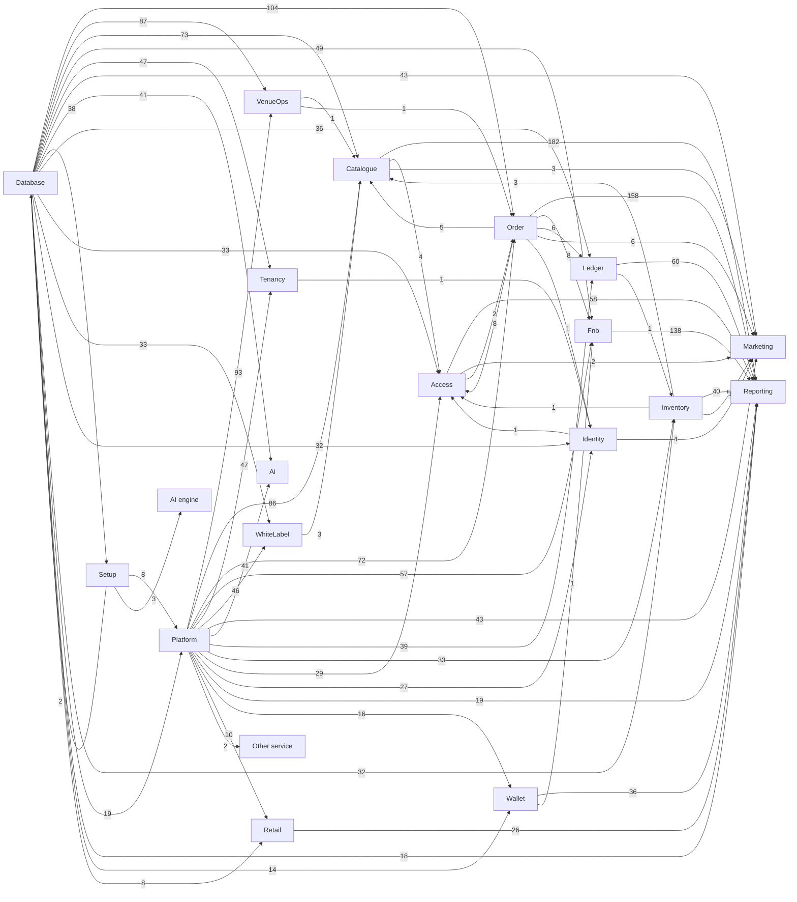

# How the Block A tickets are linked

> **Generated by** `tools/build-ticket-links.py` from `handoff/service-docs/tasks.csv` (the task sheet that becomes the OpenProject tickets). A ticket *waits on* another when it cannot be finished before the other is: that is the "follows" link in OpenProject and the order of each person's board.

**873 tasks, 4163 links.**

## 1. The build layers, in order

| Layer | Tasks | Build order | Waits on |
|---|---:|---|---|
| Setup | 9 | #2 to #210 | Database (38) |
| Onboarding | 12 | #4 to #15 | nothing |
| Database | 57 | #145 to #862 | Setup (2) |
| Platform | 20 | #152 to #200 | Setup (8), Database (2) |
| AI engine | 9 | #142 to #166 | Setup (3) |
| Services | 239 | #253 to #808 | Platform (494), Database (462) |
| Screens | 325 | #157 to #815 | Services (986), Setup (193) |
| Services (Venue Management) | 95 | #863 to #1054 | Services (246), Database (205), Platform (185) |
| Screens (Venue Management) | 107 | #871 to #1064 | Services (208), Services (Venue Management) (193), Setup (107) |

## 2. Service map

An arrow means the service on the right waits on the one on the left; the number is how many task links carry it. Screens are left out here (section 4).

## 3. Services: what each waits on and what waits on it

| Service | Owner | Tasks | Points | Build order | Waits on | Needed by |
|---|---|---:|---:|---|---|---|
| **Tenancy** | Tanmay Dukhande, Deep Khanvilkar | 22 | 106 | #253 to #885 | Database 47, Platform 47 | screens: Sell 36, screens: Venue Operations 23, screens: People & Access Rights 12, screens: Shift 3, screens: Food & Beverage 3, screens: Guests & Marketing 2 ... |
| **Identity** | Tanmay Dukhande, Deep Khanvilkar | 12 | 59 | #254 to #866 | Database 32, Platform 27, Order 1, Tenancy 1 | screens: Account & Self-Service 23, screens: Shift 7, screens: Membership, Loyalty & Value 6, Marketing 4, screens: People & Access Rights 4, screens: Branding & Localisation 3 ... |
| **Platform** | Chinmay Patkar, Sanket Keluskar | 10 | 40 | #257 to #880 | Platform 21, Database 17 | screens: Tenants & Licensing 5, screens: Developer & API 5, screens: Branding & Localisation 3, screens: Sell 2, screens: Venue Operations 2, Access 1 ... |
| **WhiteLabel** | Deep Khanvilkar, Tanmay Dukhande | 23 | 122 | #261 to #338 | Platform 46, Database 33 | screens: White Label 54, screens: Branding & Localisation 9, screens: Booking & Selection 8, screens: Engagement & Support 6, screens: Discovery & Browse 6, screens: Cart & Checkout 5 ... |
| **Wallet** | Sanket Keluskar, Pranay Shinde | 7 | 34 | #340 to #506 | Platform 16, Database 14 | Reporting 36, screens: Membership, Loyalty & Value 8, screens: Other 4, screens: Account & Self-Service 2, screens: Sell 1, Fnb 1 |
| **Catalogue** | Tanmay Dukhande, Chinmay Patkar | 43 | 211 | #342 to #921 | Platform 86, Database 73, Order 5, Inventory 3, WhiteLabel 3, VenueOps 1 | Reporting 182, screens: Sell 75, screens: Booking & Selection 32, screens: Discovery & Browse 28, screens: Commercial 22, screens: Membership, Loyalty & Value 11 ... |
| **Ledger** | Sanket Keluskar, Pranay Shinde | 18 | 75 | #353 to #944 | Platform 39, Database 36, Order 6 | Reporting 60, screens: Orders & Money 27, screens: Account & Self-Service 4, screens: Sell 3, screens: Ticketing 2, screens: Commercial 2 ... |
| **Order** | Pranay Shinde, Chinmay Patkar | 32 | 205 | #383 to #956 | Database 104, Platform 72, Access 2, VenueOps 1 | Reporting 158, screens: Orders & Money 60, screens: Sell 52, screens: Cart & Checkout 26, screens: Account & Self-Service 25, screens: Shift 18 ... |
| **Access** | Hrushikant Patkar, Chinmay Patkar | 15 | 88 | #415 to #940 | Database 33, Platform 29, Order 8, Catalogue 4, Identity 1, Inventory 1 | Reporting 58, screens: Access & Venue 28, screens: Account & Self-Service 12, screens: In-venue Services 5, screens: Venue Operations 5, screens: Sell 3 ... |
| **VenueOps** | Hrushikant Patkar, Chinmay Patkar | 48 | 221 | #517 to #1011 | Platform 93, Database 87 | screens: Access & Venue 46, screens: Transport 15, screens: Engagement & Support 12, screens: Booking & Selection 12, screens: In-venue Services 12, screens: Other 9 ... |
| **Other service** | Hrushikant Patkar | 1 | 1 | #523 to #523 | Platform 2 | - |
| **Inventory** | Hrushikant Patkar, Deep Khanvilkar | 17 | 95 | #524 to #1003 | Platform 33, Database 32, Ledger 1 | Reporting 40, screens: Stock & Supply 38, Catalogue 3, screens: Sell 3, screens: Stock on the Floor 1, Access 1 ... |
| **Fnb** | Hrushikant Patkar, Deep Khanvilkar | 28 | 154 | #547 to #1018 | Platform 57, Database 49, Order 8, Wallet 1 | Reporting 138, screens: Kitchen 30, screens: Sell 28, screens: In-venue Services 20, screens: Food & Beverage 17, screens: Stock & Supply 10 ... |
| **Retail** | Tanmay Dukhande, Sanket Keluskar | 5 | 27 | #584 to #1027 | Platform 10, Database 8 | Reporting 26, screens: Sell 16, screens: Retail 6, screens: Payment 2, screens: Orders & Money 2, screens: Shift 1 ... |
| **Ai** | Pranay Shinde, Chinmay Patkar | 21 | 93 | #687 to #1038 | Database 41, Platform 41 | screens: Engagement & Support 11, screens: Platform 8, screens: White Label 7, screens: AI 4, screens: Sell 3, screens: Membership, Loyalty & Value 2 ... |
| **Marketing** | Pranay Shinde, Sanket Keluskar | 22 | 119 | #713 to #1044 | Database 43, Platform 43, Order 6, Identity 4, Catalogue 3, Access 2, Inventory 1 | screens: Account & Self-Service 25, screens: Engagement & Support 24, screens: Membership, Loyalty & Value 12, screens: Sell 11, screens: Booking & Selection 7, screens: Cart & Checkout 5 ... |
| **Reporting** | Chinmay Patkar, Hrushikant Patkar | 10 | 41 | #798 to #1054 | Catalogue 182, Order 158, Fnb 138, Ledger 60, Access 58, Inventory 40, Wallet 36, Retail 26, Platform 19, Database 18 | screens: Venue Operations 14, screens: Sell 7, screens: Orders & Money 6, screens: Stock & Supply 4, screens: Analytics 3, screens: Reports 3 ... |

## 4. Module builds: the services each module's screens need

| App | Module | Screen tasks | Build order | Waits on services | Other |
|---|---|---:|---|---|---|
| Guest App — Mobile | System States | 2 | #157 to #282 | WhiteLabel 1 | Setup 2 |
| Venue Management — Back Office | People & Access Rights | 10 | #267 to #1055 | Tenancy 12, Identity 4, Ai 1, Reporting 1 | Setup 7 |
| Developer Portal | Developer & API | 3 | #269 to #299 | - | Platform 5 |
| TICVAI Web — Platform Console | Platform | 10 | #280 to #763 | Ai 8, Identity 1, Tenancy 1 | - |
| Venue Management — Back Office | Sell | 37 | #283 to #1048 | Catalogue 56, Tenancy 22, Fnb 11, Retail 6, Marketing 6, Reporting 4, Ai 3, Inventory 2, VenueOps 2, Order 2, WhiteLabel 1, Access 1, Identity 1 | Setup 26, Platform 2 |
| Guest Web — Storefront | Engagement & Support | 6 | #284 to #796 | Marketing 10, Ai 3, Fnb 2, WhiteLabel 2 | Setup 6 |
| Guest Web — Storefront | System States | 1 | #285 to #285 | WhiteLabel 1 | Setup 1 |
| Venue CMS — White Label | White Label | 23 | #287 to #784 | WhiteLabel 54, Catalogue 7, Ai 7, VenueOps 6, Marketing 5, Fnb 2, Order 2, Tenancy 1, Identity 1 | Setup 23 |
| Venue POS — Terminal and Tablet | Shift | 4 | #296 to #801 | Order 18, Identity 7, Tenancy 3, Retail 1, Reporting 1 | Setup 4 |
| TICVAI Web — Platform Console | Tenants & Licensing | 3 | #304 to #474 | Order 1 | Platform 5 |
| Guest App — Mobile | Discovery & Browse | 7 | #321 to #722 | Catalogue 17, Marketing 3, WhiteLabel 3, VenueOps 3, Access 1, Ai 1 | Setup 7 |
| Guest Web — Storefront | Support | 2 | #330 to #797 | Marketing 2, WhiteLabel 2 | Setup 2 |
| TICVAI Web — Platform Console | Branding & Localisation | 3 | #331 to #333 | WhiteLabel 9, Identity 3 | Setup 3, Platform 3 |
| Venue Management — Back Office | Engagement & Support | 6 | #339 to #779 | Marketing 5, WhiteLabel 1 | - |
| Venue Management | Other | 14 | #352 to #975 | VenueOps 9, Catalogue 4, Wallet 4, Order 1, Tenancy 1 | Setup 2 |
| Guest App — Mobile | High-Demand Access | 1 | #357 to #357 | Catalogue 1 | Setup 1 |
| Guest App — Mobile | Discovery | 1 | #358 to #358 | Catalogue 1 | Setup 1 |
| TICVAI Web — Platform Console | Commercial | 24 | #359 to #514 | Catalogue 22, Ledger 2, Order 2 | - |
| Venue Management — Back Office | Access & Venue | 41 | #363 to #1057 | VenueOps 46, Access 28, Catalogue 8, Order 5, Tenancy 2, Marketing 2, Reporting 1 | Setup 16 |
| Venue Management — Back Office | Orders & Money | 26 | #379 to #1050 | Order 60, Ledger 27, Reporting 6, Fnb 3, Retail 2, Tenancy 1, VenueOps 1, Access 1, Catalogue 1 | Setup 20 |
| Venue POS — Terminal and Tablet | Sell | 24 | #389 to #803 | Order 50, Catalogue 19, Fnb 17, Tenancy 14, Retail 10, Marketing 5, VenueOps 5, Ledger 3, Reporting 3, Access 2, Identity 1, Wallet 1, Inventory 1 | Setup 24 |
| TICVAI Web — Platform Console | Catalogue | 1 | #400 to #400 | Catalogue 1 | - |
| Venue Management — Back Office | Games & Rides | 1 | #414 to #414 | Catalogue 1 | - |
| Guest App — Mobile | Cart & Checkout | 3 | #445 to #622 | Order 13, Catalogue 2, WhiteLabel 2, VenueOps 1 | Setup 3 |
| Guest App — Mobile | Account & Self-Service | 14 | #446 to #791 | Order 16, Marketing 14, Identity 14, Access 10, Wallet 2, Ledger 2 | Setup 14 |
| Venue Management — Back Office | Venue Operations | 15 | #456 to #1064 | Tenancy 23, Reporting 14, VenueOps 9, Order 6, Access 5, Fnb 3, Ledger 2, Retail 1 | Setup 12, Platform 2 |
| Guest Web — Storefront | Cart & Checkout | 5 | #472 to #750 | Order 13, Marketing 5, Catalogue 3, WhiteLabel 3, VenueOps 1 | Setup 5 |
| Guest Web — Storefront | Account & Self-Service | 5 | #480 to #752 | Marketing 11, Identity 9, Order 9, Access 2, Ledger 2 | Setup 5 |
| Guest Web — Storefront | Ticketing | 3 | #481 to #634 | Order 7, Catalogue 3, Ledger 1, Fnb 1, VenueOps 1 | Setup 3 |
| Guest App — Mobile | Booking & Selection | 10 | #497 to #787 | Catalogue 19, Order 11, VenueOps 6, Marketing 4, WhiteLabel 3, Ai 1 | Setup 10 |
| Guest Web — Storefront | Booking & Selection | 7 | #498 to #794 | Catalogue 13, VenueOps 6, Order 5, WhiteLabel 5, Marketing 3, Ai 1 | Setup 7 |
| Guest Web — Storefront | High-Demand Access | 1 | #499 to #499 | Catalogue 1 | Setup 1 |
| Guest App — Mobile | Promotions | 1 | #501 to #501 | Catalogue 3 | Setup 1 |
| Guest Web — Storefront | Promotions | 1 | #502 to #502 | Catalogue 2 | Setup 1 |
| Guest App — Mobile | Ticketing | 4 | #503 to #538 | Order 5, Catalogue 1, Ledger 1 | Setup 4 |
| Guest App — Mobile | Membership, Loyalty & Value | 3 | #510 to #773 | Catalogue 4, Order 4, Wallet 3, Marketing 2, Identity 1, Ai 1 | Setup 3 |
| Guest Web — Storefront | Membership, Loyalty & Value | 5 | #515 to #795 | Marketing 10, Order 7, Catalogue 7, Wallet 5, Identity 5, Access 2, VenueOps 1, Ai 1 | Setup 5 |
| Venue Staff App — Operations | Operations | 1 | #522 to #522 | VenueOps 1 | - |
| Guest Web — Storefront | Discovery & Browse | 5 | #529 to #749 | Catalogue 11, VenueOps 4, WhiteLabel 3, Marketing 2, Access 1, Ai 1 | Setup 5 |
| Guest Web — Storefront | In-venue Services | 6 | #542 to #658 | Fnb 10, VenueOps 5, Order 3, Access 2, Catalogue 1 | Setup 6 |
| Guest App — Mobile | In-venue Services | 10 | #543 to #683 | Fnb 10, VenueOps 7, Order 4, Catalogue 3, Access 3, WhiteLabel 2 | Setup 10 |
| Venue Management — Back Office | Stock & Supply | 16 | #546 to #1063 | Inventory 38, Fnb 10, Reporting 4, Ai 2, Tenancy 1, Order 1 | Setup 15 |
| Guest App — Mobile | Engagement & Support | 12 | #574 to #792 | VenueOps 12, Marketing 9, Ai 8, Fnb 4, Catalogue 4, WhiteLabel 3, Order 3 | Setup 12 |
| Guest App — Mobile | Retail | 1 | #588 to #588 | Order 2, Retail 2, VenueOps 1 | Setup 1 |
| Guest Web — Storefront | Retail | 2 | #589 to #590 | Order 4, Retail 4 | Setup 2 |
| Venue Management — Back Office | Food & Beverage | 8 | #603 to #1060 | Fnb 17, Tenancy 3, Reporting 1 | Setup 6 |
| Venue Management — Back Office | Rentals | 7 | #620 to #712 | VenueOps 8, Ai 2, Tenancy 1 | - |
| Guest App — Mobile | In-Venue Experience | 2 | #641 to #686 | Fnb 2, Retail 1 | Setup 2 |
| Kitchen Display — Pass and Stations | Kitchen | 10 | #643 to #814 | Fnb 30, Reporting 2, Tenancy 1 | Setup 10 |
| Venue Staff App — Operations | Stock on the Floor | 2 | #652 to #653 | Fnb 2, Inventory 1 | - |
| Guest App — Mobile | Transport | 4 | #669 to #681 | VenueOps 9, Order 2 | Setup 4 |
| Guest Web — Storefront | Transport | 1 | #682 to #682 | VenueOps 6, Order 1 | Setup 1 |
| TICVAI Web — Platform Console | Analytics | 1 | #703 to #703 | Ai 1 | - |
| Venue Analytics — Cross-Domain Reporting | Analytics | 4 | #709 to #812 | Reporting 3, Ai 1 | - |
| Venue Management — Back Office | Guests & Marketing | 4 | #710 to #1062 | Marketing 4, Tenancy 2, Ai 2, Reporting 1, Identity 1 | Setup 3 |
| Venue POS — Terminal and Tablet | Payment | 1 | #729 to #729 | Order 2, Retail 2, Access 1, Marketing 1 | Setup 1 |
| Venue CMS — White Label | Policy | 2 | #747 to #748 | Marketing 2 | - |
| TICVAI Web — Platform Console | AI | 1 | #756 to #756 | Ai 4 | - |
| Guest App — Mobile | Support | 1 | #772 to #772 | Marketing 2 | Setup 1 |
| Venue Support — Agent Console | Overview | 1 | #780 to #780 | Marketing 1 | - |
| Guest App — Mobile | Marketing | 1 | #793 to #793 | Marketing 4 | Setup 1 |
| TICVAI Web — Platform Console | Security & Compliance | 1 | #809 to #809 | Reporting 1 | - |
| Venue POS — Terminal and Tablet | Reports | 1 | #815 to #815 | Reporting 3, Ledger 1 | Setup 1 |

## 5. Reports and other read-only work that waits for its data

A backend task that only reads waits for the tasks that write what it reads (decided 30 September).

| Task | Service | Waits on the data of |
|---|---|---|
| SVC-ACCESS-SYNC-1 | Access | Order |
| SVC-LEDGER-REPORTING-1 | Ledger | Order |
| SVC-CATALOGUE-PRODUCT-1 | Catalogue | Inventory |
| SVC-CATALOGUE-PRODUCT-2 | Catalogue | Inventory, WhiteLabel |
| SVC-ACCESS-ACCESS-3 | Access | Catalogue, Identity, Inventory, Order, Platform |
| SVC-CATALOGUE-CAPACITY-1 | Catalogue | Order, VenueOps |
| SVC-FNB-GUESTORDERING-2 | Fnb | Order, Wallet |
| SVC-MARKETING-MARKETING-2 | Marketing | Access, Catalogue, Inventory, Order |
| SVC-MARKETING-CONSENT-2 | Marketing | Access, Identity, Order |
| VM-IDENTITY-ADMINISTRATION-1 | Identity | Order, Platform, Tenancy |
| VM-CATALOGUE-PRICING-1 | Catalogue | Inventory |
| VM-ORDER-DRAFTED-1 | Order | Access |
| VM-LEDGER-REPORTING-1 | Ledger | Order |
| VM-ORDER-SYNC-1 | Order | Access, VenueOps |
| VM-INVENTORY-STOCK-1 | Inventory | Ledger |

## 6. Tasks that wait on nothing

Only setup and onboarding should be here.

| Task | Layer | Build order |
|---|---|---|
| SETUP-CI | Setup | #2 |
| SETUP-ENV | Setup | #3 |
| SETUP-ONBOARD-CHINMAY-PATKAR | Onboarding | #4 |
| SETUP-ONBOARD-CHITRANGI-MESTRY | Onboarding | #5 |
| SETUP-ONBOARD-DEEP-KHANVILKAR | Onboarding | #6 |
| SETUP-ONBOARD-HRUSHIKANT-PATKAR | Onboarding | #7 |
| SETUP-ONBOARD-KALPITA-MEJARI | Onboarding | #8 |
| SETUP-ONBOARD-PALLAVI-SAWANT | Onboarding | #9 |
| SETUP-ONBOARD-PRADNYA-YERAM | Onboarding | #10 |
| SETUP-ONBOARD-PRANAY-SHINDE | Onboarding | #11 |
| SETUP-ONBOARD-SANKET-KELUSKAR | Onboarding | #12 |
| SETUP-ONBOARD-SECOND-AI-ENGINEER | Onboarding | #13 |
| SETUP-ONBOARD-SURENDRA | Onboarding | #14 |
| SETUP-ONBOARD-TANMAY-DUKHANDE | Onboarding | #15 |

