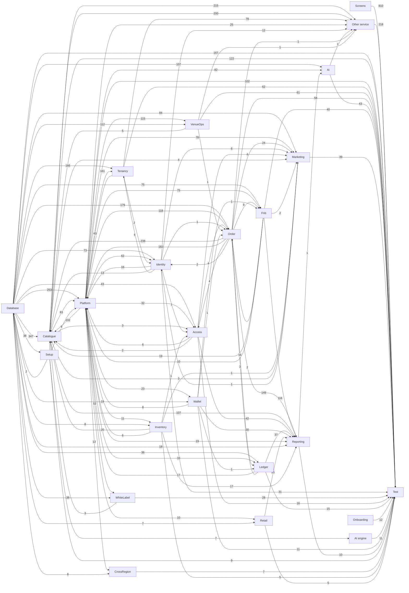

# How the Block A tickets are linked

> **Generated by** `tools/build-ticket-links.py` from `handoff/service-docs/tasks.csv` (the task sheet that becomes the OpenProject tickets). A ticket *waits on* another when it cannot be finished before the other is: that is the "follows" link in OpenProject and the order of each person's board.

**2043 tasks, 11150 links.**

## 1. The build layers, in order

| Layer | Tasks | Build order | Waits on |
|---|---:|---|---|
| Setup | 9 | #3 to #61 | Database (38) |
| Onboarding | 12 | #5 to #16 | nothing |
| Database | 167 | #23 to #2134 | Setup (2) |
| Platform | 20 | #31 to #85 | Setup (8), Database (2) |
| AI engine | 11 | #88 to #2199 | Setup (7) |
| Services | 245 | #79 to #1032 | Platform (499), Database (467) |
| Screens | 309 | #115 to #1037 | Services (975), Setup (196) |
| Services (Venue Management) | 608 | #129 to #2196 | Database (1104), Services (779), Platform (718), Setup (215) |
| Screens (Venue Management) | 501 | #130 to #2172 | Services (Venue Management) (667), Setup (501), Services (401) |
| Test | 161 | #62 to #2202 | Services (Venue Management) (608), Screens (Venue Management) (501), Screens (309), Services (245), Database (167), Platform (20), Onboarding (12), AI engine (11), Setup (9) |

## 2. Service map

An arrow means the service on the right waits on the one on the left; the number is how many task links carry it. Screens are left out here (section 4).

## 3. Services: what each waits on and what waits on it

| Service | Owner | Tasks | Points | Build order | Waits on | Needed by |
|---|---|---:|---:|---|---|---|
| **Other service** | Sanket Keluskar, Chinmay Patkar | 218 | 557 | #79 to #2196 | Setup 215, Catalogue 200, Tenancy 78, Platform 25, Identity 12, Order 1, Ai 1, VenueOps 1 | Test 218 |
| **Ai** | Hrushikant Patkar, Sanket Keluskar | 43 | 198 | #92 to #1843 | Database 107, Platform 82, Reporting 1 | Test 43, screens: Engagement & Support 15, screens: Platform 12, screens: White Label 8, screens: AI 6, screens: Analytics 6 ... |
| **Identity** | Pranay Shinde, Sanket Keluskar | 31 | 126 | #107 to #1388 | Database 73, Platform 62, Order 2, Tenancy 2, Marketing 1 | Test 31, screens: Account & Self-Service 22, screens: Tenants & Licensing 21, screens: Other 20, Platform 16, screens: Access & Identity 15 ... |
| **Order** | Pranay Shinde, Sanket Keluskar | 58 | 322 | #113 to #2077 | Database 179, Platform 118, Access 4, Fnb 2, Ledger 2, VenueOps 1, Identity 1, Wallet 1 | Catalogue 238, Platform 182, Reporting 149, screens: Sell 58, Test 58, Marketing 24 ... |
| **Marketing** | Pranay Shinde, Pallavi Sawant | 39 | 192 | #114 to #2051 | Database 84, Platform 78, Order 24, Identity 6, Access 4, Catalogue 4, Fnb 2, Inventory 1 | screens: Engagement & Support 40, Test 39, screens: Account & Self-Service 22, screens: Membership, Loyalty & Value 16, screens: White Label 8, screens: Sell 8 ... |
| **Platform** | Sanket Keluskar, Pallavi Sawant | 82 | 352 | #147 to #2061 | Database 251, Order 182, Platform 149, Catalogue 83, Tenancy 43, Ledger 17, Identity 16, Fnb 10, Wallet 8, Inventory 6, Access 6 | screens: Tenants & Licensing 140, Test 82, screens: Other 41, Tenancy 36, screens: Partners 27, screens: Sell 23 ... |
| **WhiteLabel** | Deep Khanvilkar, Hrushikant Patkar | 28 | 136 | #148 to #1772 | Platform 53, Database 38 | screens: White Label 66, Test 28, screens: Engagement & Support 17, screens: Branding & Localisation 9, screens: Discovery & Browse 8, screens: Booking & Selection 8 ... |
| **Tenancy** | Hrushikant Patkar, Sanket Keluskar | 62 | 253 | #161 to #2086 | Database 166, Platform 161, Identity 6 | Other service 78, Test 62, screens: Venue Operations 59, Platform 43, screens: Sell 31, screens: Other 23 ... |
| **VenueOps** | Tanmay Dukhande, Chinmay Patkar | 61 | 286 | #197 to #1743 | Platform 115, Database 112 | Test 61, screens: Media Library 56, screens: Access & Venue 18, screens: Other 17, screens: Transport 15, screens: Operations 15 ... |
| **Catalogue** | Tanmay Dukhande, Deep Khanvilkar | 122 | 556 | #213 to #2179 | Database 347, Order 238, Platform 232, Inventory 20, Fnb 19, Identity 13, VenueOps 5, WhiteLabel 3, Marketing 3, Access 2 | Other service 200, screens: Sell 127, Test 122, Reporting 107, Platform 83, screens: Other 68 ... |
| **Access** | Hrushikant Patkar, Sanket Keluskar | 16 | 101 | #216 to #1831 | Database 43, Platform 32, Order 4, Catalogue 3, Identity 1, Inventory 1 | Reporting 42, screens: Access & Venue 18, Test 16, screens: Account & Self-Service 13, Platform 6, screens: In-venue Services 5 ... |
| **Inventory** | Deep Khanvilkar, Sanket Keluskar | 5 | 19 | #226 to #887 | Platform 11, Database 8 | Catalogue 20, Reporting 17, Platform 6, Test 5, Access 1, Marketing 1 ... |
| **Fnb** | Tanmay Dukhande, Deep Khanvilkar | 40 | 205 | #302 to #1833 | Database 75, Platform 75, Order 9, Wallet 1 | Reporting 116, Test 40, screens: Other 28, screens: Kitchen 26, screens: Sell 23, Catalogue 19 ... |
| **Wallet** | Pranay Shinde, Sanket Keluskar | 11 | 53 | #324 to #2099 | Platform 23, Database 19 | Reporting 30, Test 11, screens: Membership, Loyalty & Value 8, Platform 8, screens: Other 6, screens: Sell 3 ... |
| **Retail** | Pranay Shinde, Chinmay Patkar | 5 | 28 | #371 to #650 | Platform 10, Database 7 | Reporting 25, screens: Sell 12, screens: Retail 7, Test 5, screens: Payment 3, screens: Other 2 ... |
| **Ledger** | Tanmay Dukhande, Sanket Keluskar | 15 | 72 | #485 to #1353 | Database 36, Platform 33, Order 16, Wallet 1 | Reporting 37, Platform 17, Test 15, screens: Orders & Money 11, screens: Sell 5, screens: Account & Self-Service 4 ... |
| **CrossRegion** | Pallavi Sawant, Sanket Keluskar | 7 | 29 | #586 to #1288 | Platform 13, Database 8 | Test 7, screens: Access 2 |
| **Reporting** | Hrushikant Patkar, Sanket Keluskar | 10 | 41 | #651 to #1098 | Order 149, Fnb 116, Catalogue 107, Access 42, Ledger 37, Wallet 30, Retail 25, Platform 19, Database 18, Inventory 17 | Test 10, screens: Analytics 5, screens: Sell 3, screens: Reports 3, screens: Orders & Money 3, screens: Venue Operations 2 ... |

## 4. Module builds: the services each module's screens need

| App | Module | Screen tasks | Build order | Waits on services | Other |
|---|---|---:|---|---|---|
| Guest Web — Storefront | Account & Self-Service | 5 | #115 to #933 | Identity 9, Marketing 9, Order 8, Access 3, Ledger 2, Wallet 1 | Setup 5 |
| Guest App — Mobile | Account & Self-Service | 14 | #119 to #947 | Order 13, Identity 13, Marketing 13, Access 10, Ledger 2, Wallet 2 | Setup 14 |
| Venue Staff App — Operations | Operations | 11 | #130 to #1788 | VenueOps 15, Identity 13, Catalogue 3, Tenancy 2, Inventory 1, Marketing 1 | Setup 11 |
| Venue Scanner — Access Control | Access | 4 | #133 to #1282 | Identity 5, Access 3, CrossRegion 2, Tenancy 1, Order 1 | Setup 4 |
| Venue POS — Terminal and Tablet | Shift | 4 | #139 to #780 | Order 11, Identity 7, Tenancy 3 | Setup 4 |
| Venue CMS — White Label | White Label | 23 | #141 to #954 | WhiteLabel 66, Marketing 8, Ai 8, Catalogue 6, VenueOps 6, Identity 2, Order 1, Tenancy 1 | Setup 23 |
| Venue Support — Agent Console | Access & Availability | 1 | #144 to #144 | Identity 6 | Setup 1 |
| TICVAI Web — Platform Console | Access & Identity | 4 | #155 to #1113 | Identity 15 | Setup 4, Platform 2 |
| Partner Web — Reseller Portal | Access & Account | 4 | #157 to #1702 | Identity 10 | Setup 4, Platform 5 |
| Venue POS — Terminal and Tablet | Sell | 26 | #165 to #1034 | Order 53, Fnb 20, Catalogue 17, Retail 10, Tenancy 8, Marketing 8, Ledger 5, Reporting 3, VenueOps 2, Wallet 2, Access 1, Inventory 1 | Setup 26 |
| TICVAI Web — Platform Console | Tenants & Licensing | 88 | #173 to #1700 | Identity 21, Tenancy 6, WhiteLabel 2, Order 1, Ledger 1 | Setup 85, Platform 140 |
| TICVAI Web — Platform Console | Overview & Health | 4 | #177 to #1394 | - | Setup 4, Platform 11 |
| Guest App — Mobile | Discovery & Browse | 7 | #230 to #920 | Catalogue 15, WhiteLabel 4, Marketing 3, VenueOps 3, Access 1, Ai 1 | Setup 7 |
| TICVAI Web — Platform Console | Branding & Localisation | 4 | #248 to #1274 | WhiteLabel 9, Identity 8, Tenancy 2 | Setup 4, Platform 4 |
| Guest Web — Storefront | Engagement & Support | 6 | #250 to #972 | Marketing 13, WhiteLabel 3, Ai 3, Order 1, Fnb 1 | Setup 6 |
| Guest Web — Storefront | System States | 1 | #251 to #251 | WhiteLabel 1 | Setup 1 |
| Guest Web — Storefront | Support | 2 | #252 to #930 | WhiteLabel 3, Marketing 2 | Setup 2 |
| Guest App — Mobile | Engagement & Support | 12 | #253 to #978 | Marketing 14, VenueOps 12, Ai 10, WhiteLabel 4, Order 4, Catalogue 4, Fnb 3 | Setup 12 |
| Guest App — Mobile | System States | 2 | #254 to #255 | WhiteLabel 2 | Setup 2 |
| Venue Management — Back Office | Platform | 3 | #295 to #300 | Tenancy 3, Identity 1 | - |
| Venue Management — Back Office | People & Access Rights | 9 | #297 to #1573 | Tenancy 12, Identity 11, Ai 1 | Setup 7 |
| Venue Management — Back Office | Sell | 83 | #298 to #2172 | Catalogue 107, Tenancy 23, Order 5, Identity 5, Fnb 3, Retail 2, Ai 2, Wallet 1, VenueOps 1, WhiteLabel 1 | Setup 69, Platform 23 |
| Venue Management | Other | 64 | #301 to #2152 | Catalogue 68, Fnb 28, Tenancy 23, VenueOps 17, Identity 17, Wallet 6, Ai 2, Retail 2, WhiteLabel 2, Reporting 2, Order 2, Access 1, Marketing 1 | Setup 51, Platform 15 |
| Venue Management — Back Office | Food & Beverage | 4 | #303 to #908 | Fnb 13, Retail 1, Tenancy 1 | Setup 2 |
| Developer Portal | Developer & API | 8 | #313 to #1714 | - | Platform 18, Setup 5 |
| Venue Management — Back Office | Access & Venue | 45 | #340 to #1856 | Access 18, VenueOps 18, Tenancy 10, Order 4, Catalogue 2, Ai 1, Reporting 1, Marketing 1 | Setup 23, Platform 4 |
| Venue Management — Back Office | Commercial | 5 | #343 to #647 | Ledger 2, Order 2, Catalogue 1 | - |
| Guest Web — Storefront | High-Demand Access | 1 | #380 to #380 | Catalogue 2 | Setup 1 |
| Guest Web — Storefront | Discovery & Browse | 5 | #385 to #818 | Catalogue 10, VenueOps 4, WhiteLabel 4, Marketing 2, Access 1, Ai 1 | Setup 5 |
| Guest Web — Storefront | Booking & Selection | 7 | #386 to #971 | Catalogue 13, VenueOps 6, Order 5, WhiteLabel 5, Marketing 3, Ai 1 | Setup 7 |
| Guest Web — Storefront | Membership, Loyalty & Value | 5 | #387 to #936 | Marketing 11, Order 6, Identity 5, Catalogue 5, Wallet 5, Access 2, Ai 1, VenueOps 1 | Setup 5 |
| Guest App — Mobile | High-Demand Access | 1 | #395 to #395 | Catalogue 2 | Setup 1 |
| Guest App — Mobile | Discovery | 1 | #396 to #396 | Catalogue 1 | Setup 1 |
| Guest App — Mobile | Booking & Selection | 10 | #400 to #977 | Catalogue 19, Order 10, VenueOps 6, WhiteLabel 3, Marketing 2, Ai 1 | Setup 10 |
| Guest Web — Storefront | Promotions | 1 | #410 to #410 | Catalogue 2 | Setup 1 |
| Guest App — Mobile | Promotions | 1 | #413 to #413 | Catalogue 3 | Setup 1 |
| Guest Web — Storefront | Cart & Checkout | 5 | #443 to #931 | Order 11, Marketing 4, WhiteLabel 4, Catalogue 3, Identity 1, VenueOps 1 | Setup 5 |
| Guest Web — Storefront | Ticketing | 3 | #447 to #629 | Order 7, Catalogue 3, Ledger 1, Fnb 1, VenueOps 1 | Setup 3 |
| Guest Web — Storefront | Retail | 2 | #451 to #754 | Retail 4, Order 3 | Setup 2 |
| Guest App — Mobile | Cart & Checkout | 3 | #458 to #631 | Order 11, WhiteLabel 3, Catalogue 2, VenueOps 1, Identity 1 | Setup 3 |
| Guest App — Mobile | Ticketing | 4 | #461 to #594 | Order 7, Catalogue 1, Ledger 1 | Setup 4 |
| Guest App — Mobile | Membership, Loyalty & Value | 3 | #550 to #944 | Marketing 5, Order 4, Wallet 3, Catalogue 3, VenueOps 1, Identity 1, Ai 1 | Setup 3 |
| Guest App — Mobile | In-venue Services | 10 | #568 to #833 | Fnb 10, VenueOps 7, Order 3, Access 3, Catalogue 2, WhiteLabel 2 | Setup 10 |
| Guest Web — Storefront | In-venue Services | 6 | #574 to #829 | Fnb 9, VenueOps 5, Order 2, Access 2 | Setup 6 |
| Venue Management — Back Office | Venue Operations | 39 | #612 to #1676 | Tenancy 59, Fnb 3, Ai 3, Access 2, Reporting 2, Order 2, Retail 1 | Setup 36, Platform 1 |
| Venue Management — Back Office | Rentals | 20 | #632 to #2097 | VenueOps 10, Catalogue 8, Tenancy 3, Ai 2 | Setup 12, Platform 1 |
| Venue Management — Back Office | Orders & Money | 9 | #645 to #913 | Order 17, Ledger 11, Reporting 3, Fnb 2, Tenancy 1, Retail 1 | Setup 3 |
| Venue Analytics — Cross-Domain Reporting | Analytics | 5 | #655 to #1270 | Reporting 5, Identity 3, Tenancy 1 | Setup 2 |
| Guest Web — Storefront | Transport | 1 | #659 to #659 | VenueOps 6, Order 1 | Setup 1 |
| Guest App — Mobile | Transport | 4 | #662 to #665 | VenueOps 9, Order 2 | Setup 4 |
| Guest App — Mobile | In-Venue Experience | 2 | #703 to #758 | Fnb 1, Retail 1 | Setup 2 |
| Kitchen Display — Pass and Stations | Kitchen | 10 | #713 to #1037 | Fnb 26, Reporting 2 | Setup 10 |
| Venue Staff App — Operations | Floor Service | 2 | #728 to #730 | Fnb 14, Order 1 | Setup 2 |
| Guest App — Mobile | Retail | 1 | #757 to #757 | Retail 3, Order 1 | Setup 1 |
| Venue POS — Terminal and Tablet | Payment | 1 | #763 to #763 | Retail 3, Order 2, Access 1, Marketing 1 | Setup 1 |
| Venue Management — Back Office | Games & Rides | 9 | #806 to #2049 | Catalogue 3, VenueOps 1 | Setup 9 |
| Venue Staff App — Operations | Stock on the Floor | 2 | #877 to #878 | Fnb 2, Inventory 1 | - |
| Venue Management — Back Office | Stock & Supply | 2 | #888 to #1161 | Inventory 1 | Setup 1 |
| Guest App — Mobile | Support | 1 | #941 to #941 | Marketing 2 | Setup 1 |
| Guest App — Mobile | Marketing | 1 | #946 to #946 | Marketing 4 | Setup 1 |
| Venue Support — Agent Console | Conversations | 2 | #966 to #968 | Marketing 7 | Setup 2 |
| Guest Kiosk — Self-Service | AI | 1 | #981 to #981 | Ai 2, Catalogue 2, Marketing 1 | Setup 1 |
| Venue Management — Back Office | Engagement & Support | 27 | #987 to #2052 | Marketing 13, WhiteLabel 10, Ai 2, Identity 2, Tenancy 2 | Setup 17 |
| Venue CMS — White Label | Policy | 2 | #997 to #998 | Marketing 2 | - |
| Venue Support — Agent Console | Overview | 1 | #1001 to #1001 | Marketing 1 | - |
| Venue Management — Back Office | Guests & Marketing | 2 | #1007 to #1169 | Tenancy 3, Ai 2, Identity 1 | Setup 1 |
| TICVAI Web — Platform Console | AI | 2 | #1021 to #1024 | Ai 4 | - |
| TICVAI Web — Platform Console | Analytics | 5 | #1022 to #1118 | Ai 6, Identity 6 | Setup 3, Platform 3 |
| TICVAI Web — Platform Console | Platform | 10 | #1025 to #1844 | Ai 12, Identity 10, Tenancy 4 | Setup 5, Platform 5 |
| Venue POS — Terminal and Tablet | Reports | 1 | #1033 to #1033 | Reporting 3 | Setup 1 |
| Venue CMS — White Label | Media Library | 40 | #1092 to #1766 | VenueOps 56, Identity 2, Ai 1 | Setup 40 |
| TICVAI Web — Platform Console | Commercial | 1 | #1121 to #1121 | Identity 2, Order 1, Ledger 1 | Setup 1, Platform 1 |
| TICVAI Sign-up — Onboarding & Purchase | Onboarding & Assessment | 10 | #1140 to #1503 | Identity 1 | Setup 10, Platform 10 |
| Partner Web — Reseller Portal | Partners | 22 | #1151 to #1936 | Identity 4 | Setup 22, Platform 27 |
| Venue Management — Back Office | Operations | 5 | #1232 to #1246 | Tenancy 6 | Setup 5 |
| Venue Management — Back Office | Setup & Go-Live | 19 | #1256 to #2127 | Catalogue 3, Tenancy 2 | Setup 19, Platform 15 |
| TICVAI Web — Platform Console | Releases & Environments | 8 | #1294 to #1320 | Identity 4 | Setup 8, Platform 16 |
| TICVAI Web — Platform Console | Platform Ops | 1 | #1306 to #1306 | - | Setup 1, Platform 2 |
| TICVAI Web — Platform Console | Security & Compliance | 1 | #1315 to #1315 | - | Setup 1, Platform 2 |
| TICVAI Web — Platform Console | Infrastructure & Resilience | 4 | #1316 to #1415 | - | Setup 4, Platform 7 |
| TICVAI Web — Platform Console | Support & Communications | 2 | #1317 to #1318 | - | Setup 2, Platform 2 |
| TICVAI Web | Other | 2 | #1398 to #1472 | Identity 3 | Setup 2, Platform 17 |
| TICVAI Sign-up — Onboarding & Purchase | Purchase & Activation | 6 | #1495 to #1517 | - | Setup 6, Platform 5 |
| TICVAI Sign-up — Onboarding & Purchase | Package Builder | 7 | #1504 to #1513 | - | Setup 7, Platform 8 |
| Partner Web — Reseller Portal | Booking & Quotes | 1 | #1527 to #1527 | - | Setup 1, Platform 2 |
| Partner Web — Reseller Portal | Reports & Settlement | 1 | #1534 to #1534 | - | Setup 1, Platform 1 |
| Developer | Other | 2 | #1706 to #1707 | - | Setup 2, Platform 9 |
| Guest Kiosk — Self-Service | Sell | 3 | #1769 to #1783 | Catalogue 3, WhiteLabel 1 | Setup 3 |
| Partner Web — Reseller Portal | Inventory & Pricing | 2 | #2130 to #2131 | Catalogue 6 | Setup 2 |

## 5. Reports and other read-only work that waits for its data

A backend task that only reads waits for the tasks that write what it reads (decided 30 September).

| Task | Service | Waits on the data of |
|---|---|---|
| SVC-CATALOGUE-PRODUCT-2 | Catalogue | Inventory, WhiteLabel |
| SVC-CATALOGUE-PRODUCT-1 | Catalogue | Inventory |
| SVC-CATALOGUE-CAPACITY-1 | Catalogue | Order, VenueOps |
| SVC-ACCESS-ACCESS-3 | Access | Catalogue, Identity, Inventory, Order, Platform |
| SVC-MARKETING-CONSENT-2 | Marketing | Access, Identity, Order |
| SVC-ORDER-DRAFTED-1 | Order | Access |
| SVC-LEDGER-REPORTING-2 | Ledger | Order, Wallet |
| SVC-FNB-GUESTORDERING-2 | Fnb | Order, Wallet |
| VM-ORDER-DRAFTED-1 | Order | Access, Fnb, Identity, Ledger, Wallet |
| VM-ORDER-SYNC-1 | Order | Access, VenueOps |
| SVC-MARKETING-MARKETING-3 | Marketing | Access, Catalogue, Inventory, Order |
| SVC-IDENTITY-IDENTITY-6 | Identity | Marketing |
| VM-ADM-247 | Other service | Identity, Tenancy |
| VM-ADM-340 | Other service | Identity |
| VM-IDENTITY-ADMINISTRATION-2 | Identity | Order, Platform, Tenancy |
| VM-ADM-582 | Other service | Tenancy |
| VM-ADM-584 | Other service | Tenancy |
| VM-ADM-587 | Other service | Tenancy, VenueOps |
| VM-ADM-581 | Other service | Order, Tenancy |
| VM-ADM-346 | Other service | Tenancy |
| VM-PTR-026 | Other service | Platform |
| VM-PTR-029 | Other service | Identity, Platform |
| VM-PTR-047 | Other service | Platform |
| VM-ADM-239 | Other service | Tenancy |
| VM-ADM-241 | Other service | Tenancy |
| VM-ADM-245 | Other service | Tenancy |
| VM-ADM-145 | Other service | Catalogue, Tenancy |
| SVC-TENANCY-ANALYTICS-1 | Tenancy | Platform |
| SVC-TENANCY-APPROVALS-9 | Tenancy | Identity, Platform |
| VM-ADM-246 | Other service | Tenancy |
| VM-ADM-253 | Other service | Tenancy |
| VM-ADM-254 | Other service | Tenancy |
| VM-ADM-256 | Other service | Tenancy |
| VM-ADM-320 | Other service | Tenancy |
| VM-ADM-322 | Other service | Tenancy |
| VM-ADM-324 | Other service | Tenancy |
| VM-ADM-325 | Other service | Tenancy |
| VM-ADM-326 | Other service | Tenancy |
| VM-ADM-250 | Other service | Tenancy |
| VM-ADM-251 | Other service | Tenancy |
| VM-ADM-255 | Other service | Tenancy |
| VM-ADM-257 | Other service | Tenancy |
| SVC-TENANCY-APPROVALS-5 | Tenancy | Identity, Platform |
| VM-ADM-238 | Other service | Tenancy |
| VM-ADM-240 | Other service | Tenancy |
| VM-ADM-244 | Other service | Tenancy |
| VM-ADM-248 | Other service | Tenancy |
| VM-ADM-319 | Other service | Catalogue, Tenancy |
| VM-ADM-323 | Other service | Tenancy |
| VM-ADM-327 | Other service | Tenancy |
| VM-ADM-328 | Other service | Tenancy |
| VM-ADM-330 | Other service | Tenancy |
| VM-ADM-331 | Other service | Tenancy |
| VM-ADM-332 | Other service | Tenancy |
| VM-ADM-333 | Other service | Tenancy |
| VM-ADM-334 | Other service | Tenancy |
| VM-ADM-335 | Other service | Tenancy |
| VM-ADM-336 | Other service | Tenancy |
| VM-ADM-341 | Other service | Tenancy |
| VM-ADM-343 | Other service | Tenancy |
| VM-ADM-345 | Other service | Tenancy |
| VM-ADM-347 | Other service | Tenancy |
| VM-ADM-350 | Other service | Tenancy |
| VM-ADM-352 | Other service | Platform, Tenancy |
| VM-ADM-355 | Other service | Tenancy |
| VM-ADM-329 | Other service | Tenancy |
| VM-ADM-338 | Other service | Tenancy |
| VM-ADM-349 | Other service | Tenancy |
| VM-ADM-337 | Other service | Tenancy |
| VM-ADM-339 | Other service | Tenancy |
| VM-ADM-348 | Other service | Tenancy |
| VM-ADM-357 | Other service | Tenancy |
| SVC-TENANCY-APPROVALS-11 | Tenancy | Identity, Platform |
| VM-ADM-367 | Other service | Tenancy |
| VM-ADM-358 | Other service | Tenancy |
| VM-ADM-359 | Other service | Tenancy |
| VM-ADM-360 | Other service | Tenancy |
| VM-ADM-361 | Other service | Tenancy |
| VM-ADM-362 | Other service | Tenancy |
| VM-ADM-363 | Other service | Tenancy |
| VM-ADM-364 | Other service | Tenancy |
| VM-ADM-366 | Other service | Ai, Tenancy |
| VM-ADM-368 | Other service | Tenancy |
| VM-ADM-356 | Other service | Identity, Platform |
| VM-ADM-351 | Other service | Platform |
| SVC-PLATFORM-DRAFTED-11 | Platform | Fnb, Identity, Ledger, Order, Tenancy, Wallet |
| SVC-PLATFORM-DRAFTED-12 | Platform | Identity, Order, Tenancy, Wallet |
| SVC-AI-AUDIT-1 | Ai | Reporting |
| VM-ADM-119 | Other service | Catalogue |
| VM-ADM-120 | Other service | Catalogue |
| VM-ADM-123 | Other service | Catalogue |
| VM-ADM-124 | Other service | Catalogue |
| VM-ADM-125 | Other service | Catalogue |
| VM-ADM-052 | Other service | Catalogue |
| VM-ADM-129 | Other service | Catalogue, Tenancy |
| VM-ADM-131 | Other service | Catalogue |
| VM-ADM-127 | Other service | Catalogue |
| VM-ADM-132 | Other service | Catalogue |
| VM-ADM-135 | Other service | Catalogue |
| VM-ADM-136 | Other service | Catalogue |
| VM-ADM-130 | Other service | Catalogue, Tenancy |
| VM-ADM-133 | Other service | Catalogue |
| VM-ADM-134 | Other service | Catalogue |
| VM-ADM-055 | Other service | Catalogue |
| VM-ADM-070 | Other service | Catalogue |
| VM-ADM-072 | Other service | Catalogue |
| VM-ADM-075 | Other service | Catalogue |
| VM-ADM-076 | Other service | Catalogue |
| VM-ADM-079 | Other service | Catalogue |
| VM-ADM-080 | Other service | Catalogue |
| VM-ADM-083 | Other service | Catalogue, Tenancy |
| VM-ADM-084 | Other service | Catalogue |
| VM-ADM-092 | Other service | Catalogue |
| VM-ADM-093 | Other service | Catalogue |
| VM-ADM-094 | Other service | Catalogue |
| VM-ADM-100 | Other service | Catalogue |
| VM-ADM-102 | Other service | Catalogue |
| VM-ADM-107 | Other service | Catalogue |
| VM-CATALOGUE-PRICING-1 | Catalogue | Fnb, Inventory |
| SVC-CATALOGUE-DRAFTED-18 | Catalogue | Fnb, Identity, Inventory, Order, Platform |
| VM-ADM-078 | Other service | Catalogue |
| VM-ADM-081 | Other service | Catalogue |
| VM-ADM-085 | Other service | Catalogue |
| VM-ADM-086 | Other service | Catalogue |
| SVC-PLATFORM-DRAFTED-3 | Platform | Catalogue, Fnb, Identity, Inventory, Ledger, Order, Tenancy, Wallet |
| VM-PTR-035 | Other service | Identity, Platform |
| VM-PTR-036 | Other service | Identity, Platform |
| VM-PTR-039 | Other service | Platform |
| VM-PTR-048 | Other service | Identity, Platform |
| SVC-PLATFORM-DRAFTED-14 | Platform | Catalogue, Fnb, Identity, Inventory, Order, Tenancy, Wallet |
| SVC-PLATFORM-DRAFTED-15 | Platform | Catalogue, Identity, Inventory, Ledger, Order, Tenancy, Wallet |
| SVC-CATALOGUE-DRAFTED-9 | Catalogue | Fnb, Inventory |
| VM-ADM-050 | Other service | Catalogue |
| VM-ADM-053 | Other service | Catalogue |
| VM-ADM-126 | Other service | Catalogue |
| VM-ADM-128 | Other service | Catalogue |
| SVC-CATALOGUE-DRAFTED-21 | Catalogue | Identity, Inventory, Order, Platform, VenueOps |
| VM-ADM-095 | Other service | Catalogue |
| VM-ADM-096 | Other service | Catalogue |
| VM-ADM-099 | Other service | Catalogue |
| VM-ADM-103 | Other service | Catalogue |
| SVC-CATALOGUE-DRAFTED-22 | Catalogue | Fnb, Identity, Inventory, Order, Platform |
| VM-ADM-098 | Other service | Catalogue |
| VM-ADM-101 | Other service | Catalogue |
| VM-ADM-105 | Other service | Catalogue |
| VM-ADM-106 | Other service | Catalogue |
| VM-ADM-114 | Other service | Catalogue |
| VM-ADM-115 | Other service | Catalogue |
| VM-ADM-259 | Other service | Catalogue |
| VM-ADM-260 | Other service | Catalogue |
| VM-ADM-109 | Other service | Catalogue |
| VM-ADM-110 | Other service | Catalogue |
| VM-ADM-111 | Other service | Catalogue |
| VM-ADM-261 | Other service | Catalogue |
| VM-ADM-108 | Other service | Catalogue |
| SVC-CATALOGUE-DRAFTED-26 | Catalogue | Identity, Inventory, Order, Platform, VenueOps |
| SVC-CATALOGUE-DRAFTED-27 | Catalogue | Fnb, Identity, Inventory, Order, Platform |
| VM-ADM-112 | Other service | Catalogue |
| VM-ADM-113 | Other service | Catalogue |
| VM-ADM-116 | Other service | Catalogue |
| VM-ADM-117 | Other service | Catalogue |
| VM-ADM-258 | Other service | Catalogue |
| VM-ADM-262 | Other service | Catalogue |
| VM-ADM-263 | Other service | Catalogue |
| VM-ADM-264 | Other service | Catalogue |
| SVC-CATALOGUE-DRAFTED-30 | Catalogue | Identity, Inventory, Order, Platform, VenueOps |
| VM-ADM-265 | Other service | Catalogue |
| VM-ADM-266 | Other service | Catalogue |
| VM-ADM-267 | Other service | Catalogue |
| VM-ADM-268 | Other service | Catalogue |
| VM-ADM-269 | Other service | Catalogue |
| VM-ADM-272 | Other service | Catalogue |
| VM-ADM-277 | Other service | Catalogue |
| SVC-CATALOGUE-DRAFTED-4 | Catalogue | Fnb, Identity, Inventory, Order, Platform |
| VM-ADM-118 | Other service | Catalogue |
| VM-ADM-122 | Other service | Catalogue |
| SVC-CATALOGUE-DRAFTED-8 | Catalogue | Fnb, Inventory |
| VM-ADM-048 | Other service | Catalogue |
| VM-ADM-054 | Other service | Catalogue |
| VM-ADM-137 | Other service | Catalogue |
| SVC-CATALOGUE-DRAFTED-12 | Catalogue | Inventory |
| SVC-CATALOGUE-DRAFTED-14 | Catalogue | Fnb, Inventory |
| VM-ADM-056 | Other service | Catalogue |
| VM-ADM-059 | Other service | Catalogue |
| VM-ADM-060 | Other service | Catalogue |
| VM-ADM-062 | Other service | Catalogue |
| VM-ADM-063 | Other service | Catalogue |
| VM-ADM-065 | Other service | Catalogue |
| VM-ADM-071 | Other service | Catalogue |
| VM-ADM-057 | Other service | Catalogue |
| VM-ADM-058 | Other service | Catalogue |
| VM-ADM-061 | Other service | Catalogue |
| VM-ADM-064 | Other service | Catalogue |
| VM-ADM-066 | Other service | Catalogue |
| VM-ADM-067 | Other service | Catalogue |
| VM-ADM-088 | Other service | Catalogue |
| VM-ADM-089 | Other service | Catalogue |
| VM-ADM-104 | Other service | Catalogue |
| SVC-CATALOGUE-DRAFTED-31 | Catalogue | Identity, Inventory, Order, Platform |
| VM-ADM-273 | Other service | Catalogue |
| VM-ADM-274 | Other service | Catalogue |
| VM-ADM-275 | Other service | Catalogue |
| VM-ADM-276 | Other service | Catalogue |
| SVC-CATALOGUE-CATALOGUE-6 | Catalogue | Identity, Inventory, Order, Platform |
| VM-ADM-090 | Other service | Catalogue |
| VM-ADM-091 | Other service | Catalogue |
| SVC-MARKETING-GUESTS-1 | Marketing | Access, Catalogue, Fnb, Identity, Order, Platform |
| SVC-PLATFORM-DRAFTED-4 | Platform | Access, Catalogue, Identity, Inventory, Order, Tenancy, Wallet |
| VM-PTR-037 | Other service | Platform |
| SVC-PLATFORM-DRAFTED-7 | Platform | Access, Catalogue, Fnb, Identity, Inventory, Order, Tenancy, Wallet |
| SVC-PLATFORM-DRAFTED-8 | Platform | Access, Catalogue, Fnb, Identity, Inventory, Order, Wallet |
| SVC-CATALOGUE-DRAFTED-17 | Catalogue | Access, Fnb, Identity, Inventory, Order, Platform |
| VM-ADM-073 | Other service | Catalogue |
| VM-ADM-074 | Other service | Catalogue |
| VM-ADM-082 | Other service | Catalogue |
| VM-ADM-087 | Other service | Catalogue |
| SVC-CATALOGUE-DRAFTED-32 | Catalogue | Fnb, Inventory, Order, VenueOps |
| VM-ADM-270 | Other service | Catalogue |
| VM-ADM-271 | Other service | Catalogue |
| VM-ADM-365 | Other service | Catalogue |
| SVC-CATALOGUE-UPSELL-2 | Catalogue | Inventory |
| SVC-CATALOGUE-DRAFTED-35 | Catalogue | Fnb, Identity, Order, Platform |
| SVC-CATALOGUE-DRAFTED-37 | Catalogue | Fnb, Identity, Order, Platform |
| SVC-CATALOGUE-DRAFTED-38 | Catalogue | Fnb, Inventory |
| VM-ADM-138 | Other service | Catalogue |
| VM-ADM-140 | Other service | Catalogue |
| VM-ADM-139 | Other service | Catalogue |
| VM-ADM-141 | Other service | Catalogue |
| VM-ADM-142 | Other service | Catalogue |
| VM-ADM-143 | Other service | Catalogue |
| VM-ADM-144 | Other service | Catalogue |
| VM-ADM-146 | Other service | Catalogue |
| VM-ADM-147 | Other service | Catalogue |
| VM-ADM-149 | Other service | Catalogue |
| VM-ADM-150 | Other service | Catalogue |
| VM-ADM-152 | Other service | Catalogue |
| VM-ADM-151 | Other service | Catalogue |
| SVC-CATALOGUE-DRAFTED-40 | Catalogue | Marketing |
| SVC-CATALOGUE-DRAFTED-41 | Catalogue | Fnb, Identity, Order, Platform |
| VM-ADM-158 | Other service | Catalogue |
| VM-ADM-157 | Other service | Catalogue |
| VM-ADM-153 | Other service | Catalogue |
| VM-ADM-155 | Other service | Catalogue |
| VM-ADM-156 | Other service | Catalogue |
| VM-ADM-160 | Other service | Catalogue |
| VM-ADM-161 | Other service | Catalogue |
| VM-ADM-162 | Other service | Catalogue |
| VM-ADM-163 | Other service | Catalogue |
| VM-ADM-166 | Other service | Catalogue |
| VM-ADM-168 | Other service | Catalogue |
| VM-ADM-170 | Other service | Catalogue |
| VM-ADM-171 | Other service | Catalogue |
| VM-ADM-154 | Other service | Catalogue |
| VM-ADM-165 | Other service | Catalogue |
| VM-ADM-167 | Other service | Catalogue |
| VM-ADM-175 | Other service | Catalogue |

## 6. Tasks that wait on nothing

Only setup and onboarding should be here.

| Task | Layer | Build order |
|---|---|---|
| SETUP-CI | Setup | #3 |
| SETUP-ENV | Setup | #4 |
| SETUP-ONBOARD-CHINMAY-PATKAR | Onboarding | #5 |
| SETUP-ONBOARD-CHITRANGI-MESTRY | Onboarding | #6 |
| SETUP-ONBOARD-DEEP-KHANVILKAR | Onboarding | #7 |
| SETUP-ONBOARD-HRUSHIKANT-PATKAR | Onboarding | #8 |
| SETUP-ONBOARD-KALPITA-MEJARI | Onboarding | #9 |
| SETUP-ONBOARD-PALLAVI-SAWANT | Onboarding | #10 |
| SETUP-ONBOARD-PRADNYA-YERAM | Onboarding | #11 |
| SETUP-ONBOARD-PRANAY-SHINDE | Onboarding | #12 |
| SETUP-ONBOARD-SANKET-KELUSKAR | Onboarding | #13 |
| SETUP-ONBOARD-SECOND-AI-ENGINEER | Onboarding | #14 |
| SETUP-ONBOARD-SURENDRA | Onboarding | #15 |
| SETUP-ONBOARD-TANMAY-DUKHANDE | Onboarding | #16 |

