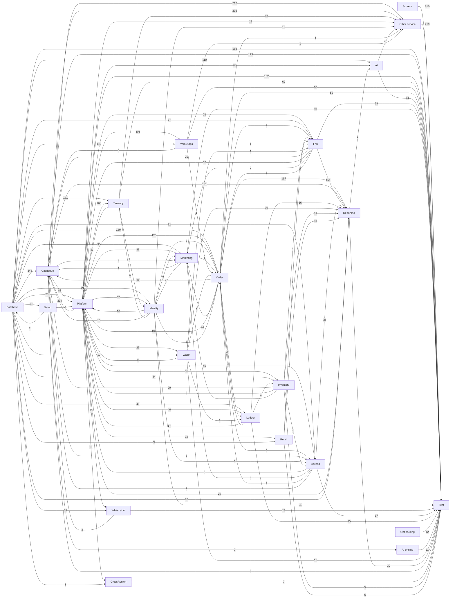

# How the Block A tickets are linked

> **Generated by** `tools/build-ticket-links.py` from `handoff/service-docs/tasks.csv` (the task sheet that becomes the OpenProject tickets). A ticket *waits on* another when it cannot be finished before the other is: that is the "follows" link in OpenProject and the order of each person's board.

**2167 tasks, 11920 links.**

## 1. The build layers, in order

| Layer | Tasks | Build order | Waits on |
|---|---:|---|---|
| Setup | 9 | #3 to #60 | Database (37) |
| Onboarding | 12 | #5 to #16 | nothing |
| Database | 169 | #23 to #3270 | Setup (2) |
| Platform | 20 | #30 to #84 | Setup (8), Database (2) |
| AI engine | 11 | #87 to #2205 | Setup (7) |
| Services | 243 | #78 to #1028 | Platform (496), Database (463) |
| Screens | 309 | #114 to #1033 | Services (978), Setup (196) |
| Services (Venue Management) | 654 | #128 to #4393 | Database (1181), Services (911), Platform (799), Setup (217) |
| Screens (Venue Management) | 578 | #129 to #4394 | Services (Venue Management) (803), Setup (578), Services (501) |
| Test | 162 | #61 to #2208 | Services (Venue Management) (613), Screens (Venue Management) (501), Screens (309), Services (243), Database (168), Platform (20), Onboarding (12), AI engine (11), Setup (9) |

## 2. Service map

An arrow means the service on the right waits on the one on the left; the number is how many task links carry it. Screens are left out here (section 4).

## 3. Services: what each waits on and what waits on it

| Service | Owner | Tasks | Points | Build order | Waits on | Needed by |
|---|---|---:|---:|---|---|---|
| **Other service** | Sanket Keluskar, Chinmay Patkar | 220 | 562 | #78 to #2254 | Setup 217, Catalogue 205, Tenancy 78, Platform 25, Identity 12, Order 1, VenueOps 1, Ai 1 | Test 219 |
| **Ai** | Sanket Keluskar, Hrushikant Patkar | 44 | 198 | #91 to #1864 | Database 110, Platform 84, Reporting 1 | Test 44, screens: Platform 23, screens: Engagement & Support 15, screens: White Label 8, screens: Analytics 7, screens: AI 6 ... |
| **Identity** | Sanket Keluskar, Hrushikant Patkar | 31 | 125 | #106 to #1387 | Database 73, Platform 62, Order 2, Tenancy 2, Marketing 1 | Test 31, screens: Account & Self-Service 22, screens: Tenants & Licensing 21, screens: Other 20, screens: Platform 17, Platform 16 ... |
| **Order** | Pranay Shinde, Sanket Keluskar | 59 | 325 | #112 to #2082 | Database 180, Platform 120, Identity 5, Access 4, Fnb 2, Ledger 2, VenueOps 1, Wallet 1, Marketing 1 | Catalogue 238, Reporting 197, Platform 182, screens: Orders & Money 62, Test 59, screens: Sell 58 ... |
| **Marketing** | Pranay Shinde, Chinmay Patkar | 44 | 218 | #113 to #3832 | Database 93, Platform 86, Order 24, Identity 6, Access 4, Catalogue 4, Fnb 2, Inventory 1 | screens: Engagement & Support 40, Test 39, screens: Account & Self-Service 22, screens: Membership, Loyalty & Value 16, screens: Sell 14, screens: White Label 8 ... |
| **WhiteLabel** | Hrushikant Patkar, Sanket Keluskar | 28 | 136 | #146 to #1773 | Platform 53, Database 38 | screens: White Label 66, Test 28, screens: Engagement & Support 17, screens: Branding & Localisation 9, screens: Discovery & Browse 8, screens: Booking & Selection 8 ... |
| **Platform** | Sanket Keluskar, Pallavi Sawant | 82 | 352 | #150 to #2066 | Database 249, Order 182, Platform 149, Catalogue 83, Tenancy 43, Ledger 17, Identity 16, Fnb 10, Wallet 8, Access 6, Inventory 6 | screens: Tenants & Licensing 140, Test 82, screens: Other 41, Tenancy 36, screens: Partners 27, screens: Sell 23 ... |
| **Tenancy** | Pallavi Sawant, Sanket Keluskar | 64 | 260 | #160 to #3624 | Database 171, Platform 165, Identity 6 | Other service 78, Test 62, screens: Venue Operations 60, Platform 43, screens: Sell 31, screens: Other 23 ... |
| **VenueOps** | Tanmay Dukhande, Chinmay Patkar | 64 | 294 | #196 to #3674 | Platform 121, Database 115 | Test 60, screens: Media Library 56, screens: Access & Venue 36, screens: Other 19, screens: Transport 15, screens: Operations 14 ... |
| **Catalogue** | Tanmay Dukhande, Chinmay Patkar | 123 | 558 | #212 to #2185 | Database 348, Order 238, Platform 234, Inventory 20, Fnb 20, Identity 13, VenueOps 5, Marketing 4, WhiteLabel 3, Access 2 | Other service 205, Reporting 191, screens: Sell 127, Test 123, Platform 83, screens: Other 70 ... |
| **Access** | Hrushikant Patkar, Sanket Keluskar | 21 | 128 | #215 to #2942 | Database 52, Platform 40, Order 4, Catalogue 3, Identity 1, Inventory 1 | Reporting 58, screens: Access & Venue 27, Test 17, screens: Account & Self-Service 13, Platform 6, screens: In-venue Services 5 ... |
| **Inventory** | Pranay Shinde, Deep Khanvilkar | 18 | 98 | #225 to #3431 | Platform 35, Database 34, Ledger 1 | Reporting 32, screens: Stock & Supply 30, Catalogue 20, Platform 6, Test 5, Fnb 3 ... |
| **Fnb** | Tanmay Dukhande, Deep Khanvilkar | 42 | 211 | #302 to #3262 | Platform 79, Database 77, Order 9, Inventory 3, Retail 2, Wallet 1, VenueOps 1 | Reporting 151, Test 39, screens: Other 30, screens: Kitchen 28, screens: Sell 23, Catalogue 20 ... |
| **Wallet** | Pranay Shinde, Sanket Keluskar | 11 | 53 | #323 to #2104 | Platform 23, Database 19 | Reporting 39, Test 11, screens: Membership, Loyalty & Value 8, Platform 8, screens: Other 6, screens: Sell 3 ... |
| **Retail** | Pranay Shinde, Deep Khanvilkar | 6 | 31 | #358 to #3271 | Platform 12, Database 9 | Reporting 31, screens: Sell 17, screens: Retail 7, Test 5, screens: Payment 3, Fnb 2 ... |
| **Ledger** | Tanmay Dukhande, Sanket Keluskar | 21 | 96 | #484 to #3118 | Database 48, Platform 46, Order 24, Wallet 1 | Reporting 56, screens: Orders & Money 26, Platform 17, Test 15, screens: Sell 5, screens: Account & Self-Service 4 ... |
| **CrossRegion** | Pallavi Sawant, Sanket Keluskar | 7 | 29 | #585 to #1286 | Platform 13, Database 8 | Test 7, screens: Access 2 |
| **Reporting** | Hrushikant Patkar, Chinmay Patkar | 12 | 44 | #650 to #4393 | Order 197, Catalogue 191, Fnb 151, Access 58, Ledger 56, Wallet 39, Inventory 32, Retail 31, Platform 22, Database 20 | screens: Venue Operations 14, Test 10, screens: Orders & Money 7, screens: Analytics 5, screens: Stock & Supply 4, screens: Sell 4 ... |

## 4. Module builds: the services each module's screens need

| App | Module | Screen tasks | Build order | Waits on services | Other |
|---|---|---:|---|---|---|
| Guest Web — Storefront | Account & Self-Service | 5 | #114 to #924 | Identity 9, Marketing 9, Order 8, Access 3, Ledger 2, Wallet 1 | Setup 5 |
| Guest App — Mobile | Account & Self-Service | 14 | #118 to #943 | Identity 13, Marketing 13, Order 13, Access 10, Wallet 2, Ledger 2 | Setup 14 |
| Venue Staff App — Operations | Operations | 12 | #129 to #3680 | VenueOps 14, Identity 13, Catalogue 3, Tenancy 2, Inventory 1 | Setup 12 |
| Venue Scanner — Access Control | Access | 4 | #132 to #1280 | Identity 5, Access 3, CrossRegion 2, Order 1, Tenancy 1 | Setup 4 |
| Venue POS — Terminal and Tablet | Shift | 4 | #138 to #778 | Order 11, Identity 7, Tenancy 3 | Setup 4 |
| Venue CMS — White Label | White Label | 23 | #140 to #952 | WhiteLabel 66, Ai 8, Marketing 8, VenueOps 6, Catalogue 6, Identity 2, Tenancy 1, Order 1 | Setup 23 |
| Venue Support — Agent Console | Access & Availability | 1 | #143 to #143 | Identity 6 | Setup 1 |
| TICVAI Web — Platform Console | Access & Identity | 4 | #149 to #1109 | Identity 15 | Setup 4, Platform 2 |
| Partner Web — Reseller Portal | Access & Account | 4 | #156 to #1703 | Identity 10 | Setup 4, Platform 5 |
| Venue POS — Terminal and Tablet | Sell | 26 | #164 to #1029 | Order 53, Fnb 20, Catalogue 17, Retail 10, Marketing 8, Tenancy 8, Ledger 5, Reporting 3, Wallet 2, VenueOps 2, Inventory 1, Access 1 | Setup 26 |
| TICVAI Web — Platform Console | Overview & Health | 4 | #175 to #1393 | - | Setup 4, Platform 11 |
| TICVAI Web — Platform Console | Tenants & Licensing | 88 | #176 to #1701 | Identity 21, Tenancy 6, WhiteLabel 2, Ledger 1, Order 1 | Setup 85, Platform 140 |
| Guest App — Mobile | Discovery & Browse | 7 | #229 to #918 | Catalogue 15, WhiteLabel 4, VenueOps 3, Marketing 3, Access 1, Ai 1 | Setup 7 |
| TICVAI Web — Platform Console | Branding & Localisation | 4 | #249 to #1272 | WhiteLabel 9, Identity 8, Tenancy 2 | Setup 4, Platform 4 |
| Guest Web — Storefront | Engagement & Support | 6 | #251 to #969 | Marketing 13, Ai 3, WhiteLabel 3, Fnb 1, Order 1 | Setup 6 |
| Guest Web — Storefront | System States | 1 | #252 to #252 | WhiteLabel 1 | Setup 1 |
| Guest Web — Storefront | Support | 2 | #253 to #933 | WhiteLabel 3, Marketing 2 | Setup 2 |
| Guest App — Mobile | System States | 2 | #254 to #255 | WhiteLabel 2 | Setup 2 |
| Guest App — Mobile | Engagement & Support | 12 | #256 to #975 | Marketing 14, VenueOps 12, Ai 10, Catalogue 4, Order 4, WhiteLabel 4, Fnb 3 | Setup 12 |
| Venue Management — Back Office | Platform | 3 | #295 to #300 | Tenancy 3, Identity 1 | - |
| Venue Management — Back Office | People & Access Rights | 12 | #297 to #4332 | Tenancy 16, Identity 12, Ai 1, Reporting 1 | Setup 10 |
| Venue Management — Back Office | Sell | 89 | #298 to #3826 | Catalogue 107, Tenancy 23, Retail 7, Marketing 6, Order 5, Identity 5, Fnb 3, Ai 2, VenueOps 1, Reporting 1, Inventory 1, WhiteLabel 1, Wallet 1 | Setup 75, Platform 23 |
| Venue Management | Other | 65 | #301 to #3143 | Catalogue 70, Fnb 30, Tenancy 23, VenueOps 19, Identity 17, Wallet 6, Ai 2, Retail 2, Order 2, WhiteLabel 2, Reporting 2, Access 1, Marketing 1 | Setup 52, Platform 15 |
| Venue Management — Back Office | Food & Beverage | 8 | #303 to #4336 | Fnb 18, Tenancy 2, Retail 1, Reporting 1 | Setup 6 |
| Developer Portal | Developer & API | 8 | #313 to #1715 | - | Setup 5, Platform 18 |
| Venue Management — Back Office | Access & Venue | 62 | #334 to #3809 | VenueOps 36, Access 27, Tenancy 12, Order 6, Reporting 2, Catalogue 2, Ai 1, Marketing 1 | Setup 40, Platform 4 |
| Venue Management — Back Office | Commercial | 5 | #337 to #646 | Order 2, Ledger 2, Catalogue 1 | - |
| Guest Web — Storefront | Discovery & Browse | 5 | #384 to #814 | Catalogue 10, WhiteLabel 4, VenueOps 4, Marketing 2, Access 1, Ai 1 | Setup 5 |
| Guest Web — Storefront | Booking & Selection | 7 | #385 to #968 | Catalogue 13, VenueOps 6, WhiteLabel 5, Order 5, Marketing 3, Ai 1 | Setup 7 |
| Guest Web — Storefront | High-Demand Access | 1 | #387 to #387 | Catalogue 2 | Setup 1 |
| Guest Web — Storefront | Membership, Loyalty & Value | 5 | #388 to #934 | Marketing 11, Order 6, Wallet 5, Identity 5, Catalogue 5, Access 2, VenueOps 1, Ai 1 | Setup 5 |
| Guest App — Mobile | High-Demand Access | 1 | #395 to #395 | Catalogue 2 | Setup 1 |
| Guest App — Mobile | Discovery | 1 | #396 to #396 | Catalogue 1 | Setup 1 |
| Guest App — Mobile | Booking & Selection | 10 | #400 to #974 | Catalogue 19, Order 10, VenueOps 6, WhiteLabel 3, Marketing 2, Ai 1 | Setup 10 |
| Guest Web — Storefront | Promotions | 1 | #410 to #410 | Catalogue 2 | Setup 1 |
| Guest App — Mobile | Promotions | 1 | #413 to #413 | Catalogue 3 | Setup 1 |
| Guest Web — Storefront | Cart & Checkout | 5 | #443 to #922 | Order 11, WhiteLabel 4, Marketing 4, Catalogue 3, Identity 1, VenueOps 1 | Setup 5 |
| Guest Web — Storefront | Ticketing | 3 | #447 to #630 | Order 7, Catalogue 3, Ledger 1, Fnb 1, VenueOps 1 | Setup 3 |
| Guest Web — Storefront | Retail | 2 | #450 to #752 | Retail 4, Order 3 | Setup 2 |
| Guest App — Mobile | Cart & Checkout | 3 | #455 to #632 | Order 11, WhiteLabel 3, Catalogue 2, VenueOps 1, Identity 1 | Setup 3 |
| Guest App — Mobile | Ticketing | 4 | #461 to #593 | Order 7, Catalogue 1, Ledger 1 | Setup 4 |
| Guest App — Mobile | Membership, Loyalty & Value | 3 | #549 to #941 | Marketing 5, Order 4, Catalogue 3, Wallet 3, Identity 1, Ai 1, VenueOps 1 | Setup 3 |
| Guest App — Mobile | In-venue Services | 10 | #567 to #830 | Fnb 10, VenueOps 7, Order 3, Access 3, Catalogue 2, WhiteLabel 2 | Setup 10 |
| Guest Web — Storefront | In-venue Services | 6 | #573 to #825 | Fnb 9, VenueOps 5, Order 2, Access 2 | Setup 6 |
| Venue Management — Back Office | Venue Operations | 45 | #610 to #4394 | Tenancy 60, Reporting 14, VenueOps 8, Access 4, Order 4, Fnb 4, Ai 3, Ledger 2, Retail 1 | Setup 42, Platform 1 |
| Venue Management — Back Office | Rentals | 21 | #625 to #3594 | VenueOps 10, Catalogue 8, Tenancy 5, Ai 2 | Setup 13, Platform 1 |
| Venue Management — Back Office | Orders & Money | 25 | #644 to #4335 | Order 62, Ledger 26, Reporting 7, Tenancy 4, Fnb 2, Access 1, Retail 1 | Setup 19 |
| Venue Analytics — Cross-Domain Reporting | Analytics | 6 | #654 to #4131 | Reporting 5, Identity 3, Ai 1, Tenancy 1 | Setup 3 |
| Guest Web — Storefront | Transport | 1 | #658 to #658 | VenueOps 6, Order 1 | Setup 1 |
| Guest App — Mobile | Transport | 4 | #661 to #664 | VenueOps 9, Order 2 | Setup 4 |
| Guest App — Mobile | In-Venue Experience | 2 | #708 to #756 | Retail 1, Fnb 1 | Setup 2 |
| Kitchen Display — Pass and Stations | Kitchen | 10 | #711 to #1033 | Fnb 28, Reporting 2 | Setup 10 |
| Venue Staff App — Operations | Floor Service | 2 | #726 to #728 | Fnb 14, Order 1 | Setup 2 |
| Guest App — Mobile | Retail | 1 | #755 to #755 | Retail 3, Order 1 | Setup 1 |
| Venue POS — Terminal and Tablet | Payment | 1 | #761 to #761 | Retail 3, Order 2, Access 1, Marketing 1 | Setup 1 |
| Venue Management — Back Office | Games & Rides | 9 | #807 to #1987 | Catalogue 3, VenueOps 1 | Setup 9 |
| Venue Staff App — Operations | Stock on the Floor | 3 | #873 to #3260 | Fnb 2, Inventory 2, Retail 1 | Setup 1 |
| Venue Management — Back Office | Stock & Supply | 16 | #884 to #4339 | Inventory 30, Fnb 11, Reporting 4, Ai 1 | Setup 15 |
| TICVAI Web — Platform Console | Security & Compliance | 2 | #896 to #1313 | Reporting 1 | Setup 1, Platform 2 |
| Guest App — Mobile | Support | 1 | #939 to #939 | Marketing 2 | Setup 1 |
| Guest App — Mobile | Marketing | 1 | #945 to #945 | Marketing 4 | Setup 1 |
| Venue Support — Agent Console | Conversations | 2 | #963 to #965 | Marketing 8 | Setup 2 |
| Guest Kiosk — Self-Service | AI | 1 | #978 to #978 | Ai 2, Catalogue 2, Marketing 1 | Setup 1 |
| Venue Management — Back Office | Engagement & Support | 27 | #982 to #3848 | Marketing 13, WhiteLabel 10, Ai 2, Tenancy 2, Identity 2 | Setup 18 |
| Venue CMS — White Label | Policy | 2 | #993 to #994 | Marketing 2 | - |
| Venue Support — Agent Console | Overview | 1 | #997 to #997 | Marketing 1 | - |
| Venue Management — Back Office | Guests & Marketing | 4 | #1003 to #3825 | Marketing 5, Tenancy 4, Ai 2, Reporting 1, Identity 1 | Setup 3 |
| TICVAI Web — Platform Console | AI | 2 | #1017 to #1020 | Ai 4 | - |
| TICVAI Web — Platform Console | Analytics | 5 | #1018 to #1114 | Ai 6, Identity 6 | Setup 3, Platform 3 |
| TICVAI Web — Platform Console | Platform | 13 | #1021 to #4226 | Ai 23, Identity 16, Tenancy 4 | Setup 8, Platform 8 |
| Venue POS — Terminal and Tablet | Reports | 1 | #1030 to #1030 | Reporting 3 | Setup 1 |
| Venue CMS — White Label | Media Library | 40 | #1089 to #1767 | VenueOps 56, Identity 2, Ai 1 | Setup 40 |
| TICVAI Web — Platform Console | Commercial | 1 | #1117 to #1117 | Identity 2, Order 1, Ledger 1 | Setup 1, Platform 1 |
| TICVAI Sign-up — Onboarding & Purchase | Onboarding & Assessment | 10 | #1137 to #1502 | Identity 1 | Setup 10, Platform 10 |
| Partner Web — Reseller Portal | Partners | 22 | #1148 to #1941 | Identity 4 | Setup 22, Platform 27 |
| Venue Management — Back Office | Operations | 5 | #1230 to #1244 | Tenancy 6 | Setup 5 |
| Venue Management — Back Office | Setup & Go-Live | 19 | #1254 to #2132 | Catalogue 3, Tenancy 2 | Setup 19, Platform 15 |
| TICVAI Web — Platform Console | Releases & Environments | 8 | #1292 to #1318 | Identity 4 | Setup 8, Platform 16 |
| TICVAI Web — Platform Console | Platform Ops | 1 | #1304 to #1304 | - | Setup 1, Platform 2 |
| TICVAI Web — Platform Console | Infrastructure & Resilience | 4 | #1314 to #1414 | - | Setup 4, Platform 7 |
| TICVAI Web — Platform Console | Support & Communications | 2 | #1315 to #1316 | - | Setup 2, Platform 2 |
| TICVAI Web | Other | 2 | #1397 to #1471 | Identity 3 | Setup 2, Platform 17 |
| TICVAI Sign-up — Onboarding & Purchase | Purchase & Activation | 6 | #1494 to #1516 | - | Setup 6, Platform 5 |
| TICVAI Sign-up — Onboarding & Purchase | Package Builder | 7 | #1503 to #1512 | - | Setup 7, Platform 8 |
| Partner Web — Reseller Portal | Booking & Quotes | 1 | #1526 to #1526 | - | Setup 1, Platform 2 |
| Partner Web — Reseller Portal | Reports & Settlement | 1 | #1533 to #1533 | - | Setup 1, Platform 1 |
| Developer | Other | 2 | #1709 to #1710 | - | Setup 2, Platform 9 |
| Guest Kiosk — Self-Service | Sell | 3 | #1770 to #1784 | Catalogue 3, WhiteLabel 1 | Setup 3 |
| Partner Web — Reseller Portal | Inventory & Pricing | 2 | #2135 to #2136 | Catalogue 6 | Setup 2 |

## 5. Reports and other read-only work that waits for its data

A backend task that only reads waits for the tasks that write what it reads (decided 30 September).

| Task | Service | Waits on the data of |
|---|---|---|
| SVC-CATALOGUE-PRODUCT-2 | Catalogue | Inventory, WhiteLabel |
| SVC-CATALOGUE-PRODUCT-1 | Catalogue | Inventory |
| SVC-CATALOGUE-CAPACITY-1 | Catalogue | Order, VenueOps |
| SVC-ORDER-ORDERS-11 | Order | Identity, Marketing |
| SVC-ACCESS-ACCESS-3 | Access | Catalogue, Identity, Inventory, Order, Platform |
| SVC-MARKETING-CONSENT-2 | Marketing | Access, Identity, Order |
| SVC-ORDER-DRAFTED-1 | Order | Access |
| SVC-LEDGER-REPORTING-2 | Ledger | Order, Wallet |
| SVC-FNB-GUESTORDERING-2 | Fnb | Order, Wallet |
| VM-ORDER-DRAFTED-1 | Order | Access, Fnb, Identity, Ledger, Wallet |
| VM-ORDER-SYNC-2 | Order | Access, VenueOps |
| SVC-MARKETING-MARKETING-7 | Marketing | Access, Catalogue, Inventory, Order |
| SVC-IDENTITY-IDENTITY-6 | Identity | Marketing |
| VM-ADM-247 | Other service | Identity, Tenancy |
| VM-ADM-340 | Other service | Identity |
| VM-IDENTITY-ADMINISTRATION-2 | Identity | Order, Platform, Tenancy |
| VM-ADM-582 | Other service | Tenancy |
| VM-ADM-584 | Other service | Tenancy |
| VM-ADM-587 | Other service | Tenancy, VenueOps |
| VM-ADM-581 | Other service | Order, Tenancy |
| VM-ADM-346 | Other service | Tenancy |
| VM-PTR-026 | Other service | Platform |
| VM-PTR-029 | Other service | Identity, Platform |
| VM-PTR-047 | Other service | Platform |
| VM-ADM-239 | Other service | Tenancy |
| VM-ADM-241 | Other service | Tenancy |
| VM-ADM-245 | Other service | Tenancy |
| VM-ADM-246 | Other service | Tenancy |
| VM-ADM-145 | Other service | Catalogue, Tenancy |
| SVC-TENANCY-ANALYTICS-1 | Tenancy | Platform |
| SVC-TENANCY-APPROVALS-9 | Tenancy | Identity, Platform |
| VM-ADM-253 | Other service | Tenancy |
| VM-ADM-254 | Other service | Tenancy |
| VM-ADM-256 | Other service | Tenancy |
| VM-ADM-320 | Other service | Tenancy |
| VM-ADM-322 | Other service | Tenancy |
| VM-ADM-324 | Other service | Tenancy |
| VM-ADM-325 | Other service | Tenancy |
| VM-ADM-326 | Other service | Tenancy |
| VM-ADM-329 | Other service | Tenancy |
| VM-ADM-250 | Other service | Tenancy |
| VM-ADM-251 | Other service | Tenancy |
| VM-ADM-255 | Other service | Tenancy |
| VM-ADM-257 | Other service | Tenancy |
| SVC-TENANCY-APPROVALS-5 | Tenancy | Identity, Platform |
| VM-ADM-238 | Other service | Tenancy |
| VM-ADM-240 | Other service | Tenancy |
| VM-ADM-244 | Other service | Tenancy |
| VM-ADM-248 | Other service | Tenancy |
| VM-ADM-319 | Other service | Catalogue, Tenancy |
| VM-ADM-323 | Other service | Tenancy |
| VM-ADM-327 | Other service | Tenancy |
| VM-ADM-328 | Other service | Tenancy |
| VM-ADM-330 | Other service | Tenancy |
| VM-ADM-331 | Other service | Tenancy |
| VM-ADM-332 | Other service | Tenancy |
| VM-ADM-333 | Other service | Tenancy |
| VM-ADM-334 | Other service | Tenancy |
| VM-ADM-335 | Other service | Tenancy |
| VM-ADM-336 | Other service | Tenancy |
| VM-ADM-341 | Other service | Tenancy |
| VM-ADM-343 | Other service | Tenancy |
| VM-ADM-345 | Other service | Tenancy |
| VM-ADM-347 | Other service | Tenancy |
| VM-ADM-350 | Other service | Tenancy |
| VM-ADM-352 | Other service | Platform, Tenancy |
| VM-ADM-355 | Other service | Tenancy |
| VM-ADM-338 | Other service | Tenancy |
| VM-ADM-349 | Other service | Tenancy |
| VM-ADM-337 | Other service | Tenancy |
| VM-ADM-339 | Other service | Tenancy |
| VM-ADM-348 | Other service | Tenancy |
| VM-ADM-357 | Other service | Tenancy |
| SVC-TENANCY-APPROVALS-11 | Tenancy | Identity, Platform |
| VM-ADM-367 | Other service | Tenancy |
| VM-ADM-358 | Other service | Tenancy |
| VM-ADM-359 | Other service | Tenancy |
| VM-ADM-360 | Other service | Tenancy |
| VM-ADM-361 | Other service | Tenancy |
| VM-ADM-362 | Other service | Tenancy |
| VM-ADM-363 | Other service | Tenancy |
| VM-ADM-364 | Other service | Tenancy |
| VM-ADM-366 | Other service | Ai, Tenancy |
| VM-ADM-368 | Other service | Tenancy |
| VM-ADM-356 | Other service | Identity, Platform |
| VM-ADM-351 | Other service | Platform |
| SVC-PLATFORM-DRAFTED-11 | Platform | Fnb, Identity, Ledger, Order, Tenancy, Wallet |
| SVC-PLATFORM-DRAFTED-12 | Platform | Identity, Order, Tenancy, Wallet |
| VM-ADM-119 | Other service | Catalogue |
| VM-ADM-120 | Other service | Catalogue |
| VM-ADM-123 | Other service | Catalogue |
| VM-ADM-124 | Other service | Catalogue |
| VM-ADM-125 | Other service | Catalogue |
| SVC-AI-AUDIT-1 | Ai | Reporting |
| VM-ADM-052 | Other service | Catalogue |
| VM-ADM-129 | Other service | Catalogue, Tenancy |
| VM-ADM-127 | Other service | Catalogue |
| VM-ADM-132 | Other service | Catalogue |
| VM-ADM-135 | Other service | Catalogue |
| VM-ADM-136 | Other service | Catalogue |
| VM-ADM-130 | Other service | Catalogue, Tenancy |
| VM-ADM-133 | Other service | Catalogue |
| VM-ADM-134 | Other service | Catalogue |
| APP-SETUP-ADM-055 | Other service | Catalogue |
| VM-ADM-070 | Other service | Catalogue |
| VM-ADM-072 | Other service | Catalogue |
| APP-SETUP-ADM-075 | Other service | Catalogue |
| VM-ADM-076 | Other service | Catalogue |
| VM-ADM-079 | Other service | Catalogue |
| VM-ADM-080 | Other service | Catalogue |
| VM-ADM-083 | Other service | Catalogue, Tenancy |
| VM-ADM-084 | Other service | Catalogue |
| APP-SETUP-ADM-090 | Other service | Catalogue |
| APP-SETUP-ADM-091 | Other service | Catalogue |
| VM-ADM-092 | Other service | Catalogue |
| VM-ADM-093 | Other service | Catalogue |
| VM-ADM-094 | Other service | Catalogue |
| VM-ADM-100 | Other service | Catalogue |
| VM-ADM-102 | Other service | Catalogue |
| VM-ADM-107 | Other service | Catalogue |
| VM-CATALOGUE-PRICING-2 | Catalogue | Fnb, Inventory |
| SVC-CATALOGUE-DRAFTED-22 | Catalogue | Fnb, Identity, Inventory, Order, Platform |
| VM-ADM-078 | Other service | Catalogue |
| VM-ADM-081 | Other service | Catalogue |
| VM-ADM-085 | Other service | Catalogue |
| VM-ADM-086 | Other service | Catalogue |
| SVC-PLATFORM-DRAFTED-3 | Platform | Catalogue, Fnb, Identity, Inventory, Ledger, Order, Tenancy, Wallet |
| VM-PTR-035 | Other service | Identity, Platform |
| VM-PTR-036 | Other service | Identity, Platform |
| VM-PTR-039 | Other service | Platform |
| VM-PTR-048 | Other service | Identity, Platform |
| SVC-PLATFORM-DRAFTED-14 | Platform | Catalogue, Fnb, Identity, Inventory, Order, Tenancy, Wallet |
| SVC-PLATFORM-DRAFTED-15 | Platform | Catalogue, Identity, Inventory, Ledger, Order, Tenancy, Wallet |
| SVC-CATALOGUE-DRAFTED-13 | Catalogue | Fnb, Inventory |
| APP-SETUP-ADM-050 | Other service | Catalogue |
| VM-ADM-053 | Other service | Catalogue |
| VM-ADM-126 | Other service | Catalogue |
| VM-ADM-128 | Other service | Catalogue |
| SVC-CATALOGUE-DRAFTED-25 | Catalogue | Identity, Inventory, Order, Platform, VenueOps |
| APP-SETUP-ADM-095 | Other service | Catalogue |
| VM-ADM-096 | Other service | Catalogue |
| VM-ADM-099 | Other service | Catalogue |
| VM-ADM-103 | Other service | Catalogue |
| SVC-CATALOGUE-DRAFTED-26 | Catalogue | Fnb, Identity, Inventory, Order, Platform |
| VM-ADM-098 | Other service | Catalogue |
| VM-ADM-101 | Other service | Catalogue |
| VM-ADM-105 | Other service | Catalogue |
| VM-ADM-106 | Other service | Catalogue |
| VM-ADM-114 | Other service | Catalogue |
| VM-ADM-115 | Other service | Catalogue |
| VM-ADM-259 | Other service | Catalogue |
| VM-ADM-260 | Other service | Catalogue |
| VM-ADM-109 | Other service | Catalogue |
| VM-ADM-110 | Other service | Catalogue |
| VM-ADM-111 | Other service | Catalogue |
| VM-ADM-261 | Other service | Catalogue |
| VM-ADM-108 | Other service | Catalogue |
| SVC-CATALOGUE-DRAFTED-30 | Catalogue | Identity, Inventory, Order, Platform, VenueOps |
| SVC-CATALOGUE-DRAFTED-31 | Catalogue | Fnb, Identity, Inventory, Order, Platform |
| VM-ADM-112 | Other service | Catalogue |
| VM-ADM-113 | Other service | Catalogue |
| VM-ADM-116 | Other service | Catalogue |
| VM-ADM-117 | Other service | Catalogue |
| VM-ADM-258 | Other service | Catalogue |
| VM-ADM-262 | Other service | Catalogue |
| VM-ADM-263 | Other service | Catalogue |
| VM-ADM-264 | Other service | Catalogue |
| SVC-CATALOGUE-DRAFTED-34 | Catalogue | Identity, Inventory, Order, Platform, VenueOps |
| VM-ADM-265 | Other service | Catalogue |
| VM-ADM-266 | Other service | Catalogue |
| VM-ADM-267 | Other service | Catalogue |
| VM-ADM-268 | Other service | Catalogue |
| VM-ADM-269 | Other service | Catalogue |
| VM-ADM-272 | Other service | Catalogue |
| VM-ADM-277 | Other service | Catalogue |
| SVC-CATALOGUE-DRAFTED-8 | Catalogue | Fnb, Identity, Inventory, Order, Platform |
| VM-ADM-118 | Other service | Catalogue |
| VM-ADM-122 | Other service | Catalogue |
| SVC-CATALOGUE-DRAFTED-12 | Catalogue | Fnb, Inventory |
| VM-ADM-048 | Other service | Catalogue |
| VM-ADM-054 | Other service | Catalogue |
| VM-ADM-137 | Other service | Catalogue |
| SVC-CATALOGUE-DRAFTED-16 | Catalogue | Inventory |
| SVC-CATALOGUE-DRAFTED-18 | Catalogue | Fnb, Inventory |
| VM-ADM-056 | Other service | Catalogue |
| VM-ADM-059 | Other service | Catalogue |
| VM-ADM-060 | Other service | Catalogue |
| VM-ADM-062 | Other service | Catalogue |
| VM-ADM-063 | Other service | Catalogue |
| VM-ADM-065 | Other service | Catalogue |
| VM-ADM-071 | Other service | Catalogue |
| VM-ADM-057 | Other service | Catalogue |
| VM-ADM-058 | Other service | Catalogue |
| VM-ADM-061 | Other service | Catalogue |
| VM-ADM-064 | Other service | Catalogue |
| VM-ADM-066 | Other service | Catalogue |
| VM-ADM-067 | Other service | Catalogue |
| VM-ADM-088 | Other service | Catalogue |
| VM-ADM-089 | Other service | Catalogue |
| VM-ADM-104 | Other service | Catalogue |
| SVC-CATALOGUE-DRAFTED-35 | Catalogue | Identity, Inventory, Order, Platform |
| VM-ADM-273 | Other service | Catalogue |
| VM-ADM-274 | Other service | Catalogue |
| VM-ADM-275 | Other service | Catalogue |
| VM-ADM-276 | Other service | Catalogue |
| SVC-CATALOGUE-CATALOGUE-8 | Catalogue | Fnb, Identity, Inventory, Order, Platform |
| VM-ADM-131 | Other service | Catalogue |
| SVC-MARKETING-GUESTS-2 | Marketing | Access, Catalogue, Fnb, Identity, Order, Platform |
| SVC-PLATFORM-DRAFTED-4 | Platform | Access, Catalogue, Identity, Inventory, Order, Tenancy, Wallet |
| VM-PTR-037 | Other service | Platform |
| SVC-PLATFORM-DRAFTED-7 | Platform | Access, Catalogue, Fnb, Identity, Inventory, Order, Tenancy, Wallet |
| SVC-PLATFORM-DRAFTED-8 | Platform | Access, Catalogue, Fnb, Identity, Inventory, Order, Wallet |
| SVC-CATALOGUE-DRAFTED-21 | Catalogue | Access, Fnb, Identity, Inventory, Order, Platform |
| VM-ADM-073 | Other service | Catalogue |
| VM-ADM-074 | Other service | Catalogue |
| VM-ADM-082 | Other service | Catalogue |
| VM-ADM-087 | Other service | Catalogue |
| SVC-CATALOGUE-DRAFTED-36 | Catalogue | Fnb, Inventory, Order, VenueOps |
| VM-ADM-270 | Other service | Catalogue |
| VM-ADM-271 | Other service | Catalogue |
| VM-ADM-365 | Other service | Catalogue |
| SVC-CATALOGUE-UPSELL-2 | Catalogue | Inventory |
| SVC-CATALOGUE-DRAFTED-39 | Catalogue | Fnb, Identity, Marketing, Order, Platform |
| SVC-CATALOGUE-DRAFTED-41 | Catalogue | Fnb, Identity, Order, Platform |
| SVC-CATALOGUE-DRAFTED-42 | Catalogue | Fnb, Inventory |
| VM-ADM-138 | Other service | Catalogue |
| VM-ADM-140 | Other service | Catalogue |
| VM-ADM-139 | Other service | Catalogue |
| VM-ADM-141 | Other service | Catalogue |
| VM-ADM-142 | Other service | Catalogue |
| VM-ADM-143 | Other service | Catalogue |
| VM-ADM-144 | Other service | Catalogue |
| VM-ADM-146 | Other service | Catalogue |
| VM-ADM-147 | Other service | Catalogue |
| VM-ADM-149 | Other service | Catalogue |
| VM-ADM-150 | Other service | Catalogue |
| VM-ADM-153 | Other service | Catalogue |
| VM-ADM-151 | Other service | Catalogue |
| VM-ADM-152 | Other service | Catalogue |
| SVC-CATALOGUE-DRAFTED-45 | Catalogue | Fnb, Identity, Order, Platform |
| VM-ADM-158 | Other service | Catalogue |
| VM-ADM-157 | Other service | Catalogue |
| VM-ADM-154 | Other service | Catalogue |
| VM-ADM-156 | Other service | Catalogue |
| VM-ADM-160 | Other service | Catalogue |
| VM-ADM-161 | Other service | Catalogue |
| VM-ADM-162 | Other service | Catalogue |
| VM-ADM-163 | Other service | Catalogue |
| VM-ADM-166 | Other service | Catalogue |
| VM-ADM-168 | Other service | Catalogue |
| VM-ADM-170 | Other service | Catalogue |
| VM-ADM-171 | Other service | Catalogue |
| VM-ADM-176 | Other service | Catalogue |
| VM-ADM-155 | Other service | Catalogue |
| VM-ADM-165 | Other service | Catalogue |
| VM-ADM-167 | Other service | Catalogue |
| VM-ADM-175 | Other service | Catalogue |
| APP-SETUP-ADM-219 | Other service | Catalogue |
| VM-LEDGER-REPORTING-1 | Ledger | Order |
| VM-INVENTORY-STOCK-1 | Inventory | Ledger |
| VM-FNB-FNB-1 | Fnb | Inventory, Retail, VenueOps |

## 6. Tasks that wait on nothing

Only setup and onboarding should be here.

| Task | Layer | Build order |
|---|---|---|
| SETUP-CI | Setup | #3 |
| SETUP-ENV | Setup | #4 |
| SETUP-ONBOARD-CHINMAY-PATKAR | Onboarding | #5 |
| SETUP-ONBOARD-CHITRANGI-MESTRY | Onboarding | #6 |
| SETUP-ONBOARD-DEEP-KHANVILKAR | Onboarding | #7 |
| SETUP-ONBOARD-HRUSHIKANT-PATKAR | Onboarding | #8 |
| SETUP-ONBOARD-KALPITA-MEJARI | Onboarding | #9 |
| SETUP-ONBOARD-PALLAVI-SAWANT | Onboarding | #10 |
| SETUP-ONBOARD-PRADNYA-YERAM | Onboarding | #11 |
| SETUP-ONBOARD-PRANAY-SHINDE | Onboarding | #12 |
| SETUP-ONBOARD-SANKET-KELUSKAR | Onboarding | #13 |
| SETUP-ONBOARD-SECOND-AI-ENGINEER | Onboarding | #14 |
| SETUP-ONBOARD-SURENDRA | Onboarding | #15 |
| SETUP-ONBOARD-TANMAY-DUKHANDE | Onboarding | #16 |

