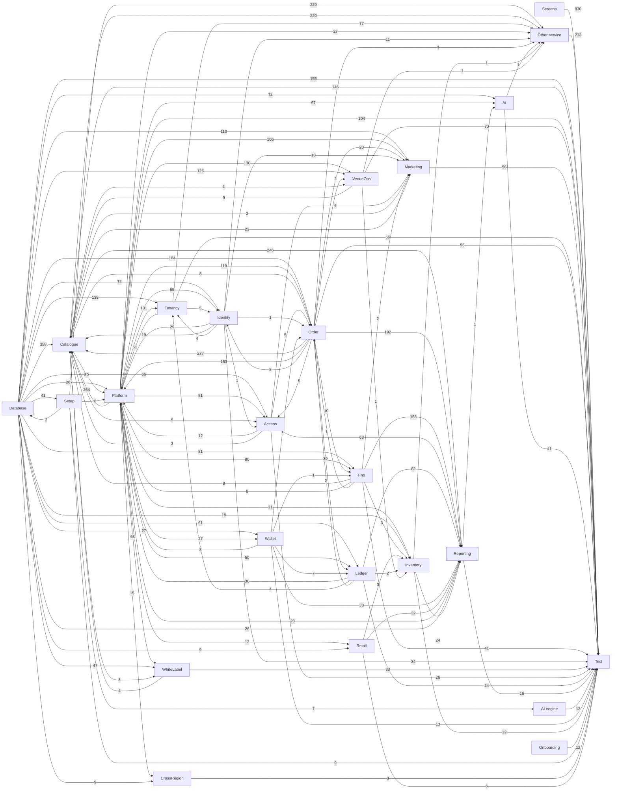

# How the Block A tickets are linked

> **Generated by** `tools/build-ticket-links.py` from `handoff/service-docs/tasks.csv` (the task sheet that becomes the OpenProject tickets). A ticket *waits on* another when it cannot be finished before the other is: that is the "follows" link in OpenProject and the order of each person's board.

**2284 tasks, 12925 links.**

## 1. The build layers, in order

| Layer | Tasks | Build order | Waits on |
|---|---:|---|---|
| Setup | 9 | #3 to #396 | Database (41) |
| Onboarding | 12 | #5 to #16 | nothing |
| Database | 155 | #23 to #2466 | Setup (2) |
| Platform | 20 | #31 to #83 | Setup (8), Database (2) |
| AI engine | 12 | #86 to #2458 | Setup (7) |
| Services | 266 | #77 to #1404 | Platform (557), Database (522) |
| Screens | 331 | #112 to #1435 | Services (1033), Setup (194), Services (Venue Management) (3), AI engine (3) |
| Services (Venue Management) | 686 | #132 to #2470 | Services (1357), Database (1131), Platform (791), Setup (229) |
| Screens (Venue Management) | 599 | #130 to #2474 | Services (Venue Management) (880), Services (665), Setup (599), AI engine (1) |
| Test | 194 | #61 to #2475 | Services (Venue Management) (686), Screens (Venue Management) (599), Screens (331), Services (268), Database (155), Platform (20), AI engine (13), Onboarding (12), Setup (9) |

## 2. Service map

An arrow means the service on the right waits on the one on the left; the number is how many task links carry it. Screens are left out here (section 4).

```mermaid
flowchart LR
  Screens["Screens"] -->|930| Test["Test"]
  Database["Database"] -->|358| Catalogue["Catalogue"]
  Order["Order"] -->|277| Catalogue["Catalogue"]
  Database["Database"] -->|267| Platform["Platform"]
  Platform["Platform"] -->|264| Catalogue["Catalogue"]
  Catalogue["Catalogue"] -->|246| Reporting["Reporting"]
  Other_service["Other service"] -->|233| Test["Test"]
  Setup["Setup"] -->|229| Other_service["Other service"]
  Catalogue["Catalogue"] -->|220| Other_service["Other service"]
  Order["Order"] -->|192| Reporting["Reporting"]
  Database["Database"] -->|164| Order["Order"]
  Fnb["Fnb"] -->|158| Reporting["Reporting"]
  Database["Database"] -->|155| Test["Test"]
  Order["Order"] -->|153| Platform["Platform"]
  Catalogue["Catalogue"] -->|146| Test["Test"]
  Database["Database"] -->|138| Tenancy["Tenancy"]
  Platform["Platform"] -->|131| Tenancy["Tenancy"]
  Platform["Platform"] -->|130| VenueOps["VenueOps"]
  Database["Database"] -->|126| VenueOps["VenueOps"]
  Platform["Platform"] -->|119| Order["Order"]
  Database["Database"] -->|110| Marketing["Marketing"]
  Platform["Platform"] -->|106| Marketing["Marketing"]
  Platform["Platform"] -->|104| Test["Test"]
  Database["Database"] -->|81| Fnb["Fnb"]
  Catalogue["Catalogue"] -->|80| Platform["Platform"]
  Platform["Platform"] -->|80| Fnb["Fnb"]
  Tenancy["Tenancy"] -->|77| Other_service["Other service"]
  Database["Database"] -->|74| Ai["Ai"]
  Database["Database"] -->|74| Identity["Identity"]
  VenueOps["VenueOps"] -->|70| Test["Test"]
  Access["Access"] -->|68| Reporting["Reporting"]
  Platform["Platform"] -->|67| Ai["Ai"]
  Database["Database"] -->|66| Access["Access"]
  Platform["Platform"] -->|65| Identity["Identity"]
  Platform["Platform"] -->|63| WhiteLabel["WhiteLabel"]
  Ledger["Ledger"] -->|62| Reporting["Reporting"]
  Database["Database"] -->|61| Ledger["Ledger"]
  Marketing["Marketing"] -->|56| Test["Test"]
  Tenancy["Tenancy"] -->|56| Test["Test"]
  Order["Order"] -->|55| Test["Test"]
  Platform["Platform"] -->|51| Access["Access"]
  Tenancy["Tenancy"] -->|51| Platform["Platform"]
  Platform["Platform"] -->|50| Ledger["Ledger"]
  Database["Database"] -->|47| WhiteLabel["WhiteLabel"]
  Ai["Ai"] -->|41| Test["Test"]
  Database["Database"] -->|41| Setup["Setup"]
  Fnb["Fnb"] -->|41| Test["Test"]
  Wallet["Wallet"] -->|38| Reporting["Reporting"]
  Identity["Identity"] -->|34| Test["Test"]
  WhiteLabel["WhiteLabel"] -->|33| Test["Test"]
  Retail["Retail"] -->|32| Reporting["Reporting"]
  Ledger["Ledger"] -->|30| Platform["Platform"]
  Order["Order"] -->|30| Ledger["Ledger"]
  Identity["Identity"] -->|29| Platform["Platform"]
  Platform["Platform"] -->|28| Reporting["Reporting"]
  Database["Database"] -->|27| Wallet["Wallet"]
  Platform["Platform"] -->|27| Other_service["Other service"]
  Platform["Platform"] -->|27| Wallet["Wallet"]
  Access["Access"] -->|26| Test["Test"]
  Database["Database"] -->|26| Reporting["Reporting"]
  Inventory["Inventory"] -->|24| Reporting["Reporting"]
  Ledger["Ledger"] -->|24| Test["Test"]
  Marketing["Marketing"] -->|23| Catalogue["Catalogue"]
  Platform["Platform"] -->|21| Inventory["Inventory"]
  Order["Order"] -->|20| Marketing["Marketing"]
  Identity["Identity"] -->|19| Catalogue["Catalogue"]
  Database["Database"] -->|18| Inventory["Inventory"]
  Reporting["Reporting"] -->|16| Test["Test"]
  Platform["Platform"] -->|15| CrossRegion["CrossRegion"]
  AI_engine["AI engine"] -->|13| Test["Test"]
  Wallet["Wallet"] -->|13| Test["Test"]
  Access["Access"] -->|12| Platform["Platform"]
  Inventory["Inventory"] -->|12| Test["Test"]
  Onboarding["Onboarding"] -->|12| Test["Test"]
  Platform["Platform"] -->|12| Retail["Retail"]
  Identity["Identity"] -->|11| Other_service["Other service"]
  Identity["Identity"] -->|10| Marketing["Marketing"]
  Order["Order"] -->|10| Fnb["Fnb"]
  Database["Database"] -->|9| CrossRegion["CrossRegion"]
  Database["Database"] -->|9| Retail["Retail"]
  Setup["Setup"] -->|9| Test["Test"]
  VenueOps["VenueOps"] -->|9| Catalogue["Catalogue"]
  Catalogue["Catalogue"] -->|8| Order["Order"]
  Catalogue["Catalogue"] -->|8| WhiteLabel["WhiteLabel"]
  CrossRegion["CrossRegion"] -->|8| Test["Test"]
  Fnb["Fnb"] -->|8| Catalogue["Catalogue"]
  Order["Order"] -->|8| Identity["Identity"]
  Setup["Setup"] -->|8| Platform["Platform"]
  Wallet["Wallet"] -->|8| Platform["Platform"]
  Setup["Setup"] -->|7| AI_engine["AI engine"]
  Wallet["Wallet"] -->|7| Ledger["Ledger"]
  Access["Access"] -->|6| Marketing["Marketing"]
  Fnb["Fnb"] -->|6| Platform["Platform"]
  Retail["Retail"] -->|6| Test["Test"]
  Access["Access"] -->|5| Order["Order"]
  Catalogue["Catalogue"] -->|5| Access["Access"]
  Order["Order"] -->|5| Access["Access"]
  Tenancy["Tenancy"] -->|5| Identity["Identity"]
  Identity["Identity"] -->|4| Tenancy["Tenancy"]
  Ledger["Ledger"] -->|4| Tenancy["Tenancy"]
  Order["Order"] -->|4| Other_service["Other service"]
  WhiteLabel["WhiteLabel"] -->|4| Catalogue["Catalogue"]
  Access["Access"] -->|3| Catalogue["Catalogue"]
  Fnb["Fnb"] -->|3| Inventory["Inventory"]
  Retail["Retail"] -->|3| Inventory["Inventory"]
  Catalogue["Catalogue"] -->|2| Marketing["Marketing"]
  Fnb["Fnb"] -->|2| Marketing["Marketing"]
  Ledger["Ledger"] -->|2| Inventory["Inventory"]
  Ledger["Ledger"] -->|2| Order["Order"]
  Order["Order"] -->|2| VenueOps["VenueOps"]
  Setup["Setup"] -->|2| Database["Database"]
  Ai["Ai"] -->|1| Other_service["Other service"]
  Catalogue["Catalogue"] -->|1| VenueOps["VenueOps"]
  Fnb["Fnb"] -->|1| Order["Order"]
  Identity["Identity"] -->|1| Access["Access"]
  Identity["Identity"] -->|1| Order["Order"]
  Inventory["Inventory"] -->|1| Other_service["Other service"]
  Reporting["Reporting"] -->|1| Ai["Ai"]
  VenueOps["VenueOps"] -->|1| Inventory["Inventory"]
  VenueOps["VenueOps"] -->|1| Other_service["Other service"]
  Wallet["Wallet"] -->|1| Fnb["Fnb"]
  Wallet["Wallet"] -->|1| Order["Order"]
```

## 3. Services: what each waits on and what waits on it

| Service | Owner | Tasks | Points | Build order | Waits on | Needed by |
|---|---|---:|---:|---|---|---|
| **Other service** | Sanket Keluskar, Chinmay Patkar | 233 | 585 | #77 to #2463 | Setup 229, Catalogue 220, Tenancy 77, Platform 27, Identity 11, Order 4, Inventory 1, Ai 1, VenueOps 1 | Test 233 |
| **Ai** | Sanket Keluskar, Tanmay Dukhande | 39 | 152 | #89 to #1984 | Database 74, Platform 67, Reporting 1 | screens: Other 58, Test 41, screens: Engagement & Support 15, screens: Analytics 13, screens: Platform 12, screens: White Label 8 ... |
| **Identity** | Deep Khanvilkar, Sanket Keluskar | 34 | 141 | #102 to #1690 | Database 74, Platform 65, Order 8, Tenancy 5 | screens: Other 39, Test 34, Platform 29, screens: Account & Self-Service 22, screens: Tenants & Licensing 21, Catalogue 19 ... |
| **Order** | Pranay Shinde, Deep Khanvilkar | 55 | 305 | #109 to #2274 | Database 164, Platform 119, Catalogue 8, Access 5, Ledger 2, Fnb 1, Identity 1, Wallet 1 | Catalogue 277, Reporting 192, Platform 153, screens: Sell 62, Test 55, Ledger 30 ... |
| **Marketing** | Pranay Shinde, Deep Khanvilkar | 56 | 264 | #113 to #2254 | Database 110, Platform 106, Order 20, Identity 10, Access 6, Catalogue 2, Fnb 2 | Test 56, screens: Other 44, screens: Engagement & Support 32, screens: Account & Self-Service 24, Catalogue 23, screens: Membership, Loyalty & Value 16 ... |
| **Platform** | Sanket Keluskar, Tanmay Dukhande | 84 | 354 | #150 to #2264 | Database 265, Order 153, Platform 149, Catalogue 80, Tenancy 51, Ledger 30, Identity 29, Access 12, Wallet 8, Fnb 6 | screens: Tenants & Licensing 150, Test 84, screens: Other 65, screens: Partners 26, Other service 22, screens: Sell 22 ... |
| **WhiteLabel** | Hrushikant Patkar, Deep Khanvilkar | 33 | 169 | #151 to #2470 | Platform 63, Database 47, Catalogue 8 | screens: White Label 68, Test 33, screens: Engagement & Support 17, screens: Branding & Localisation 9, screens: Booking & Selection 8, screens: Discovery & Browse 8 ... |
| **Tenancy** | Deep Khanvilkar, Pranay Shinde | 56 | 208 | #163 to #2290 | Database 138, Platform 131, Identity 4, Ledger 4 | Other service 77, screens: Venue Operations 63, Test 56, Platform 51, screens: Other 49, screens: Sell 33 ... |
| **Wallet** | Pranay Shinde, Sanket Keluskar | 13 | 60 | #191 to #2328 | Database 27, Platform 27 | Reporting 38, screens: Other 14, Test 13, Platform 8, Ledger 7, screens: Membership, Loyalty & Value 6 ... |
| **Retail** | Pranay Shinde, Deep Khanvilkar | 6 | 29 | #197 to #827 | Platform 12, Database 9 | Reporting 32, screens: Sell 11, screens: Retail 7, Test 6, screens: Other 3, Inventory 3 ... |
| **VenueOps** | Tanmay Dukhande, Chinmay Patkar | 70 | 319 | #212 to #2044 | Platform 130, Database 126, Order 2, Catalogue 1 | Test 70, screens: Other 67, screens: Media Library 56, screens: Access & Venue 20, screens: Operations 16, screens: Transport 16 ... |
| **Catalogue** | Tanmay Dukhande, Chinmay Patkar | 146 | 629 | #227 to #2436 | Database 358, Order 277, Platform 264, Marketing 23, Identity 19, VenueOps 9, Fnb 8, WhiteLabel 4, Access 3 | Reporting 246, Other service 220, Test 146, screens: Other 132, screens: Sell 129, Platform 80 ... |
| **Access** | Tanmay Dukhande, Hrushikant Patkar | 26 | 132 | #231 to #1560 | Database 66, Platform 51, Catalogue 5, Order 5, Identity 1 | Reporting 68, screens: Other 44, Test 26, screens: Access & Venue 24, screens: Account & Self-Service 14, Platform 12 ... |
| **Fnb** | Tanmay Dukhande, Deep Khanvilkar | 41 | 227 | #321 to #1217 | Database 81, Platform 80, Order 10, Wallet 1 | Reporting 158, screens: Other 50, Test 41, screens: Sell 28, screens: Kitchen 25, screens: In-venue Services 19 ... |
| **Ledger** | Tanmay Dukhande, Sanket Keluskar | 24 | 114 | #684 to #1683 | Database 61, Platform 50, Order 30, Wallet 7 | Reporting 62, Platform 30, Test 24, screens: Other 20, screens: Orders & Money 12, screens: Sell 5 ... |
| **CrossRegion** | Deep Khanvilkar, Pranay Shinde | 8 | 29 | #801 to #1632 | Platform 15, Database 9 | Test 8, screens: Access 3 |
| **Reporting** | Chinmay Patkar, Tanmay Dukhande | 16 | 52 | #923 to #1497 | Catalogue 246, Order 192, Fnb 158, Access 68, Ledger 62, Wallet 38, Retail 32, Platform 28, Database 26, Inventory 24 | screens: Other 17, Test 16, screens: Analytics 10, screens: Venue Operations 4, screens: Reports 3, screens: Orders & Money 3 ... |
| **Inventory** | Pranay Shinde, Sanket Keluskar | 12 | 55 | #1013 to #1226 | Platform 21, Database 18, Fnb 3, Retail 3, Ledger 2, VenueOps 1 | Reporting 24, Test 12, screens: Other 12, screens: Stock & Supply 2, screens: Sell 1, Other service 1 ... |

## 4. Module builds: the services each module's screens need

| App | Module | Screen tasks | Build order | Waits on services | Other |
|---|---|---:|---|---|---|
| Guest Web — Storefront | Cart & Checkout | 5 | #112 to #1241 | Order 11, Catalogue 4, Marketing 4, WhiteLabel 4, Identity 3, VenueOps 1 | Setup 5 |
| Guest Web — Storefront | Account & Self-Service | 5 | #114 to #1243 | Marketing 10, Identity 9, Order 8, Access 3, Ledger 2, Wallet 1 | Setup 5 |
| Guest App — Mobile | Cart & Checkout | 3 | #117 to #668 | Order 10, WhiteLabel 3, Identity 3, Catalogue 2, VenueOps 1 | Setup 3 |
| Guest App — Mobile | Account & Self-Service | 14 | #118 to #1254 | Order 15, Marketing 14, Identity 13, Access 11, Wallet 3, Ledger 2, WhiteLabel 1 | Setup 14 |
| Venue Staff App — Operations | Operations | 12 | #130 to #2100 | VenueOps 16, Identity 13, Catalogue 3, Tenancy 2, Order 2, Marketing 1, Inventory 1 | Setup 12 |
| Venue Scanner — Access Control | Access | 4 | #136 to #1630 | Identity 5, CrossRegion 3, Access 3, Order 1, Tenancy 1 | Setup 4 |
| Venue POS — Terminal and Tablet | Shift | 4 | #142 to #1080 | Order 12, Identity 7, Tenancy 3 | Setup 4 |
| Venue CMS — White Label | White Label | 23 | #144 to #1281 | WhiteLabel 68, Marketing 8, Ai 8, VenueOps 8, Catalogue 6, Identity 2, Tenancy 1, Order 1 | Setup 23 |
| Venue Support — Agent Console | Access & Availability | 1 | #147 to #147 | Identity 6 | Setup 1 |
| TICVAI Web — Platform Console | Access & Identity | 4 | #158 to #1506 | Identity 17 | Setup 4, Platform 2 |
| Partner Web — Reseller Portal | Access & Account | 4 | #160 to #2017 | Identity 10 | Setup 4, Platform 6 |
| Venue POS — Terminal and Tablet | Sell | 26 | #168 to #1257 | Order 57, Fnb 24, Catalogue 17, Tenancy 10, Retail 9, Marketing 8, Ledger 5, Reporting 3, Wallet 2, Inventory 1, Access 1, VenueOps 1 | Setup 26 |
| TICVAI Web — Platform Console | Tenants & Licensing | 87 | #186 to #2014 | Identity 21, Tenancy 6, WhiteLabel 2, Ledger 1, Order 1 | Setup 84, Platform 150 |
| Venue Management — Back Office | People & Access Rights | 9 | #206 to #1870 | Tenancy 13, Identity 12, Order 1, Catalogue 1, Ai 1, Reporting 1 | Setup 6 |
| Guest App — Mobile | Discovery & Browse | 7 | #246 to #1122 | Catalogue 15, WhiteLabel 4, Marketing 3, VenueOps 3, Access 1, Ai 1 | Setup 7 |
| TICVAI Web — Platform Console | Branding & Localisation | 4 | #264 to #1618 | WhiteLabel 9, Identity 8, VenueOps 2, Tenancy 2 | Setup 4, Platform 4 |
| Guest Web — Storefront | Engagement & Support | 5 | #266 to #1294 | Marketing 8, WhiteLabel 3, Ai 3, Fnb 1, Order 1 | Setup 5, AI engine 1 |
| Guest Web — Storefront | System States | 1 | #267 to #267 | WhiteLabel 1 | Setup 1 |
| Guest Web — Storefront | Support | 2 | #268 to #1240 | WhiteLabel 3, Marketing 2 | Setup 2 |
| Guest App — Mobile | Engagement & Support | 12 | #269 to #1299 | Marketing 12, VenueOps 12, Ai 10, WhiteLabel 4, Order 4, Catalogue 4, Fnb 3 | Setup 12, AI engine 2 |
| Guest App — Mobile | System States | 2 | #270 to #271 | WhiteLabel 2 | Setup 2 |
| Venue Management — Back Office | Platform | 3 | #313 to #315 | Identity 2, Tenancy 1 | - |
| Venue Management — Back Office | Sell | 81 | #319 to #2358 | Catalogue 108, Tenancy 23, Order 5, Identity 5, Fnb 4, Ai 2, Retail 2, WhiteLabel 1, Wallet 1, VenueOps 1 | Setup 65, Platform 22 |
| Venue Management | Other | 155 | #320 to #2474 | Catalogue 132, VenueOps 67, Tenancy 47, Fnb 44, Access 44, Marketing 34, Ai 29, Order 24, Ledger 20, Identity 16, Wallet 14, Reporting 9, Inventory 7, WhiteLabel 5, Retail 3 | Setup 139, Platform 21 |
| Venue Management — Back Office | Food & Beverage | 5 | #322 to #1444 | Fnb 12, Reporting 2, Tenancy 1, Retail 1 | Setup 3 |
| TICVAI Web | Other | 12 | #352 to #1429 | Ai 29, Identity 23, Order 2, Tenancy 2 | Setup 12, Platform 29, AI engine 1 |
| Developer Portal | Developer & API | 8 | #356 to #2025 | - | Setup 5, Platform 16 |
| TICVAI Web — Platform Console | Overview & Health | 4 | #381 to #1718 | - | Setup 4, Platform 14 |
| Developer | Other | 3 | #388 to #391 | - | Setup 3, Platform 15 |
| Venue Management — Back Office | Commercial | 22 | #422 to #921 | Catalogue 18, Order 3, Ledger 2 | - |
| Venue Management — Back Office | Access & Venue | 44 | #443 to #2113 | Access 24, VenueOps 20, Tenancy 8, Order 5, Catalogue 3, Reporting 2, Ai 1, Marketing 1 | Setup 21, Platform 4 |
| Guest Web — Storefront | High-Demand Access | 1 | #567 to #567 | Catalogue 2 | Setup 1 |
| Venue Management — Back Office | Venue Operations | 38 | #569 to #1988 | Tenancy 63, Reporting 4, Ai 3, Order 3, Fnb 3, VenueOps 3, Access 2, Retail 1 | Setup 35, Platform 1 |
| Guest Web — Storefront | Discovery & Browse | 5 | #576 to #1119 | Catalogue 10, VenueOps 4, WhiteLabel 4, Marketing 2, Access 1, Ai 1 | Setup 5 |
| Guest Web — Storefront | Booking & Selection | 7 | #577 to #1293 | Catalogue 14, Order 6, VenueOps 6, WhiteLabel 5, Marketing 3, Ai 1 | Setup 7 |
| Guest Web — Storefront | Membership, Loyalty & Value | 5 | #578 to #1244 | Marketing 11, Order 6, Catalogue 5, Identity 5, Wallet 4, Access 2, VenueOps 1, Ai 1 | Setup 5 |
| Guest App — Mobile | High-Demand Access | 1 | #584 to #584 | Catalogue 2 | Setup 1 |
| Guest App — Mobile | Discovery | 1 | #585 to #585 | Catalogue 1 | Setup 1 |
| Guest App — Mobile | Booking & Selection | 10 | #589 to #1061 | Catalogue 18, Order 12, VenueOps 8, WhiteLabel 3, Marketing 2, Ai 1 | Setup 10 |
| Guest Kiosk — Self-Service | Sell | 5 | #597 to #2095 | Catalogue 4, WhiteLabel 2 | Setup 5 |
| Guest Web — Storefront | Promotions | 1 | #615 to #615 | Catalogue 2 | Setup 1 |
| Guest App — Mobile | Promotions | 1 | #618 to #618 | Catalogue 3 | Setup 1 |
| Guest Web — Storefront | Ticketing | 3 | #654 to #831 | Order 7, Catalogue 3, Fnb 2, Ledger 1, VenueOps 1 | Setup 3 |
| Guest Web — Storefront | Retail | 2 | #655 to #1043 | Retail 4, Order 3 | Setup 2 |
| Guest App — Mobile | Ticketing | 4 | #667 to #835 | Order 7, Catalogue 1, Ledger 1 | Setup 4 |
| Venue Management — Back Office | Orders & Money | 10 | #712 to #1275 | Order 18, Ledger 12, Reporting 3, Fnb 2, Tenancy 1, Retail 1, Marketing 1 | Setup 4 |
| Guest App — Mobile | Membership, Loyalty & Value | 3 | #737 to #1249 | Order 5, Marketing 5, Catalogue 3, Wallet 2, VenueOps 1, Identity 1, Ai 1 | Setup 3 |
| Guest Web — Storefront | In-venue Services | 6 | #787 to #1130 | Fnb 9, VenueOps 6, Access 3, Order 2 | Setup 6 |
| Guest App — Mobile | In-venue Services | 10 | #791 to #1134 | Fnb 10, VenueOps 8, Access 5, Order 3, WhiteLabel 2, Catalogue 2 | Setup 10 |
| Venue Management — Back Office | Rentals | 19 | #873 to #2299 | VenueOps 10, Catalogue 8, Ai 2, Tenancy 2 | Setup 11, Platform 1 |
| Venue Analytics — Cross-Domain Reporting | Analytics | 6 | #944 to #1614 | Reporting 10, Identity 3, Ai 2, Tenancy 1 | Setup 3 |
| Guest Web — Storefront | Transport | 1 | #947 to #947 | VenueOps 6, Order 1 | Setup 1 |
| Guest App — Mobile | Transport | 4 | #950 to #954 | VenueOps 10, Order 2 | Setup 4 |
| Guest App — Mobile | In-Venue Experience | 2 | #997 to #1046 | Access 1, Retail 1, Fnb 1 | Setup 2 |
| Kitchen Display — Pass and Stations | Kitchen | 10 | #1002 to #1435 | Fnb 25, Reporting 2 | Setup 10 |
| Venue Staff App | Other | 2 | #1019 to #1207 | Fnb 6, Inventory 5 | Setup 2 |
| Venue Staff App — Operations | Floor Service | 2 | #1021 to #1023 | Fnb 15, Order 1 | Setup 2 |
| Guest App — Mobile | Retail | 1 | #1047 to #1047 | Retail 3, Order 1 | Setup 1 |
| Venue POS — Terminal and Tablet | Payment | 1 | #1055 to #1055 | Retail 3, Order 2, Access 1, Marketing 1 | Setup 1 |
| Venue Management — Back Office | Games & Rides | 10 | #1108 to #2473 | WhiteLabel 4, Catalogue 3, VenueOps 1 | Setup 10 |
| Venue Staff App — Operations | Stock on the Floor | 2 | #1153 to #1154 | Fnb 2, Inventory 1 | - |
| Venue Management — Back Office | Stock & Supply | 2 | #1162 to #1440 | Inventory 2, Reporting 1 | Setup 1 |
| Venue Analytics | Other | 3 | #1180 to #1183 | Reporting 8 | Setup 3 |
| Guest App — Mobile | Support | 1 | #1250 to #1250 | Marketing 2 | Setup 1 |
| Venue Support — Agent Console | Conversations | 2 | #1288 to #1290 | Marketing 7 | Setup 2 |
| Guest Kiosk — Self-Service | AI | 1 | #1302 to #1302 | Ai 2, Catalogue 2, Marketing 1, Order 1 | Setup 1 |
| Venue Management — Back Office | Engagement & Support | 26 | #1311 to #2255 | Marketing 12, WhiteLabel 10, Ai 2, Tenancy 2, Identity 1 | Setup 16 |
| Venue Management — Back Office | Guests & Marketing | 3 | #1337 to #1545 | Tenancy 4, Marketing 2, Ai 2, Reporting 1, Identity 1 | Setup 2 |
| Venue CMS — White Label | Policy | 2 | #1353 to #1354 | Marketing 2 | - |
| Venue CMS | Other | 2 | #1360 to #1361 | Marketing 5 | Setup 2 |
| Venue Support — Agent Console | Overview | 1 | #1364 to #1364 | Marketing 1 | - |
| Venue Support | Other | 1 | #1369 to #1369 | Marketing 5 | Setup 1 |
| TICVAI Web — Platform Console | AI | 2 | #1405 to #1408 | Ai 4 | - |
| TICVAI Web — Platform Console | Analytics | 5 | #1406 to #1511 | Ai 11, Identity 6 | Setup 3, Platform 3 |
| TICVAI Web — Platform Console | Platform | 10 | #1409 to #1985 | Ai 12, Identity 10, Tenancy 4 | Setup 5, Platform 5 |
| Venue POS — Terminal and Tablet | Reports | 1 | #1432 to #1432 | Reporting 3 | Setup 1 |
| Venue CMS — White Label | Media Library | 40 | #1493 to #2077 | VenueOps 56, Identity 3, Ai 1 | Setup 40 |
| TICVAI Web — Platform Console | Commercial | 1 | #1508 to #1508 | Identity 2, Order 1, Ledger 1 | Setup 1, Platform 1 |
| TICVAI Sign-up — Onboarding & Purchase | Onboarding & Assessment | 10 | #1527 to #1820 | Identity 1 | Setup 10, Platform 10 |
| Partner Web — Reseller Portal | Partners | 22 | #1534 to #2140 | Identity 4 | Setup 22, Platform 26 |
| Venue Management — Back Office | Setup & Go-Live | 19 | #1600 to #2334 | Catalogue 3, Tenancy 2 | Setup 19, Platform 15 |
| Venue Management — Back Office | Operations | 3 | #1604 to #1606 | Tenancy 6 | Setup 3 |
| TICVAI Web — Platform Console | Releases & Environments | 8 | #1640 to #1661 | Identity 4 | Setup 8, Platform 16 |
| TICVAI Web — Platform Console | Platform Ops | 1 | #1650 to #1650 | - | Setup 1, Platform 2 |
| TICVAI Web — Platform Console | Support & Communications | 2 | #1659 to #1660 | - | Setup 2, Platform 2 |
| TICVAI Sign-up — Onboarding & Purchase | Purchase & Activation | 6 | #1812 to #1834 | - | Setup 6, Platform 5 |
| TICVAI Sign-up — Onboarding & Purchase | Package Builder | 7 | #1821 to #1830 | - | Setup 7, Platform 8 |
| Partner Web — Reseller Portal | Reports & Settlement | 1 | #1851 to #1851 | - | Setup 1, Platform 2 |
| Partner Web — Reseller Portal | Inventory & Pricing | 2 | #2337 to #2338 | Catalogue 6 | Setup 2 |
| Venue CMS — White Label | Kiosk | 1 | #2471 to #2471 | WhiteLabel 4 | Setup 1 |
| Kiosk | Other | 1 | #2472 to #2472 | WhiteLabel 1 | Setup 1 |

## 5. Reports and other read-only work that waits for its data

A backend task that only reads waits for the tasks that write what it reads (decided 30 September).

| Task | Service | Waits on the data of |
|---|---|---|
| SVC-CATALOGUE-PRODUCT-2 | Catalogue | WhiteLabel |
| SVC-ORDER-ORDERS-8 | Order | Catalogue |
| SVC-CATALOGUE-CAPACITY-1 | Catalogue | Order, VenueOps |
| VM-IDENTITY-ADMINISTRATION-2 | Identity | Order, Tenancy |
| SVC-IDENTITY-ADMINISTRATION-9 | Identity | Order, Tenancy |
| SVC-IDENTITY-ADMINISTRATION-10 | Identity | Order, Tenancy |
| SVC-IDENTITY-IDENTITY-7 | Identity | Order, Tenancy |
| SVC-CATALOGUE-DRAFTED-27 | Catalogue | Identity, Order |
| SVC-CATALOGUE-DRAFTED-22 | Catalogue | Identity, Order, VenueOps |
| SVC-CATALOGUE-DRAFTED-26 | Catalogue | Identity, Order, VenueOps |
| SVC-CATALOGUE-DRAFTED-30 | Catalogue | Identity, Order, VenueOps |
| SVC-ACCESS-ACCESS-3 | Access | Catalogue, Identity, Order |
| SVC-MARKETING-CONSENT-2 | Marketing | Access, Identity, Order |
| SVC-ORDER-DRAFTED-1 | Order | Access |
| SVC-PLATFORM-LICENSING-2 | Platform | Access, Order |
| SVC-CATALOGUE-DRAFTED-18 | Catalogue | Access, Identity, Order |
| SVC-LEDGER-FINANCE-5 | Ledger | Order, Wallet |
| SVC-CATALOGUE-DRAFTED-6 | Catalogue | Identity, Order |
| SVC-VENUEOPS-GENERAL-1 | VenueOps | Catalogue, Order |
| SVC-FNB-GUESTORDERING-2 | Fnb | Order, Wallet |
| SVC-CATALOGUE-DRAFTED-48 | Catalogue | Fnb, Identity, Order |
| VM-ORDER-DRAFTED-1 | Order | Access, Fnb, Identity, Ledger, Wallet |
| SVC-LEDGER-REPORTING-2 | Ledger | Order, Wallet |
| VM-INVENTORY-STOCK-1 | Inventory | Fnb, Ledger, Retail, VenueOps |
| SVC-MARKETING-GUEST-4 | Marketing | Access, Identity, Order |
| SVC-MARKETING-SEGMENT-4 | Marketing | Access, Order |
| VM-ADM-247 | Other service | Identity, Tenancy |
| SVC-AI-AUDIT-1 | Ai | Reporting |
| VM-ADM-582 | Other service | Tenancy |
| VM-ADM-584 | Other service | Tenancy |
| VM-ADM-587 | Other service | Tenancy, VenueOps |
| VM-ADM-581 | Other service | Order, Tenancy |
| VM-ADM-346 | Other service | Tenancy |
| VM-PTR-035 | Other service | Identity, Platform |
| VM-PTR-039 | Other service | Platform |
| VM-PTR-048 | Other service | Identity, Platform |
| SVC-PLATFORM-SUBSCRIPTION-18 | Platform | Tenancy |
| SVC-TENANCY-ANALYTICS-1 | Tenancy | Identity, Ledger, Platform |
| VM-ADM-238 | Other service | Tenancy |
| VM-ADM-239 | Other service | Tenancy |
| VM-ADM-240 | Other service | Tenancy |
| VM-ADM-241 | Other service | Tenancy |
| VM-ADM-245 | Other service | Tenancy |
| VM-ADM-246 | Other service | Tenancy |
| VM-ADM-248 | Other service | Tenancy |
| VM-ADM-250 | Other service | Tenancy |
| VM-ADM-253 | Other service | Tenancy |
| VM-ADM-254 | Other service | Tenancy |
| VM-ADM-256 | Other service | Tenancy |
| VM-ADM-257 | Other service | Tenancy |
| VM-ADM-320 | Other service | Tenancy |
| VM-ADM-322 | Other service | Tenancy |
| VM-ADM-323 | Other service | Tenancy |
| VM-ADM-324 | Other service | Tenancy |
| VM-ADM-325 | Other service | Tenancy |
| VM-ADM-326 | Other service | Tenancy |
| VM-ADM-327 | Other service | Tenancy |
| VM-ADM-328 | Other service | Tenancy |
| VM-ADM-330 | Other service | Tenancy |
| VM-ADM-331 | Other service | Tenancy |
| VM-ADM-332 | Other service | Tenancy |
| VM-ADM-319 | Other service | Catalogue, Tenancy |
| VM-ADM-329 | Other service | Tenancy |
| VM-ADM-333 | Other service | Tenancy |
| VM-ADM-334 | Other service | Tenancy |
| VM-ADM-335 | Other service | Tenancy |
| VM-ADM-336 | Other service | Tenancy |
| VM-ADM-341 | Other service | Tenancy |
| VM-ADM-343 | Other service | Tenancy |
| VM-ADM-345 | Other service | Tenancy |
| VM-ADM-347 | Other service | Tenancy |
| VM-ADM-350 | Other service | Tenancy |
| VM-ADM-352 | Other service | Platform, Tenancy |
| VM-ADM-355 | Other service | Tenancy |
| VM-ADM-338 | Other service | Tenancy |
| VM-ADM-349 | Other service | Tenancy |
| VM-ADM-337 | Other service | Tenancy |
| VM-ADM-339 | Other service | Tenancy |
| VM-ADM-348 | Other service | Tenancy |
| VM-ADM-359 | Other service | Tenancy |
| VM-ADM-360 | Other service | Tenancy |
| VM-ADM-361 | Other service | Tenancy |
| VM-ADM-362 | Other service | Tenancy |
| VM-ADM-367 | Other service | Tenancy |
| VM-ADM-363 | Other service | Tenancy |
| VM-ADM-364 | Other service | Tenancy |
| VM-ADM-366 | Other service | Ai, Tenancy |
| VM-ADM-368 | Other service | Tenancy |
| SVC-PLATFORM-DRAFTED-14 | Platform | Fnb, Identity, Ledger, Order, Tenancy, Wallet |
| SVC-TENANCY-APPROVALS-9 | Tenancy | Identity, Ledger, Platform |
| VM-ADM-251 | Other service | Tenancy |
| VM-ADM-255 | Other service | Tenancy |
| VM-ADM-357 | Other service | Tenancy |
| VM-ADM-358 | Other service | Tenancy |
| SVC-PLATFORM-DRAFTED-10 | Platform | Fnb, Identity, Ledger, Order, Tenancy, Wallet |
| VM-ADM-356 | Other service | Identity, Platform |
| VM-ADM-351 | Other service | Platform |
| SVC-PLATFORM-DRAFTED-4 | Platform | Catalogue, Fnb, Identity, Ledger, Order, Tenancy, Wallet |
| VM-PTR-026 | Other service | Platform |
| VM-PTR-029 | Other service | Identity, Platform |
| VM-PTR-047 | Other service | Platform |
| SVC-PLATFORM-DRAFTED-11 | Platform | Catalogue, Fnb, Identity, Ledger, Order, Tenancy, Wallet |
| SVC-PLATFORM-DRAFTED-15 | Platform | Catalogue, Identity, Ledger, Order, Tenancy, Wallet |
| VM-ADM-123 | Other service | Catalogue |
| VM-ADM-120 | Other service | Catalogue |
| VM-ADM-127 | Other service | Catalogue |
| VM-ADM-129 | Other service | Catalogue, Tenancy |
| VM-ADM-124 | Other service | Catalogue |
| VM-ADM-130 | Other service | Catalogue, Tenancy |
| VM-ADM-133 | Other service | Catalogue |
| VM-ADM-134 | Other service | Catalogue |
| VM-ADM-137 | Other service | Catalogue |
| VM-ADM-055 | Other service | Catalogue |
| VM-ADM-070 | Other service | Catalogue |
| VM-ADM-050 | Other service | Catalogue |
| VM-ADM-056 | Other service | Catalogue |
| VM-ADM-058 | Other service | Catalogue |
| VM-ADM-060 | Other service | Catalogue |
| VM-ADM-061 | Other service | Catalogue |
| VM-ADM-064 | Other service | Catalogue |
| VM-ADM-066 | Other service | Catalogue |
| VM-ADM-067 | Other service | Catalogue |
| VM-ADM-054 | Other service | Catalogue |
| VM-ADM-059 | Other service | Catalogue |
| VM-ADM-063 | Other service | Catalogue |
| VM-ADM-065 | Other service | Catalogue |
| VM-ADM-118 | Other service | Catalogue |
| VM-ADM-122 | Other service | Catalogue |
| VM-ADM-126 | Other service | Catalogue |
| VM-ADM-128 | Other service | Catalogue |
| SVC-CATALOGUE-DRAFTED-19 | Catalogue | Identity, Order, Platform |
| VM-ADM-072 | Other service | Catalogue |
| VM-ADM-075 | Other service | Catalogue |
| VM-ADM-079 | Other service | Catalogue |
| VM-ADM-080 | Other service | Catalogue |
| VM-ADM-083 | Other service | Catalogue, Tenancy |
| VM-ADM-084 | Other service | Catalogue |
| VM-ADM-078 | Other service | Catalogue |
| VM-ADM-081 | Other service | Catalogue |
| VM-ADM-085 | Other service | Catalogue |
| VM-ADM-086 | Other service | Catalogue |
| VM-ADM-073 | Other service | Catalogue |
| VM-ADM-074 | Other service | Catalogue |
| VM-ADM-082 | Other service | Catalogue |
| VM-ADM-076 | Other service | Catalogue |
| VM-ADM-111 | Other service | Catalogue |
| VM-ADM-093 | Other service | Catalogue |
| VM-ADM-096 | Other service | Catalogue |
| VM-ADM-102 | Other service | Catalogue |
| VM-ADM-105 | Other service | Catalogue |
| VM-ADM-088 | Other service | Catalogue |
| VM-ADM-099 | Other service | Catalogue |
| VM-ADM-101 | Other service | Catalogue |
| VM-ADM-103 | Other service | Catalogue |
| VM-ADM-104 | Other service | Catalogue |
| VM-ADM-108 | Other service | Catalogue |
| SVC-CATALOGUE-DRAFTED-23 | Catalogue | Identity, Order, Platform |
| VM-ADM-087 | Other service | Catalogue |
| VM-ADM-092 | Other service | Catalogue |
| VM-ADM-098 | Other service | Catalogue |
| VM-ADM-100 | Other service | Catalogue |
| SVC-CATALOGUE-DRAFTED-28 | Catalogue | Identity, Order, Platform |
| VM-ADM-107 | Other service | Catalogue |
| VM-ADM-110 | Other service | Catalogue |
| VM-ADM-112 | Other service | Catalogue |
| SVC-CATALOGUE-DRAFTED-32 | Catalogue | Order, VenueOps |
| VM-ADM-114 | Other service | Catalogue |
| VM-ADM-113 | Other service | Catalogue |
| VM-ADM-117 | Other service | Catalogue |
| VM-ADM-116 | Other service | Catalogue |
| VM-ADM-258 | Other service | Catalogue |
| VM-ADM-262 | Other service | Catalogue |
| VM-ADM-264 | Other service | Catalogue |
| VM-ADM-265 | Other service | Catalogue |
| VM-ADM-268 | Other service | Catalogue |
| VM-ADM-270 | Other service | Catalogue |
| VM-ADM-271 | Other service | Catalogue |
| VM-ADM-272 | Other service | Catalogue |
| SVC-CATALOGUE-DRAFTED-9 | Catalogue | Identity, Order, Platform |
| VM-ADM-125 | Other service | Catalogue |
| VM-ADM-132 | Other service | Catalogue |
| VM-ADM-135 | Other service | Catalogue |
| VM-ADM-136 | Other service | Catalogue |
| SVC-MARKETING-GUESTS-1 | Marketing | Access, Catalogue, Fnb, Identity, Order, Platform |
| SVC-PLATFORM-DRAFTED-3 | Platform | Access, Catalogue, Identity, Ledger, Order, Tenancy, Wallet |
| VM-PTR-036 | Other service | Identity, Platform |
| VM-PTR-037 | Other service | Platform |
| SVC-PLATFORM-DRAFTED-6 | Platform | Access, Catalogue, Fnb, Identity, Ledger, Order, Tenancy, Wallet |
| SVC-PLATFORM-DRAFTED-7 | Platform | Access, Catalogue, Fnb, Identity, Order, Wallet |
| SVC-CATALOGUE-DRAFTED-31 | Catalogue | Identity, Order, Platform |
| VM-ADM-273 | Other service | Catalogue |
| VM-ADM-274 | Other service | Catalogue |
| VM-ADM-275 | Other service | Catalogue |
| VM-ADM-365 | Other service | Catalogue |
| VM-ADM-276 | Other service | Catalogue |
| VM-ADM-277 | Other service | Catalogue |
| VM-ADM-048 | Other service | Catalogue |
| VM-ADM-057 | Other service | Catalogue |
| VM-ADM-062 | Other service | Catalogue |
| SVC-CATALOGUE-PROMOTIONS-3 | Catalogue | Marketing, Order, VenueOps |
| VM-ADM-151 | Other service | Catalogue |
| VM-ADM-160 | Other service | Catalogue |
| VM-ADM-162 | Other service | Catalogue |
| SVC-CATALOGUE-DRAFTED-40 | Catalogue | Order |
| SVC-CATALOGUE-DRAFTED-41 | Catalogue | Fnb, Order, Platform, VenueOps |
| SVC-CATALOGUE-DRAFTED-44 | Catalogue | Order |
| VM-ADM-182 | Other service | Catalogue |
| VM-ADM-163 | Other service | Catalogue |
| VM-ADM-166 | Other service | Catalogue |
| VM-ADM-168 | Other service | Catalogue |
| VM-ADM-171 | Other service | Catalogue |
| VM-ADM-175 | Other service | Catalogue |
| VM-ADM-176 | Other service | Catalogue |
| VM-ADM-183 | Other service | Catalogue |
| VM-ADM-184 | Other service | Catalogue |
| VM-ADM-187 | Other service | Catalogue |
| VM-ADM-189 | Other service | Catalogue, Inventory |
| SVC-CATALOGUE-DRAFTED-76 | Catalogue | Marketing |
| SVC-CATALOGUE-DRAFTED-74 | Catalogue | Fnb, Identity, Marketing, Order, Platform, VenueOps |
| SVC-CATALOGUE-DRAFTED-75 | Catalogue | Fnb, Identity, Order, Platform, VenueOps |
| VM-ADM-192 | Other service | Catalogue |
| VM-ADM-200 | Other service | Catalogue |
| VM-ADM-201 | Other service | Catalogue |
| VM-ADM-204 | Other service | Catalogue |
| VM-ADM-190 | Other service | Catalogue |
| VM-ADM-191 | Other service | Catalogue |
| VM-ADM-194 | Other service | Catalogue |
| VM-ADM-195 | Other service | Catalogue |
| VM-ADM-196 | Other service | Catalogue |
| VM-ADM-202 | Other service | Catalogue |
| VM-ADM-203 | Other service | Catalogue |
| VM-ADM-205 | Other service | Catalogue |
| VM-ADM-207 | Other service | Catalogue |
| SVC-CATALOGUE-DRAFTED-36 | Catalogue | Marketing |
| SVC-CATALOGUE-DRAFTED-35 | Catalogue | Fnb, Identity, Order, Platform |
| SVC-CATALOGUE-DRAFTED-38 | Catalogue | Fnb, Identity, Order, Platform |
| VM-ADM-149 | Other service | Catalogue |
| VM-ADM-153 | Other service | Catalogue |
| VM-ADM-154 | Other service | Catalogue |
| VM-ADM-156 | Other service | Catalogue |
| VM-ADM-139 | Other service | Catalogue |
| VM-ADM-142 | Other service | Catalogue |
| VM-ADM-143 | Other service | Catalogue |
| VM-ADM-144 | Other service | Catalogue |
| VM-ADM-146 | Other service | Catalogue |
| VM-ADM-147 | Other service | Catalogue |
| VM-ADM-150 | Other service | Catalogue |
| VM-ADM-152 | Other service | Catalogue |
| VM-ADM-155 | Other service | Catalogue |
| VM-ADM-161 | Other service | Catalogue |
| SVC-CATALOGUE-DRAFTED-43 | Catalogue | Fnb, Identity, Order, Platform |
| SVC-CATALOGUE-DRAFTED-42 | Catalogue | Order |
| VM-ADM-165 | Other service | Catalogue |
| VM-ADM-167 | Other service | Catalogue |
| VM-ADM-185 | Other service | Catalogue |
| VM-ADM-186 | Other service | Catalogue |
| VM-ADM-170 | Other service | Catalogue |
| VM-ADM-177 | Other service | Catalogue |
| VM-ADM-188 | Other service | Catalogue |
| SVC-CATALOGUE-DRAFTED-77 | Catalogue | Marketing |
| VM-ADM-198 | Other service | Catalogue |
| VM-ADM-206 | Other service | Catalogue |
| VM-ADM-208 | Other service | Catalogue |
| VM-ADM-209 | Other service | Catalogue |
| VM-ADM-193 | Other service | Catalogue |
| VM-ADM-197 | Other service | Catalogue |
| SVC-CATALOGUE-DRAFTED-79 | Catalogue | Identity, Order, Platform |
| SVC-CATALOGUE-DRAFTED-80 | Catalogue | Fnb, Identity, Order, Platform |
| VM-ADM-211 | Other service | Catalogue |
| VM-ADM-219 | Other service | Catalogue |
| VM-ADM-220 | Other service | Catalogue |
| VM-ADM-222 | Other service | Catalogue |
| VM-ADM-213 | Other service | Catalogue |
| VM-ADM-221 | Other service | Catalogue |
| VM-ADM-223 | Other service | Catalogue, Tenancy |
| VM-ADM-224 | Other service | Catalogue, Tenancy |
| VM-ADM-212 | Other service | Catalogue |
| VM-ADM-214 | Other service | Catalogue |
| VM-ADM-215 | Other service | Catalogue |
| VM-ADM-216 | Other service | Catalogue |
| VM-ADM-217 | Other service | Catalogue |
| VM-ADM-218 | Other service | Catalogue |
| VM-ADM-225 | Other service | Catalogue |
| VM-ADM-226 | Other service | Catalogue |
| VM-ADM-227 | Other service | Catalogue |
| VM-ADM-228 | Other service | Catalogue |
| VM-ADM-229 | Other service | Catalogue |
| DEVICE-BOCA-FGL | Other service | Order |
| SVC-WHITELABEL-KIOSK-2 | WhiteLabel | Catalogue |

## 6. Tasks that wait on nothing

Only setup and onboarding should be here.

| Task | Layer | Build order |
|---|---|---|
| SETUP-CI | Setup | #3 |
| SETUP-ENV | Setup | #4 |
| SETUP-ONBOARD-CHINMAY-PATKAR | Onboarding | #5 |
| SETUP-ONBOARD-CHITRANGI-MESTRY | Onboarding | #6 |
| SETUP-ONBOARD-DEEP-KHANVILKAR | Onboarding | #7 |
| SETUP-ONBOARD-HRUSHIKANT-PATKAR | Onboarding | #8 |
| SETUP-ONBOARD-KALPITA-MEJARI | Onboarding | #9 |
| SETUP-ONBOARD-PALLAVI-SAWANT | Onboarding | #10 |
| SETUP-ONBOARD-PRADNYA-YERAM | Onboarding | #11 |
| SETUP-ONBOARD-PRANAY-SHINDE | Onboarding | #12 |
| SETUP-ONBOARD-SANKET-KELUSKAR | Onboarding | #13 |
| SETUP-ONBOARD-SECOND-AI-ENGINEER | Onboarding | #14 |
| SETUP-ONBOARD-SURENDRA | Onboarding | #15 |
| SETUP-ONBOARD-TANMAY-DUKHANDE | Onboarding | #16 |
| TEST-BLOCK-A2-BE | Test | #1464 |
| TEST-BLOCK-A2-FE | Test | #1465 |

