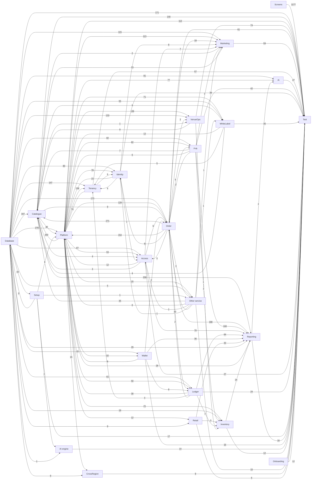

# How the Block A tickets are linked

> **Generated by** `tools/build-ticket-links.py` from `handoff/service-docs/tasks.csv` (the task sheet that becomes the OpenProject tickets). A ticket *waits on* another when it cannot be finished before the other is: that is the "follows" link in OpenProject and the order of each person's board.

**2378 tasks, 15695 links.**

## 1. The build layers, in order

| Layer | Tasks | Build order | Waits on |
|---|---:|---|---|
| Setup | 17 | #3 to #435 | Database (43) |
| Onboarding | 12 | #5 to #16 | nothing |
| Database | 171 | #31 to #2561 | Setup (3) |
| Platform | 24 | #38 to #108 | Setup (8), Database (2) |
| AI engine | 13 | #111 to #2553 | Setup (7), Database (1) |
| Services | 273 | #92 to #1495 | Platform (539), Database (493), Setup (1) |
| Screens | 333 | #156 to #1526 | Services (988), Setup (805), Services (Venue Management) (111), AI engine (3) |
| Services (Venue Management) | 496 | #154 to #2565 | Database (1227), Services (1158), Platform (882) |
| Screens (Venue Management) | 844 | #159 to #2569 | Setup (2461), Services (Venue Management) (1338), Services (660), AI engine (1) |
| Test | 195 | #72 to #2570 | Screens (Venue Management) (844), Services (Venue Management) (496), Screens (333), Services (264), Database (171), Platform (24), Setup (17), AI engine (14), Onboarding (12) |

## 2. Service map

An arrow means the service on the right waits on the one on the left; the number is how many task links carry it. Screens are left out here (section 4).

```mermaid
flowchart LR
  Screens["Screens"] -->|1177| Test["Test"]
  Database["Database"] -->|347| Catalogue["Catalogue"]
  Database["Database"] -->|278| Platform["Platform"]
  Order["Order"] -->|271| Catalogue["Catalogue"]
  Platform["Platform"] -->|250| Catalogue["Catalogue"]
  Catalogue["Catalogue"] -->|206| Reporting["Reporting"]
  Order["Order"] -->|188| Reporting["Reporting"]
  Database["Database"] -->|173| Order["Order"]
  Database["Database"] -->|171| Test["Test"]
  Fnb["Fnb"] -->|160| Reporting["Reporting"]
  Order["Order"] -->|154| Platform["Platform"]
  Database["Database"] -->|147| Tenancy["Tenancy"]
  Catalogue["Catalogue"] -->|140| Test["Test"]
  Platform["Platform"] -->|138| Tenancy["Tenancy"]
  Platform["Platform"] -->|138| VenueOps["VenueOps"]
  Database["Database"] -->|133| VenueOps["VenueOps"]
  Platform["Platform"] -->|129| Order["Order"]
  Database["Database"] -->|115| Marketing["Marketing"]
  Platform["Platform"] -->|113| Marketing["Marketing"]
  Platform["Platform"] -->|112| Test["Test"]
  Database["Database"] -->|82| Fnb["Fnb"]
  Platform["Platform"] -->|82| Fnb["Fnb"]
  Database["Database"] -->|81| Ai["Ai"]
  Catalogue["Catalogue"] -->|80| Platform["Platform"]
  Database["Database"] -->|80| Identity["Identity"]
  Platform["Platform"] -->|78| Identity["Identity"]
  Platform["Platform"] -->|77| Ai["Ai"]
  VenueOps["VenueOps"] -->|74| Test["Test"]
  Platform["Platform"] -->|71| WhiteLabel["WhiteLabel"]
  Access["Access"] -->|70| Reporting["Reporting"]
  Database["Database"] -->|67| Access["Access"]
  Ledger["Ledger"] -->|64| Reporting["Reporting"]
  Database["Database"] -->|61| Ledger["Ledger"]
  Order["Order"] -->|61| Test["Test"]
  Marketing["Marketing"] -->|59| Test["Test"]
  Tenancy["Tenancy"] -->|57| Test["Test"]
  Database["Database"] -->|55| WhiteLabel["WhiteLabel"]
  Platform["Platform"] -->|53| Access["Access"]
  Tenancy["Tenancy"] -->|51| Platform["Platform"]
  Platform["Platform"] -->|50| Ledger["Ledger"]
  Ai["Ai"] -->|47| Test["Test"]
  Database["Database"] -->|43| Setup["Setup"]
  Fnb["Fnb"] -->|42| Test["Test"]
  Identity["Identity"] -->|38| Test["Test"]
  Wallet["Wallet"] -->|36| Reporting["Reporting"]
  Other_service["Other service"] -->|35| Catalogue["Catalogue"]
  WhiteLabel["WhiteLabel"] -->|35| Test["Test"]
  Database["Database"] -->|33| Wallet["Wallet"]
  Platform["Platform"] -->|32| Wallet["Wallet"]
  Retail["Retail"] -->|32| Reporting["Reporting"]
  Ledger["Ledger"] -->|30| Platform["Platform"]
  Order["Order"] -->|30| Ledger["Ledger"]
  Database["Database"] -->|29| Reporting["Reporting"]
  Platform["Platform"] -->|28| Reporting["Reporting"]
  Access["Access"] -->|27| Test["Test"]
  Inventory["Inventory"] -->|24| Reporting["Reporting"]
  Ledger["Ledger"] -->|24| Test["Test"]
  Marketing["Marketing"] -->|23| Catalogue["Catalogue"]
  Identity["Identity"] -->|21| Platform["Platform"]
  Platform["Platform"] -->|21| Inventory["Inventory"]
  Database["Database"] -->|18| Inventory["Inventory"]
  Order["Order"] -->|18| Marketing["Marketing"]
  Setup["Setup"] -->|17| Test["Test"]
  Reporting["Reporting"] -->|16| Test["Test"]
  Wallet["Wallet"] -->|16| Test["Test"]
  Platform["Platform"] -->|15| CrossRegion["CrossRegion"]
  Platform["Platform"] -->|15| Other_service["Other service"]
  AI_engine["AI engine"] -->|14| Test["Test"]
  Access["Access"] -->|12| Platform["Platform"]
  Inventory["Inventory"] -->|12| Test["Test"]
  Onboarding["Onboarding"] -->|12| Test["Test"]
  Platform["Platform"] -->|12| Retail["Retail"]
  WhiteLabel["WhiteLabel"] -->|12| Platform["Platform"]
  Other_service["Other service"] -->|10| Test["Test"]
  Catalogue["Catalogue"] -->|9| Order["Order"]
  Catalogue["Catalogue"] -->|9| WhiteLabel["WhiteLabel"]
  Database["Database"] -->|9| CrossRegion["CrossRegion"]
  Database["Database"] -->|9| Retail["Retail"]
  Order["Order"] -->|9| Fnb["Fnb"]
  VenueOps["VenueOps"] -->|9| Catalogue["Catalogue"]
  CrossRegion["CrossRegion"] -->|8| Test["Test"]
  Identity["Identity"] -->|8| Marketing["Marketing"]
  Order["Order"] -->|8| Identity["Identity"]
  Setup["Setup"] -->|8| Platform["Platform"]
  Wallet["Wallet"] -->|8| Ledger["Ledger"]
  Wallet["Wallet"] -->|8| Platform["Platform"]
  Access["Access"] -->|7| Marketing["Marketing"]
  Fnb["Fnb"] -->|7| Catalogue["Catalogue"]
  Setup["Setup"] -->|7| AI_engine["AI engine"]
  Access["Access"] -->|6| Order["Order"]
  Fnb["Fnb"] -->|6| Platform["Platform"]
  Other_service["Other service"] -->|6| Platform["Platform"]
  Retail["Retail"] -->|6| Test["Test"]
  Database["Database"] -->|5| Other_service["Other service"]
  Order["Order"] -->|5| Access["Access"]
  Tenancy["Tenancy"] -->|5| Identity["Identity"]
  WhiteLabel["WhiteLabel"] -->|5| Tenancy["Tenancy"]
  Access["Access"] -->|4| Catalogue["Catalogue"]
  Catalogue["Catalogue"] -->|4| Access["Access"]
  Identity["Identity"] -->|4| Tenancy["Tenancy"]
  Ledger["Ledger"] -->|4| Tenancy["Tenancy"]
  WhiteLabel["WhiteLabel"] -->|4| Catalogue["Catalogue"]
  Fnb["Fnb"] -->|3| Inventory["Inventory"]
  Order["Order"] -->|3| Other_service["Other service"]
  Retail["Retail"] -->|3| Inventory["Inventory"]
  Setup["Setup"] -->|3| Database["Database"]
  Catalogue["Catalogue"] -->|2| Marketing["Marketing"]
  Fnb["Fnb"] -->|2| Marketing["Marketing"]
  Fnb["Fnb"] -->|2| Order["Order"]
  Ledger["Ledger"] -->|2| Inventory["Inventory"]
  Ledger["Ledger"] -->|2| Order["Order"]
  Order["Order"] -->|2| VenueOps["VenueOps"]
  Reporting["Reporting"] -->|2| Ai["Ai"]
  Wallet["Wallet"] -->|2| Order["Order"]
  Catalogue["Catalogue"] -->|1| VenueOps["VenueOps"]
  Database["Database"] -->|1| AI_engine["AI engine"]
  Identity["Identity"] -->|1| Access["Access"]
  Other_service["Other service"] -->|1| Access["Access"]
  Other_service["Other service"] -->|1| Identity["Identity"]
  Other_service["Other service"] -->|1| Marketing["Marketing"]
  Other_service["Other service"] -->|1| Order["Order"]
  Other_service["Other service"] -->|1| WhiteLabel["WhiteLabel"]
  Setup["Setup"] -->|1| Other_service["Other service"]
  VenueOps["VenueOps"] -->|1| Inventory["Inventory"]
```

## 3. Services: what each waits on and what waits on it

| Service | Owner | Tasks | Points | Build order | Waits on | Needed by |
|---|---|---:|---:|---|---|---|
| **Other service** | Sanket Keluskar, Surendra | 21 | 59 | #92 to #2558 | Platform 15, Database 5, Order 3, Setup 1 | Catalogue 35, Test 10, Platform 6, Order 1, Access 1, WhiteLabel 1 ... |
| **Ai** | Sanket Keluskar, Narayan Gaonkar | 45 | 167 | #114 to #1638 | Database 81, Platform 77, Reporting 2 | screens: Other 58, Test 47, screens: Platform 33, screens: Analytics 19, screens: Engagement & Support 14, screens: White Label 10 ... |
| **Identity** | Deep Khanvilkar, Sanket Keluskar | 38 | 152 | #128 to #1814 | Database 80, Platform 78, Order 8, Tenancy 5, Other service 1 | screens: Platform 58, screens: Other 39, Test 38, screens: Analytics 27, screens: Account & Self-Service 23, screens: Tenants & Licensing 21 ... |
| **Order** | Pranay Shinde, Chinmay Patkar | 61 | 315 | #133 to #2410 | Database 173, Platform 129, Catalogue 9, Access 6, Fnb 2, Wallet 2, Ledger 2, Other service 1 | Catalogue 271, Reporting 188, Platform 154, screens: Sell 64, Test 61, Ledger 30 ... |
| **Marketing** | Pranay Shinde, Deep Khanvilkar | 59 | 270 | #140 to #2390 | Database 115, Platform 113, Order 18, Identity 8, Access 7, Catalogue 2, Fnb 2, Other service 1 | Test 59, screens: Other 44, screens: Engagement & Support 33, screens: Account & Self-Service 25, Catalogue 23, screens: Membership, Loyalty & Value 16 ... |
| **WhiteLabel** | Hrushikant Patkar, Deep Khanvilkar | 35 | 175 | #184 to #2565 | Platform 71, Database 55, Catalogue 9, Other service 1 | screens: White Label 71, Test 35, screens: Engagement & Support 17, Platform 12, screens: Branding & Localisation 9, screens: Discovery & Browse 9 ... |
| **Platform** | Sanket Keluskar, Narayan Gaonkar | 88 | 370 | #192 to #2400 | Database 276, Platform 154, Order 154, Catalogue 80, Tenancy 51, Ledger 30, Identity 21, Access 12, WhiteLabel 12, Wallet 8, Other service 6, Fnb 6 | screens: Tenants & Licensing 155, Test 88, screens: Other 65, screens: Partners 42, screens: Platform 37, screens: Setup & Go-Live 23 ... |
| **Tenancy** | Deep Khanvilkar, Pranay Shinde | 57 | 209 | #194 to #2418 | Database 147, Platform 138, WhiteLabel 5, Identity 4, Ledger 4 | screens: Platform 75, screens: Venue Operations 65, screens: Other 58, Test 57, Platform 51, screens: Sell 34 ... |
| **CrossRegion** | Deep Khanvilkar, Chinmay Patkar | 8 | 29 | #218 to #1760 | Platform 15, Database 9 | Test 8, screens: Access 3 |
| **Wallet** | Pranay Shinde, Sanket Keluskar | 16 | 67 | #233 to #2134 | Database 33, Platform 32 | Reporting 36, screens: Other 20, Test 16, Ledger 8, Platform 8, screens: Membership, Loyalty & Value 5 ... |
| **Retail** | Pranay Shinde, Deep Khanvilkar | 6 | 30 | #238 to #887 | Platform 12, Database 9 | Reporting 32, screens: Sell 11, screens: Retail 7, Test 6, Inventory 3, screens: Payment 3 ... |
| **VenueOps** | Narayan Gaonkar, Chinmay Patkar | 74 | 337 | #261 to #2172 | Platform 138, Database 133, Order 2, Catalogue 1 | Test 74, screens: Other 71, screens: Media Library 50, screens: Access & Venue 22, screens: Operations 17, screens: Transport 16 ... |
| **Catalogue** | Narayan Gaonkar, Hrushikant Patkar | 140 | 606 | #276 to #2531 | Database 347, Order 271, Platform 250, Other service 35, Marketing 23, VenueOps 9, Fnb 7, WhiteLabel 4, Access 4 | Reporting 206, screens: Commercial 186, Test 140, screens: Other 133, screens: Sell 128, Platform 80 ... |
| **Access** | Narayan Gaonkar, Hrushikant Patkar | 27 | 136 | #281 to #1692 | Database 67, Platform 53, Order 5, Catalogue 4, Other service 1, Identity 1 | Reporting 70, screens: Other 44, Test 27, screens: Access & Venue 24, screens: Account & Self-Service 14, Platform 12 ... |
| **Fnb** | Narayan Gaonkar, Deep Khanvilkar | 42 | 229 | #364 to #1290 | Database 82, Platform 82, Order 9 | Reporting 160, screens: Other 56, Test 42, screens: Sell 30, screens: Kitchen 26, screens: In-venue Services 19 ... |
| **Ledger** | Narayan Gaonkar, Sanket Keluskar | 24 | 114 | #741 to #1810 | Database 61, Platform 50, Order 30, Wallet 8 | Reporting 64, Platform 30, Test 24, screens: Other 20, screens: Orders & Money 12, screens: Sell 5 ... |
| **Inventory** | Pranay Shinde, Deep Khanvilkar | 12 | 55 | #749 to #1284 | Platform 21, Database 18, Fnb 3, Retail 3, Ledger 2, VenueOps 1 | Reporting 24, Test 12, screens: Other 12, screens: Stock & Supply 2, screens: Stock on the Floor 1, screens: Commercial 1 ... |
| **Reporting** | Chinmay Patkar, Narayan Gaonkar | 16 | 54 | #986 to #1589 | Catalogue 206, Order 188, Fnb 160, Access 70, Ledger 64, Wallet 36, Retail 32, Database 29, Platform 28, Inventory 24 | screens: Other 17, Test 16, screens: Analytics 10, screens: Venue Operations 4, screens: Orders & Money 3, screens: Reports 3 ... |

## 4. Module builds: the services each module's screens need

| App | Module | Screen tasks | Build order | Waits on services | Other |
|---|---|---:|---|---|---|
| Guest Web — Storefront | Cart & Checkout | 5 | #156 to #1347 | Order 11, Catalogue 4, Marketing 4, WhiteLabel 4, Identity 3, VenueOps 1 | Setup 13 |
| Guest App — Mobile | Cart & Checkout | 3 | #157 to #723 | Order 10, Identity 3, WhiteLabel 3, Catalogue 2, VenueOps 1 | Setup 7 |
| Venue Staff App — Operations | Operations | 12 | #159 to #2229 | VenueOps 17, Identity 13, Catalogue 3, Order 2, Tenancy 2, Inventory 1, Marketing 1 | Setup 36 |
| Guest App — Mobile | Account & Self-Service | 14 | #163 to #1350 | Order 20, Identity 15, Marketing 15, Access 11, Wallet 3, Ledger 2, WhiteLabel 1 | Setup 38 |
| Venue Scanner — Access Control | Access | 4 | #168 to #1758 | Identity 5, Access 3, CrossRegion 3, Order 1, Tenancy 1 | Setup 12 |
| Venue POS — Terminal and Tablet | Shift | 4 | #174 to #1145 | Order 12, Identity 7, Tenancy 3 | Setup 12 |
| Venue CMS — White Label | White Label | 23 | #176 to #1370 | WhiteLabel 71, Ai 10, Marketing 8, VenueOps 8, Catalogue 7, Identity 2, Order 1, Tenancy 1 | Setup 69 |
| Venue Support — Agent Console | Access & Availability | 1 | #179 to #179 | Identity 6 | Setup 2 |
| TICVAI Web — Platform Console | Access & Identity | 4 | #190 to #1597 | Identity 17 | Setup 12, Platform 2 |
| TICVAI Web — Platform Console | Tenants & Licensing | 87 | #226 to #2139 | Identity 21, Tenancy 6, WhiteLabel 2, Order 1 | Setup 258, Platform 155 |
| Venue Management — Back Office | People & Access Rights | 9 | #248 to #2003 | Tenancy 13, Identity 12, Order 1, Reporting 1, Catalogue 1, Ai 1 | Setup 24 |
| Guest App — Mobile | Discovery & Browse | 7 | #295 to #1337 | Catalogue 15, WhiteLabel 4, VenueOps 3, Marketing 2, Access 1 | Setup 19 |
| TICVAI Web — Platform Console | Branding & Localisation | 4 | #312 to #1747 | Identity 10, WhiteLabel 9, VenueOps 2, Tenancy 2 | Setup 12, Platform 4 |
| Guest Web — Storefront | Engagement & Support | 5 | #314 to #1389 | Marketing 8, WhiteLabel 3, Ai 3, Fnb 1, Order 1 | Setup 13, AI engine 1 |
| Guest Web — Storefront | System States | 1 | #315 to #315 | WhiteLabel 1 | Setup 1 |
| Guest Web — Storefront | Support | 2 | #316 to #1312 | WhiteLabel 3, Marketing 2 | Setup 6 |
| Guest App — Mobile | Engagement & Support | 12 | #317 to #1394 | Marketing 13, VenueOps 13, Ai 9, WhiteLabel 4, Fnb 3, Order 3, Catalogue 1 | AI engine 2, Setup 34 |
| Guest App — Mobile | System States | 2 | #318 to #1321 | WhiteLabel 2, Marketing 2 | Setup 2 |
| Venue Management — Back Office | Platform | 63 | #356 to #2350 | Tenancy 68, Identity 6, Catalogue 3, Ai 1 | Setup 186, Platform 6 |
| Venue Management — Back Office | Sell | 81 | #362 to #2491 | Catalogue 108, Tenancy 23, Identity 5, Fnb 5, Order 5, Retail 2, Ai 2, VenueOps 1, Wallet 1, WhiteLabel 1 | Setup 227, Platform 22 |
| Venue Management | Other | 159 | #363 to #2569 | Catalogue 133, VenueOps 71, Tenancy 56, Fnb 50, Access 44, Marketing 34, Ai 29, Order 21, Wallet 20, Ledger 20, Identity 16, Reporting 9, Inventory 7, WhiteLabel 5, Retail 3 | Setup 460, Platform 21 |
| Venue Management — Back Office | Food & Beverage | 5 | #365 to #1535 | Fnb 12, Tenancy 3, Reporting 2, Retail 1 | Setup 13 |
| TICVAI Web — Platform Console | Overview & Health | 5 | #397 to #1845 | Identity 2, Ai 1, Tenancy 1 | Setup 15, Platform 15 |
| TICVAI Web | Other | 12 | #403 to #1520 | Ai 29, Identity 23, Tenancy 2, Order 2 | AI engine 1, Setup 36, Platform 29 |
| Developer Portal | Developer & API | 8 | #414 to #2152 | - | Setup 13, Platform 15 |
| Developer | Other | 3 | #427 to #430 | - | Setup 6, Platform 15 |
| Venue Management — Back Office | Commercial | 147 | #455 to #2550 | Catalogue 185, Order 7, Tenancy 6, Ledger 2, Inventory 1, VenueOps 1 | Setup 420 |
| Venue Management — Back Office | Access & Venue | 44 | #466 to #2242 | Access 24, VenueOps 22, Tenancy 8, Order 5, Catalogue 4, Reporting 2, Marketing 1, Ai 1 | Setup 109, Platform 4 |
| Guest Web — Storefront | High-Demand Access | 1 | #601 to #601 | Catalogue 2 | Setup 1 |
| Venue Management — Back Office | Venue Operations | 38 | #603 to #2114 | Tenancy 65, Reporting 4, VenueOps 3, Order 3, Ai 3, Fnb 3, Access 2, Retail 1 | Setup 110, Platform 1 |
| Guest Web — Storefront | Discovery & Browse | 5 | #609 to #1335 | Catalogue 11, WhiteLabel 5, VenueOps 5, Access 1, Marketing 1 | Setup 13 |
| Guest Web — Storefront | Booking & Selection | 7 | #610 to #1388 | Catalogue 15, Order 7, VenueOps 6, WhiteLabel 5, Marketing 3, Ai 1 | Setup 17 |
| Guest Web — Storefront | Membership, Loyalty & Value | 5 | #611 to #1346 | Marketing 11, Identity 5, Order 5, Catalogue 5, Wallet 3, Access 2, VenueOps 1, WhiteLabel 1 | Setup 11 |
| Guest App — Mobile | High-Demand Access | 1 | #622 to #622 | Catalogue 2 | Setup 3 |
| Guest App — Mobile | Discovery | 1 | #623 to #623 | Catalogue 1 | Setup 3 |
| Guest App — Mobile | Booking & Selection | 10 | #628 to #1344 | Catalogue 20, Order 15, VenueOps 8, WhiteLabel 3, Marketing 2, Ai 1 | Setup 30 |
| Venue POS — Terminal and Tablet | Sell | 26 | #632 to #1353 | Order 59, Fnb 25, Catalogue 16, Tenancy 11, Retail 9, Marketing 8, Ledger 5, Reporting 3, VenueOps 3, Inventory 1, Access 1, Wallet 1 | Setup 78 |
| Guest Kiosk — Self-Service | Sell | 5 | #635 to #2224 | Catalogue 4, WhiteLabel 2 | Setup 15 |
| Guest Kiosk — Self-Service | AI | 1 | #636 to #636 | Catalogue 2, Ai 1, Marketing 1, Order 1 | Setup 3 |
| Guest Web — Storefront | Promotions | 1 | #663 to #663 | Catalogue 2 | Setup 1 |
| Guest App — Mobile | Promotions | 1 | #667 to #667 | Catalogue 3 | Setup 1 |
| Guest Web — Storefront | Ticketing | 3 | #709 to #892 | Order 9, Catalogue 3, Fnb 2, Ledger 1, VenueOps 1 | Setup 9 |
| Guest Web — Storefront | Retail | 2 | #710 to #1112 | Retail 4, Order 3 | Setup 6 |
| Guest App — Mobile | Ticketing | 4 | #721 to #896 | Order 7, Catalogue 1, Ledger 1 | Setup 12 |
| Guest App — Mobile | Membership, Loyalty & Value | 3 | #722 to #1317 | Marketing 5, Order 4, Catalogue 3, Wallet 2, VenueOps 1, Identity 1 | Setup 9 |
| Venue Management — Back Office | Orders & Money | 10 | #773 to #1364 | Order 18, Ledger 12, Tenancy 3, Reporting 3, Fnb 2, Retail 1, Marketing 1 | Setup 24 |
| Guest Web — Storefront | Account & Self-Service | 5 | #852 to #1348 | Order 10, Marketing 10, Identity 8, Access 3, Ledger 2, Wallet 1 | Setup 13 |
| Guest Web — Storefront | In-venue Services | 6 | #853 to #1192 | Fnb 9, VenueOps 7, Access 3, Order 2 | Setup 18 |
| Guest App — Mobile | In-venue Services | 10 | #857 to #1196 | Fnb 10, VenueOps 8, Access 5, Order 3, WhiteLabel 2, Catalogue 2 | Setup 30 |
| Venue Management — Back Office | Rentals | 19 | #935 to #2432 | VenueOps 13, Catalogue 8, Ai 2, Tenancy 2 | Setup 49, Platform 1 |
| Venue Analytics — Cross-Domain Reporting | Analytics | 6 | #1010 to #1743 | Reporting 10, Identity 3, Ai 2, Tenancy 1 | Setup 9 |
| Guest Web — Storefront | Transport | 1 | #1013 to #1013 | VenueOps 6, Order 1 | Setup 3 |
| Guest App — Mobile | Transport | 4 | #1016 to #1020 | VenueOps 10, Order 2 | Setup 12 |
| Guest App — Mobile | In-Venue Experience | 2 | #1061 to #1115 | Fnb 1, Access 1, Retail 1 | Setup 6 |
| Kitchen Display — Pass and Stations | Kitchen | 10 | #1066 to #1526 | Fnb 26, Reporting 2 | Setup 20 |
| Venue Staff App | Other | 2 | #1083 to #1221 | Fnb 6, Inventory 5 | Setup 6 |
| Venue Staff App — Operations | Floor Service | 2 | #1085 to #1087 | Fnb 15, Order 1 | Setup 6 |
| Guest App — Mobile | Retail | 1 | #1116 to #1116 | Retail 3, Order 1 | Setup 3 |
| Venue POS — Terminal and Tablet | Payment | 1 | #1120 to #1120 | Retail 3, Order 2, Access 1, Marketing 1, Wallet 1 | Setup 3 |
| Venue Management — Back Office | Games & Rides | 10 | #1173 to #2568 | WhiteLabel 4, Catalogue 3, VenueOps 1 | Setup 30 |
| Venue Staff App — Operations | Stock on the Floor | 2 | #1213 to #1214 | Fnb 2, Inventory 1 | Setup 4 |
| Venue Management — Back Office | Stock & Supply | 3 | #1236 to #1531 | Inventory 2, Fnb 1, Reporting 1 | Setup 7 |
| Venue Analytics | Other | 3 | #1254 to #1257 | Reporting 8 | Setup 6 |
| Guest App — Mobile | Support | 1 | #1319 to #1319 | Marketing 2 | Setup 3 |
| Venue Support — Agent Console | Conversations | 2 | #1377 to #1379 | Marketing 7 | Setup 4 |
| Venue Management — Back Office | Engagement & Support | 26 | #1403 to #2391 | Marketing 12, WhiteLabel 10, Tenancy 2, Ai 2, Identity 1 | Setup 68 |
| Venue Management — Back Office | Guests & Marketing | 3 | #1424 to #1678 | Tenancy 4, Marketing 2, Ai 2, Identity 1, Reporting 1 | Setup 8 |
| Venue CMS — White Label | Policy | 2 | #1445 to #1446 | Marketing 2 | Setup 4 |
| Venue CMS | Other | 2 | #1452 to #1453 | Marketing 5 | Setup 6 |
| Venue Support — Agent Console | Overview | 1 | #1456 to #1456 | Marketing 1 | Setup 1 |
| Venue Support | Other | 1 | #1460 to #1460 | Marketing 5 | Setup 2 |
| TICVAI Web — Platform Console | AI | 2 | #1496 to #1499 | Ai 4 | Setup 4, Platform 2 |
| TICVAI Web — Platform Console | Analytics | 14 | #1497 to #1624 | Identity 24, Ai 17, Tenancy 1 | Setup 40, Platform 14 |
| TICVAI Web — Platform Console | Platform | 31 | #1500 to #2111 | Identity 52, Ai 32, Tenancy 7 | Setup 88, Platform 31 |
| Venue POS — Terminal and Tablet | Reports | 1 | #1523 to #1523 | Reporting 3 | Setup 3 |
| Venue CMS — White Label | Media Library | 40 | #1585 to #2205 | VenueOps 50, Identity 3, Tenancy 1, Ai 1 | Setup 120 |
| TICVAI Web — Platform Console | Commercial | 2 | #1617 to #2305 | Identity 4, Catalogue 1, Order 1, Ledger 1 | Setup 6, Platform 2 |
| TICVAI Sign-up — Onboarding & Purchase | Onboarding & Assessment | 10 | #1659 to #1949 | Identity 1 | Setup 20, Platform 10 |
| Partner Web — Reseller Portal | Access & Account | 4 | #1662 to #2142 | Identity 10 | Setup 7, Platform 6 |
| Partner Web — Reseller Portal | Partners | 22 | #1667 to #2266 | Identity 4 | Setup 44, Platform 26 |
| Venue Management — Back Office | Operations | 3 | #1718 to #1737 | Tenancy 6 | Setup 9 |
| Venue Management — Back Office | Setup & Go-Live | 19 | #1731 to #2454 | Catalogue 3, Tenancy 2 | Setup 57, Platform 23 |
| TICVAI Web — Platform Console | Releases & Environments | 8 | #1766 to #1787 | Identity 4 | Setup 24, Platform 16 |
| TICVAI Web — Platform Console | Platform Ops | 1 | #1776 to #1776 | - | Setup 3, Platform 2 |
| TICVAI Web — Platform Console | Support & Communications | 2 | #1785 to #1786 | - | Setup 6, Platform 2 |
| Venue Management — Back Office | Partners | 8 | #1807 to #2397 | Identity 8 | Setup 24, Platform 16 |
| TICVAI Sign-up — Onboarding & Purchase | Purchase & Activation | 6 | #1940 to #1962 | - | Setup 12, Platform 3 |
| TICVAI Sign-up — Onboarding & Purchase | Package Builder | 7 | #1950 to #1958 | - | Setup 14, Platform 8 |
| Partner Web — Reseller Portal | Reports & Settlement | 1 | #1978 to #1978 | - | Setup 2, Platform 2 |
| Venue Management — Back Office | Catalogue | 17 | #2269 to #2387 | Catalogue 24, Tenancy 2 | Setup 51 |
| Partner Web — Reseller Portal | Inventory & Pricing | 2 | #2457 to #2458 | Catalogue 6 | Setup 4 |
| Venue CMS — White Label | Kiosk | 1 | #2566 to #2566 | WhiteLabel 4 | Setup 3 |
| Kiosk | Other | 1 | #2567 to #2567 | WhiteLabel 1 | Setup 3 |

## 5. Reports and other read-only work that waits for its data

A backend task that only reads waits for the tasks that write what it reads (decided 30 September).

| Task | Service | Waits on the data of |
|---|---|---|
| SVC-IDENTITY-SESSION-1 | Identity | Other service |
| SVC-CATALOGUE-PRODUCT-2 | Catalogue | Other service, WhiteLabel |
| VM-TENANCY-MATRIX-1 | Tenancy | WhiteLabel |
| SVC-CATALOGUE-PRODUCT-1 | Catalogue | Other service |
| SVC-CATALOGUE-CAPACITY-1 | Catalogue | Order, VenueOps |
| SVC-CATALOGUE-DRAFTED-21 | Catalogue | Other service |
| SVC-ORDER-ORDERS-8 | Order | Catalogue, Other service |
| VM-IDENTITY-ADMINISTRATION-2 | Identity | Order, Tenancy |
| SVC-IDENTITY-ADMINISTRATION-9 | Identity | Order, Tenancy |
| SVC-IDENTITY-ADMINISTRATION-10 | Identity | Order, Tenancy |
| SVC-IDENTITY-IDENTITY-7 | Identity | Order, Tenancy |
| SVC-CATALOGUE-DRAFTED-27 | Catalogue | Order, Other service |
| SVC-CATALOGUE-DRAFTED-22 | Catalogue | Order, Other service, VenueOps |
| SVC-CATALOGUE-DRAFTED-26 | Catalogue | Order, Other service, VenueOps |
| SVC-CATALOGUE-DRAFTED-30 | Catalogue | Order, Other service, VenueOps |
| SVC-MARKETING-CONSENT-2 | Marketing | Access, Identity, Order |
| SVC-ACCESS-ACCESS-3 | Access | Catalogue, Identity, Order, Other service |
| SVC-ORDER-DRAFTED-1 | Order | Access |
| SVC-CATALOGUE-DRAFTED-18 | Catalogue | Access, Order, Other service |
| SVC-LEDGER-FINANCE-5 | Ledger | Order, Wallet |
| SVC-CATALOGUE-DRAFTED-6 | Catalogue | Order, Other service |
| SVC-VENUEOPS-GENERAL-1 | VenueOps | Catalogue, Order |
| SVC-FNB-GUESTORDERING-2 | Fnb | Order |
| SVC-CATALOGUE-DRAFTED-48 | Catalogue | Fnb, Order, Other service |
| VM-ORDER-DRAFTED-1 | Order | Access, Fnb, Ledger, Wallet |
| SVC-LEDGER-REPORTING-2 | Ledger | Order, Wallet |
| SVC-ORDER-REFUND-2 | Order | Fnb, Wallet |
| VM-INVENTORY-STOCK-1 | Inventory | Fnb, Ledger, Retail, VenueOps |
| SVC-MARKETING-GUEST-4 | Marketing | Access, Identity, Order |
| SVC-MARKETING-SEGMENT-4 | Marketing | Access, Order |
| SVC-AI-GOVERNANCE-5 | Ai | Reporting |
| SVC-AI-AUDIT-1 | Ai | Reporting |
| SVC-PLATFORM-SUBSCRIPTION-18 | Platform | Tenancy |
| SVC-TENANCY-ANALYTICS-1 | Tenancy | Identity, Ledger, Platform, WhiteLabel |
| SVC-PLATFORM-DRAFTED-14 | Platform | Fnb, Identity, Ledger, Order, Tenancy, Wallet, WhiteLabel |
| SVC-TENANCY-APPROVALS-9 | Tenancy | Identity, Ledger, Platform, WhiteLabel |
| SVC-PLATFORM-DRAFTED-10 | Platform | Fnb, Identity, Ledger, Order, Tenancy, Wallet, WhiteLabel |
| SVC-PLATFORM-DRAFTED-4 | Platform | Catalogue, Fnb, Identity, Ledger, Order, Other service, Tenancy, Wallet, WhiteLabel |
| SVC-PLATFORM-DRAFTED-11 | Platform | Catalogue, Fnb, Identity, Ledger, Order, Other service, Tenancy, Wallet, WhiteLabel |
| SVC-PLATFORM-DRAFTED-15 | Platform | Catalogue, Ledger, Order, Other service, Tenancy, Wallet |
| SVC-CATALOGUE-DRAFTED-13 | Catalogue | Other service |
| SVC-CATALOGUE-DRAFTED-15 | Catalogue | Other service |
| SVC-CATALOGUE-DRAFTED-46 | Catalogue | Other service |
| SVC-CATALOGUE-DRAFTED-8 | Catalogue | Other service |
| SVC-CATALOGUE-DRAFTED-19 | Catalogue | Order, Platform |
| SVC-CATALOGUE-DRAFTED-23 | Catalogue | Order, Other service, Platform |
| SVC-CATALOGUE-DRAFTED-31 | Catalogue | Order, Other service, Platform |
| SVC-CATALOGUE-DRAFTED-32 | Catalogue | Order, Other service, VenueOps |
| SVC-CATALOGUE-DRAFTED-28 | Catalogue | Order, Other service, Platform |
| SVC-CATALOGUE-DRAFTED-9 | Catalogue | Order, Other service, Platform |
| SVC-MARKETING-GUESTS-1 | Marketing | Access, Catalogue, Fnb, Identity, Order, Other service, Platform |
| SVC-PLATFORM-DRAFTED-3 | Platform | Access, Catalogue, Identity, Ledger, Order, Other service, Tenancy, Wallet, WhiteLabel |
| SVC-PLATFORM-DRAFTED-6 | Platform | Access, Catalogue, Fnb, Identity, Ledger, Order, Other service, Tenancy, Wallet, WhiteLabel |
| SVC-PLATFORM-DRAFTED-7 | Platform | Access, Catalogue, Fnb, Order, Other service, Wallet |
| SVC-CATALOGUE-DRAFTED-12 | Catalogue | Other service |
| SVC-CATALOGUE-DRAFTED-36 | Catalogue | Marketing |
| SVC-CATALOGUE-DRAFTED-39 | Catalogue | Other service |
| SVC-CATALOGUE-UPSELL-2 | Catalogue | Other service |
| SVC-CATALOGUE-DRAFTED-35 | Catalogue | Fnb, Order, Platform |
| SVC-CATALOGUE-DRAFTED-38 | Catalogue | Fnb, Order, Platform |
| SVC-CATALOGUE-PROMOTIONS-3 | Catalogue | Marketing, Order, Other service, VenueOps |
| SVC-CATALOGUE-DRAFTED-40 | Catalogue | Order |
| SVC-CATALOGUE-DRAFTED-41 | Catalogue | Fnb, Order, Platform, VenueOps |
| SVC-CATALOGUE-DRAFTED-42 | Catalogue | Order |
| SVC-CATALOGUE-DRAFTED-44 | Catalogue | Order |
| SVC-CATALOGUE-DRAFTED-43 | Catalogue | Fnb, Order, Platform |
| SVC-CATALOGUE-DRAFTED-82 | Catalogue | Marketing |
| SVC-CATALOGUE-DRAFTED-83 | Catalogue | Marketing |
| SVC-CATALOGUE-DRAFTED-80 | Catalogue | Fnb, Marketing, Order, Platform, VenueOps |
| SVC-CATALOGUE-DRAFTED-81 | Catalogue | Fnb, Order, Platform, VenueOps |
| DEVICE-BOCA-FGL | Other service | Order |
| SVC-WHITELABEL-KIOSK-2 | WhiteLabel | Catalogue, Other service |

## 6. Tasks that wait on nothing

Only setup and onboarding should be here.

| Task | Layer | Build order |
|---|---|---|
| SETUP-CI | Setup | #3 |
| SETUP-ENV | Setup | #4 |
| SETUP-ONBOARD-CHINMAY-PATKAR | Onboarding | #5 |
| SETUP-ONBOARD-CHITRANGI-MESTRY | Onboarding | #6 |
| SETUP-ONBOARD-DEEP-KHANVILKAR | Onboarding | #7 |
| SETUP-ONBOARD-HRUSHIKANT-PATKAR | Onboarding | #8 |
| SETUP-ONBOARD-KALPITA-MEJARI | Onboarding | #9 |
| SETUP-ONBOARD-PALLAVI-SAWANT | Onboarding | #10 |
| SETUP-ONBOARD-PRADNYA-YERAM | Onboarding | #11 |
| SETUP-ONBOARD-PRANAY-SHINDE | Onboarding | #12 |
| SETUP-ONBOARD-SANKET-KELUSKAR | Onboarding | #13 |
| SETUP-ONBOARD-SECOND-AI-ENGINEER | Onboarding | #14 |
| SETUP-ONBOARD-SURENDRA | Onboarding | #15 |
| SETUP-ONBOARD-TANMAY-DUKHANDE | Onboarding | #16 |
| SETUP-SHELL-EMPLOYEE-APP | Setup | #17 |
| SETUP-SHELL-GUEST-APP | Setup | #18 |
| SETUP-SHELL-GUEST-WEB | Setup | #19 |
| SETUP-SHELL-KIOSK | Setup | #20 |
| SETUP-SHELL-POS | Setup | #21 |
| SETUP-SHELL-VENUE-MANAGEMENT | Setup | #22 |
| SETUP-SHELL-WEB | Setup | #23 |
| R8-DB-LOCAL-CHINMAY-PATKAR | Services | #92 |
| R8-DB-LOCAL-CHITRANGI-MESTRY | Services | #93 |
| R8-DB-LOCAL-DEEP-KHANVILKAR | Services | #94 |
| R8-DB-LOCAL-KALPITA-MEJARI | Services | #95 |
| R8-DB-LOCAL-NARAYAN-GAONKAR | Services | #96 |
| R8-DB-LOCAL-PALLAVI-SAWANT | Services | #97 |
| R8-DB-LOCAL-PRADNYA-YERAM | Services | #98 |
| R8-DB-LOCAL-PRANAY-SHINDE | Services | #99 |
| R8-DB-LOCAL-SANKET-KELUSKAR | Services | #100 |
| R8-DB-LOCAL-SURENDRA | Services | #101 |
| R8-DB-SHARED | Services | #102 |
| TEST-BLOCK-A2-BE | Test | #1555 |
| TEST-BLOCK-A2-FE | Test | #1556 |

